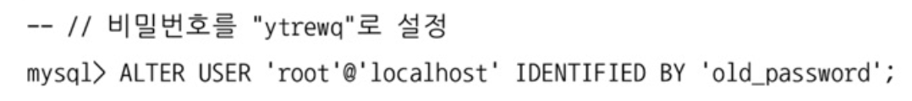
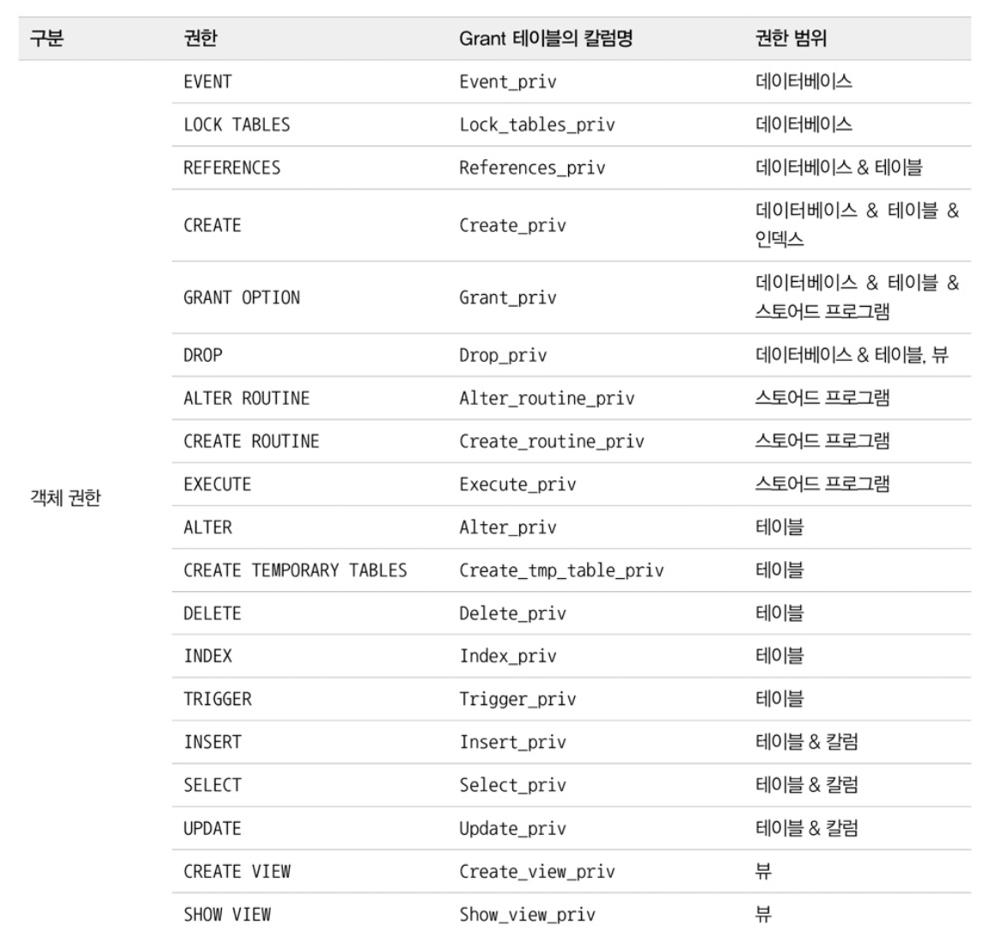

# 3장 / 사용자 권한

MySQL에서 사용자 계정 생성 및 계정 권한 설정은 다른 DBMS와는 조금 다르다.

- 사용자 아이디 뿐만 아니라 사용자의 접속 IP도 확인한다.
- MySQL 8.0부터 권한을 묶어서 관리하는 역할(Role)이라는 것이 도입되어서 미리 준비된 권한 세트를 부여하는 것도 가능

> 점점 방대한 데이터로 이루어지는 세상속에서 데이터베이스 서버 보안의 중요성은 함께 증가하고 있다. 때문에 계정의 식별 방식과 권한, 역할에 대한 기본적인 내용 숙지는 필수이다.
> 

# 3.1 사용자 식별

MySQL의 사용자는 계정뿐만 아니라 사용자의 접속 지점(클라이언트가 실행된 **호스트명**이나 **도메인** 또는 **IP 주소**)도 계정의 일부로 사용된다.

때문에 MySQL 계정을 언급할 때는 아이디,호스트를 함께 명시해야한다.

```sql
`svc_id`@`127.0.0.1`
```

위 사용자 계정은 **Localhost**에서 **svc_id** 라는 아이디로 접속할 때만 사용할 수 있는 계정이다.

- 아이디와 IP주소를 감싸고있는 역따옴표(`)는 MySQL에서 식별자를 감싸는 역할을 한다.
    - 이는 종종 홀따옴표(’)로 사용되기도 한다.
- 다른 컴퓨터에서는 svc_id로 접속이 불가능하다.

만약 모든 외부 컴퓨터에서 접속이 가능한 사용자 계정을 생성하려면 호스트 부분을 **‘%’** 로 대체하면 된다.

- **‘%’** 는 모든 IP를 의미한다.

---

### 계정 식별의 주의점 (동일한 아이디의 계정)

```sql
`svc_id`@`192.168.0.10` #(이 계정의 패스워드는 123)
`svc_id`@`%` #(이 계정의 패스워드는 abc)
```

만약 위와 같이 IP주소가 **‘192.168.0.10’**이고 아이디가 **’svc_id’** 인 계정 정보와
모든 IP(**’%’**)에서 접속 가능하고 아이디가 **‘svc_id’**인 계정이 존재한다고 가정하자.

이때 IP주소가  **‘192.168.0.10’**인 PC에서 해당 MySQL 서버에 접속할 때
MySQL 서버가 첫 번째 정보를 이용해 인증을 실행할 지, 아니면 두 번째 계정 정보를 이용할 지에 따라 이 접속은 성공할 수도 있고 실패할 수도 있다.

이때 MySQL은 범위가 작은 것을 항상 먼저 선택한다.

두 계정 정보 중 범위가 더 좁은 것은 IP주소가 구체적으로 포함된 **`svc_id`@`192.168.0.10`** 이기 때문에 첫 번째를 선택해 로그인을 시도한다.

만약 IP주소가 **‘192.168.0.10**인 PC에서 svc_id 아이디로 접속하려고 할 때, 비밀번호를 abc로 입력한다면 로그인에 실패하여 접속이 거절될 것이다.

<aside>
🚀 **[궁금 포인트]**
그럼 IP주소가 192.168.0.11 인 IP에서 접속하려고 해도 구체적으로 포함된 첫 번째 계정을 선택할 것이기 때문에 접속에 실패하는가?

예상) 그렇게 될 것 같다.

</aside>

# 3.2 사용자 계정 관리

## 3.2.1 (1) 시스템 계정과 일반 계정

MySQL 8.0부터 계정은 **`SYSTEM_USER`** 권한을 가지고 있느냐에 따라 **시스템 계정(System Account)**와 **일반 계정(Regular Account)**로 구분된다.

- **시스템 계정:** 데이터베이스 서버 관리자를 위한 계정
    - 일반 계정을 관리(생성 / 삭제 / 변경 / 계정권한 설정) 가능
    - 데이터베이스 서버 관리와 관련된 중요 작업 수행 가능
        - 다른 세션(Connection) 또는 그 세션에서 실행 중인 쿼리를 강제 종료 등
        - 스토어드 프로그램 생성 시 DEFINER를 타 사용자로 설정
- **일반 계정:** 응용 프로그램이나 개발자를 위한 계정

<aside>
🚀 **[궁금 포인트]**
DEFINER란 무엇인가

</aside>

이렇게 시스템 계정, 일반 계정의 개념이 도입된 이유는 DBA 계정과 일반 사용자를 위한 계정을 구분하기 위함이다.

> 일반적으로 데이터베이스에서는 계정과 사용자라는 말을 혼용하지만, 이번 장에서는 설명의 편의를 위해 두 단어가 구분된다.

**[사용자]** MySQL 서버를 사용하는 주체(사람 또는 응용프로그램)
**[계정]** MySQL 서버에 로그인하기 위한 식별자(로그인 아이디)
> 

### MySQL 내장 계정

MySQL 서버에는 미리 내장된 계정들이 존재한다.

루트 계정(**`root`@`localhost`**)를 제외한 3개의 계정은 내부적으로 각기 다른 목적으로 사용되기 때문에 삭제되어선 안된다.

- **`mysql.sys`@`localhost`:** MySQL 8.0부터 기본으로 내장된 sys 스키마의 객체(뷰, 함수, 프로시저) 들의 DEFINER로 사용되는 계정
- **`mysql.session`@`localhost`:** MySQL 플러그인이 서버로 접근할 때 쓰는 계정
- **`mysql.infoschema`@`localhost`:** infomation_schema에 정의된 뷰의 DEFINER로 사용되는 계정


위 3가지 계정들은 처음부터 잠겨(**account_locked**)있는 상태이므로
의도적으로 잠긴 계정을 풀지 않는 한, 악의적인 용도로 사용할 수 없다.

> **’시스템 계정’**으로 로그인해서 해당 계정의 잠금을 풀지 않으면
외부에서 애초에 접속이 불가능한 것으로 추정
> 

---

## 3.2.2 계정 생성

MySQL 5.7 버전까지는 GRANT 명령으로 권한의 부여와 동시에 계정 생성이 가능했지만,
8.0 버전부터는 **계정의 생성(CREATE USER)**과 **권한 부여(GRANT)** 명령이 구분되도록 바뀌었다.

계정을 생성할 때는 다음과 같은 ‘다양한 옵션’을 설정할 수 있다.

- 계정의 인증 방식과 비밀번호
- 비밀번호 관련 옵션(비밀번호 유효 기간, 비밀번호 이력 개수, 비밀번호 재사용 불가 기간)
- 기본 역할(Role)
- SSL 옵션
- 계정 잠금 여부


일반적으로 많이 사용되는 옵션을 가진 CREATE USER 명령은 다음과 같은데,
한 번 살펴보자.

## 3.2.2.1 IDENTIFIED WITH

사용자의 **‘인증 방식’**과 **‘비밀번호’**를 설정한다.

IDENTIFIED WITH 뒤에는 반드시 인증 방식(인증 플러그인 이름)을 명시해야한다.

- 이때 MySQL 서버의 기본 인증 방식을 사용하고자 한다면
**IDENTIFIED WITH ‘비밀번호’ BY ‘password’** 형식으로 명시한다.

MySQL 서버의 다양한 인증 방식을 ‘플러그인 형태’로 제공하는데,
다음 4가지 방식이 가장 대표적이다.

### **Native pluggable Authentication `(5.7 Default)`**

MySQL 5.7 버전가지 기본으로 사용되던 방식.
단순히 비밀번호에 대한 해시(SHA-1 알고리즘) 값을 저장해두고, 클라이언트가 보낸 값과 해시값이 일치하는지 비교하는 인증 방식이다.

### **Caching SHA-2 Pluggable Authentication `(8.0 Default)`**

MySQL 5.6 버전에 도입되고 MySQL 8.0 버전에서는 조금 더 보완된 인증 방식으로,
암호화 해시값 생성을 위해 ‘SHA-2(256비트) 알고리즘’을 사용한다.

Native 방식과의 큰 차이점은 사용되는 알고리즘의 차이이며, SHA-2 Authentication은 저장된 해시값의 보안에 더 중점을 둔 알고리즘으로 이해할 수 있다.

Native 플러그인은 입력이 동일한 해시값을 출력하지만,
Caching SHA-2 Authentication은 내부적으로 Salt 키를 활용하며 수천 번의 해시 계산을 수행해서 결과를 만들기 때문에 동일한 키 값에 대해서도 다른 결과를 만들어낸다.

수천 번의 연산을 하는 만큼 성능은 매우 떨어지는데, 이를 보완하기 위해 MySQL 서버는 해시 결과값을 메모리에 캐시해서 사용한다. 그래서 방식 이름에 ‘Caching’이 포함된 것이다.

이 방식을 사용하려면 SSL/TLS 또는 RSA 키페어를 반드시 사용해야 하는데, 이를 위해 클라이언트에서 접속할 때 SSL 옵션을 활성화해야 한다.

<aside>
🚀 **[궁금 포인트]**
Salt 키란 무엇인가

</aside>

### **PAM Pluggable Authentication `(Enterprise Edition)`**

유닉스나 리눅스 패스워드 또는 LDAP 같은 외부 인증을 사용할 수 있게 해주는 방식

### **LDAP Pluggable Authentication** **`(Enterprise Edition)`**

LDAP를 이용한 외부 인증을 사용할 수 있게 해주는 인증 방식

### Caching SHA-2 Pluggable Authentication 사용 시 주의점

1. **호환성 고려**
    
    위 설명에서 알 수 있듯이 Caching SHA-2 Pluggable Authentication 방식이 8.0부터 기본방식으로 변경되었지만, SSL/TLS 또는 RSA 키페어를 필요로 하기 때문에 5.7까지와의 연결 방식과는 다른 방식으로 접속해야 한다.
    
    그래서 보안 수준은 낮아지겟지만 호환성을 고려한다면 Native Authentication 인증 방식으로 계정을 생성해야 할 수도 있다.
    
    
    
    Native Authentication으로 기본 인증 방식을 변경하는 쿼리
    
    위 명령을 수행하면 기본 인증 방식을 변경할 수 있다.
    이 외에 **‘my.cnf’** 설정 파일에 정보를 추가하는 방법도 있다.
    
2. **성능 고려**
    
    Caching SHA-2 Pluggable Authentication은 `SCRAM(Salted Challenge Response Authentication Mechanism)` 인증 방식을 사용한다.
    
    SCRAM 인증 방식은 평문 비밀번호에 `‘최소 5000번 이상’` 암호화 해시 함수를 실행해야 MySQL 서버로 로그인 요청을 보낼 수 있기 때문에 무작위로 비밀번호를 입력하는 무차별 대입 공격(brute-force attack)을 어렵게 만든다.
    
    > 5000번 이상의 해시 계산을 수행해야 로그인 요청이 가능하므로 공격 속도가 현저히 느려지고 CPU 자원소모가 커진다.
    > 
    
    하지만 악의가 없는 정상적인 유저나 응용프로그램의 연결도 느리게 만든다는 단점이 있다.
    
    물론 허가된 사용자나 응용 프로그램은 정확한 비밀번호를 알고 있기 때문에 5000번의 해시 함수만 실행하면 된다.
    
    - MySQL 서버의 SCRAM 인증 방식에서 해시 함수를 몇 번이나 실행(SCRAM Iteration count)할지는 caching_sha2_password_digest_rounds 시스템 변수로 설정이 가능하다. 하지만 기본 설정 값인 5000은 최소 설정 값이기도 해서 더 이상 줄이는 것은 불가능하다.

## 3.2.2.2 REQUIRE

MySQL 서버에 접속할 때 암호화된 SSL/TLS 채널을 사용할지 여부를 설정한다.

만약 별도로 설정하지 않으면 비암호화 채널로 연결하게 된다.

> 이 설정을 SSL로 설정하지 않더라도 `Caching SHA-2 Pluggable Authentication` 를 사용하면 암호화된 채널만으로 MySQL 서버에 접속할 수 있게 된다.
> 

## 3.2.2.3 PASSWORD EXPIRE

비밀번호 유효 기간을 설정하는 옵션

만약 별도로 설정하지 않으면 ‘default_password_lifetime’ 시스템 변수에 저장된 기간이 설정됨.

- 개발자나 데이터베이스 관리자의 비밀번호는 유효기간을 설정해주는 것이 보안적
- 응용프로그램 접속용 계정에 유효기간 설정은 어느날 갑자기 DB 서버가 정상작동하지 않게 될 위험성이 있으니 충분한 고려가 필요

### PASSWORD EXPIRE 절 설정 옵션

- **PASSWORD EXPIRE :** 계정 생성과 동시에 비밀번호의 만료 처리
- **PASSWORD EXPIRE NEVER :** 계정 비밀번호의 만료 기간 없음
- **PASSWORD EXPIRE DEFAULT :  ‘**default_password_lifetime’ 시스템 변수에 저장된 기간으로 비밀번호의 유효 기간을 설정
- **PASSWORD EXPIRE INTERVAL n DAY** : 비밀번호의 유효 기간을 오늘부터 n일자로 설정

<aside>
🚀 **[궁금 포인트]
’**PASSWORD EXPIRE’의 용도가 이해가 되지 않는다.
계정 생성 이후 바로 바꾸는 것이 보안상 어느 이점이 있는가.

</aside>

## 3.2.2.4 PASSWORD HISTORY

한 번 사용했던 비밀번호를 재사용하지 못하게 설정하는 옵션

### PASSWORD HISTROY 절 설정 옵션

- PASSWORD HISTORY DEFAULT : ‘password_history’ 시스템 변수에 저장된 개수만큼의 이력을 저장하며, 저장된 이력에 남아있는 비밀번호는 재사용 불가
- PASSWORD HISTORY n : n개의 최근 비밀번호 이력을 저장하며, 저장된 이력에 남아있는 비밀번호는 재사용 불가

> 사용했던 비밀번호는 `‘mysql’` DB의 `‘password_history’` 테이블에서 관리한다.
> 
> 
> 
> 

## 3.3.2.5 PASSWORD REUSE INTERVAL

한 번 사용했던 비밀번호에 재사용 금지 기간을 지정하는 옵션

- 별도 명시가 없다면 ‘password_reuse_interval’ 시스템 변수에 저장된 기간으로 설정된다.

### PASSWORD REUSE INTERVAL 절 설정 옵션

- **PASSWORD REUSE INTERVAL DEFAULT**: ‘password_reuse_interval’ 변수에 저장된 기간으로 설정
- **PASSWORD REUSE INTERVAL n DAY**: n일 이후 재사용 가능하도록 설정

## 3.3.2.6 PASSWORD REQUIRE

비밀번호가 만료되어 새로운 비밀번호로 변경할 때, 현재 비밀번호를 필요로 할지 말지 설정하는 옵션

- 별도의 명시가 없다면 ‘password_require_current' 시스템 변수의 값으로 설정된다.

### PASSWORD REQUIRE 절 설정 옵션

- **PASSWORD REQUIRE CURRENT**: 비밀빈호를 변경할 때 현재 비밀번호를 먼저 입력하도록 설정
- **PASSWORD REQUIRE OPTIONAL**: 비밀번호를 변경할 때 현재 비밀번호를 입력하지 않아도 되도록 설정
- **PASSWORD REQUIRE DEFAULT**: ‘password_require_current' 시스템 변수의 값으로 설정

## 3.3.2.7 ACCOUNT LOCK , UNLOCK

외부로부터 계정의 로그인을 일시적으로 또는 영구적으로 차단하는 옵션 (주로 보안적인 목적으로 사용)

> 계정 생성 시 또는 ALTER USER 명령을 사용해 계정 정보를 변경할 때 설정 가능
> 

### ACCOUNT 절 설정 옵션

- **ACCOUNT LOCK**: 계정을 사용하지 못하게 잠금
- **ACCOUNT UNLOCK**: 잠긴 계정을 다시 사용 가능한 상태로 잠금 해제

<aside>
🚀 **[궁금 포인트]**
MySQL의 기본 계정 ‘sys’, ‘’session, ‘infoschema’ 은 account_lock이 Y인데, 어떻게 로그인되어 사용되는가?

**답)** 해당 설정은 ‘외부로부터의’ 로그인을 막는 것이며,
내장 계정은 설정이 필요할 때 MySQL이 내부적으로 접근하여 처리한다.
때문에 내장 계정은 내부에서 MySQL이 알아서 동작하는 것만 가능하도록 account_lock을 걸어두는 것이 안전하다.

</aside>

# 3.3 비밀번호 관리

## 3.3.1 고수준 비밀번호

MySQL 서버의 비밀번호는 유효기간이나 히스토리 관리 등의 기능뿐만 아니라
비밀번호를 쉽게 유추할 수 있는 단어들이 사용되지 않게 `글자의 조합을 강제`하거나 `금칙어`를 설정할 수도 있다.

### validated_password 컴포넌트

> validated_password는 5.7버전까지는 플러그인 형태로 제공되다가 8.0 버전부터 **’컴포넌트’** 형태로도 제공되었다.

컴포넌트는 플러그인의 단점을 보완하기 위해 8.0 버전부터 도입된 것이기 때문에 가능하면 컴포넌트를 선택하는 편이 더 나을 것이다.
> 

‘validated_password’ 컴포넌트를 이용하면 MySQL에서 비밀번호에 ‘유효성 체크 규칙’을 적용할 수 있다.

‘validated_password’ 컴포넌트는 MySQL 서버 프로그램에 내장되어 있어서
특별히 다운로드받을 경로를 입력할 필요없이 아래와 같은 명령만 입력해주면 된다.


mysql.component를 조회해서 정상적으로 컴포넌트가 설치되었는지 확인할 수 있다.


### validated_password 관련 시스템 변수

validated_password 컴포넌트가 설치되면 아래 시스템 변수를 확인할 수 있다.


비밀번호 정책은 크게 3가지 중에 아래 쿼리를 통해 설정이 가능하다. **`(기본값: MEDIUM)`**


- **LOW**: 비밀번호의 길이만 검증
- **MEDIUM**: 비밀번호의 길이를 검증하며, 숫자와 대소문자 그리고 특수문자의 배합 검증
- **STRONG**: MEDIUM + 금칙어 포함 여부 검증

**validated_password.length `LOW`**

- 해당 시스템 변수에 설정된 길이 이상의 비밀번호가 사용됐는지 검증한다.

**validated_password.mixed_case_count `MEDIUM`**

- 해당 시스템 변수에 설정된 개수 이상의 대소문자를 사용하여 패스워드를 설정하였는지 검증

**validated_password.number_count `MEDIUM`**

- 해당 시스템 변수에 설정된 개수 이상의 숫자를 사용하여 패스워드를 설정하였는지 검증

**validated_password.special_char_count `MEDIUM`**

- 해당 시스템 변수에 설정된 개수 이상의 특수문자를 사용하여 패스워드를 설정하였는지 검증

**validated_password.dictionary_file `STRONG`**

- **사전파일(dictionaryFile)**은 금칙어를 설정해둔 파일이다.
해당 시스템 변수에 설정된 파일에 명시된 단어를 포함하고 있는지 검증한다.
    - 사전 파일은 금칙어를 한 줄에 하나씩 기록하여 작성된 텍스트(txt) 파일이다.
    하지만 하나하나 직접 입력하는 것은 시간 소모적인 일이므로 이미 만들어진 파일을 내려받는 것도 방법이다.
    검색을 통해 쉽게 찾을 수 있다.
        
        
        
    - 아래 쿼리를 통해 설정이 가능하다.
        
        
        
    

## 3.3.2 이중 비밀번호

많은 응용프로그램들이 공용 계정으로 데이터베이스 서버를 이용함 → 이러한 구현 특성 상 서버의 계정 정보는 쉽게 변경할 수 없음 → 그 중에서도 DB 계정의 비밀번호는 서비스가 실행 중인 상태에서는 변경 불가능 → 때문에 처음 설정한 상태로 몇 년간 사용하는 경우가 많다

비밀번호는 주기적으로 변경하는 것이 보안적이지만, 비밀번호 변경을 위해 서비스를 멈추는 것은 불가능한 일이었다.

이 문제점을 해결하기 위해 8.0 버전에서 계정의 비밀번호로 2개의 값을 동시에 사용할 수 있는 기능을 추가했다. 이를 **‘이중 비밀번호(Dual Password)’**라고 한다.

2개의 비밀번호는 **최근 설정한 비밀번호 ‘프라이머리(Primary)‘**와 **이전 비밀번호 ‘세컨더리(Secondary)‘**로 구분된다.

### **기존 변경 구문**



이는 세컨더리 비밀번호 설정 없이 기존 비밀번호만 변경하는 기존 구문이다.

### **이중 비밀번호 설정 구문**


이중 비밀번호 설정은 기존 비밀번호 변경 구문에 **RETAIN CURRENT PASSWORD** 옵션만 붙이면 된다.

이 구문을 실행하면 기존 비밀번호는 ‘세컨더리 패스워드’로 변경되며,
새로 설정된 비밀번호는 ‘프라이머리 패스워드’로 설정된다.

이중 비밀번호가 설정된 계정은 두 비밀번호 중 무엇을 입력해도 로그인이 된다.

이 상태에서 데이터베이스에 연결하는 응용 프로그램의 소스코드나 설정 파일의 비밀번호를 새로운 비밀번호로 변경하고 배포 및 재시작을 순차적으로 실행하면,
설정된 부분들은 모두 새로운 비밀번호를 사용할 수 있다.

### 세컨더리 비밀번호 삭제 구문


모든 응용 프로그램을 재시작하고 나면, 보안의 목적으로 세컨더리 비밀 번호를 삭제하여
기존 패스워드로 로그인하는 것을 막아야한다.

<aside>
🚀 **[궁금 포인트]**
비밀번호를 변경하는 과정에서 실행중인 응용프로그램을 종료시켜야하는 문제 때문에 이중 비밀번호의 개념이 등장한 것 아닌가? 그런데 프라이머리 패스워드로 응용 프로그램의 소스코드나 설정 파일의 패스워드 변경을 완료하렴녀 어찌되었든 재시작을 해야하는데 똑같은 문제가 있는 것 아닌가?

**답)** 이중 비밀번호를 통해 서비스가 종료되는 시간이 최소화될 수 있다.
미리 모든 설정을 끝낸 뒤에 재시작만 수행하면 되므로, 일련의 비밀번호 변경 작업을 서비스를 종료시킨 후에 처리하는 것에 비해 엄청난 시간이 단축될 수 있어 이점이 있는 것이다.

</aside>

# 3.4 권한(Privilege)

## MySQL 5.7까지의 권한 (정적 권한)

### 객체 권한



데이터베이스나 테이블을 제어하는 데 필요한 권한

- GRANT 명령으로 권한을 부여받을 때, 반드시 특정 객체를 명시해야함

### 글로벌 권한


데이터베이스나 테이블 이외의 객체에 적용되는 권한

- GRANT 명령에서 특정 객체를 명시하지 말아야함

### ALL 권한


예외적으로 **ALL(또는 ALL PRIVILEGES)**은 **’글로벌’**과 **’객체 권한’** 두 가지 용도로 사용될 수 있다.

- 특정 객체에 ALL 권한이 부여되면 해당 객체에 적용될 수 있는 모든 객체의 권한을 부여
- 글로벌로 ALL이 사용되면 글로벌 수준에서 가능한 모든 권한을 부여

---

## MySQL 8.0부터 추가된 권한 (동적 권한)


MySQL 8.0부터는 소스코드에 고정적으로 명시돼 있는 권한인 **‘정적 권한’** 외에
(일부는 MySQL 서버에 명시돼 있기도 하지만) MySQL 서버가 시작되면서 동적으로 생성하는 권한을 의미하는 **‘동적 권한’**이 추가되었다.

> 예를 들어 ‘컴포넌트’나 ‘플러그인’이 설치되면 그때 등록되는 권한을 동적 권한이라고 한다.
> 

- MySQL 5.7 까지는 `SUPER` 라는 권한이 데이터베이스 관리를 위해 꼭 필요한 권한이었지만
- MySQL 8.0 부터는 `SUPER` 권한이 잘게 쪼개어져 위 표에 있는 동적 권한으로 분산됐다.

때문에 8.0 버전부터는 ‘백업 관리자’, ‘복제 관리자’ 개별로 *꼭 필요한 권한만 부여할 수 있게 되었다.*

---

## 권한 부여 명령

### GRANT 절


사용자에게 권한을 부여할 때는 **`GRANT`** 명령을 사용한다.

GRANT 명령은 각 권한의 특성(범위)에 따라 ON 절에 명시되는 오브젝트(DB or TABLE)의 내용이 바뀌어야 한다.

**privilege_list** 에는 구분자(,)를 써서 앞에 표에 명시된 *권한 여러 개를 동시에 명시할 수 있다.*

- **ON**
    - ON 키워드 뒤에는 어떤 DB의 어떤 오브젝트에 권한을 부여할지 정의한다.
- **TO**
    - TO 키워드 뒤에는 권한을 부여할 대상 사용자를 명시한다.
    
    MySQL 8.0 버전부터는 존재하지 않은 사용자에 대해 GRANT 명령이 실행되면 에러가 발생하기 때문에, 반드시 사용자를 먼저 생성해야한다.
    
    > 이전 버전에서는 존재하지 않는 사용자이면, MySQL이 사용자를 함께 생성해주었다.
    > 

### GRANT OPTION 권한

```sql
GRANT SELECT, INSERT, UPDATE ON mydb.* TO 'username'@'host' WITH GRANT OPTION;
```

**`GRANT OPTION`** 권한은 다른 권한과 달리 명령의 마지막에 **’WITH GRANT OPTION’**을 명시해야 한다.

> MySQL에서 ’GRANT OPTION’ 권한은 특정 사용자에게 다른 사용자에게 권한을 부여할 수 있는 권한을 주는 옵션이다.
위 명령을 실행하면 username 유저는 ‘SELECT’, ‘INSERT’, ‘UPDATE’ 권한을 가지게 되며, 다른 유저에게 해당 권한을 부여할 수 있게 된다.
> 

### 글로벌 권한


글로벌 권한은 특정 DB나 테이블에 부여될 수 없기 때문에
글로벌 권한을 부여할 때 GRANT 명령의 ON 절에는 항상 **‘*.*’** 을 사용하게 된다.

모든 DB의 모든 오브젝트(테이블과 스토어드 프로시저나 함수 등)를 포함해서 MySQL 서버 전체를 의미한다.

**CREATE USER**나 **CREATE ROLE** 과 같은 글로벌 권한은
DB 단위나 오브젝트 단위로 부여할 수 있는 권한이 아니므로 항상 **‘*.*’** 로만 대상을 지정할 수 있다.

### DB 권한


DB 권한은 **’특정 DB에 대해서만’** 권한을 부여하거나, **’서버에 존재하는 모든 DB’**에 권한을 부여할 수 있다.

- 특정 DB에 대해서만 권한을 부여하려면 ON절에 **‘db_name.*’**
- 모든 DB에 대해서 권한을 부여하려면 ON절에 **‘*.*’**

> 여기서 DB라 함은, DB 내부에 존재하는 테이블 뿐만 아니라 스토어드 프로그램들도 모두 포함된다.
> 

### 테이블 권한


테이블 권한은

- 첫 번째 예제와 같이 **‘서버의 모든 DB‘** 에 대해 권한을 부여하는 것도 가능하다.
- 두 번째 예제와 같이 **‘특정 DB의 오브젝트‘** 에 대해서만 권한을 부여하는 것도 가능하다.
- 세 번째 예제와 같이 **‘특정 DB의 특정 테이블‘** 에 대해서만 권한을 부여하는 것도 가능하다.

### 컬럼 권한


테이블의 특정 칼럼에 대해서만 권한을 부여하는 것도 가능한데, 이는 GRANT 문법이 조금 다르다.

칼럼에 부여할 수 있는 권한은 DELETE를 제외한 INSERT, UPDATE, SELECT로 3가지이며,
각 권한 뒤에 칼럼을 명시하는 형태로 부여한다.

- 위의 경우 **모든 칼럼**에 대해 SELECT, INSERT 권한을 부여하고
- **dept_name 칼럼**에 대해서만 UPDATE 권한도 부여한다.

### 구체적인 권한 설정의 단점

일반적으로 이렇듯이 여러 레벨이나 범위로 권한을 설정하는 것이 가능하지만
테이블이나 칼럼 단위의 권한은 잘 사용하지 않는다.

특히 ‘**칼럼 단위’의 권한이 하나라도 설정된다면 나머지 모든 테이블의 모든 칼럼에 대해서도 권한을 체크**하기 때문에, 하나의 칼럼에만 권한이 설정되더라도 전체적인 성능에 영향을 미칠 수 있다.

칼럼 단위의 접근 권한이 꼭 필요하다면 GRANT 명령으로 해결하기보다는
테이블에서 권한을 허용하고자 하는 칼럼만 별도의 뷰(VIEW)를 만들어 사용하는 방법이 있다.

> 뷰도 하나의 테이블로 인식되기 때문에 뷰를 만들어 두면 뷰의 칼럼에 대해 권한을 체크하지 않고 **뷰 자체에 대한 권한만 체크**하게 된다.
> 

### 권한 확인


각 계정이나, 권한에 부여된 권한의 역할을 확인하기 위해서는 SHOW GRANTS 명령을 사용할 수도 있지만,

표 형태로 깔끔하게 보려면 mysql DB의 권한 관련 테이블을 참조하자.

# 3.5 역할(Role)

역할은 MySQL 8.0 부터 도입된 기능으로 **권한을 역할이라는 단위로 묶어서 관리하도록** 해준다.

실제 MySQL 서버 내부적으로 역할은 계정과 똑같은 모습을 하고 있다.

## 예시

### 역할 생성


우선 `CREATE ROLE` 명령을 통해 **‘role_emp_read’, ‘role_emp_write’** 라는 이름의 역할을 정의한다. 현재까지 두 역할은 빈 껍데기이다.

### 역할에 권한 부여


위와 같이 GRANT 명령으로 각 역할에 대해 실질적인 권한을 부여할 수 있다.

역할의 이름대로

- **role_emp_read** 역할에는 employees DB의 모든 객체에 대해 읽기(SELECT) 권한만 부여했으며
- **role_emp_write** 역할에는 employees DB의 모든 객체에 대해 쓰기(INSERT, UPDATE, DELETE) 권한을 부여했다.

기본적으로 역할은 그 자체로 사용될 수 없고, 계정에 부여해야 하므로
`CREATE USER` 명령으로 **reader**와 **writer** 라는 계정을 생성해보자

### 계정 생성


`CREATE USER` 명령으로 계정을 생성했다.

이제 `GRANT` 명령으로 **reader**와 **writer** 계정에 역할을 부여해보자.

### 계정에 역할 부여


reader 계정에 role_emp_read,
writer 계정에는 role_emp_read, role_emp_write 역할을 부여했다.

### 부여한 권한 확인


역할이 제대로 부여됐는지 확인하려면 `SHOW GRANTS` 명령을 사용하면 된다.

### 에러 발생


그런데 이상하게도 지금 상태에서 reader나 writer 계정으로 접속해서 역할에 부여된 권한을 행사하려고하면 권한이 없다는 에러를 마주하게 된다.


`SELECT current_role()` 명령을 통해 실제로 확인해봐도 역할이 없는 것을 확인할 수 있다.

그 이유는 `SET ROLE` 명령을 통해 해당 역할을 활성화해주지 않았기 때문이다.

### 수동 역할 부여


위와 같이 SET ROLE 명령을 사용했을 때, 역할이 부여된 것을 확인할 수 있다.

그런데 이렇게 역할을 활성화하면, 그 역할이 가지는 권한을 사용할 수 있는 상태가 되지만
계정이 로그아웃됐다가 다시 로그인하면 역할이 다시 비활성화 되어버린다.

굉장히 불편하고 수동적이게 느껴진다.

이는 MySQL 서버의 역할이 자동으로 활성화되지 않도록 설정되어 있기 때문이다.

이는 간단한 설정으로 해결할 수 있다.

### 자동 권한 부여 설정


**‘activate_all_roles_on_login’** 시스템 변수를 **ON**으로 설정하게 되면
매번 `SET ROLE` 명령을 사용할 필요없이 로그인과 동시에 역할이 활성화된다.

### 권한은 사실 계정이다

위에서 언급했듯이

- 역할은 사용자 계정과 거의 동일한 형태를 띄며
- MySQL 내부적으로 역할과 계정은 동일한 객체로 취급된다.

권한의 동작원리는 단순히
*하나의 사용자 계정에 다른 사용자 계정이 가진 권한을 병합하는 방식*인 것이다.


실제로 user 테이블을 확인하면, 아까 생성해준 사용자와 역할이 공존하는 것을 확인할 수 있다.

역할을 설정할 때는 사용자 생성과는 달리 host 부분을 별도 명시하지 않는다는 점이 차이처럼 보일 수 있겠지만,
*호스트 부분을 명시하지 않은 경우 자동으로* **‘모든 호스트(%)’**가 추가된다.


실제로 역할 생성 시, 위 두 명령의 결과는 같다.

> 결론적으로 MySQL 서버 내부적으로 계정과 역할은 아무런 차이가 없다.
실제 관리자가 볼 때도 역할인지 계정인지 구분이 어렵다.
이 책의 예제에서는 **‘role_’** 이라는 Prefix를 붙여 역할의 이름을 정의했다.

이렇듯 역할과 계정의 구분을 명확히하고자 한다면
**’Prefix’**나 **‘키워드’**를 추가해 역할의 이름을 선택하는 방법을 권장한다.
> 

### 역할의 Host 부분이 미치는 영향

역할의 Host 부분은 아무런 영향을 미치지 않는다.

역할의 Host와 역할을 부여받은 사용자 계정의 Host가 다르더라도,
그저 역할이 가진 권한만을 부여하는 것이기 때문이다.

만약 역할 계정으로 로그인하려고 한다면 Host 부분이 미치는 영향이 있겠지만
그렇지 않다면 사용에 있어 아무런 문제가 없다.

### 동일한 객체인데 CREATE ROLE, CREATE USER 를 구분하는 이유

이는 데이터베이스 관리의 직무를 분리할 수 있게 해서 **‘보안을 강화하는 용도‘**로 사용하기 위함이다.

`CREATE USER` 명령에 대해서는 권한이 없지만, `CREATE ROLE` 명령만 실행 가능한 사용자는 역할 생성이 가능하다.

이렇게 생성된 역할은 계정과 동일한 객체를 생성하지만,
실제 이 역할은 **account_locked** 칼럼 값이 **‘Y’**로 설정되어 로그인 용도로 사용이 불가능하다.

### 계정의 역할 확인


`SHOW GRANTS` 명령을 사용해도 되지만,
깔끔하게 표 형태로 보려면 mysql DB의 **권한 관련 테이블**을 참조하자