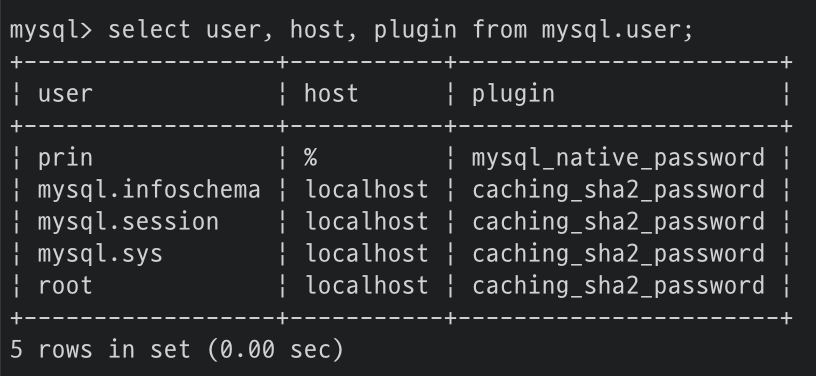
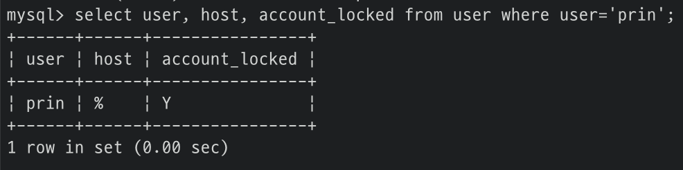
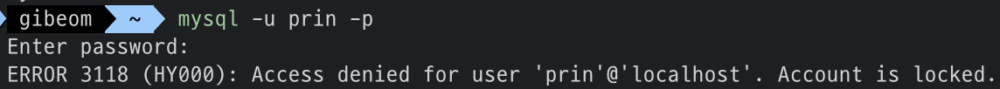
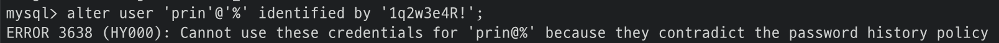
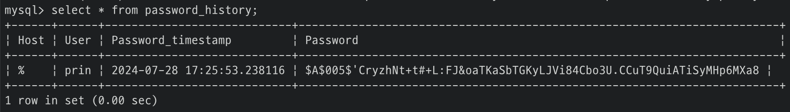
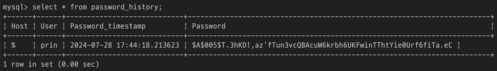
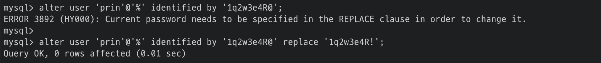
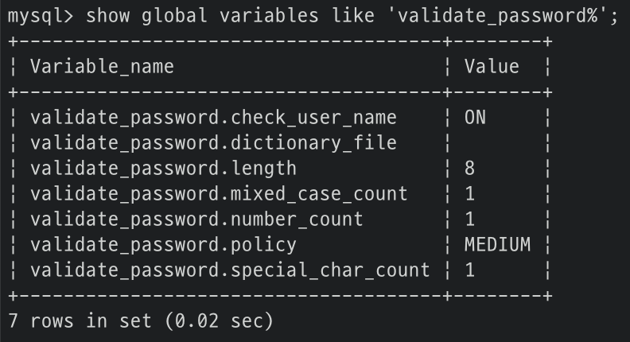
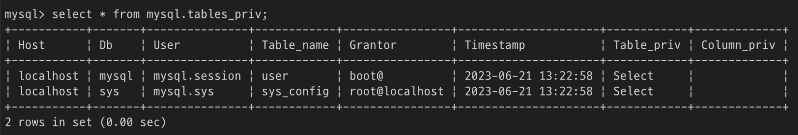
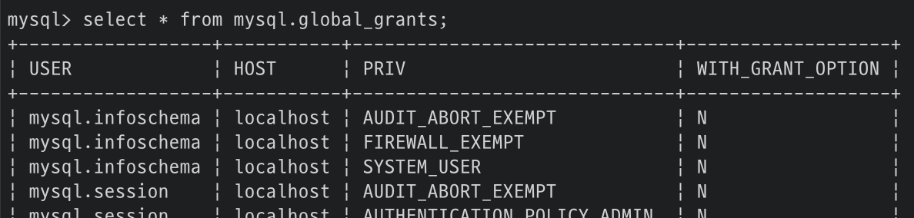

# 3. 사용자 및 권한
- [3.1. 사용자 식별](#31-사용자-식별)
- [3.2. 사용자 계정 관리](#32-사용자-계정-관리)
- [3.3. 비밀번호 관리](#33-비밀번호-관리)
- [3.4. 권한(Privilege)](#34-권한privilege)
- [3.5. 역할(Role)](#35-역할role)

## 3.1. 사용자 식별
```sql
'{사용자 아이디}'@'{호스트}'

'prin'@'127.0.0.1' -- 로컬 호스트에서만 prin이라는 아이디로 접속 가능
'prin'@'%' -- 모든 외부 컴퓨터에서 접속 가능
```

### 주의 사항
```sql
'prin'@'127.0.0.1' -- password: abc
'prin'@'%' -- password: 123
```
두 계정이 서버에 존재할 때 MySQL은 **범위가 가장 작은 것**을 항상 먼저 선택한다.
따라서 `prin`이라는 아이디와 `123` 패스워드로 로그인하면 접속에 실패한다.

## 3.2. 사용자 계정 관리
### 시스템 계정
- `SYSTEM_USER` 권한을 가지고 있다.
- 데이터베이스 서버 관리자를 위한 계정
- 시스템 계정 및 일반 계정을 관리할 수 있다.
- 계정 관리(계정 생성, 삭제, 권한 부여 및 제거)
- 다른 세션(Connection) 또는 그 세션에서 실행 중인 쿼리 강제 종료
- 스토어드 프로그램 생성 시 DEFINER를 타 사용자로 설정

#### 내장된 계정
- `mysql.sys`: sys 스키마의 객체(view, func, procedure)들의 DEFINER로 사용되는 계정
- `mysql.session`: MySQL 플러그인이 서버로 접근할 떄 사용되는 계정
- `mysql.infoschema`: information_schema에 정의된 view의 DEFINER로 사용되는 계정

> 삭제되지 않도록 주의

### 일반 계정
- 응용 프로그램이나 개발자를 위한 계정
- 시스템 계정을 관리할 수 없다.

<br/>

### 계정 생성
https://dev.mysql.com/doc/refman/8.4/en/create-user.html
```sql
CREATE USER 'prin'@'%'
    IDENTIFIED WITH 'mysql_native_password' BY '1q2w3e4r!' -- (1) 계정 인증 방식과 패스워드 설정
    REQUIRE NONE -- (2) 암호화된 SSL/TLS 채널 사용 여부
    PASSWORD EXPIRE INTERVAL 30 DAY -- (3) 패스워드 유효 기간
    ACCOUNT UNLOCK -- (4) 계정 잠금 여부
    PASSWORD HISTORY DEFAULT -- (5) 패스워드 이력 개수
    PASSWORD REUSE INTERVAL DEFAULT -- (6) 패스워드 재사용 불가 기간
    PASSWORD REQUIRE CURRENT DEFAULT; -- (7) 만료된 패스워드 변경 시 현재 패스워드 입력 여부
```
> 호스트를 명시하지 않을 경우 자동으로 모든 호스트('%')가 추가된다.
> ```sql
> CREATE USER 'prin'
> -- equals
> CREATE USER 'prin'@'%'
> ```

#### (1) IDENTIFIED WITH
```sql
CREATE USER 'prin'@'%'
    IDENTIFIED WITH 'mysql_native_password' BY '1q2w3e4r!';

CREATE USER 'prin'@'%'
    IDENTIFIED BY '1q2w3e4r!'; -- 기본 인증 방식 사용 (caching_sha2_password)
```



어떤 인증 플러그인을 사용할 것인지 명시한다. MySQL 8.0 버전부터 `Caching SHA-2 Authentication`이 기본 인증 방식이다.
> 기본 인증 방식 변경
>```sql
> SET GLOBAL default_authentication_plugin="mysql_native_password"
> -- or
>```
>```bash
> # my.cnf
> [mysqld]
> default_authentication_plugin=mysql_native_password
>```

1. Native Pluggable Authentication
    - MySQL 5.7 버전까지 기본으로 사용되던 방식
    - 패스워드에 대한 해시(SHA-1 알고리즘)값을 저장해두고, 클라이언트가 보낸 값과 해시값이 일치하는지 비교
2. Caching SHA-2 Pluggable Authentication
    - **MySQL 8.0 버전부터 기본 인증 방식**
    - Native Authentication과 달리 SHA-2 알고리즘을 사용하여 암호화 해시값 생성 (보안성이 더 높음)
    - salt 키 활용 + 수천 번의 해시 계산을 수행하기 때문에 동일한 키 값에 대해서도 결과가 다름
    - 성능이 떨어지기 때문에 해시 결괏값을 메모리에 캐시해서 사용 -> Caching이 이름에 포함된 이유
    - **SSL/TLS 또는 RSA 키페어**를 반드시 사용해야 하며 이를 위해 클라이언트에서 접속할 때 **SSL 옵션을 활성화**해야 함
    > MySQL 서버에 연결할 때 `useSSL=false` 옵션으로 SSL/TLS를 사용하지 않으면 RSA 키페어를 사용하고, 클라이언트는 공개키로 패스워드를 암호화해서 전송한다.<br>서버의 공개키를 요청하기 위해서는 `allowPublicKeyRetrieval=true` 옵션을 설정해야 하며  그렇지 않으면 `Public Key Retrieval is not allowed` 에러가 발생한다.<br>
    reference:<br>
    https://mysqlconnector.net/connection-options/ <br>
    https://dev.mysql.com/doc/refman/8.0/en/caching-sha2-pluggable-authentication.html <br>
    https://mysqlconnector.net/troubleshooting/retrieval-public-key/
3. PAM Pluggable Authentication
    - Unix나 Linux 패스워드 또는 LDAP같은 외부 인증을 사용할 수 있게 해주는 인증 방식
    - MySQL Enterprise Edition에서만 사용 가능
4. LDAP Pluggable Authentication
    - LDAP를 이용한 외부 인증을 사용할 수 있게 해주는 인증 방식
    - MySQL Enterprise Edition에서만 사용 가능

#### (2) REQUIRE
```sql
CREATE USER 'prin'@'%'
    REQUIRE {NONE | SSL | X509 | CIPHER | ISSUER | SUBJECT};
```
MySQL 서버에 접속할 때 암호화된 SSL/TLS 채널을 사용할지 여부를 설정한다. 별도로 설정하지 않으면 비암호화 채널로 연결된다.
`Caching SHA-2 Authentication` 인증 방식을 사용하면 `REQUIRE NONE`이어도 암호화된 채널만으로 MySQL 서버에 접속할 수 있다.

#### (3) PASSWORD EXPIRE
```sql
CREATE USER 'prin'@'%'
    PASSWORD EXPIRE { | NEVER | DEFAULT | INTERVAL n DAY}
```
패스워드의 유효 기간을 설정한다.
- \-
    - 계정 생성과 동시에 패스워드 만료 처리
- NEVER
    - 패스워드의 만료 기간 없음
- DEFAULT
    - `default_password_lifetime` 시스템 변수에 지정된 값으로 설정
- INTERVAL n DAY
    - 패스워드의 유효 기간을 오늘부터 n일로 설정
    - n = 30일 경우 30일마다 패스워드 변경

#### (4) ACCOUNT LOCK / UNLOCK
```sql
CREATE USER 'prin'@'%'
    ACCOUNT {LOCK | UNLOCK}
```
해당 계정으로 로그인하지 못하도록 계정을 잠굴지 여부를 설정한다.
옵션을 사용하지 않을 경우 **잠금 해제된 상태로 생성**된다.





#### (5) PASSWORD HISTORY
```sql
CREATE USER 'prin'@'%'
    PASSWORD HISTORY {DEFAULT | n}
```
한 번 사용했던 패스워드를 재사용하지 못하도록 `password_history` 테이블에 패스워드를 저장한다. 테이블에 존재하는 패스워드는 재사용할 수 없다.




- DEFAULT
    - `password_history` 시스템 변수에 지정된 값만큼 패스워드 이력 저장
- n
    - 최근 n개까지만 패스워드 이력 저장

#### (6) PASSWORD REUSE INTERVAL
```sql
CREATE USER 'prin'@'%'
    PASSWORD REUSE INTERVAL {DEFAULT | n DAY}
```
한 번 사용했던 패스워드의 재사용 금지 기간을 설정한다.




> PASSWORD HISTORY와 마찬가지로 `password_history` 테이블에 패스워드가 저장되는데, timestamp와 해싱된 값으로 금지 기간을 판별하지 않을까 추측

- DEFAULT
    - `password_reuse_interval` 시스템 변수에 지정된 기간으로 설정
- n DAY
    - n일 이후에 패스워드를 재사용할 수 있게 설정

#### (7) PASSWORD REQUIRE CURRENT
```sql
CREATE USER 'prin'@'%'
    PASSWORD REQUIRE CURRENT { | OPTIONAL | DEFAULT}
```
패스워드가 만료되어 새로운 패스워드로 변경할 때, 현재 패스워드를 입력해야 할지 여부를 설정한다.



- \-
    - 현재 패스워드를 먼저 입력하도록 설정
- OPTIONAL
    - 현재 패스워드를 입력하지 않아도 되도록 설정
- DEFAULT
    - `password_require_current` 시스템 변수의 값으로 설정

## 3.3. 비밀번호 관리


- *validate_password.check_user_name*: 패스워드에 계졍명이 포함되어 있는지 검증
- *validate_password.dictionary_file*: 설정된 사전 파일에 명시된 단어가 포함되어 있는지 검증 (금칙어)
- *validate_password.length*: 설정된 길이 이상의 패스워드가 사용됐는지 검증
- *validate_password.mixed_case_count*: 설정된 개수 이상의 대소문자 포함
- *validate_password.number_count*: 설정된 개수 이상의 숫자 포함
- *validate_password.policy*: 패스워드 정책 3가지
    1. LOW: `validate_password.length` 검증
    2. MEDIUM: LOW + `validate_password.mixed_case_count`, `validate_password.number_count`, `validate_password.special_char_count` 검증
    3. STRONG: MEDIUM + `validate_password.dictionary_file` 검증
- *validate_password.special_char_count*: 설정된 개수 이상의 특수문자 포함

### 이중 비밀번호
db 서버의 계정 정보는 다른 응용 프로그램로부터 공용으로 사용되는 경우가 많다. 
> ex. jdbc에서 'prin' 계정을 '1q2w3e4r!' 패스워드로 연결해서 사용하고 있을 때 db 서버에서 'prin' 계정의 패스워드를 변경할 경우 장애 발생

따라서 서비스가 실행 중인 상태에서 계정의 패스워드를 변경하는 것이 불가능하다. 이 같은 문제를 해결하기 위해 MySQL 8.0 부터 **2개의 패스워드를 동시에 사용할 수 있는 기능**이 추가되었다.

1. 계정 생성
```sql
CREATE USER 'prin'@'%'
    IDENTIFIED BY '1q2w3e4r!'; -- 현재 패스워드 1q2w3e4r!
```
2. 타 프로그램에서 'prin' 계정 연결
3. db에서 'prin' 계정의 패스워드 변경
```sql
ALTER USER 'prin'@'%'
    IDENTIFIED BY 'hello01!'
    RETAIN CURRENT PASSWORD;
    -- primary password: hello01!
    -- secondary password: 1q2w3e4r!
```
4. db에 연결하는 타 프로그램에서 'prin' 계정의 패스워드 변경
5. db에서 'prin'의 secondary 패스워드 삭제
```sql
ALTER USER 'prin'@'%'
    DISCARD OLD PASSWORD;
```

## 3.4. 권한(Privilege)
### GRANT
```sql
GRANT {권한명1, 권한명2, ...} ON {database명}.{table명} TO '{사용자 아이디}'@'{호스트}'
```

### GRANT OPTION
```sql
GRANT {권한명1, 권한명2, ...} ON {database명}.{table명} TO '{사용자 아이디}'@'{호스트}' WITH GRANT OPTION
```
다른 계정에게 자신의 권한을 공유할 수 있는 권한인 `GRANT OPTION`은 마지막에 `WITH GRANT OPTION`을 명시해서 부여한다.

### 글로벌 권한
```sql
GRANT {글로벌 권한명1, ...} ON *.* TO '{사용자 아이디}'@'{호스트}'
```
글로벌 권한은 특정 DB나 테이블에 부여할 수 없기 때문에 항상 `*.*`을 사용한다.

### 객체 권한
```sql
GRANT {db 권한명1, ...} ON *.* TO '{사용자 아이디}'@'{호스트}'
GRANT {db 권한명1, ...} ON {database명}.* TO '{사용자 아이디}'@'{호스트}'
```
객체 권한 중 db 권한은 모든 db(`*.*`) 또는 특정 db(`{database명}.*`)에 권한을 부여할 수 있고, 특정 table까지는 명시할 수 없다.

db는 db 내부에 존재하는 테이블뿐만 아니라 스토어드 프로그램들도 모두 포함한다.

<br>

```sql
GRANT {table 권한명1, ...} ON *.* TO '{사용자 아이디}'@'{호스트}'
GRANT {table 권한명1, ...} ON {database명}.* TO '{사용자 아이디}'@'{호스트}'
GRANT {table 권한명1, ...} ON {database명}.{table명} TO '{사용자 아이디}'@'{호스트}'
```
객체 권한 중 table 권한은 모든 db(`*.*`) 또는 특정 db(`{database명}.*`) 또는 특정 db의 특정 table(`{database명}.{table명}`)에 권한을 부여할 수 있다.

테이블의 특정 column에 권한을 부여하는 경우 `INSERT`, `UPDATE`, `SELECT`만 가능하다.
```sql
GRANT INSERT({column명}) ON *.* TO '{사용자 아이디}'@'{호스트}'
```
자주 사용하지 않으며 column 단위의 권한이 하나라도 설정되면 나머지 모든 table의 모든 column에 대해서도 권한 체크가 이루어지기 때문에 **전체적인 성능에 영향을 미칠 수 있다.**
> 꼭 필요할 경우 별도의 view를 만들어 사용 -> view 자체에 대한 권한만 체크하게 된다.


### 정적 권한
MySQL 서버의 소스코드에 고정적으로 명시되어 있는 권한

|저장소 테이블|설명|
|--|--|
|mysql.user|계정 정보 & 계정이나 역할에 부여된 글로벌 권한|
|mysql.db|계정이나 역할에 DB 단위로 부여된 권한|
|mysql.tables_priv|계정이나 역할에 table 단위로 부여된 권한|
|mysql.columns_priv|계정이나 역할에 column 단위로 부여된 권한|
|mysql.procs_priv|계정이나 역할에 스토어드 프로그램 단위로 부여된 권한|



### 동적 권한
MySQL 서버가 시작되면서 동적으로 생성하는 권한

|저장소 테이블|설명|
|--|--|
|mysql.global_grants|계정이나 역할에 부여되는 동적 글로벌 권한|



## 3.5 역할(Role)
```sql
CREATE ROLE {role명1, role명2, ...}; 
```
빈 껍데기만 있는 역할을 정의한다.

<br>

```sql
GRANT {권한명1, 권한명2, ...} ON {database명}.{table명} TO {role명}
```
GRANT 명령으로 각 역할에 실질적인 권한을 부여해야 한다.

<br>


```sql
GRANT {role명1, role명2, ...} TO '{사용자 아이디}'@'{호스트}'
```
역할 그 자체로는 사용할 수 없고, 계정에 역할을 부여해야 한다.

<br>

```sql
SET ROLE '{role명}';
-- or
SET GLOBAL activate_all_roles_on_login=ON; -- 로그인과 동시에 부여된 역할 자동 활성화
```
역할은 로그인 동안만 유지되기 때문에 재로그인하면 역할이 활성화되지 않은 상태로 초기화된다.
따라서 `SET ROLE` 명령으로 다시 활성화하거나 시스템 변수를 설정해야 한다.

### 역할 vs 계정
MySQL은 내부적으로 역할과 계정을 동일한 객체로 취급한다. 하나의 계정에 다른 계정의 권한을 병합하는 방식이기 때문에 따로 구분하지 않는다.
> 식별할 수 있는 prefix나(ex. `role_`) 키워드를 추가해서 role명을 선택하는 방법을 권장한다.

역할의 호스트는 계정에 연결되었을 때 아무런 영향이 없으며 `account_locked`가 Y이기 때문에 로그인 용도로도 사용할 수 없다.

> 여러 권한 부여를 재사용할 때 용이할 것 같다.
> 
> ex) A, B, C 계정에 INSERT, UPDATE, DELETE 권한을 부여할 경우 `role_write` 역할에 권한 부여한 후 A, B, C 계정에 역할 연결
