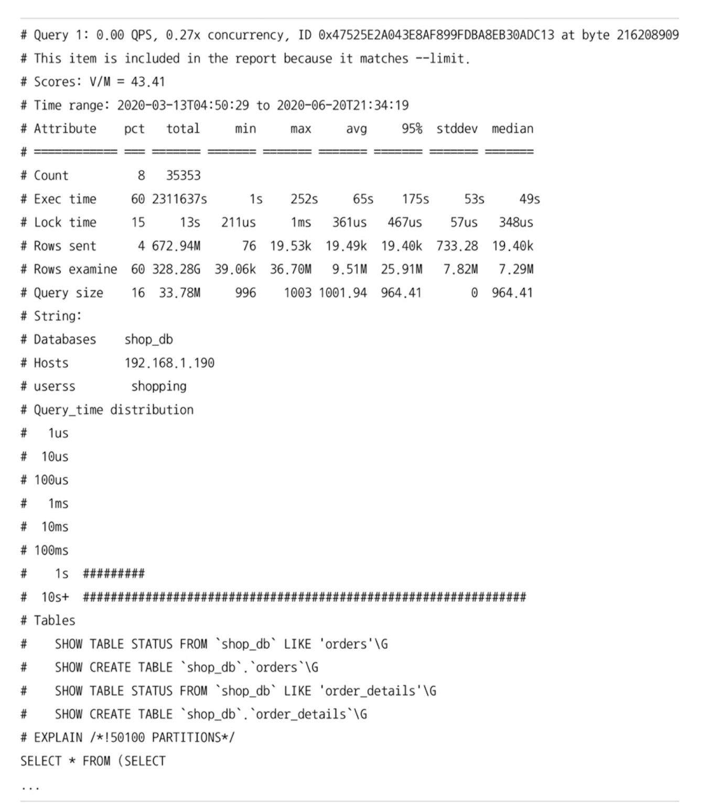

# 4장 아키텍처

MySQL 서버는 사람의 머리 역할을 하는 MySQL 엔진과 손발 역할을 하는 스토리지 엔진으로 나뉜다.

핸들러 API를 만족한다면 누구나 스토리지 엔진을 구현하여 MySQL 서버에 추가할 수 있다.

MySQL 엔진과 MySQL 서버에서 기본으로 제공되는 InnoDB 스토리지 엔진과 MyISAM 스토리지 엔진을 구분해서 알아보자.

# 4.1 MySQL 엔진 아키텍처

기본적인 MySQL 엔진의 구조에 대해서 알아보자.

MySQL 서버는 다른 DBMS에 비해 구조가 상당히 독특한 편이다. 사용자 입장에서는 차이를 거의 못느끼지만 이러한 독특한 구조 덕분에 다른 DBMS에서 가질 수 없는 엄청한 해택을 누릴 수 있다. 하지만 동시에 다른 DBMS에서 문제가 되지 않을 것들이 가끔 문제가 되기도 한다.

## 4.1.1 MySQL의 전체 구조


MySQL은 대부분의 프로그래밍 언어로부터 접근 방법을 모두 지원한다.

그리고 앞서 말했듯이 MySQL 서버는 크게 MySQL 엔진과 스토리지 엔진으로 구분할 수 있다.

> MySQL 서버
> 
> - MySQL 엔진
> - 스토리지 엔진

그리고 이 둘을 합쳐서 그냥 MySQL 또는 MySQL 서버라고 이 책에서는 표현한다고 한다.

### 4.1.1.1 MySQL 엔진

MySQL 엔진은 다음 것들이 중심을 이룬다.

- **커넥션 핸들러**: 클라이언트로부터의 접속 및 쿼리 요청을 처리
- **SQL 파서 및 전처리기**
- **옵티마이저** : 쿼리의 최적화된 실행을 위함

또한 MySQL은 표준 SQL문법을 지원하기 때문에 표준 문법에 따라 작성된 타 DBMS와 호환되어 실행될 수 있다.

MySQL 엔진은 요청된 SQL 문장을 분석하거나 최적화하는 등 DBMS의 두뇌에 해당하는 처리를 수행한다.

### 4.1.1.2 스토리지 엔진

반면에 스토리지 엔진은 실제 데이터를 디스크 스토리지에 저장하거나 디스크 스토리지로부터 데이터를 읽어보는 부분을 전담한다.

MySQL 서버에서 MySQL 엔진은 하나이지만 스토리지 엔진은 여러 개를 동시에 사용할 수 있다.

```sql
CREATE TABLE test_table(fd1 INT, fd2 INT) ENGINE=INNODB;
```

다음과 같이 테이블을 생성할 때 스토리지 엔진을 지정하면 이후 해당 테이블의 모든 읽기 및 쓰기 작업은 정의된 스토리지 엔진에서 수행한다. 위 쿼리를 통해 테이블을 생성하면 test_table에 대해 INSERT, UPDATE, DELETE, SELECT. .. 등의 작업이 발생하면 InnoDB 스토리지 엔진이 담당하여 처리하게 된다.

<aside>
💡 **❓그렇다면 엔진을 따로 지정하지 않는 경우에는 어떨까? 랜덤으로 스토리지 엔진이 할당되는 것일까?**

</aside>

각 스토리지 엔진은 성능을 향상시키기 위해 키 캐시(MyISAM 스토리지 엔진)나 InnoDB 버퍼 풀(InnoDB 스토리지 엔진)과 같은 기능을 내장하고 있다.

### 4.1.1.3 핸들러 API

MySQL 엔진의 쿼리 실행기에서 데이터를 쓰거나 읽을 때 각 스토리지 엔진에 쓰기 또는 읽기를 요청하는데 이러한 요청을 **핸들러(Handler) 요청**이라고 한다. 그리고 여기서 사용되는 API를 **핸들러 API**라고 한다. InnoDB 스토리지 엔진도 이러한 핸들러 API를 통해 MySQL 엔진과 데이터를 주고받는다.

이 핸들러 API를 통해 얼마나 많은 데이터(레코드) 작업이 있었는지 `SHOW GLOBAL STATUS LIKE 'Handler%'` 명령어로 확인할 수 있다.


## 4.1.2 MySQL 스레딩 구조


MySQL 서버는 프로세스 기반이 아니라 스레드 기반으로 동작한다. 그리고 스레드는 크게 포그라운드(Foreground) 스레드와 백그라운드(Background) 스레드로 구분할 수 있다.

> MySQL 스레드
> 
> - 포그라운드(Foreground) 스레드 : 사용자(클라이언트)의 요청을 처리하는 스레드
> - 백그라운드(Background) 스레드

MySQL 서버에서 실행중인 스레드의 목록은 다음과 같이 `performance_schema` 데이터베이스의 `threads` 테이블을 통해 확인할 수 있다.

```sql
SELECT thread_id, name, type, processlist_user, processlist_host FROM performance_schema.threads ORDER BY type, thread_id;
```


39개의 스레드가 실행중이라고 나오며 이 중 4개만 포그라운드 스레드이고 나머지 35개는 전부 백그라운드 스레드이다. 그런데 이 중에서 마지막 부분에 `therad/sql/one_connection`  스레드만 실제 사용자의 요청을 처리하는 포그라운드 스레드이다.

백드라운드 스레드의 개수는 MySQL 서버의 설정에 따라 가변적이고, 동일한 이름의 스레드가 2개 이상 보이는 것은 MySQL 서버의 설정 내용에 의해 여러 스레드가 동일 작업을 병렬로 처리하는 경우이다.

<aside>
💡 여기서 소개하는 스레드 모델은 MySQL 서버가 전통적으로 가지고 있던 스레드의 모델이며 MySQL 커뮤니티 에디션에서 사용되는 모델이다. MySQL 서버에는 전통적인 스레드 모델 뿐 아니라 **스레드 풀(Thread Pool)모델**도 있다. 이 둘의 가장 큰 차이점은 **포그라운드 스레드와 커넥션과의 관계**이다. 전통적인 스레드 모델에서는 커넥션 별로  포그라운드 스레드가 하나씩 생성되고 할당된다. 반면에 스레드 풀에서는 하나의 스레드가 여러 개의 커넥션 요청을 전담한다. 스레드 풀에 대한 자세한 설명은 4.1.9절 스레드 풀에서 확인하자.

</aside>

### 4.1.2.1 포그라운드 스레드(클라이언트 스레드, 사용자 스레드)

포그라운드 스레드는 최소한 MySQL 서버에 접속한 클라이언트 수 만큼 생성(최소한이라는 말은 하나의 클라이언트가 여러 스레드를 사용할 수 있다는 의미인듯)하며 주로 각 클라이언트 사용자가 요청하는 쿼리문을 처리한다.

**[스레드 캐시]**

클라이언트 사용자가 작업을 마치고 커넥션을 종료하면 해당 커넥션을 담당하던 스레드는 **스레드 캐시(Thread cache)**로 되돌아간다. 만약 스레드 캐시에 일정 개수 이상의 대기 중인 스레드가 있다면 스레드 캐시에 넣지 않고 스레드를 종료시켜 일정 개수의 스레드만 스레드 캐시에 존재하도록 유지한다. 스레드 캐시에 유지할 수 있는 스레드의 개수는 `thread_cache_size` 시스템 변수로 설장한다.

포그라운드 스레드는 데이터를 MySQL의 데이터버퍼나 캐시로부터 가져온다. 만약 버퍼나 캐시에 없는 경우에는 직접 디스크의 데이터나 인덱스 파일로부터 데이터를 읽어와서 작업을 처리한다.

<aside>
💡 **❓디스크의 데이터는 DB서버에 저장된 데이터를 말하는건가? 인덱스 파일은 뭘까??**

</aside>

MyISAM 테이블은 디스크 쓰기 작업까지 포그라운드 스레드가 처리한다. InnoDB 테이블은 데이터 버퍼나 캐시까지만 포그라운드 스레드가 처리하고 나머지 버터로부터 디스크까지 기록하는 작업은 백그라운드 스레드가 처리한다. 버퍼로부터 디스크까지 기록하는 작업은 백그라운드 스레드가 처리한다.

<aside>
💡 MySQL에서는 **사용자 스레드**와 **포그라운드 스레드**를 똑같은 의미로 사용한다. MySQL 서버에 사용자가 접속하게 되면 클라이언트의 쿼리를 처리할 스레드를 생성해 클라이언트에게 할당한다. 이 스레드는 DBMS의 앞단에서 사용자(클라이언트)와 통신하기 때문에 포그라운드 스레드라고 하며, 사용자가 요청한 작업을 처리하기 때문에 사용자 스레드라고도 한다.

</aside>

### 4.1.2.2 백그라운드 스레드

MyISAM의 경우에는 별로 해당 사항이 없는 부분이지만 InnoDB는 다음과 같은 여러 작업들을 백그라운드로 처리한다.

- 인서트 버퍼(Insert Buffer)를 병합하는 스레드
- 로그를 디스크로 기록하는 스레드
- InnoDB 버퍼 풀의 데이터를 디스크에 기록하는 스레드
- 데이터를 버퍼로 읽어 오는 스레드
- 잠금이나 데드락을 모니터링하는 스레드

모두 중요한 작업이지만 로그 스레드(Log thread)와 버퍼의 데이터를 디스크로 내려쓰는 작업을 처리하는 쓰기 스레드(write thread)일 것이다. MySQL 5.5 이후부터 쓰기 스레드와 읽기 스레드의 개수를 2개 이상 지정할 수 있는데 `innodb_write_io_threads` , `innodb_read_io_threads` 시스템 변수로 스레드의 개수를 설정할 수 있다.

**[백그라운드 스레드 개수]**

InnoDB에서도 데이터를 읽는 작업을 포그라운드 스레드에서 처리하기 때문에 읽기 스레드는 많이 설정할 필요가 없지만 쓰기 스레드는 아주 많은 작업을 백그라운드로 처리하기 때문에 일반적인 내장 디스크로 사용할 때는 2~4개 정도. DAS나 SAN과 같은 스토리지를 사용하는 경우 최적으로 사용할 수 있는 개수를 설정하는 것이 좋다.

<aside>
💡 **❓읽기 스레드를 많이 설정할 필요가 없다는 것은 대부분의 읽기 작업은 포그라운드 스레드가 처리하기 때문에 백그라운드 스레드로 읽기 스레드를 설정할 필요가 적다는 의미인가?**

</aside>

<aside>
💡 **❓스토리지가 있어도 결국 쓰기 작업을 하는 스레드가 필요한 것은 동일한 것 아닌가? DAS, SAN은 쓰기 작업을 처리하는 별도의 무엇이 있는건가?**

</aside>

**[쓰기 작업 지연]**

사용자 요청을 처리하는 데이터의 쓰기 작업은 지연(버퍼링)되어 처리될 수 있지만 읽기 작업은 절대 지연될 수 없다(SELECT 작업 쿼리를 날렸는데 10분뒤에 알려준다면 사용할 사용자는 없을 것이다). 

InnoDB를 포함한 대부분의 상용 DBMS에서는 쓰기 작업을 버퍼링해서 일괄 처리하는 기능을 탑재되어 있다. 이러한 이유로 INSERT, UPDATE, DELETE 쿼리로 데이터가 변경되는 경우 데이터가 디스크에 완전히 저장될 때 까지 기다리지 않아도 된다.

하지만 MyISAM은 사용자 스레드에서 쓰기 작업까지 함께 처리되도록 설계되어 있다. 따라서 MyISAM에서 일반적인 쿼리는 쓰기 버퍼링 기능을 사용할 수 없다. (즉, 데이터 변경의 경우에도 처리될 때 까지 기다려야 한다는 의미)

## 4.1.3 메모리 할당 및 사용 구조


MySQL에서 사용되는 메모리 공간은 크게 **글로벌 메모리 영역**과 **로컬 메모리 영역**으로 나뉜다. 

글로벌 메모리 영역의 모든 메모리 공간은 MySQL 서버가 시작되면서 운영체제로 부터 할당 받는다. 운영체제 종류에 따라 다르겠지만 요청된 메모리를 전부 할당해줄 수 있고, 필요할 때 마다 조금씩 할당 받을 수도 있다. 정확히 MySQL 서버가 사용하는 메모리 양을 측정하는 것이 어렵기 때문에 MySQL의 시스템 변수로 설정해둔 만큼 운영체재로 부터 메모리를 할당 받는다고 생각해도 된다.

글로벌 메모리 영역과 로컬 메모리 영역을 구분하는 기준은 MySQL 서버 내에 존재하는 많은 스레드가 공유해서 사용할 수 있는 공간이지 유무에 따라 나뉜다.

### 4.1.3.1 글로벌 메모리 영역

클라이언트 스레드의 수와 무관하게 하나의 메모리 공간만 할당된다. 필요에 따라 N개의 메모리 공간을 할당 받을 수도 있다. 글로벌 메모리 영역이 N개라도 모든 스레드에 의해 공유된다. 대표적인 글로벌 메모리 영역은 다음과 같다.

- 테이블 캐시
- InnoDB 버퍼 풀
- InnoDB 어댑티브 해시 인덱스
- InnoDB 리두 로그 버퍼

### 4.1.3.2 로컬 메모리 영역(세션 메모리 영역, 클라이언트 메모리 영역)

MySQL 서버상에 존재하는 클라이언트 스레드(포그라운드 스레드)가 쿼리를 처리하는 데 사용하는 메모리 영역이다. 대표적으로 그림 4.3의 커넥션 버퍼와 정렬(소트) 버퍼가 등이 있다.

그림 4.2에서 볼 수 있듯이 MySQL 서버는 클라이언트 커넥션으로 부터 요청을 처리하기 위해 스레드를 하나씩 할당하게 되는데, 클라이언트 스레드가 사용하는 메모리 공간이여서 **클라이언트 메모리 영역**이라고도 한다. 클라이언트와 MySQL 서버와의 커넥션을 세션이라고 하기 때문에 로컬 메모리 영역을 **세션 메모리 영역**이라고도 한다.

**[로컬 메모리 영역 관리]**

로컬 메모리 영역은 각 스레드마다 독립적으로 할당되기 때문에 절대 공유되지 않는다는 것이 특징이다. 공유되는 영역이 아니기 때문에 크게 신경 쓰지 않고 설정할 수 있는데 최악의 경우(가능성은 희박)에는 MySQL 서버가 메모리 부족으로 멈춰 버릴 수 있으므로 적절한 메모리 공간을 설정하는 것이 중요하다. 로컬 메모리 공간의 또 한 가지 중요한 특징은 각 쿼리의 용도별로 필요할 때만 공간이 할당되고 그렇지 않은 경우에는 MySQL이 메모리 공간을 할당조차 안할 수 있다는 점이다. **커넥션 버퍼**나 **결과 버퍼** 같은 경우에는 로컬 메모리 공간은 커넥션이 열려 있는 동안 할당되는 반면에 **소트 버퍼(Sort buffer)**나 **조인 버퍼** 같은 경우, 쿼리를 실행하는 순간에만 공간을 할당했다가 다시 해제한다.

대표적인 로컬 메모리 영역은 다음과 같다.

- 정렬 버퍼(Sort buffer)
- 조인 버퍼
- 바이너리 로그 캐시
- 네트워크 버퍼

## 4.1.4 플러그인 스토리지 엔진 모델


MySQL의 독특한 구조 중 대표적인 것이 플러그인 모델이다. 스토리지 엔진 플러그인 뿐만 아니라 전문 검색을 위한 검잭어 파서도 플러그인 형대로 개발해서 사용할 수 있으며 이전에 배웠듯이 사용자의 인증을 위한 Caching SHA-2 Authentication 등도 모두 플러그인으로 구현되어 제공된다. 이러한 요건을 기조로 다른 전문 개발 회사나 사용자가 직접 스토리지 엔진을 개발하는 것도 가능하다.


거의 대부분의 작업은 MySQL 엔진이 처리하기 때문에 스토리지 엔진을 만든다고 하더라도 필요한 일부분의 기능만 수행하는 엔진을 만들 수 있다.

**[핸들러]**

그림 4.5의 각 처리 영역에서 ‘데이터 읽기/쓰기’작업은 대부분 1건의 레코드 단위(레코드 1건 읽기 또는 마지막으로 읽은 레코드 다음 또는 이전 레코드 읽기와 같이)로 처리된다. 그리고 MySQL을 사용하다보면 **핸들러(Handler)**라는 단어를 자주 듣게 될 것이다. 사람이 핸들을 이용해 자동차를 운전하듯이, 프로그래밍 언어에서는 어떤 기능을 호출하기 위해 사용하는 운전대 같은 역할을 하는 객체를 핸들러(또는 핸들러 객체)라고 한다. MySQL 서버에서는 MySQL 엔진이 사람의 역할을 하고 각 스토리지 엔진은 자동차의 역할을 하는데, MySQL 엔진이 스토리지 엔진을 조정하기 위해 핸들러라는 것을 사용하게 된다. MySQL 엔진이 각 스토리지 엔진에게 데이터를 읽어오거나 저장하도록 명령하려면 반드시 핸들러를 통해야한 한다는 점을 기억하자. 이후 상태 변수라는 것을 배울 텐데, 이러한 상태 변수에서 `Handler_` 로 시작하는 상태 변수는 ‘MySQL 엔진이 각 스토리지 엔진에게 보낸 명령어의 횟수를 의미하는 변수’라고 이해하면 된다.

**[스토리지 엔진은 차이가 없나?]**

MySQL에서 MyISAM이나 InnoDB같이 다른 스토리지 엔진을 사용하는 테이블에 대해서 쿼리를 실행하더라고 MySQL 처리 내용은 대부분 동일하며, 단순히 ‘데이터 읽기/쓰기’영역의 처리만 차이가 있을 뿐이다. 

실질적인 GROUP BY 나 ORDER BY 같은 복잡한 처리는 스토리지 엔진이 아니라 MySQL 엔진의 처리 영역인 ‘SQL 실행기’ 에서 처리된다. 

이러면 MyISAM 이나 InnoDB 스토리지 엔진 가운데 뭘 사용하든 별 차이가 없을 것 처럼 느껴지는데 여기선 매우 간략하게 언급한 것일 뿐이고, 단순히 보이는 ‘데이터 읽기/쓰기’ 작업 처리 방식이 얼마나 달라질 수 있는 가는 앞으로 느끼게 될 것이다.

여기서 중요한 것은 하나의 쿼리 작업은 여러 하위 작업으로 나뉘는데, 각 하위 작업이 **MySQL 엔진의 영역에서 처리**되는 것인지 아니면 **스토리지 엔진의 영역에서 처리**되는 것인지 **구분**할 줄 알아야 한다.

**[스토리지 엔진 확인]**

설치된 MySQL서버에서 지원하는 스토리지 엔진은 어떤것이 있는지 확인하자

```sql
SHOW ENGINES;
```


- Support 칼럼
    - YES : MySQL 서버에 해당 스토리지 엔진이 포함되어 있고, 사용 가능으로 활성화된 상태
    - DEFAULT : ‘YES’ 와 동일한 상태이지만 필수 스토리지 엔진임을 의미(즉, 이 엔진이 없으면 MySQL이 실행되지 않을 수도 있음을 의미)
    - NO : 현재 MySQL 서버에 포함되지 않았음
    - DISABLED : 현재 MySQL 서버에는 포함됐지만 파라미터에 의해 비활성화된 상태

MySQL 서버에 ****포함되지 않은 스토리지 엔진(Support : NO)을 사용하려면 MySQL 서버를 다시 빌드(컴파일)해야한다. 하지만 만약 MySQL 서버가 적절한 준비만 되어 있다면 플러그인 형태로 빌드된 스토리지 엔진 라이브러리를 다운로드해서 끼워넣기만 하면 사용할 수 있다. 또한 플러그인 형태의 스토리지 엔진을 업그레이드할 수도 있다.

스토리지 엔진 뿐만 아니라 모든 플러그인의 내용을 다음과 같이 확인할 수 있다.

```sql
SHOW PLUGINS;
```


MySQL 서버는 스토리지 엔진 뿐만 아니라 다양한 기능을 플러그인 형태로 지원한다. 심지어 커스텀하게 확장할 수 있게 플러그인 API가 메뉴얼로 공개되어 있어서 MySQL 서버에서 제공하는 기능들을 확장하거나 완전히 새로운 기능들을 플러그인을 이용해 구현할 수 있다.

## 4.1.5 컴포넌트

MySQL 8.0 부터는 기존의 플러그인 아키텍처를 대체하기 위해 컴포넌트 아키텍쳐가 지원된다.

MySQL 서버의 플러그인에는 몇가지 단점이 존재했는데 이를 보완하기 위해서 컴포넌트가 개발되었다.

- 플러그인은 오직 MySQL 서버와 인터페이스할 수 있고 플러그인 끼리는 통신할 수 없다.
- 플러그인은 MySQL 서버의 변수나 함수를 직접 호출하기 때문에 안전하지 않다.(캡슐화 안됨)
- 플러그인은 상호 의존 관계를 설정할 수 없어서 초기화가 어렵다.

MySQL 5.7까지는 비밀번호 검증 기능이 플러그인 형태로 제공되었지만 8.0 이후로는 컴포넌트로 개선되었다. 비밀번호 검증 기능 컴포넌트를 통해 컴포넌트를 살펴보자.

```sql
INSTALL COMPONENT 'file://component_validate_password'; 

SELECT * FROM mysql.component;
```

이미 설치되어 있으면 INSTALL 명령어는 오류 응답을 준다.


플러그인과 마찬가지로 컴포넌트를 설치하면서 새로운 시스템 변수를 설정해야할 수 있으므로 컴포넌트를 사용하기 전에 관련 메뉴얼을 참고하자.

## 4.1.6 쿼리 실행 구조 (여기부터 빠르게 정리)


쿼리 구조를 간단히 그리면 위와 같으며 다음과 같이 기능별로 나눠볼 수 있다.

### 4.1.6.1 쿼리 파서

- 사용자 요청으로 오는 쿼리문 문장을 토큰 단위로 분해
- 기본 문법 오류 확인

### 4.1.6.2 전처리기

- 쿼리 문장에 구조적 문제 확인
- 테이블 이름, 칼럼 이름, 객체 존재 여부, 객체 접근 구너한 확인

### 4.1.6.3 옵티마이저

- 가장 저렴한 비용으로 처리하는 방법을 결정하는 역할
- DBMS의 두뇌 역할

### 4.1.6.4 실행 엔진

- 옵티마이저가 두뇌면 실행 엔진과 핸들러는 손과 발
- 회사로 비유
    - 옵티마이저 : 경영진
    - 실행 엔진 : 중간 관리자
    - 핸들러 : 업부 실무자
- 만들어진 계획대로 각 핸들러에게 요청하고 결과를 또 다른 핸들러에게 요청 입력으로 연결하는 역할 수행

### 4.1.6.5 핸들러(스토리지 엔진)

- 핸들러 MySQL 서버의 가장 밑단에서 MySQL 실행 엔진 요청에 따라 디스크에 데이터를 읽어오고 저장하는 역할 담당
- 핸들러는 결국 스토리지 엔진을 의미한다.
    - MyISAM 테이블을 조작하는 경우, 핸들러가 MyISAM 스토리지 엔진이 되는 것이다.

### 4.1.6.7 복제

- 매우 중요한 역할을 담당하는 것이여서 뒤에서 다룰 예정

## 4.1.8 쿼리 캐시

- 쿼리 캐시(Query Cache)는 쿼리 실행 결과를 캐시하고 동일한 요청 시 즉시 결과를 반환하여 빠른 성능을 보였다.
- 하지만 테이블 데이터 변경 시 변경된 테이블과 관련된 것들을 모두 삭제를 해줘야해서 심각한 동시 처리 성능 저하를 유발
- 또한 MySQL 이 발전하면서 계속된 동시 처리 성능 저하와 많은 버그를 유발
- 따라서 8.0에서는 완전히 사라짐

## 4.1.9 스레드 풀

- MySQL 서버는 엔터프라이즈 에디션에서만 스레드 풀 기능을 제공
- 따라서 이 책에서는 Percona Server에서 제공하는 스레드 풀 기능을 살펴볼 예정
    - Percona Server 는 플러그인 형태로 작동하게 구현 돼 있음
    - 따라서 커뮤니티 에디션에서도 동일 버전의 Percona Server를 다운 받아서 사용하면 됨
- 스레드 풀은 내부적으로 사용자 요청을 처리하는 스레드 개수를 줄여 동시 처리가 많아도 MySQL 서버의 CPU가 제한된 스레드 처리에만 집중할 수 있게 하여 서버의 자원 소모를 줄이는 것이 목적
- 스레드 풀을 도입해서 성능이 눈에 띄게 좋아지는 경우는 드묾
- 스케줄링 과정에서 CPU 시간을 제대로 확보하지 못하면 오히려 성능이 떨어질 수 있음
- 물론 제한된 스레드 만으로 CPU가 처리하도록 잘 유도하면 CPU 프로세스 친화도(Processor affinity)를 높이고 운영체제 입장에서 불필요한 컨텍스트 스위칭도 줄여 오버헤드를 낮출 수 있음
- Percona Server는 기본적으로 CPU 코어 수 만큼 스레드 그룹을 생성
    - `thread_pool_size` 시스템 변수로 조정 가능
    - 일반적으로 코어 개수만큼 하는게 프로세스 친화도에 좋음
    - 모든 스레드를 사용중인 경우 설정된 개수 만큼 추가로 더 받아들여서 처리하는 방법이 있음
        - `thread_pool_oversubsribe` 변수로 조정 (기본값 3)
- 새로운 작업이 왔는데 모든 스레드 사용중이라면 `pool_stall_limit` 까지 기다린 뒤 새로운 스레드를 생성한다.
    - 응답 시간이 민감한 서비스이면 해당 값을 적절히 낮춰서 사용
    - 그렇다며 0에 가까운 값을 설정하는 것은 권장 X → 그럴거면 스레드 풀 안쓰는게 나음
- `thread_pool_max_threads` 보다는 많이 생성할 수 없음
- Percon Server 는 선순위 큐와 후순위 큐를 사용하여 특정 트랜잭션이나 쿼리를 우선적으로 처리하는 기능을 제공함
    
    
    

## 4.1.10 트랜잭션 지원 메타 데이터

- 데이터베이스 서버에서 테이블 구조 정보와 스토어드 프로그램 등의 정보를 데이터 **딕셔너리** 또는 **메타데이터**라고 한다.
- MySQL 5.7까지는 이러한 메타데이터 생성 및 변경 작업이 트랜잭션으로 지원하지 않아 중간에 MySQL 서버가 비정상 종료 시 일관되지 않는 상태로 남아 있는 문제가 있었음
- 따라서 MySQL 8.0 부터는 이러한 메타데이터를 모두 InnoDB 테이블에 저장하도록 개선됨
- MySQL 서버가 작동하는데 기본적으로 필요한 테이블들을 묶어 **시스템 테이블**이라고 한다.
    - 대표적으로 사용자 인증과 권한 관련 테이블
- 이런 시스템 테이블과 데이터 딕셔너리 정보를 모두 모아서 mysql DB에 저장하고 있다.
    - `mysql.ibd` 라는 이름의 테이블스페이스에 저장되어서 관리됨
    - 테이블스페이스가 뭐지? 그냥 테이블 저장 공간?
    - 따라서 다른 `*.ibd` 와 함께 특별히 주의해야함
- 테이블 목록을 확인해보면 테이블 구조가 저장된 테이블은 보이지 않는다.
    - 임의로 수정 못하게 화면에 보여주지 않는다. 하지만 실제로 테이블이 존재한다.
    - 대신 아래 명령어로 조회할 수 있다.
    
    ```sql
    SHOW CREATE TABLE INFORMATION_SCHEMA.TABLES;
    ```
    
    
    
    ```sql
    SELECT * FROM mysql.tables LIMIT 1;
    ```
    
    실제로 조회해보면 테이블이 없다고 나오지 않고 권한이 없다고 나옴
    
    
    
- InnoDB 스토리지 엔진을 사용하지 않는 MyISAM이나 CSV등에서는 여전히 메타 정보를 저장할 공간이 필요하다
- MySQL 서버에서는 이러한 엔진들을 사용하는 테이블들을 위해 SDI(Serialized Dictionary Information) 파일을 사용한다.
- InnoDB 이외의 테이블에 대해선 SDI 포맷의  `*.sdi` 파일이 존재하고 이 파일은 기존의 `*.FRM` 파일과 동일한 역할을 한다.
- SDI는 이름 그대로 직렬화 포맷이므로 InnoDB 테이블도 SDI 파일로 변환할 수 있음
    - 뭐고., 이게 왜 필요한대
- `ibd2sdi` 유틸리티를 사용하면 InnoDB 테이블스페이스에서 스키마 정보를 추출할 수 있음
    - 스키마 추출은 왜하는데

# 4.2 InnoDB 스토리지 엔진 아키텍처

- InnoDB는 스토리지 엔진 중 거의 유일하게 레코드 기반의 잠금을 제공한다.
- 따라서 높은 동시성 처리가 가능하고 안정적이며 성능이 뛰어나다.


## 4.2.1 프라이머리 키에 의한 클러스터링

- InnoDB 의 모든 테이블은 기본적으로 프라이머리 키를 기준으로 클러스팅되어 저장된다.
    - 프라이머리 키 값 순서대로 디스크에 저장된다는 뜻
    - 모든 세컨더리 키는 레코드 주소 대신 프라이머리 키의 값을 논리적인 주소로 사용
    - 클러스터링이 뭐지? → 이후 뒤에서 자세히 다룰 듯
- 프라이머리 키를 이용한 레인지 스캔이 상당히 빨리 처리된다.
    - 이유는 모르겠음
- 프라이머리 키는 기본적으로 다른 보조 인덱스에 비해 비중이 높게 설정
    - 뭔 비중이 높아??
- MyISAM 스토리지 엔진에서는 클러스터링 키를 지원하지 않는다.
- 따라서 프라이머리 키와 세컨더리 인덱스는 구조적 차이가 없음
    - 세컨더리 인덱스요?
- 프라이머리 키는 유니크 제약을 가진 세컨더리 인덱스일 뿐
- 모든 인덱스는 물리적인 레코드의 주소 값(ROWID)를 가진다.
    - 프라이머리 키(인덱스) 구조도 뒤에서 자세히 다룰 듯

## 4.2.2 외래 키 지원

- InnoDB 스토리지 엔진 레벨에서 지원하는 기능으로 MyISAM 이나 MEMORY 테이블에서 사용할 수 없다.
- InnoDB에서 외래 키는 부모 테이블과 자식 테이블 모두 해당 칼럼 인덱스 생성이 필요하고 변경 시 부모 테이블과 자식 테이블에 데이터가 있는지 체크하는 작업이 필요
    - 따라서 잠금이 여러 테이블로 전파되고 그로 인해 데드락이 발생할 때가 많아 외래 키 존재에 주의하는 것이 좋음
- `foreign_key_check` 변수 값을 OFF로 하면 외래 키 관계에 대한 체크 작업을 일시적으로 멈출 수 있다.
    - 빠르게 외래키 작업을 수동으로 처리할 때 사용
    - 외래키 관계의 부모 테이블에 대한 작업도 무시함
    - 레코드 적재나 삭재 등의 작업도 부가적 체크가 필요 없기 때문에 빠르게 처리할 수 있다.
    - 변수값 OFF 하도 작업 실행하고 다시 ON 하는 방식으로 활용한다.
    - 키 체크를 해제해도 부모 자식 테이블 관계를 깨진 상태로 유지할 수 없다.
        - 반드시 일관성을 맞춘 후 외래 키 체크 기능을 활성화해야 한다.
    - 해당 옵션의 적용 범위를 GLOBAL이나 SESSION으로 설정할 수 있다.
        
        ```sql
        SET GLOBAL foreign_key_checks=ON;
        SET SESSION foreign_key_checks=OFF;
        ```
        
        만약 따로 지정하지 않았다면 자동으로 현재 작업을 실행하는 SESSION에만 적용된다.
        

## 4.2.3 MVCC(Multi Version Concurrency Control)

- 일반적으로 레코드 레벨의 트랜잭션을 지원하는 DBMS가 제공하는 기능
    - 레코드 레벨의 트랜잭션이 뭐죠?
- MVCC의 가장 큰 목적은 **잠금을 사용하지 않는 일관된 읽기를 제공하는데 있다.**
- InnoDB는 언두 로그(Undo log)를 이용해 이 기능을 구현한다.
- MVCC에서 멀티 버전이라 함은 하나의 레코드에 여러 개의 버전이 동시에 관리된다는 의미이다.
- 예시를 살펴보자

```sql
CREATE TABLE member (
		m_id INT NOT NULL,
    m_name VARCHAR(20) NOT NULL,
    m_area VARCHAR(100) NOT NULL,
    PRIMARY KEY (m_id),
    INDEX ix_area (m_area)
);
    
INSERT INTO member (m_id, m_name, m_area) VALUES (12, '홍길동', '서울');

COMMIT;
```

테이블을 만들고 INSERT 문을 실행한 결과는 다음과 같다.


여기서 아래 쿼리문이 트랜잭션 안에서 실행된다고 해보자.

```sql
UPDATE member SET m_area='경기' WHERE m_id=12;
```


- UPDATE 문이 실행되면 커밋 실행 여부와 상관없이 InnoDB 버퍼 풀은 새로운 값인 ‘경기’로 업데이트 된다.
- 그리고 디스크의 데이터 파일에는 체크포인트나 InnoDB Write 스레드에 의해 새로운 값으로 업데이트돼 있을 수도 아닐 수도 있다.
    - InnoDB가 ACID를 보장하기 때문에 일반적으로 InnoDB 버퍼 풀과 데이터 파일은 동일한 상태라고 가정해도 무방하다.
    - 체크포인트가 뭐죠?

만약 여기서 해당 레코드를 조회하면 어디에 있는 결과가 나올까?

```sql
SELECT * FROM member where m_id=12;
```

- `transcation_isolation` 시스템 변수에 설정된 격리 수준(Isolation level)에 따라 다르다.
    - `READ_UNCOMMITED` → InnoDB 버퍼 풀이 가지고 있는 변경된 데이터를 읽어 반환한다.
    - `READ_COMMITED` 이상 → 언두 영역의 데이터를 반환한다.
- 이런 과정을 DBMS에서 MVCC라고 표현한다.
    - 하나의 레코드에 대해 2개의 버전이 유지되고 필요에 따라 어느 데이터가 보여지는지 여러 가지 상황에 따라 달라지는 구조이다.

- 이 상황에서 커밋을 하게 되면 InnoDB는 더 이상의 변경 작업 없이 지금의 상태를 영구적인 데이터로 만들어 버린다.
- 반면 롤백을 실행하게 되면 InnoDB는 언두 영역에 있는 백업 데이터로 변경되고 언두 영역의 내용은 삭제해버린다.
    - 언두 영역의 백업 데이터가 바로 삭제되지는 않는다.
    - 언두 영역을 필요로 하는 트랜잭션이 더는 없을 때 비로소 삭제된다.

## 4.2.4 잠금 없는 일관된 읽기(Non-Locking Consistent Read)

- InnoDB 스토리지엔진은 MVCC 기술을 이용해 잠금을 걸지 않고 읽기 작업을 수행한다.
    - 따라서 읽기 작업은 다른 트랜잭션이 가지고 있는 잠금을 기다리지 않고 수행한다.
- 격리 수준이 `SERIALIZABLE` 이 아닌 `READ_UNCOMMITED` , `READ_COMMITED` , `REPEATABLE_READ` 수준인 경우 INSERT 와 연결되지 않은 순수한 읽기(SELECT) 작업은 다른 트랜잭션의 변경 작업과 관계 없이 항상 잠금을 대기하지 않고 바로 실행된다.


- 사용자가 특정 레코드를 수정하고 있고 아직 커밋을 수행하지 않았더라도 이 변경은 다른 사용자의 SELECT 작업을 방해하지 않는다. 이를 ‘잠금 없는 일관된 읽기’라고 표현한다.
    - InnoDB에서는 변경되기 전의 데이터를 읽기 위해 언두 로그를 사용한다.
- 오랫동안 활성화된 트랜잭션으로 인해 MySQL 서버가 느려지는 문제가 발생하는데 이는 일관된 읽기를 위해 언두 로그를 삭제하지 못하고 계속 유지하기 때문에 발생하는 문제이다.
    - 언두 로그는 해당 로그를 필요로 하는 트랜잭션이 모두 종료된 이후에 비로서 삭제 되기 때문
    - 따라서 트랜잭션이 시작됐다면 가능한 빨리 롤백이나 커밋을 통해 트랜잭션으 완료하는 것이 좋다.

## 4.2.5 자동 데드락 감지

- InnoDB 스토리지엔진은 내부적으로 잠금이 교촉 상태에 빠지지 않는지 체크하기 위해 잠금 대기 목록을 그래프(Wait-for-List)형태로 관리한다.
- InnoDB 스토리지 엔진 내부에는 데드락 감지 스레드가 있다.
    - 주기적으로 잠금 대기 그래프를 검사하여 교착 상태에 빠진 트랜잭션을 찾아 그 중 하나를 강제 종료한다
    - 강제 종료 하는 트랜잭션은 언두 로그 양이 적은 트랜잭션을 선택하여 종료한다.
    - 언두 처리를 해야 할 내용이 적어서 MySQL 서버의 부하도 덜 유발하기 때문
- InnoDB 스토리지 엔진은 상위 레이어인 MySQL 엔진에서 관리하는 테이블 잠금(LOCK TABLES명령으로 잠긴 테이블)을 볼 수 없어 데드락 감지가 불확실할 수 있다.
    - `innodb_table_locks` 시스템 변수를 활성화 하면 InnoDB 스토리지 엔진 내부의 잠금뿐 아니라 테이블 레벨의 잠금까지 감지할 수 있다.
    - 특별한 이유가 없다면 `innodb_table_locks` 를 활성화 하자.
    - 테이블 잠금?? 이게 뭔지 잘 모르겠음
- 데드락을 찾아내는 작업은 크게 부담되지 않지만 트랜잭션 양이나 동시 처리 스레드가 많아지면 감지 스레드가 느려진다.
    - 데드락 감시 스레드도 잠금 목록을 검사해야하기 때문에 잠금 상태가 변경되지 않도록 잠금 목록이 저장된 리스트(잠금 테이블)에 새로운 잠금을 걸고 데드락을 찾는다. → 오히려 악영향을 끼칠 수 있다.
    - 감시 스레드 작업이 느려지면 서비스 쿼리를 처리중인 스레드는 더 작업을 못하게 되면서 서비스에 악영향을 끼침
    - `innodb_deadlock_detect` 를 OFF 하여 감지 스레드가 작동하지 못하게 할 수 있다.
    - 위 변수를 OFF하면 데드락 상황에서 무한정 대기 하기 때문에 `innodb_lock_wait_timeout` 변수 값을 짧게 설정하여 일정 시간이 지나면 자동으로 요청을 실패하고 에러 메시지를 반환하게 해야한다.
    - `innodb_lock_wait_timeout` 의 기본값은 50초이다. 만약 데드락을 끄면 50초 보다 훨씬 낮은값으로 설정할 것을 권장
    - 성능 차이를 비교해서 데드락을 끌지 말지를 비교하는게 좋음

## 4.2.6 자동화된 장애 복구

- MySQL 서버가 시작될 때 완료되지 못한 트랜잭션이나 디스크 일부만 기록된(Partial write) 데이터 페이지 등에 대한 일련의 복구 작업이 항상 자동으로 진행된다.
- 이 단계에서 복구될 수 없는 손상이 있다면 자동 복구는 멈추고 MySQL 서버는 종료된다.
- `innodb_force_recovery` 변수로 손상 여부 검사 과정을 선별적으로 진행할 수 있다.
    - innoDB의 로그 파일 손상 → 6
    - innoDB 테이블 손상 → 1
    - 어떤 손상인지 모르겠으면 1부터 6까지 변경해보면서 찾아야한다.
    - 변수 값이 커질수록 그 만큼 심각한 상황이여서 복구 가능성이 적어진다.
- 복구 모두에서는 SELECT 이외의 다른 쿼리는 수행할 수 없다.

- 1(SRV_FORCE_IGNORE_CORRUPT)
    - InnoDB의 테이블스페이스의 데이터나 인덱스 페이지에 손상된 부분이 발견돼도 무시하고 MySQL 서버를 시작한다.
    - 에러 로그에 ‘Database page corruption on disk or a failed’가 나오면 대부분 이 경우
    - mysqldump 프로그램이나 SELECT INTO OUTFILE … 명령으로 덤프해서 DB를 다시 구축하는게 좋다.
- 2(SRV_FORCE_NO_BACKGROUND)
    - 백그라운드 스레드 가운데 메인 스레드를 시작하지 않고 MySQL 서버를 시작한다.
        - InnoDB 메인 스레드에 의해 주시적으로 언두 데이터를 삭제(이를 Undo purge)하는데 이 과정에서 장애가 발생한다면 이 모드로 복구하면 된다.
- 3(SRV_FORCE_NO_TRX_UNDO)
    - 서버 다시 시작하면 언두 영역에 데이터를 먼저 데이터 파일에 적용하고 리두 로그의 내용을 다시 덮어 써서 장애 시점의 데이터 상태를 만든다.
    - `innodb_force_recovery` 를 3으로 설정하면 커밋되지 않은 트랜잭션 작업을 롤백하지 않고 그대로 놔둔다. 즉, 커밋되지 않고 종료된 트랜잭션은 계속 그 상태로 남아 있게 MySQL 서버를 시작하는 모드이다.
    - 이 경우 mysqldump를 이용해 데이터를 모두 백업해서 DB를 새로 구축해야한다.
- 4(SRV_FORCE_NO_IBUF_MERGE)
    - 인덱스 변경 작업을 상황에 따라 즉시 처리할수도 있고 인서트 버퍼에 저장해둬 나중에 처리할 수 있다.
    - MySQL을 종료해도 병합되지 않을 수 있는데 만약 MySQL이 재시작되면서 인서트버퍼의 손상을 감지하면 InnoDB는 에러를 발생시키고 MySQL 서버는 시작하지 못한다.
    - 이 옵션을 설정하면 InnoDB 스토리지 엔진이 인서트 버퍼를 내용을 무시하고 강제로 MySQL을 시작한다.
    - 인서트 버퍼는 실제 데이터 관련 부분이 아니라 인덱스에 관련된 부분이여서 테이블을 덤프한 후 다시 DB를 구축하면 데이터 손실 없이 복구할 수 있다.
- 5(SRV_FORCE_NO_UNDO_LOG_SCAN)
    - MySQL 종료되는 시점에 진행중인 트랜잭션이 있다면 단순히 커넥션을 강제로 끊어버리고 별도의 정리 작업 없이 종료한다.
    - MySQL을 다시 시작하게 되면 언두 레코드를 통해 데이터 페이지를 복구하고 리두 로그를 적용해 종료 시점의 상황으로 재현한다.
    - InnoDB는 마지막으로 커밋되지 않은 트랜잭션에서 변경된 작업을 모두 롤백한다.
    - 그런데 만약 언두 로그를 사용할 수 없다면 InnoDB 엔진의 에러로 MySQL서버를 시작할 수 없다.
    - 이 옵션을 설정하면 언두 로그를 무시하고 MySQL서버를 실행한다.
    - 이 모드로 복구하면 커밋되지 않았던 작업도 모두 커밋된 것 처럼 처리되므로 실제로 잘못된 데이터가 DB남게 된다.
    - 이 경우 mysqldump를 이용해 데이터를 모두 백업해서 DB를 새로 구축해야한다.
- 6(SRV_FORCE_NO_LOG_REDO)
    - 리두 로그가 손상되면 MySQL서버를 실행할 수 없다.
    - 이 옵션을 설정하면 리두 로그를 무시하고 MySQL서버를 시작한다.
    - 또한 커밋됐다 하더라도 리두 로그에만 기록되고 데이터 파일에 기록되지 않은 데이터는 모두 무시된다.
    - 이 경우 mysqldump를 이용해 데이터를 모두 백업해서 DB를 새로 구축해야한다.

위 작업을 했는데도 MySQL 서버가 시작되지 않으면 백업을 이용해 다시 구축하는 방법밖에 없다. 바이너리 로그를 이용해 최대한 장애 시점까지 복구해야 한다. InnoDB의 복구를 이용하느 ㄴ것보다 풀 백업과 바이너리 로그로 복구하는 편이 데이터 손실이 더 적을 수 있다. 자세한건 `innodb_force_recovery` 시스템 변수 내용을 참조한다.

## 4.2.7 InnoDb 버퍼 풀

- InnoDB 스토리지 엔진에서 가장 핵심적인 부분으로 디스크의 데이터 파일이나 인덱스 정보를 메모리에 캐시해두는 공간이다.
- 쓰기 작업을 지연시켜 일괄 처리할 수 있도록 버퍼 역할을 같이 한다.
    - 쓰기 작업은 파일의 이곳저곳 위치한 레코드를 변경하기 때문에 랜덤한 디스크 작업이 발생하는데 버퍼 풀에 모아 한번에 처리하면 랜덤한 디스크 작업 횟수를 줄일 수 있다.

### 4.2.7.1 버퍼 풀의 크기 설정

- 버퍼 풀의 크기는 운영체제와 각 클라이언트 스레드가 사용할 메모리를 고려해서 설정해야한다.
- MySQL 서버 내에 메모리를 필요로 하는 부분은 크게 없지만 가끔 레코드 버퍼가 상당한 메모리를 사용하는 경우가 있다.
    - 레코드 버퍼 : 각 클라이언트 세션에서 테이블의 레코드를 읽고 쓸 때 버퍼로 사용하는 공간
    - 커넥션이 많거나 사용하는 테이블이 많다면 레코드 버퍼 용도로 사용되는 메모리가 많이 필요할 수 있다.
    - 레코드 버퍼 공간은 따로 설정할 수 없고, 전체 커넥션 수와 커넥션이 읽고 쓰는 테이블의 개수에 따라 결정된다.
    - 레코드 버퍼 공간은 동적으로 해제되기도 해서 정확한 크기를 계산할 수 없다.
- MySQL 5.7 부터는 InnoDB 버퍼 풀의 크기를 동적으로 조절할 수 있게 개선되었다.
- 가능하면 버퍼 풀의 크기를 적절히 작은 값으로 설정해서 조금씩 상황을 봐 가면서 증가시키는게 최적의 방법이다.
    - 운영체제의 전체 메모리 공간이 8GB 미만이면 50% 정도만 InnoDB 버퍼 풀로 설정하고 나머지 공간은 MySQL 서버와 운영체제, 다른 프로그램이 사용할 수 있는 공간으로 확보하는게 좋다.
    - 8GB 이상이라면 전체 메모리의 50%에서 시작해서 조금씩 올려가며 최적점을 찾는다.
    - 보통 메모리 공간이 50GB이상이라면, 대략 15GB 에서 30GB정도를 운영체제와 다른 프로그램을 위해 남겨두고 나머지는 InnoDB 버퍼 풀로 할당하자.
- InnoDB 버퍼 풀은 `innodb_buffer_pool_size` 크기로 설정할 수 있으며 동적으로 버퍼풀의 크기를 확장할 수 있다.
- 버퍼 풀 크기 변경 작업은 매우 크리티컬하기 때문에 MySQL 서버가 한가한 시점에 진행하는게 좋다.
- 크기를 늘리는 것은 시스템 영향이 크지 않지만 줄이는 작업은 서비스 영향도가 매우 크기 때문에 주의하자.
- InnoDB 버퍼 풀은 내부적으로 128MB 청크 단위로 쪼개어서 관리되는데 이 크기만큼 늘리거나 줄여진다.
- InnoDB 버퍼 풀 전체를 관리하는 잠금으로 인해 내부 잠금 경합을 많이 유발했었는데 여러 개로 쪼개어 관리할 수 있게 개선되었다.
    - `innodb_buffer_pool_instances` 변수르 ㄹ이용해 여러 개로 분리해서 관리할 수 있다.
    - 각 버퍼 풀을 버퍼 풀 인스턴스라고 한다.
    - 1GB 미만이라면 버퍼 풀 인스턴스는 1개만 생성된다.
    - 메모리 공간이 40GB 이하 수준이라면 기본값인 8을 유지하고 그 이상이라면 버퍼 풀 인스턴스당 5GB 정도가 되도록 인스턴스 개수를 설정하는 것이 좋다.

### 4.2.7.2 버퍼 풀의 구조

- InnoDB 스토리지 엔진은 버퍼 풀이라는 거대한 메모리 공간을 페이지 크기(`innodb_page_size`)의 조각으로 쪼개어 스토리지 엔진이 필요할 때 해당 데이터 페이지를 읽어서 각 조각에 저장한다.
    - *메모리 공간을 조각으로 쪼개고 데이터가 필요할 때 해당 조각을 읽어서 각 조각을 저장한다? 뭔말이야*
    - 버퍼 풀 페이지 조각 관리를 위해 3개의 자료 구조를 관리한다.
        - LRU (Least Recently Used) 리스트
        - 플러시(Flush) 리스트
        - 프리(Free) 리스트 : 사용자 데이터로 채워지지 않은 비어 있는 페이지들의 목록, 사용자의 쿼리가 새롭게 디스크의 데이터 페이지로 읽어와야 하는 경우 사용된다


1. 필요한 레코드가 저장된 데이터 페이지가 버퍼 풀에 있는지 검사
    1. InnoDB 어댑티브 해시 인덱스를 이용해 페이지 검색
    2. 해당 테이블의 인덱스(B-Tree)를 이용해 페이지 검색
    3. 버퍼 풀에 이미 데이터 페이지가 있었다면 MRU 방향으로 승급
2. 디스크에 필요한 데이터 페이지를 버퍼 풀에 적재하고, 적재된 페이지에 대한 포인터를 LRU 헤더 부분에 추가
3. LRU 헤더 부분에 적제된 데이터 페이지가 실제로 읽히면 MRU 헤더 부분으로 이동(대량 읽기의 경우 데이터 페이지는 버퍼 풀에 적재되지만 실제 쿼리는 사용되지 않을 수 있으며 이런 경우에는 MRU로 이동하지 않음)
4. 버퍼 풀에 상주하는 데이터 페이지는 얼마나 최근에 접근했는지에 따라 나이(Age)가 부여, 오랫동안 사용되지 않는 데이터 페이지는 Aging 되고 결국 버퍼 풀에서 제거된다. 만약 데이터 페이지가 쿼리에 의해 다시 사용되면 나이가 초기화되고 MRU 헤더 부분으로 옮겨진다.
- *줄 달리기 같이 불리면 위로가고 안불리면 아래로 가는건가??*

- 플러시 리스트는 디스크로 동기화되지 않는 데이터를 가진 데이터 페이지(이를 더티 페이지라고 함)의 변경 시점 기준의 페이지 목록을 관리한다.
    - 디스크에서 읽은 상태로 변경 사항이 없다면 리스트에 관리되지 않지만 한번이라도 변경된다면 플러시 리스트에 관리되고, 특정 시점이 되면 디스크로 기록해야한다.
    - 데이터가 변경되면 InnoDB는 변경 내용을 리두 로그에 기록하고 버퍼 풀의 데이터 페이지에도 변경 내용을 반영한다.
    - 그래서 리두 로그의 각 엔트리는 특정 데이터 페이지와 연결된다.
        - *리두 로그 엔트리란 리두 로그에 기록된 개별 데이터 변경 항목을 말하는 듯 즉, 리두 로그에는 여러개의 리두 로그 엔트리로 구성되어 있음*
    - 리두 로그에 기록되었다고 데이터 페이지가 디스크로 기록됐다고 보장할 수 없다.
    - InnoDB 스토리지 엔진은 체크포인트를 발생시켜서 디스크의 리두 로그와 데이터 페이지의 상태를 동기화하게 된다.
    - InnoDB 스토리이 엔진이 리두 로그의 어느 부분부터 복구를 실행해야 할지 판단하는 기준점을 만드는 역할을 한다.

### 4.2.7.3 버퍼 풀과 리두 로그

- InnoDB의 버퍼 풀과 리두 로그는 매우 밀접한 관계를 맺고 있다.
- 버퍼 풀은 디스크의 모든 데이터 파일을 적재할 수 있을 만큼 설정하면 할수록 쿼리 성능이 빨라진다.(그 이상 크게 설정하면 의미가 없다)
- 버퍼 풀은 데이터베이스 서버의 성능 향상을 위해 데이터 캐시와 쓰기 버퍼링 두 가지 용도 있다.
- 메모리 공간을 늘리는 것은 데이터 캐시만 향상 시키는 것이다.
- 쓰기 버퍼링 기능을 향상시키려면 버퍼 풀과 리두 로그와의 관계를 이해해야한다.


- 버퍼 풀은 2가지를 가지고 있다.
    - **클린 페이지(Clean Page)** : 디스크에서 읽은 상태로 변경되지 않은 페이지
    - **더티 페이지(Dirty Page)** : 쓰기 쿼리로 변경된 데이터를 가진 페이지
- 더티 페이지는 변경된 데이터를 가지고 있기 때문에 언젠가는 디스크에 기록해야한다.
    - 하지만 더티 페이지는 버퍼 풀에 무한정 머무를 수 있는 것은 아니다.
- InnoDB 스토리지 엔진에서 리두 로그는 1개 이상의 고정 크기 파일을 연결해서 순환 고리처럼 사용한다.
- 즉, 데이터 변경이 계속 되면 리두 로그 파일에 기록됐던 로그 엔트리는 어느 순간 다시 새로운 로그 엔트리로 덮어 쓰인다.
    - *스토리지 엔진에 항상 리두 로그 파일이 1개 이상 붙어있다는 건가?*
    - *로그 엔트리는 뭐지? 스토리지 엔진에 계속 붙어있다보니 새로운 리두 로그가 오면 덮여쓰여진다는건가?*
- 그래서 InnoDB 스토리지엔진은 전체 리두 로그 파일에서 재사용 가능한 공간과 당장 재사용 불가능한 공간을 구분해서 관리한다.
- 재사용 불가능한 공간을 **활성 리두 로그(Active Redo Log)**라고 한다.
- 그림 4.14 에서 화살표를 가진 엔트리들이 활성 리두 로그 공간인 것이다.

- 리두 로그 파일의 공간은 재순환되어 계속 사용되지만 매번 기록될 때마다 로그 포지션은 계속 증가된 값을 갖게 된다. 이를 **LSN(Log Sequence Number)**라 한다.
    - *숫자가 계속 커지는 포지션을 받는다는 말인가?*
- InnoDB 스토리지 엔진은 주기적으로 체크포인트 이벤트를 발생시켜 리두 로그와 버퍼 풀의 더티 페이지를 티스크로 **동기화**한다.
    - 이렇게 발생한 체크포인트 중 가장 최근 체크포인트 지점의 LSN이 활성 리두 로그 공간의 시작점이다.
        - *그럼 리두 공간에 있는 모든 데이터를 디스크에 반영하는 건가? 그리고 모두 반영되면 체크 포인트는 단순히 마지막으로 데이터가 적재되어 있던 위치를 의미하는건가?*
        - *동기화하면 리두 공간은 다시 빈공간이 되는건가? 아니면 단순히 데이터는 남아있되, 이미 동기화 처리되는건가?*
    - 활성 리두 로그 공간의 마지막은 계속 증가하기 때문에 체크포인트와 무관하다.
        - *이게 뭔 개소리야?*
    - 가장 최근 체크포인트 LSN과 마지막 리두 로그 엔트리 LSN의 차이를 체크포인트 에이지(Checkpoint Age)라고 한다.
    - 즉, 체크포인트 에이지는 활성 리두 공간의 크기를 일컫는다.
- InnoDB 버퍼 풀의 더티 페이지는 특정 리두 로그 앤트리와 관계를 가진다.
- 체크포인트가 발생하게 되면 체크포인트 LSN보다 작은 리두 로그 엔트리와 관련된 더티 페이지는 모두 디스크에 동기화돼야한다.
    - 물론 체크포인트 LSN보다 작은 리두 로그 엔트리도 디스크로 동기화돼야 한다.

**[버퍼 풀의 더티 페이지 비율과 리두 로그 파일의 전체 크키 관계]**

1. InnoDB 버퍼 풀은 100GB, 리두 로드 파일의 전체 크키는 100MB
2. InnoDB 버퍼 풀은 100MB, 리두 로드 파일의 전체 크키는 100GB

- 1번의 경우
    - 리두 로그 파일의 크키가 100MB이므로 체크포인트 에이지도 최대 100MB만 허용된다.
    - 리두 로그 엔드리가 4KB라면 25600(100MB / 4KB)개 정도의 더티 페이지만 버퍼 풀에 보관될 수 있다.
    - 더티 페이지가 16KB라고 하면 허용 가능한 전체 더티 페이지의 크기는 400MB(25600KB * 16KB) 수준 밖에 안된다.
    - 따라서 버퍼 풀의 크기는 크지만 버퍼링을 위한 효과는 거의 못본다.
- 2번의 경우
    - 대략 400GB 정도의 더티 페이지를 가질 수 있다. 하지만 버퍼 풀의 전체 크기가 100MB이기 때문에 최대 허용 가능한 더티 페이지는 100MB가 된다.
        - 물론 InnoDB 버퍼 풀의 여러 설정으로 100MB까지는 아니지만 설명 편의를 위해

- 둘 중 어느 경우가 좋을까?
    - 둘 다 좋은 설정은 아니다.
    - 리두 로그 공간이 무조건 큰 것이 좋은 게 아니다.
        - 오라클에서 기본값으로 리두 로그 공간을 1~200GB로 설정하지 않을까 생각해보면 당연한 결과이다.
    - 2번의 경우 이론상 문제가 없어 보여도 실제로 서비스를 운영하다보면 급작스러운 디스크 쓰기가 발생할 가능성이 높다.
    - 갑자기 버퍼 풀이 필요해지는 상황이 오면 InnoDB 스토리지 엔진은 매우 많은 더티 페이지를 한 번에 기록해야하는 상황이 온다.
    - 따라서 버퍼 풀 크기가 100GB 이하인 MySQL서버는 전체 리두 로그 파일의 크기를 5~10GB 수준으로 선택하고 필요할 때 마다 조금씩 늘려가면서 최적값을 선택하는 것이 좋다.

### 4.2.7.4 버퍼 풀 플러스(Buffer Pool Flush)

- MySQL 5.6 버전까지는 InnoDB 스토리지 더티 페이지 플러시(더티 페이지를 디스크에 동기화 하는 부분) 기능이 그다지 부드럽게 처리되지 않았다.
    - 따라서 갑자기 디스크 쓰기 작업이 폭증하면 MySQL 서버의 사용자 쿼리 처리 성능에 영향을 끼쳤다.
    - InnoDB 스토리지 엔진의 더티 페이지의 디스크 쓰기 동기화와 관련된 시스템 변수를 살펴보겠지만 특별히 서비스 운영할 때 성능 문제가 없다면 이 변수값을 조정할 필요는 없다.
- 하지만 MySQL 5.7부터는 InnoDB 스토리지 엔진은 버퍼 풀에서 디스크로 기록되지 않은 더티 페이지들을 성능상 악영향 없이 디스크에 동기화하기 위해 2개의 플러시 기능을 백그라운드로 실행한다.
    - 플러시 리스트(Flush_list) 플러시
    - LRU 리스트(LRU_list) 플러시

- 플러시 리스트 플러시
    - InnoDB 스토리지 엔진은 리두 로그 공간의 재활용을 위해 주기적으로 오래된 리두 로그 앤트리가 사용하는 공간을 비워줘야한다.
    - 오래된 리두 로그 공간이 지워지려면 반드시 InnoDB 버퍼 풀의 더티 페이지가 먼저 디스크에 동기화 되야한다.
    - 이를 위해 InnoDB 스토리지 엔진은 주기적으로 플러시 리스트 플러시 함수를 호출하여 오래전에 변경된 데이터 페이지 순서대로 디스크에 동기화한다.
    - 여기서 얼마나 많은 더티 페이지를 한번에 기록하냐에 따라 사용자 쿼리 처리에 영향을 끼친다.
    - 이를 위해 InnoDB 스토리지 엔진은 다양한 시스템 변수를 제공한다.
    - InnoDB 스토리지 엔진에서 더티 페이지를 디스크로 동기화하는 스레드를 클리너 스레드(Cleaner Thread)라고 한다.
    - InnoDB 버퍼 풀에는 클린 페이지 뿐만 아니라 사용자의 DML(INSERT, DELETE, UPDATE)에 의해 변경된 더티 페이지도 함께 가지고 있다.
    - 전체 풀의 90%까지 더티 페이지를 가지고 있다.
        - 더티 페이지를 많이 가질 수 록 쓰기 작업을 버퍼링함으로써 여러번의 디스크 쓰기를 한 번으로 줄이는 효과를 극대화할 수 있다.
    - 너무 많은 더티 페이지를 가지게 되면 디스크 쓰기 폭발(Dist IO Burst)현상이 발생할 가능성 또한 높아진다.

- LRU 리스크 플러시
    - InnoDB 스토리지 엔진은 LRU 리스트에서 사용 빈도가 낮은 데이터 페이지를 비워내 새로 페이지들을 읽을 공간을 만들어여하는데 이를 위해 LRU 리스트 플러시 함수가 사용된다.
    - LRU 리스트 끝 부분 부터, 시스템 변수로 설정된 개수 만큼 스캔하게 된다.
    - 스캔하면서 더티 페이지는 디스크에 동기화되고 클린 페이지는 즉시 프리(Free) 리스트로 페이지를 옮긴다.

### 4.2.7.5 버퍼 풀 상태 백업 및 복구

- 버퍼 풀에는 쿼리들이 사용할 데이터가 미리 준비되어 있어서 디스크에서 데이터를 읽지 않아도 쿼리가 처리될 수 있게 되어 있다.
- 이렇게 디스크의 데이터가 버퍼 풀에 적재돼 있는 상태를 워밍업(Warming Up)이라고 표현한다.
    - 워밍업 상태에서는 쿼리 성능이 그렇지 않는 상태보다 몇 십배 빠른 쿼리 처리 속도를 보인다.
- MySQL 서버를 껏다 키면 버퍼 풀이 초기화되어 워밍업 상태가 사라졌었다.
- MySQL 5.6부터는 버퍼 풀 덤프 및 적재 기능이 도입 되었다.
    - MySQL 서버를 셧다운 하기 전에 버퍼 풀의 상태를 백업하고 서버를 다시 시작하면 버퍼 풀의 상태를 다시 복구한다.

```sql
// MySQL 서버 셧다운 전에 버퍼 풀의 상태 백업
SET GLOBAL innodb_buffer_pool_dump_now=ON;

// MySQL 서버 재시작 후, 백업된 버퍼 풀의 상태 복구
SET GLOBAL innodb_buffer_pool_load_now=ON;
```

- InnoDB 스토리지 엔진이 버퍼 풀의 LRU 리스트에 적재된 데이터 페이지의 메타 정보만 가지고 있기 때문에 백업 작업은 빠르게 완료된다.
    - 실제로 백업된 데이터(ib_buffer_pool)을 확인해보면 몇십 MB 이하인 것을 알 수 있다.
- 하지만 백업 데이터를 버퍼 풀로 복구하는 과정은 상당한 시간이 걸린다.
    - 실제 디스크에서 데이터를 읽어와야하기 때문
- 버퍼 풀을 다시 복구하는 과정이 어느 정도 진행되었는지 확인할 수 있게 상태값을 제공한다.

```sql
SHOW STATUS LIKE 'Innodb_buffer_pool_dump_status'
```

- 버퍼 풀 백업 및 복구 작업을 자동화하려면 `innodb_buffer_pool_dump_now` , `innodb_buffer_pool_load_now` 설정을 MySQL 서버의 설정 파일에 넣어두면 된다.
- 버퍼 풀 백업은 반드시 직전 파일일 필요는 없다. 백업 파일(ib_buffer_pool)을 보고 실제 존재하는 데이터 페이지를 버퍼 풀로 적재하지만 그렇지 않는 경우 그냥 무시한다.

### 4.2.7.6 버퍼 풀의 적재 내용 확인

- 버퍼 풀의 메모리에 어떤 테이블의 페이지들이 적재되어 있는지 확인할 수 있다.
    - 해당 작업은 버퍼 풀의 크기가 크다면 큰 부화를 일으켜 실제 서비스용 MySQL 서버에서는 사용하는게 거의 불가능 했다.
- MySQL 8.0 버전에서는 이런 문제를 해결하기 위해 `information_schema` 데이터베이스에 `innodb_chached_indexes` 테이블이 새로 추가됐다.

```sql
SELECT 
		it.name table_name,
    ii.name idnex_name,
    ici.n_cached_pages n_cached_pages
FROM information_schema.innodb_tables it
		INNER JOIN information_schema.innodb_indexes ii ON ii.table_id = it.table_id
	  INNER JOIN information_schema.innodb_cached_indexes ici ON ici.index_id = ii.index_id
WHERE it.name=CONCAT('employees', '/', 'employess');
	
```

## 4.2.8 Double Write Buffer

- InnoDB 스토리지 엔진의 리두 로그는 리두 로그 공간의 낭비를 막기 위해 페이지의 변경된 내용만 기록한다.
- 이로 인해 InnoDB 스토리지 엔진에서 더티 페이지를 디스크 파일에 플러시할 때 일부만 기록되는 문제가 발생한다.
    - 이 현상을 **파셜 페이지(Partial-page)** 또는 **톤 페이지(Torn-page**)라고 하는데, 이런 현상은 하드웨어 오작동이나 시스템의 비정상 종료등으로 발생한다.
- 이를 막기 위해 InnoDB 스토리지 엔진은 **Double-Wirte** 기법을 사용한다.


- ‘A’~’E’까지의 더티 페이지를 디스크로 플러시 한다고 가정하자.
- InnoDB 스토리지 엔진은 실제 데이터 파일에 변경 내용을 기록하기 전에 ‘A’ ~ ‘E’까지의 더티 페이지를 우선 묶어서 한 번의 디스크 쓰기로 시스템 테이블스페이스의 DoubleWrite 버퍼에 기록한다.
- DoubleWrite 버퍼에 기록된 데이터들은 더티 페이지가 디스크에 정상적으로 기록되면 더이상 필요가 없어진다.
- DoubleWrite 버퍼 내용들은 **파일 쓰기가 중간에 실패**할 때만 사용된다.
    - ‘A’, ‘B’ 는 정상적으로 기록됐지만 ‘C’ 페이지가 기록되는 도중 운영체제가 비정상적으로 종료됐다고 가정하자.
    - 그러면 InnoDB 스토리지 엔진은 재시작될 때 항상 DoubleWrite 버퍼의 내용과 데이터 파일의 페이지들을 모두 비교하여 다른 내용을 담고 있는 페이지가 있으면 DoubleWirte 버퍼의 내용을 데이터 파일의 페이지로 복사한다.
- DoubleWrite 기능을 사용할지 여부는 `innodb_doublewirte` 시스템 변수로 제어한다.
- DoubleWrite 버퍼는 안정성을 위해 자주 사용하는데 SSD 처럼 랜덤 IO 나 순차 IO의 비용이 비슷한 저장 시스템에서는 상당히 부담스럽다.
- 데이터 무결성이 매우 중요한 서비스에서는 DoubleWrite의 활성화를 고려하는게 좋다.
    - 데이터 무결성이 민감한 서비스라면 DoubleWrite 뿐만 아니라 InnoDB 리두 로그와 복제를 위한 바이너리 로그 등 트랜잭션을 COMMIT 하는 시점에 동기화할 것들이 많다는 점에 주의하다.(*뭔솔?)*

## 4.2.9 언두 로그

- 트랜잭션 격리 수준을 보장하기 위해 DML(DELETE, UPDATE, INSERT)로 변경되기 이전의 데이터를 별도로 백업한다. 이렇게 백업된 데이터를 언두 로그(Undo Log)라고 한다.
- 언두 로그가 어떻게 사용되는지 알아보자.
    - **트랜잭션 보장**
        - 트랜잭션이 롤백되면 데이터를 변경 전 상태로 복구해야하는데 이때 언두 로그에 백업해둔 이전 버전의 데이터를 이용해 복구한다.
    - **격리 수준 보장**
        - 특정 트랜잭션에서 데이터를 변경하는 동안 다른 트랜잭션에서 해당 데이터를 조회하면 트랜잭션 격리 수준에 맞게 변경 중인 데이터가 아닌 언두 로그에 백업해둔 데이터를 읽어서 반환하기도 한다.

### 4.2.9.1 언두 로그 레코드 모니터링

- 앞서 말했듯이 언두 로그는 변경되기 이전의 데이터를 보관하는 공간이다.
- DML로 데이터를 변경하게 되면 실제 데이터 파일(데이터 / 인덱스버퍼)은 새로운 값으로 변경된다.
- 그리고 이전 상태의 값은 언두 영역에 백업된다.
- 이 상황에서 사용자가 커밋을 하게 되면 현 상태가 그대로 유지되고, 롤백하면 언두 영역의 백업된 데이터를 다시 데이터 파일로 복구한다.
- 언두 로그 데이터는 크게 2가지 용도로 사용된다.
    1. 롤백 대비용
        - 바로 위에서 언급한 것이 롤백 대비용이다.
    2. 트랜잭션 격리 수준을 유지하면서 높은 동시성 제공
        - 이에 대한 내용은 뒤에서 자세히 다룸
- MySQL 5.5 이전에는 한번 증가한 언두 로그의 크기는 줄어들지 않았다.
    - 만약 100GB 데이터를 삭제하게 되면 언두 로그의 공간은 100GB가 되었다(백업해야하기 때문)
- 트랜잭션이 완료됐다 하더라고 생성한 언두 로그는 즉시 삭제할 수 있는 것이 아니다.
    - 커밋이 완료되었다 하더라도 트랜잭션 도중에 다른 트랜잭션이 언두 로그를 통해 데이터를 조회했다면 해당 트랜잭셔니 종료될 때 까지 언두 로그는 삭제되지 않는다.
    
    
    
    - 트랜잭션 A의 작업이 진행되고 있다면 트랜잭션 B, C가 종료되었다 하더라도 언두 로그에 백업한 데이터는 삭제될 수 없다.
- MySQL 서버의 사용자가 트랜잭션을 하룻동안 방치했다고 가정해보자. 트랜잭션이 시작된 시점부터 언두 로그는 계속 보존할 것이다. 결국 언두 로드 공간은 계속 증가하게 된다.
    - 언두 로그의 크기가 크다는 것은 그 만큼 언두 로그 이력을 필요한 만큼 스캔해야하기 때문에 전반적인 쿼리 성능이 떨어지게 된다.
- 다행히 MySQL 5.7과 8.0으로 업그레이드 되면서 언두 로그 공간의 문제점은 완전히 해결되었따.
    - 8.0에서는 언두 로그를 순차적으로 사용해 디스크 공간을 줄이는 것도 가능하며 때때로 MySQL 서버가 필요한 시점에 사용 공간을 자동으로 줄여 주기도 한다.
- 그러나 여전히 트랜잭션을 장기간 유지하는 것은 성능상 좋지 않다.
- 따라서 언두 로그 레코드가 얼아마 되는지 항상 모니터링하는 것이 좋다.
    
    ```sql
    // MySQL 모든 버전에서 사용 가능한 명령
    SHOW ENGINE INNODB STATUS;
    
    // 8.0 버전에서 사용 가능한 명령
    SELECT count 
    FROM information_schema.innodb_metrics 
    WHERE SUBSYSTEM='transaction' AND NAME='trx_rseg_history_len';
    ```
    
- 서버별로 이 값은 차이를 보이기 때문에 서버별로 안정적인 시점의 언두 로그 레코드 건수를 확인해 비교군으로 두는 것이 좋다.

### 4.2.9.2 언두 테이블스페이스 관리

- 언두 로그가 저장되는 공간을 언두 테이블스페이스(Undo Tablespace)라고 한다.
- MySQL 5.6 이전 버전에서는 언두 로그가 모두 시스템 테이블스페이스(ibdata.ibd)에 저장됐다.
    - 하지만 서버가 초기화 될 때 마다 생성되기 때문에 확장의 한계가 있었다.
    - *언두 테이블스페이스와 시스템 테이블스페이스는 어떤 차이가 있는거지?*
- 5.6 부터는 별도의 언두 로그 파일에 저장하도록 시스템 변수로 할당할 수 있다(자세한건 책 125p)
- 8.0.14 버전부터는 언두 로그는 항상 시스템 테이블스페이스 외부의 별도 로그 파일에 기록되도록 개선되었다.


- 하나의 언두 테이블스페이스는 1~128 개의 롤백 세그먼트를 가진다.
- 롤백 세그먼트는 1개 이상의 언두 슬롯(Undo Slot)을 가진다.
- 하나의 롤백 세그먼트는 InnoDB의 페이지 크기를 16바이트로 나눈 값의 개수만큼 언두 슬롯을 가진다.
    - InnoDB의 페이지 크기가 16KB라면 16KB / 16B → 1024개의 언두 슬롯을 가진다.
- 하나의 트랜잭션이 필요로 하는 언두 슬롯은 INSERT, UPDATE, DELETE 문장 특성에 따라 최대 4개의 언두 슬롯을 사용한다.
    - 일반적인 경우 트랜잭션이 임시 테이블을 사용하지 않으므로 대략 2개 정도의 언두 슬롯을 필요로 한다.
        - *임시 테이블이라는 건 언두 테이블을 말하는건가? 아니라면 뭔데?*
- 최대 동시 트랜잭션 수 = (InnoDB 페이지 크기) / 16 * (롤백 세그먼트 개수) * (언두 테이블스페이스개수) / 2
    - *2로 나누는건 대략 2개 정도 사용해서인가?*
- 언두 로그 공간이 큰건 문제되지 않지만 로그 슬롯이 부족하면 트랜잭션을 시작할 수 없는 심각한 상태가 발생한다.
    - *그러면 최대한 크게 놔두면 되는건가?*
- 8.0 이전에는 한 번 생성된 언두 로그는 변경이 불가능했지만 8.0 부터는 동적으로 새로운 언두 테이블 스페이스를 추가하거나 삭제할 수 있다.
    
    ```sql
    // 언두 로그 확인
    SELECT TABLESPACE_NAME, FILE_NAME
    FROM INFORMATION_SCHEMA.FILES
    WHERE FILE_TYPE LIKE 'UNDO LOG';
    
    // 언두 테이블스페이스 추가
    CREATE UNDO TABLESPACE extra_undo_003 ADD DATAFILE '/dada/undo_dir/undo_003.ibu';
    
    // 언두 테이블스페이스 비활성화
    ALTER UNDO TABLESPACE extra_undo_003 SET INACTIVE;
    
    // // 언두 테이블스페이스 삭제
    DROP UNDO TABLESPACE extra_undo_003;
    ```
    
    - *추가 명령어를 입력하면 경로에 디렉토리가 없다고 나오면서 안됨*
- 언두 테이블스페이스를 필요한 공간 만큼만 남기고 나머지는 운영체제 반납하는 것을 ‘Undo tablespace truncate’라고 한다.
- 반납 방법에는 자동과 수동이 두 가지 모드가 있다.
    - 자동 모드
        - InnoDB 스토리지 엔진의 퍼지 스레드(Purge Thread)가 주기적으로 깨어나 불필요한 언두 로그 공간을 삭제하는 작업을 실행한다.
        - 시스템 변수로 설정할 수 있다.
    - 수동 모드
        - 자동 모드가 공간 반납을 빈번하게 하는 경우 설정할 수 있다.
        - 수동 모드는 언두 테이블스페이스가 최소 **3개 이상**은 돼야 작동한다.
    
    ```sql
    // 언두 테이블스페이스 비활성화
    ALTER UNDO TABLESPACE tablespace_name SET INACTIVE;
    
    -- // 퍼지 스레드에 의해 언두 테이블스페이스 공간이 반납되면 다시 활성화
    ALTER UNDO TABLESPACE tablespace_name SET ACTIVE;
    ```
    
    - *tablespace_name 가 없다고 동작 안함..*

## 4.2.10 체인지 버퍼

- RDMS에서 레코드가 INSERT 나 UPDATE 될 때는 데이터 파일을 변경하는 작업뿐만 아니라 해당 테이블에 포함된 인덱스를 업데이트하는 작업도 필요하다.
- 인덱스를 업데이트하는 작업은 랜덤하게 디스크를 읽는 작업이 필요하므로 테이블에 인덱스가 많다면 상당한 많은 자원을 소모한다.
- 그래서 InnoDB는 변경할 인덱스 페이지가 버퍼 풀에 있다면 바로 업데이트를 수행하지만 디스크로부터 읽어와서 업데이트를 해야하는 경우는 **임시 공간**에 저장해두고 바로 사용자에게 결과를 반환하는 형태로 성능을 향상시키는데 이때 사용하는 임시 메모리 공간을 **체인지 버퍼(Change Buffer)**라고 한다.
    - *임시 공간에 두고 결과를 사용자에게 반환하는 형태가 뭐지? 사용자에게 반환하려면 디스크에서 가져와야하는거 아닌가? 어차피 성능은 동일한거 아니야?*
- 사용자에게 결과를 전달하기 전 중복 검사를 해야하는 유니크 인덱스는 체인지 버퍼를 사용할 수 없다.
- 체인지 버퍼에 임시로 저장된 인덱스 레코드 조각은 이후 백그라운드 스레드에 의해 병합된다.
    - *인덱스 레코드 조각이 뭐야??*
    - 이 스레드를 체인지 버퍼 머지 스레드(Merge thread)라고 한다.
    - 5.5 이전에는 INSERT 작업에 대해서만 이러한 버퍼링를 제공하여 이 버퍼를 인서트 버퍼라고 했다.
        - *갑자기 버퍼링??*
        - *버퍼?? 체인지 버퍼 머지 스레드를 말하는건가?*
    - 5.5부터 작업의 종류별로 체인지 버퍼를 활성화 할 수 있다. (자세한건 책 129p)

- 체인지 버퍼는 기본적으로 InnoDB 버퍼 풀로 설정된 메모리 공간의 25%까지 사용할 수 있게 설정되어 있다.
    - 50% 까지 사용하게 설정할 수 있다.
    - 시스템 변수로 비율을 설정하면 된다.
        - *여기서 50보다 큰 값을 설정하면 어떻게 될까?*

- 체인지 버퍼가 버퍼 풀의 메모리를 얼마나 사용중인지 쿼리로 확인할 수 있다.
    
    ```sql
    // 체인지 버퍼가 사용중인 메모리 공간의 크기
    SELECT EVENT_NAME, CURRENT_NUMBER_OF_BYTES_USED 
    FROM performance_schema.memory_summary_global_by_event_name
    WHERE EVENT_NAME='memory/innodb/ibuf0ibuf';
    ```
    
    
    

## 4.2.11 리두 로그 및 로그 버퍼

- 리두 로그(Redo Log)는 트랜잭션 4가지 요소인 ACID 중 D(Durable)에 해당하는 영속성과 가장 밀접하게 연관되어 있다.
- 리두 로그는 서버가 비정상적으로 종료됐을 때 데이터 파일에 기록되지 못한 데이터를 잃지 않게 해주는 안전 장치이다.
- MySQL 을 포함한 대부분의 DB 서버는 데이터 변경 내용을 **로그로 먼저 기록**한다.
    - 그래서 일부 DBMS에서는 리두 로그를 WAL(Write Ahead Log) 로그 라고 한다. 데이터를 디스크에 기록하지 전에 먼저 기록하는 로그라는 의미이다.
- 거의 모든 DBMS에서는 쓰기보단 읽기 성능을 고려한 자료 구조를 가지고 있기 때문에 파일 쓰기는 디스크의 랜덤 엑세스가 필요하다.
    - *랜덤 엑세스랑 읽기 성능 고려 자료구조랑 무슨 상관이야?*
- 그래서 데이터 파일을 기록하는 작업은 큰 비용이 필요하다.
    - *연관관계를 잘 모르겠음 랜덤 엑세스가 큰 비용인건가?*
- 이로 인한 성능 저하를 막기 위해 데이터베이스 서버는 쓰기 비용이 낮은 자료 구조를 가진 리두 로그를 가지고 있다.
    - 비정상 종료가 발생하면 리두 로그 내용을 이용해 다시 서버가 종료되기 직전 상태로 복구한다.
- 데이터베이스 서버는 리두 로그를 버퍼링할 수 있는 InnoDB 버퍼 풀이나 리두 로그를 버퍼링할 수 있는 로그 버퍼와 같은 자료 구조도 가지고 있다.
    - *버퍼링이요?? 버퍼링하면 뭐가 좋은데 쓰기 성능이 빨라지는거야?*

- MySQL 서버가 비정상 종료되면 2가지 종류의 일관되지 않은 데이터를 가질 수 있다.
    1. 커밋됐지만 데이터 파일에 기록되지 않은 데이터
    2. 롤백됐지만 데이터 파일에 이미 기록된 데이터
        - *롤백이 됐는데 어떻게 데이터 파일에 기록된거지? 트랜잭션이 진행되면 우선 데이터 파일에 기록하고 이전 내용으르 언두 로그에 저장하지 않나?*
- 1번의 경우 리두 로그 내용을 보고 데이터 파일에 다시 복사하기만 하면 된다.
- 2번의 경우 리두 로그로는 해결할 수 없다. 리두 로그로는 변경이 커밋 됐는지, 롤백 됐는지 아니면 실행 중간 상태였는지 정도만 확인하고 언두 로그를 통해 이전 데이터를 가지고 데이터 파일에 복사하면 된다.

- 리두 로그는 트랜잭션이 커밋되면 즉시 디스크로 기록되도록 시스템 변수를 설정하는 것을 권장한다.
    - *리두 로그가 즉시 기록되는 것을 말하는거야 아니면 리두 로그 내용이 디스크에 기록되는 것ㅇ르 말하는거야? → 전자를 말하는 듯*
- 당연히 그래야만 비정상적으로 종료됐을 때 직전까지의 트랜잭션 커밋 내용이 리두 로그에 기록될 수 있고 리두 로그를 통해 장애 직전 상태로 복구가 가능하다.
- 하지만 트랜잭션이 커밋 될 때 마다 리두 로그를 디스크에 기록하는 것은 많은 부하를 유발한다.
    - 따라서 어느 주기에 디스크에 동기화할지 시스템 변수로 설정할 수 있다.(책 132p 참고)

- 리두 로그 파일의 전체 크기는 InnoDB 스토리지 엔진이 가지고 있는 버퍼 풀의 효율성을 결정하기 때문에 신중히 결정해야한다.
    - 시스템 변수로 설정한다. (책 132p)
- InnoDB 스토리지 엔진은 변경 사항을 적절히 버퍼 풀에 모았다가 한번에 디스크에 기록할 수 있다.
- 사용량이 매우 많은 DBMS서버의 경우 이 리두 로그 기록 작업이 큰 문제가 되는데 최대한 ACID 속성을 보장하는 수준에서 버퍼링한다.
- 리두 로그 버퍼링에 사용되는 공간이 **로그 버퍼**이다.
- 로그 버퍼는 기본값인 16KB 수준에서 설정하는 것이 적합하다.

### 4.2.11.1 리두 로그 아카이빙

- 8.0 버전부터 InnoDB 스토리지 엔진은 리두 로그를 아카이빙할 수 있는 기능이 추가됐다.
- 스토리지 엔진은 리두 로그에 쌓인 내용을 계속 추적하면서 새로 추가된 리두 로그 엔트리를 복사한다.
    - *리두 로그를 추적하면서 새로운 리두 로그 엔트리도 리두 로그에 추가한다는 말인가?*
- 데이터 파일을 복사하는 동안 추가된 리두 로그 엔트리가 같이 백업되지 않으면 복사된 데이터 백업 파일은 일관된 상태를 유지하지 못한다.
    - *추가된 리두 로그 엔트리를 추적하지 않아서 일관성을 유지할 수 없다는 말인가?*
- MySQL 서버에 유입되는 데이터 변경이 너무 많으면 리두 로그가 매우 빠르게 증가하고 리두 로그 내용을 복사하기도 전에 덮어쓰일 수 있다.
    - 이러면 백업 툴이 리두 로그 엔트리를 복사할 수 없어서 백업은 실패하게 된다.
        - *백업 툴은 뭔데??*
- MySQL 8.0의 리두 로그 아카이빙 기능은 데이터 변경이 않아서 리두 로그가 덮어쓰여도 백업이 실패하지 않게 해준다.
- 백업 툴이 리두 로그 아카이빙을 사용하려면 아카이빙 된 리두 로그가 저장될 디렉토리를 시스템 변수로 설정해야한다.
    - 이 디렉토리는 MySQL 서버를 실행하는 유저만 접근이 가능해야한다.
    
    
    
    - 자세한 사용법은 책 134p 참고
    - 리두 로그 파일에 로그 엔트리가 추가될 때 함께 기록되는 방식을 사용하고 있어서 데이터 변경이 발생하면 즉시 아카이빙된 로그 파일의 크기가 조금 늘어난 것을 확인할 수 있다.

### 4.2.11.2 리두 로그 활성화 및 비활성화

- InnoDB 스토리지 엔진은 트랜잭션이 비정상적으로 종료됐을 때 트랜잭션을 복구하기 위해 리두 로그가 활성화돼어있다.
- MySQL 서버는 트랜잭션이 커밋되어도 디스크에 즉시 동기화되지 않는 반면, 리두 로그에는 항상 디스크로 기록된다.
- MySQL 8.0부터는 이런 리두 로그를 활성화하거나 비활성화 할 수 있다.
    - 데이터를 복구하거나 한번에 대용량 데이터를 적재하는 경우 리두 로그를 비활성화하여 적재 시간을 단축할 수 있다.

```sql
// 리두 로그 비활성화
ALTER INSTANCE DISABLE INNODB REDO_LOG;

// -- 데이터 적재 후

// 리두 로그 활성화
ALTER INSTANCE ENABLE INNODB REDO_LOG;

// 리두 로그 상태 확인
SHOW GLOBAL STATUS LIKE 'innodb_redo_log_enabled';
```

- **비활성화 이후 반드시 다시 활성화하는 것을 잊지 말자.**
- 리두 로그를 비활성화한 상태에서 MySQL 서버가 비정상적으로 종료된다면 MySQL 서버의 마지막 체크포인트 이후의 데이터는 모두 복구할 수 없게 된다.
- 더 심각한 문제는 MySQL 서버의 데이터가 **마지막 체크포인트 시점의 일관된 상태가 아닐 수 있다**는 것이다.
    - 마지막 체크포인트가 10시 정각이고 10시 1분에 서버가 비정상적으로 종료되었다고 가정해보자. 이때 리두 로드가 없다면 재시작된 MySQL 서버의 데이터 파일의 각 부분들은 10시 정각부터 10시 1분까지 다양한 시점의 데이터를 골고루 갖게 된다.
        - *이게 무슨말이지??*
- MySQL 서버는 초기화할 때(켜질 때) 리두 로그로 부터 데이터 파일에 기록되지 못한 데이터가 있는지 검사하게 된다. 만약 리두 로그가 비활성화된 상태에서 MySQL 서버가 비정상적으로 종료됐다면 리두 로그를 이용한 복구가 불가능하기 때문에 MySQL 서버가 정상적으로 시작되지 않을 수 있다.
    - **따라서 리두 로그를 비활성화 했다면 꼭 다시 활성화하자.**
- 데이터 일부 손실이 괜찮다면 리두 로그 비활성화보단 `innodb_flush_log_at_trx_commit` 시스템 변수를 설정해서 사용할 것을 권장

## 4.2.12 어댑티브 해시 인덱스

- 일반적인 ‘인덱스’는 사용자가 생성해둔 B-Tree 인덱스를 의미한다.
- 어댑티브 해시 인덱스는 InnoDB 스토리지 엔진에서 사용자가 자주 사용하는 데이터에 대해 자동으로 생성하는 인덱스를 말한다.
- 인덱스라고 해서 항상 성능이 월등한 것은 아니다. 여러 작업을 동시에 많은 스레드로 실행하다보면 쿼리 성능이 떨어진다.
- 어댑티브 해시 인덱스는 이러한 B-Tree 검색 시간을 줄여주기 위해 도입되었다.
- 스토리지 엔진에서 자주 읽히는 데이터 페이지의 키값을 이용해 해시 인덱스를 만들고 어댑티브 해시 인덱스를 검색해서 레코드가 저장된 데이터 페이지로 즉시 찾아갈 수 있다.
- 해시 인덱스는 ‘인덱스 키 값’과 해당 인덱스 키 값이 저장된 ‘데이터 페이지 주소’의 쌍으로 관리된다.
    - 인덱스 키 값은 ‘B-Tree 인덱스의 고유번호(ID)와 B-Tree 인덱스의 실제 키 값’조합으로 생성된다.
    - ‘데이터 페이지 주소’ 는 실제 키 값이 저장된 데이터 페이지의 메모리 주소를 가진다.
    - 이는 InnoDB 버퍼 풀에 로딩된 페이지의 주소를 말한다.
    - 어댑티브 해시 인덱스는 버퍼 풀에 올려진 데이터 페이지에 대해서만 관리되고 버퍼 풀에서 데이터 페이지가 없어지면 어댑티브 해시 인덱스에서도 해당 페이지 정보가 사라진다.
- 어댑티브 해시 인덱스의 성능
    
    
    
- 어댑티브 해시 인덱스를 활성화하면 쿼리는 20000 → 40000 정도로 2배 늘었지만 CPU 사용량은 오히려 떨어진 것을 볼 수 있다.
    - B-Tree 루트 노드부터 검색이 많이 줄면서 InnoDB 내부 잠금 횟수도 획기적으로 줄어든다.

- 예전 버전에는 어댑티브 해시 인덱스의 경헙이 많이 일어났어서 8.0부터는 어댑티브 해시 인덱스의 파티션 기능을 제공한다.

- 어댑티브 해시 인덱스가 성능에 도움이 되지 않는 경우도 있다.
    - 디스크 읽기가 많은 경우
    - 특정 패턴의 쿼리가 많은 경우(조인이나 LIKE 패턴 검색)
    - 매우 큰 데이터를 가진 테이블의 레코드를 폭넓게 읽는 경우
- 반면 성능 향상에 많은 도움이 되는 경우는 다음과 같다.
    - 디스크의 데이터가 InnoDB 버퍼 풀 크기와 비슷한 경우(디스크 읽기가 많지 않은 경우)
    - 동등 조건 검색(동등 비교와 IN 연산자)이 많은 경우
    - 쿼리가 데이터 중에서 일부 데이터에만 집중되는 경우

- 어댑티브 해시 인덱스는 데이터 페이지를 메모리(버퍼 풀) 내에서 접근하는 것을 빠르게 만드는 기능이기 때문에 데이터 페이지를 디스크에서 읽어오는 경우가 빈번한 경우 아무런 도움이 되지 않는다.
- 어댑티브 해시 인덱스 또한 저장 공간인 메모리를 사용하며 때로는 상당히 큰 메모리를 사용할 수 있다.
- 해시 인덱스를 사용하게 되면 키 값이 해시 인덱스에 있든 없든 검색해야하기 때무에 해시 인덱스의 효율이 없는 경우에도 InnoDB 는 계속 해시 인덱스를 사용할 것이다.
- 어댑티브 해시 인덱스는 테이블의 삭제 작업에도 많은 영향을 끼친다.
- 테이블이 삭제되거나 변경하려고 하면 InnoDB 스토리지 엔진은 이 테이블이 가진 모든 데이터 페이지의 내용을 어댑티브 해시 인덱스에서 제거해야한다.
    - 이는 상당한 자원을 소모한다.
- 어댑티브 해시 인덱스의 도움을 많이 받을수록 테이블 삭제 또는 변경 작업(Online DDL 포함)은 더 치명적인 작업이 되는 것을 꼭 기억하자.

- 어댑티브 해시 인덱스는 기본적으로 활성화되어 있다.
- 어댑티브 해시 인덱스가 비활성화 되어 있다면 `hash searchs/s` 값이 0으로 표시될 것이다.
    
    
    
    - 초당 3.67(=2.64+1.03)번의 검색이 실행되었는데 이 중 1.03 번은 어댑티브 해시 인덱스를 사용한 것이다.
    - `seaches` 는 쿼리의 실행 횟수가 아니라 쿼리가 처리되기 위해 내부적으로 키 값의 검색이 몇 번 실행되었냐를 의미한다.
    - 자세한 판단은 책 141p. 참고

## 4.2.13 InnoDB와 MyISAM, MEMORY 스토리지 엔진 비교

- 이전에는 MyISAM 이나 MEMORY 엔진을 스토리지 엔진을 사용했지만 8.0 부터는 모든 시스템 테이블이 InnoDB로 대채되었다.
    - MyISAM 이나 MEMORY 엔진이 가진 장점들이 8.0에 오면서 무의미해졌기 때문
        - MEMORY는 하나의 스레드에서 데이터를 읽고 쓴다면 InnoDB보다 빠를 수 있다.
            - 하지만 대부분의 서비스는 트랜잭션 처리에서 동시 처리 작업이 매우 중요하다. 따라서 대부분의 경우 유의미한 장점이 아님
- MySQL 서버는 사용자 쿼리를 처리하기 위해 내부적으로 임시 테이블을 사용할 수 있는데 5.7 까지만해도 MEMORY 스토리지 엔진이 내부 임시 테이블 용도로 사용했었다.
    - 8.0부터는 이것도 TempTable 스토리지 엔진으로 대체되었다.
    - 시스템 변수로 TempTable 를 사용할지, MEMORY를 사용할지 선택할 수 있다.

# 4.3 MyISAM 스토리지 엔진 아키텍처

- MyISAM 스토리지 엔진의 성능에 영향을 미치는 요소인 키 캐시와 운영체제의 캐시/버퍼에 대해 살펴보자.


## 4.3.1 키 캐시

- InnoDB의 버퍼 풀과 비슷한 역할을 하는 것이 MyISAM의 **키 캐시**(**Key cache**, **키 버퍼**라고도 불림)이다.
- 인덱스만을 대상으로 작동하며 인덱스의 디스크 쓰기 작업에 대해서만 부분적으로 버퍼링 역할을 수행한다.
키
- 키 캐시가 얼마나 효율적으로 동작하는지 다음 수식으로 할 수 있다.
    - 키 캐시 히트율(Hit rate) = 100 - (Key_reads / Key_read_requests * 100)
        - Key_reads는 인덱스를 디스크에서 읽어 들인 횟수를 저장하는 변수이다.
        - Key_reads_requests는 키 캐시로부터 인덱스를 읽은 횟수를 저장하는 변수이다.
- 이 상태 값을 알아보려면 다음과 같이 하면 된다.
    
    ```sql
    SHOW GLOBAL STATUS LIKE 'Key%';
    ```
    
    
    

- 일반적으로 32비트 운영체제에서는 키 캐시의 공간을 4GB 이상 설정할 수 없다.
    - 64비트 운영체제에서는 시스템 변수로 설정된 크기만큼 할당된다.
- 따라서 제한 값 이상의 키 캐시를 할당하고 싶으면 별도의 명명된 키 캐시 공간을 설정해야한다.
    
    
    
    - 명명했으면 어떤 인덱스를 캐시할지 MySQL에게 알려줘야한다.
    
    ```sql
    CACHE INDEX db1.board, db2.board IN kbuf_board;
    CACHE INDEX db1.comment, db2.comment IN kbuf_comment;
    ```
    
    - 설정한 인덱스는 명명된 키 캐시에 할당되고 다른 인덱스는 기본 키 캐시를 사용한다.
    - 자세한건 MySQL 메뉴얼의 ‘Multiple Key caches’ 부분을 참고

## 4.3.2 운영체제의 캐시 및 버퍼

- MyISAM 테이블의 인덱스는 키 캐시를 활용해 디스크를 검색하지 않고 충분히 빠르게 검색할 수 있다.
- 하지만 데이터에 대해서는 디스크로 부터의 I/O를 해결해줄 어떠한 캐시나 버퍼링 기능을 MyISAM 스토리지 엔진은 가지고 있지 않다.
- 따라서 항상 운영체제에 디스크 읽기 또는 쓰기 작업을 요청할 수 밖에 없다.
- 대부분 운영체제는 디스크로부터 읽기 쓰기 작업에 대한 캐시나 버퍼링 기능을 제공하고 있긴 하다.
    - 하지만 InnoDB 처럼 데이터 특성을 알고 전분적인 캐시나 버퍼링 기능을 제공하진 않는다. 그래도 없는 것 보단 낫다.
- 운영체제 캐시 기능은 기본적으로 남는 메모리를 사용한다.
- 따라서 메모리 공간이 없다면 운영체제가 캐시 기능을 사용하지 못해서 결론적으로 MyISAM 테이블에 대한 쿼리 성능이 떨어지게 된다.
- 따라서 캐시 공간을 위해 충분히 메모리 공간을 비워둬야 이런 문제를 해결할 수 있다.
- MyISAM을 사용한다면 일반적으로 키 캐시는 최대 물리 메모리의 40% 이상을 넘지 않게 설정하고 나머지 공간은 운영체제가 자체적인 파일 시스템을 위한 캐시 공간을 마련할 수 있게 해주는 것이 좋다.

## 4.3.3 데이터 파일과 프라이머리 키(인덱스) 구조

- InnoDB 스토리지 엔진은 테이블의 프라이머리 키에 의해서 클러스터링되어 저장된다.
- 반면에 MyISAM 테이블은 프라이머리 키에 의한 클러스터링 없이 데이터 파일이 힙(Heap) 공간 처럼 활용된다.
    - 즉, 프라이머리 키 값과 무관하게 INSERT 되는 순서대로 데이터 파일이 저장된다.
- MyISAM 테이블에 저장되는 레코드는 모두 ROWID라는 물리적인 주소값을 가지는데 프라이머리 키와 세컨더리 인덱스 모두 데이터 파일에 저장된 레코드의 ROWID 값을 포인터로 가진다.
- MyISAM 테이블에 ROWID는 가변 길이와 고정 길이의 두 가지 방법으로 저장될 수 있다.
    - **고정 길이 ROWID**
        - 자주 사용하지 않음
        - 옵션을 설정해야 사용 가능
        - MySQL 서버는 최대로 가질 수 있는 레코드가 한정된 테이블을 생성
        - MyISAM 테이블은 ROWID 값으로 4바이트 정수를 사용한다.
        - INSERT 된 순번이 ROWID로 사용된다.
    - **가변 길이 ROWID**
        - ROWID 는 시스템 변수 크기 만큼 공간을 사용할 수 있음
        - 가변적인 ROWID를 사용하게 되는데 첫 번째 바이트 ROWID의 길이를 저장하는 용도로 사용되고 나머지 공간은 실제 ROWID 값을 저장하는 공간으로 사용된다.
        - 데이터 파일에서 레코드의 위치(offset)가 ROWID로 사용됨
        - MAX_ROW 옵션을 명시하지 않으면 가변적이기 때문에 MyISAM 테이블의 최대 크기는 256TB가 된다.
            - 그 이상 설정하려면 시스템 변수를 수정

# 4.4 MySQL 로그 파일

- 로그 파일을 활용하면 MySQL의 상태나 부하의 원인을 쉽게 파악할 수 있다.
- 로그 파일을 자세히 확인하는 습관을 들일 필요가 있따.

## 4.4.1 에러 로그 파일

- MySQL이 실행되는 도중 발생하는 에러나 경고 메시지가 출력되는 로그 파일이다.
- MySQL 설정 파일(my.cnf)에서 `log.error` 라는 이름의 파라미터로 정의된 경로로 생성된다.
    - `/etc/my.cnf` 에 있다.
- 따로 정의하지 않았다면 데이터 디렉토리(`datadir` 파라미터에 설정된 디렉토리)에 `.err` 라는 확장자가 붙은 파일로 생성된다.
    - *datadir 경로에서 .err 찾아보는데 왜 난 안보이지??*
    
    
    

### 4.4.1.1 MySQL이 시작하는 과정과 관련된 정보성 및 에러 메시지

- MySQL 설정 파일을 변경하서나 DB가 비정상적으로 종료된 이후 다시 시작하려는 경우 **반드시 MySQL  에러 로그 파일을 통해 설정된 변수의 이름이나 값이 제대로 적용됐는지 확인해야한다.**
- MySQL 서버가 정상적으로 기동했고 (’mysqld: ready for connection’ 메시지 확인) 새로 변경하거나 추가한 파라미터에 대해 특별한 에러나 경고 메시지가 없다면 정상적으로 적용된 것으로 판단하면 된다.
- 특정 변수가 무시된 경우 MySQL 서버는 정상적으로 기동하지만 해당 파라미터는 MySQL에 적용되지 못했음을 의미한다.
- 제대로 적용하지 못했으면 에러 메시지를 확인할 수 있을 것이다.

### 4.4.1.2 마지막으로 종료할 때 비정상적으로 종료된 경우 나타나는 InnoDB의 트랜잭션 복구 메시지

- MySQL 서버가 비정상적으로 종료됐다면 완료되지 못한 트랜잭션을 정리하고 디스크에 기록하지 못한 데이터가 있다면 다시 기록하게 된다.
- 이 과정에 대한 간단한 메시지가 출력되는데 문제가 있다면 에러 메시지를 출력하고 MySQL 서버는 다시 종료될 것이다.
- 이에 대한 해결은 4.2.6절을 참고하거나 MySQL 메뉴얼을 참고하자.

### 4.4.1.3 쿼리 처리 도중에 발생하는 문제에 대한 에러 메시지

- 쿼리 실행 도중에 발생한 에러나 문제가 될 만한 쿼리에 대한 경고 메시지가 에러 로그에 기록된다.

### 4.4.1.4 비정상적으로 종료된 커넥션 메시지(Aborted connection)

- 어떤 DB 서버의 로그 파일을 보면 이 메시지가 상당히 누적돼 있는 경우가 있다.
- 클라리언트 애플리케이션에서 접속을 정상적으로 종료하지 못하고 프로그램이 종료된 경우 이런 내용이 기록된다.
- 이런 메시지가 아주 많이 기록된다면 커넥션 종료 로직을 검토해볼 필요가 있다.
    - `max_connect_errors` 변수 값이 너무 낮게 설정되면 클라이언트 프로그램이 MySQL 서버에 접속하지 못하고 “Host {host_name} is blocked” 라는 에러가 발생할 수 있다.

### 4.4.1.5 InnoDB의 모니터링 또는 상태 조회 명령(SHOW ENGINE INNODB STATUS 같은)의 결과 메시지

- InnoDB 엔진 상태를 조회하는 명령은 상대적으로 큰 메시지를 에러 로그 파일에 기록한다.
- InnoDB의 모니터링을 활성화 상태로 만들어두고 그대로 유지하면 에러 로그 파일이 매우 커져 파일 시스템 공간을 전부 차지할 수 있다.
- 모니터링을 사용한 이후에는  모니터링을 다시 비활성화해서 에러 로그 파일이 커지지 않게 만들어야한다.

### 4.4.1.6 MySQL의 종료 메시지

- MySQL 서버가 아무도 모르게 종료돼 있거나 재시작된 경우 에러 로그 파일을 통해 출력메시지를 확인하는 것이 왜 MySQL 서버가 종료됐는지 확인하는 유일한 수단이다.
    - 누군가 의도적으로 서버를 종료시켰다면 ‘Received SHUTDOWN fron user …’ 라는 메시지를 확인할 수 있다.
    - 아무런 종료 메시지가 없거나 스택 트레이스와 같은 내용이 출력된 경우 MySQL 서버가 세그먼테이션 폴트(Segmentation fault)로 비정상적으로 종료된 것으로 판단할 수 있다.
        - 이런 경우 버그를 조사한 후 MySQL 버전을 업그레이드 하거나 회피책을 찾아보는 것이 최적의 방법이다. MySQL 메뉴얼 “The Error Log”절을 참고하자.

## 4.4.2 제너럴 쿼리 로그 파일(제너럴 로그 파일, General log)

- MySQL 서버는 실행되는 쿼리로는 어떤 것들이 있는지 쿼리 로그 파일로 확인할 수 있다.
- 슬로우 쿼리 로그와는 다르게 제너럴 쿼리 로그는 쿼리 실행 전에 로그에 기록되기 때문에 쿼리 실행 중 에러가 발생해도 로그 파일에 기록된다.
    
    
    
    - *어디에서 볼 수 있는거야?*
    - 쿼리 로그 파일의 경로는 `general_log_file` 이름의 파라미터로 설정돼 있다.
- 테이블에 저장하도록 설정할 수 있으므로 이 경우엔 파일이 아닌 테이블을 SQL로 조회해서 검토해야한다.
    
    ```sql
    SHOW GLOBAL VARIABLES LIKE 'general_log_file';
    ```
    
    
    
    - 쿼리 로그를 파일로 저장할지 테이블로 저장할지는 `log_output` 파라미터로 결정된다.
        - `TABEL` , `FILE`

## 4.4.3 슬로우 쿼리 로그

- MySQL 서버의 쿼리 튜닝을 할 때 서비스가 운영중이라면 어떤 쿼리가 성능을 저하하는지 검사하기가 까라롭다.
- 이때 슬로우 쿼리가 유용하게 사용된다.
- 슬로우 쿼리 로그 파일에는 `long_query_time` 에 설정된 시간 이상으로 소요된 쿼리가 모두 기록된다.
- 쿼리가 실행한 후, 실제 소요 시간을 기준으로 기록되기 때문에 반드시 쿼리가 정상적으로 실행되어야 슬로우 쿼리 로그에 기록된다.

- 슬로우 쿼리 또한 테이블에 기록할지 파일에 기록할지 `log_output` 파라미터로 결정된다.
    - `TABLE` 로 설정했다 하더라고 slow_log 테이블과 general_log 테이블은 CSV 스토리지 엔진을 사용하기 때문에 결국 CSV 파일로 저장하는 것과 동일하게 동작한다.

- InnoDB 의 경우 MySQL 엔진 레벨의 잠금과 스토리지 엔진 자체 잠금을 가지고 있기에 슬로우 쿼리 로그에 출력되는 내용이 상당히 혼란스러울 수 있다.
- 슬로우 쿼리 로그를 보는 방법은 책 150~151 참고

- InnoDB 테이블에 대한 SELECT 쿼리의 경우 Lock_time 이 상대적으로 큰 값이 발생할 수 있는데 이는 InnoDB의 레코드 수준의 잠금이 아닌 MySQL 엔진 레벨에서 설정한 테이블 잠금 때문일 가능성이 높다.
    - 따라서 InnoDB 테이블에만 접근하는 쿼리 문장의 슬로우 쿼리 로그에서는 Lock_time 값 튜닝은 쿼리 분석에 별 도움이 되지 않는다.
    - *Lock_time 값 설정하면 쿼리 처리 속도가 빨라지는거 아니야? 왜 쿼리 분석에 도움이 안된가는거지?*
- 어떤 쿼리를 집중적으로 튜닝할지 식별하기 어려울 수 있다. 이런 경우 Percona Toolkit 의 `pt-query-digest` 스크립트를 이요하면 쉽게 빈도나 처리 성능별로 쿼리를 정렬해서 살펴볼 수 있다.
    
    ```bash
    ## General Log 파일 분석
    pt-query-digest --type='genlog' general.log > parsed_general.log
    
    ## Slow Log 파일 분석
    pt-query-digest --type='slowlog' mysql-slow.log > parsed_mysql-slog.log
    ```
    
    로그 파일 분석이 완료되면 다음과 같이 3개의 그룹으로 나뉘어 저장된다.
    

### 4.4.3.1 슬로우 쿼리 통계

- 분석 결과 최상단에 표시되며 모든 쿼리를 대상으로 슬로우 쿼리의 실행 시간(Exec time), 그리고 잠금 대기 시간(Lock time)등에 대해 평균 및 최소/최대 값을 표시한다.


### 4.4.3.2 실행 빈도 및 누적 실행 시간순 랭킹

- 각 쿼리별 응답 시간과 실행 횟수를 보여준다.
- 옵션으로 정렬 순서를 변경할 수 있다.
- Query ID는 쿼리 문장을 정규화해서 만들어진 해시 값이다. 동일한 모양의 쿼리라면 동일한 ID를 가진다.


### 4.4.3.3 쿼리별 실행 횟수 및 누적 실행 시간 상세 정보

- Query ID별 쿼리를 쿼리 랭킹에 표시된 순서대로 자세한 내용을 보여준다.
    - *가장 밑에 Tables 부분에 나온 순서가 쿼리 랭킹인건가?*
    - *그리고 무슨 기준으로 랭킹인데? 쿼리 실행 시간이 가장 높은 기준이야?*
- 랭킹별 쿼리는 대상 테이블에 대해 어떤 쿼리인지만 표시한다.
    - 실제 상세한 쿼리 내요은 개별 쿼리의 정보를 확인해보면 된다.


