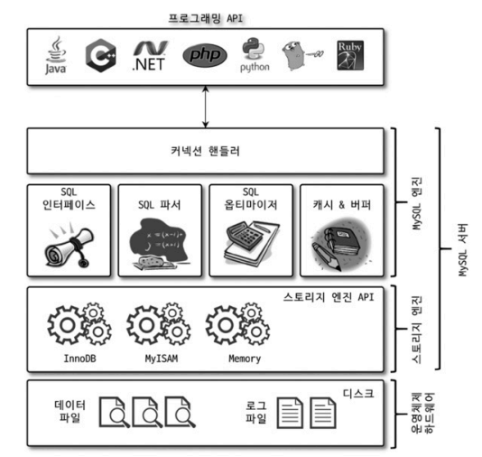
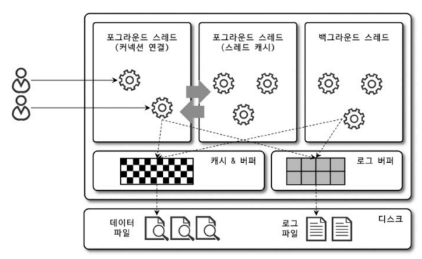
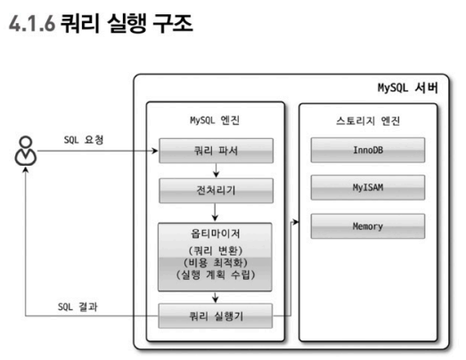
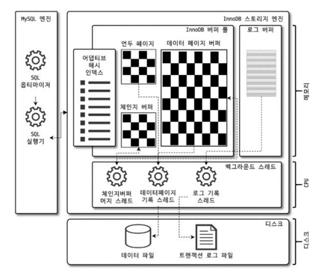
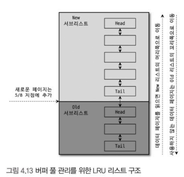
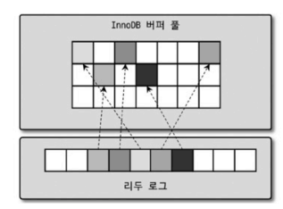
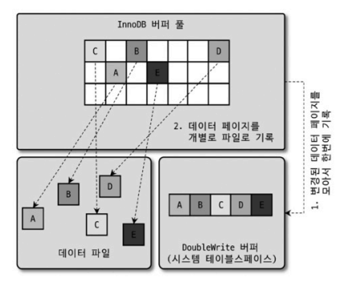
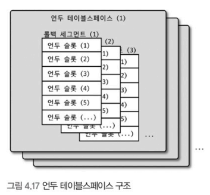
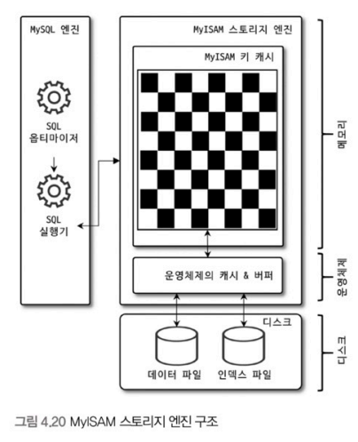

# 04. 아키텍쳐

## 4.1 MySQL 엔진 아키텍쳐

### 1. MySQL의 전체 구조

<center></center>

- MySQL 서버는 다른 DBMS에 비해 구조가 독특함
  - 다른 DBMS에서 가질 수 없는 혜택을 누리기도 함
  - 다른 DBMS에서 문제되지 않을 것들이 가끔 문제가 됨
- 일반 상용 RDBMS와 같이 대부분의 프로그래밍 언어로부터 접근 방법을 모두 지원

- MySQL 서버 구성 (큰 단위)
  - MySQL 엔진 : SQL 문장 분석 및 최적화 등을 담당 (DBMS의 두뇌를 담당)
    - 커넥션 핸들러 : 접속 및 쿼리 요청 처리
    - SQL 파서, 전처리기, 옵티마이저, 캐시 & 버퍼, ...
  - 스토리지 엔진 : 디스크 스토리지에 저장, 읽기 등을 담당
    - MySQL 엔진은 하나만 사용할 수 있지만, 스토리지 엔진은 여러개 사용할 수 있다
    - 각 스토리지 엔진은 성능 향상을 위해 InnoDB 버퍼 풀 등을 가지고 있다
    ```sql
     -- Table 당스토리지 엔진 지정 방법
     CREATE TABLE test_table (col1 INT, col2 INT) ENGINE=INNODB;
        ```

- 핸들러 API
  - 핸들러 요청에 사용되는 API
  - 핸들러 요청: 각 스토리지 엔진에 쓰기 또는 읽기를 요청
  - InnoDB 스토리지 엔진 또한 이 핸들러 API를 통해 MySQL 엔진과 데이터를 주고 받는다.

### 2. MySQL 스레딩 구조

<center></center>

- MySQL 서버는 스레드 기반으로 작동 (프로세스 기반 X)
  - 포그라운드 스레드와 백그라운드 스레드로 구분할 수 있다
  - performance_schema.threads에서 확인 가능
  - 수많은 스레드 중 'thread/sql/one_connection'만 실제 사용자의 요청을 처리하는 포그라운드 스레드다.

- 포그라운드 스레드 (클라이언트 스레드)
  - 각 클라이언트 사용자가 요청하는 쿼리 문장을 처리
  - 최소한 MySQL 서버에 접속된 클라이언트 수만큼 존재
  - 커넥션을 종료하면 담당하던 스레드는 다시 스레드 캐시로 되돌아간다.
  - 이미 대기 중인 스레드가 일정 이상 있다면, 스레드를 종료시켜 일정 개수의 스레드를 유지
  - 스레드 캐시에 유지할 수 있는 스레드 캐시의 수 : thread_cache_size 시스템 변수로 설정
  - 데이터를 MySQL의 데이터 버퍼나 캐시로부터 가져오며, 버퍼나 캐시가 없는 경우 직접 디스크의 데이터나 인덱스 파일로부터 데이터를 읽어와서 작업을 처리한다.
  - cf) InnoDB 테이블은 데이터 버퍼나 캐시까지만 포그라운드 스레드가 처리하고, 버퍼로부터 디스크까지 기록하는 작업은 백그라운드 스레드가 처리한다.

- 백그라운드 스레드 (InnoDB 기준)
  - 인서트 버퍼를 병합하는 스레드
  - 로그를 디스크로 기록하는 스레드
  - InnoDB 버퍼 풀의 데이터를 디스크에 기록하는 스레드
  - 데이터를 버퍼로 읽어 오는 스레드
  - 잠금이나 데드락을 모니터링 하는 스레드

### 3. 메모리 할당 및 사용 구조

- 글로벌 메모리 영역
  - MySQL의 **시스템 변수로 설정해 둔 만큼** 운영체제로부터 메모리를 할당 받는다
  - 클라이언트 스레드의 수와 무관하게 하나(or 여러 개)의 메모리 공간만 할당된다.
  - 생성된 글로벌 영역이 N개라 하더라도 **모든 스레드에 의해 공유**된다.
  - 종류 : 테이블 캐시, InnoDB 버퍼 풀, InnoDB 어댑티브 해시 인덱스, InnoDB 리두 로그 버퍼
-
- 로컬 메모리 영역 (세션 메모리 영역)
  - 종류 : 정렬 버퍼, 조인 버퍼, 바이너리 로그 캐시, 네트워크 버퍼
  - 클라이언트 커넥션으로부터의 요청을 처리하기 위해 스레드를 하나씩 할당
  - 각 클라이언트 스레드별로 독립적으로 할당되면 절대 공유되지 않는다
  - (가능성은 희박하지만) 서버가 메모리 부족으로 멈춰 버릴 수 있으므로 적절한 메모리 공간을 설정하는 것이 중요
  - 각 쿼리의 용도별로 필요할 때만 공간이 할당되고 필요하지 않은 경우에는 MySQL이 메모리 공간조차 할당하지 않을 수 있다 (ex. 소트 버퍼, 조인 버퍼)
  - 커넷션이 열려 있는 동안 계속 할당된 상태로 남아있는 공간(커넥션 버퍼, 결과 버퍼)도 있고, 쿼리를 실행하는 순간에만 할당했다가 다시 해제하는 공간(소트 버퍼나 조인 버퍼)도 있다

### 4. 플러그인 스토리지 엔진 모델

- 기본적으로 제공되는 스토리지 엔진 이외에 부가적인 기능을 더 제공
  - ex) 전문 검색 엔진을 위한 검색어 파서, 사용자 인증을 위한 플러그인
  - 다른 전문 개발 회사 또는 사용자가 직접 스토리지 엔진을 개발하는 것도 가능하다.
- 마지막 '데이터 읽기/쓰기' 작업만 스토리지 엔진에 의해 처리된다

- 핸들러
  - MySQL 엔진이 각 스토리지 엔진에게 데이터를 읽어오거나 저장하도록 명령하려면 반드시 **핸들러(Handler)** 를 통해야 한다
  - MySQL에서 다른 스토리지 엔진(InnoDB, MyISAN)을 사용하는 테이블에 대해 쿼리를 실행하더라도 처리 내용은 대부분 동일하다. 단, '데이터 읽기/쓰기' 영역만 다를 뿐이다.
    - 실질적인 `GROUP BY`, `ORDER BY` 등 복잡한 영역은 스토리지 엔진 영역이 아닌 MySQL 엔진 처리 영역인 '쿼리 실행기'에서 처리된다.
- c.f. 하나의 쿼리 작업은 여러 하위 작업으로 나뉘는데, 각 하위 작업이 MySQL 엔진 영역에서 처리되는지 아니면 스토리지 엔진 영역에서 처리되는지 구분할 줄 알아야 한다.

```sql
SHOW ENGINES;
```
- Support Column
  - YES : MySQL 서버에 해당 스토리지 엔진이 포함되어 있고, 사용 가능으로 활성화된 상태
  - DEFAULT : 'YES'와 동일한 상태, 필수 스토리지 엔진을 의미
  - NO : 현재 MySQL 서버에 포함되지 않았음을 의미
    - 해당 스토리지 엔진을 사용하기 위해서는 MySQL 서버를 다시 빌드해야 한다.
  - DISABLED : 현재 MySQL 서버에는 포함됐지만 파라미터에 의해 비활성화된 상태

- 서버가 적절히 준비되어 있다면, 플러그인 형태로 빌드된 스토리지 엔진 라이브러리를 다운로드해서 띠워 넣기만 하면 사용할 수 있다.
- 플러그인 형태의 스토리지 엔진은 쉽게 업그레이드할 수 있다.

```sql
SHOW PLUGINS;
```
- 스토리지 엔진 뿐 아니라 모든 플러그인의 내용을 확인하는 쿼리
  - ex) 인증 및 전문 검색용 파서 플러그인, 비밀번호 검증, 커넥션 제어, ...
- MySQL 서버의 기능을 커스텀하게 확장할 수 있게 플러그인 API가 공개되어 있다.

### 5. 컴포넌트

- MySQL 8.0부터 기존의 플러그인 아키텍쳐를 대체하기 위해 컴포넌트 아키텍처가 지원됨

- 플러그인 아키텍쳐의 단점
  - 플러그인은 MySQL 서버 인터페이스와 통신할 수 있고, 플러그인끼리는 통신 불가
  - 플러그인은 MySQL 서버의 변수나 함수를 직접 호출하기 때문에 안전하지 않음 (캠슐화 안됨)
  - 플러그인은 상호 의존 관계를 설정할 수 없어서 초기화가 어려움

```sql
-- validate_password 컴포넌트 설치
INSTALL COMPONENT 'file://component_validate_password';

-- 설치된 컴포넌트 확인
SELECT * FROM mysql.component;
```
- 컴포넌트도 설치하면서 새로운 시스템 변수를 설정해야 할 수 있으니, 컴포넌트를 사용하기 전에 관련 메뉴얼을 살펴보자.

### 6. 쿼리 실행 구조

<center></center>

#### 쿼리 파서
- 사용자의 요청으로 들어온 쿼리 문장을 토큰으로 분리해 트리 형태의 구조(파서 트리)로 만들어 내는 작업
- 쿼리 문장의 기본 문법 오류는 이 과정에서 발견, 사용자에게 오류 메시지를 전달

#### 전처리기
- 파서 트리를 기반으로 쿼리 문장에 구조적인 문제점이 있는지 확인한다.
- 각 토큰을 개체(테이블 이름, 컬럼 이름, 내장 함수)를 매핑해 해당 객체의 존재 여부와 객체의 접든 권한 등을 확인
- 실제 존재하지 않거나 권한 상 사용할 수 없는 개체의 토큰은 이 단계에서 걸리진다.

#### 옵티마이저
- DBMS의 두뇌를 담당
- 사용자의 요청으로 들어온 쿼리 문장을 저렴한 비용으로 가장 빠르게 처리할지를 결정하는 역할

#### 실행 엔진
- 만들어진 계획대로 각 핸들러에게 요청해서 받은 결과를 또 다른 핸들러 요청의 입력으로 연결하는 역할

#### 핸들러
- MySQL 가장 밑단에서 MySQL 실행 엔진 요청에 따라 데이터를 디스크에 저장하고 디스크로부터 읽어오는 역할
- 핸들러는 결국 스토리지 엔진을 의미 (InnoDB 테이블을 조작하는 경우, 핸들러가 InnoDB 스토리지 엔진이 된다)

### 8. 쿼리 캐시

- SQL의 실행 결과를 메모리에 캐시하고, 동일 SQL 쿼리가 실행되면 테이블을 읽지 않고 즉시 결과를 반환
  - 빠른 응답을 필요로 하는 웹 기반의 응용 프로그램에서 매우 중요한 역할을 담당
  - 문제점 : 테이블의 데이터가 변경되면, 변경된 테이블과 관련된 모든 데이터를 삭제해야 한다. -> 심각한 동시 처리 성능 저하, 많은 버그의 원인
- MySQL 8.0으로 올라오면서 쿼리 캐시 기능이 제거됨

### 9. 스레드 풀

- 버전 별 차이
  - MySQL 서버 엔터프라이즈 에디션에서는 스레드 풀 기능 제공
  - Percona 에서 제공하는 스레드 풀도 존재
- Percona 에서 제공하는 스레드 풀
  - 플러그인 형태로 작동
  - MySQL 커뮤니티 버전에서 사용하고자 한다면, 서버에 설치해서 사용해야 한다.

- 스레드 풀 사용 목적
  - 동시에 처리되는 요청이 많다 하더라도 MySQL 서버의 CPU가 제한된 개수의 스레드 처리에만 집중할 수 있게 하여 서버의 자원 소모를 줄이는 것이 목적
  - 스레드 풀이 실제 서비스에서 눈에 띄는 성능 향상을 보여주는 경우는 드물었다
    - 스케줄링 과정에서 CPU 시간을 제대로 확보하지 못해 쿼리 처리가 더 느려지는 사례도 발생할 수 있다
    - 제한된 수의 스레드만으로 CPU가 처리하도록 적절히 유도한다면 CPU의 프로세서 친화도를 높이고 OS 입장에서 불필요한 컨텍스트 스위치를 줄여서 오버헤드를 낮출 수 있다
-  `thread_pool_size` 시스템 변수를 통해 스레드 그룹 개수를 조정 가능
  - 일반적으로는 스레드 그룹 개수를 CPU 코어의 개수와 맞추는 것이 CPU 프로세서 친화도를 높이는 데 좋다 (Percona Server의 스레드 풀의 기본값)
  - 처리할 요청이 생기변 스레드 풀로 이관하는데, 이미 스레드 풀이 처리 중인 작업이 있는 경우에는 `thread_pool_oversubscribe` 값(default : 3)만큼 추가로 더 받아들여 처리함
  - 이 값이 너무 크면 스케줄링해야 할 스레드가 많아져서 스레드 풀이 비효율적으로 작동할 수도 있다.
- 스레드 그룹의 모든 스레드가 일 처리 시, 해당 스레드 그룹에 새로운 작업 스레드를 추가할지, 기존 작업 스레드가 처리를 완료할 때까지 기다릴지 여부 판단
  - `thread_pool_stall_limit` (밀리초) 만큼 작업 스레드가 지금 처리 중인 작업을 끝내지 못하면, 새로운 스레드를 생성해 그룹을 추가한다.
  - 단, `thread_pool_max_threads` 개수는 넘어설 수 없다.
  - 응답 시간에 민감한 서비스라면 `thread_pool_stall_limit`을 적절히 낮춰서 설정해야 한다. (0에 가까운 값으로 설정해야 한다면 스레드 풀을 사용하지 않는 편이 좋다)

- Percona Server의 스레드 풀 플러그인은 선순위 큐와 후순위 큐를 이용해 특정 트랜젝션이나 쿼리를 우선적으로 처리할 수 있는 기능도 제공
  - 먼저 시작된 트랜젝션 내에 속한 SQL을 빨리 처리 -> 잠금이 빨리 해제, 잠금의 경합을 낮춤 -> 전체적인 처리 성능 향상

### 10. 트랜잭션 지원 메타데이터

- 메타데이터 (데이터 딕셔너리) : DB 서버에서 테이블의 구조 정보와 스토어드 프로그램 등의 정보
  - MySQL 5.7 버전까지 테이블의 구조를 FRM 파일에 저장하고 일부 스토어드 프로그램 또한 파일 기반으로 관리함
  - 이러한 파일 기반의 메타데이터는 생성 및 변경 작업이 트랜젝션을 지원하지 않음 (DB 테이블 깨짐 현상)
- MySQL 8.0에서부터 테이블의 구조 정보나 스토어드 프로그램의 코드 관련 정보 모두 InnoDB의 테이블에 저장되도록 개선
  - 시스템 테이블과 데이터 딕셔너리 정보를 모두 모아서 `mysql` DB에 저장
  - `mysql` DB는 통째로 `mysql.ibd`라는 이름의 테이블 스테이스에 저장된다.
  - 따라서 `mysql.ibd`라는 파일은 다른 `*.ibd` 파일과 함께 특별히 주의해야 한다.

- InnoDB 스토리지 엔진 이외의 스토리지를 사용하는 테이블들을 위해 SDI(Serialized Dictionary Information) 파일을 사용한다.
  - InnoDB 이외의 테이블들에 대해 `*.sdi` 파일이 존재한다.
  - 직렬화를 위한 포멧이므로 InnoDB 테이블들의 구조도 SDI 파일로 변환할 수 있다.
  - c.f. `ibd2sdi` 유틸리티를 이용하면 InnoDB 테이블 스페이스에서 스키마 정보를 추출할 수 있다.
      ```shell
      idb2sdi mysql_data_dir/mysql.ibd > mysql_schema.json
      cat mysql_schema.json
        ```

## 4.2 InnoDB 스토리지 엔진 아키텍쳐

<center></center>

### 1. 프라이머리 키에 의한 클러스터링

- InnoDB의 모든 테이블은 기본적으로 PK를 기준으로 클러스터링 되어 저장된다.
  - PK 값의 순서대로 디스크에 저장된다.
  - 모든 세컨더리 인덱스는 레코드의 주소 대신 PK 값을 논리적인 주소로 사용한다.
  - 따라서 PK를 이용한 레인지 스캔은 상당히 빠르게 처리될 수 있다.
  - 쿼리의 실행 계획에서 PK는 다른 보조 인덱스에 비해 비중이 높게 설정된다.

- MyISAN 스토리지 엔진에서는 클러스터링 키를 지원하지 않는다.
  - MyISAN 테이블에서는 PK와 세컨더리 인덱스는 구조적으로 아무런 차이가 없다.
  - PK를 포함한 모든 인덱스는 물리적인 레코드의 주소 값(ROWID)을 가진다.

### 2. 외래 키 지원

- 외래 키에 대한 지원은 InnoDB 스토리지 엔진 레벨에서 지원하는 기능이다.
  - MyISAN이나 MEMORY 테이블에서는 사용할 수 없다.

- 외래 키
  - 개발 환경의 DB에서는 좋은 가이드 역할을 할 수 있다.
  - InnoDB에서 외래 키는 부모 테이블과 자식 테이블 모두 해당 컬럼에 인덱스 생성이 필요하고, 변경 시에는 반드시 부모 테이블이나 자식 테이블에 체크가 있는지 체크하는 작업이 필요
  - 이에 따라 잠금이 여러 테이블로 전파되고, 그로 인해 데드락이 발생할 때가 많으므로 개발할 때고 외래 키의 존재에 주의하는 것이 좋다.

- 수동으로 데이터를 적재하거나 스키마 변경 등의 관리 작업이 실패할 수 있다.
  - 부모 - 자식 테이블의 상관 관계를 파악하기 힘들 경우, 어려운 작업이 될 수 있다.
  - 이런 경우에는 `foregin_key_checks` 시스템 변수를 `OFF`로 설정하면 외래 키 관계에 대한 체크 작업을 일시적으로 멈출 수 있다.
    - 위 경우에는 레코드 적재나 삭제 등의 작업도 부가적인 체크가 필요 없기 때문에 빠르게 처리할 수 있다.
  - 외래 키 체크를 일시적으로 중지한 상태에서 외래 키 관계를 가진 부모 테이블의 레코드를 삭제했다면 반드시 자식 테이블의 레코드를 삭제해서 일관성을 맞춰준 후 다시 외래 키 체크 기능을 활성화해야 한다.
  ```sql
  -- SESSION 단위로 설정이 걸림
  -- 작업이 완료되면 반드시 현재 세션을 종료하거나, 현재 세션의 외래 키 체크를 활성화 해야 한다.
  SET foregin_key_checks=OFF;
    ```

### 3. MVCC (Multi Version Concurrency Control)

- MVCC
  - 레코드 레벨의 트랜젝션을 지원하는 DBMS가 제공하는 기능
  - 하나의 레코드에 대해 여러 개의 버전이 동시에 관리된다는 의미이다.
    - 하나의 레코드에 대해 2개의 버전이 유지되고, 필요에 따라 (격리 수준에 따라) 어느 데이터가 보여지는지 달라지는 구조
  - 목적 : 잠금을 사용하지 않는 일관된 읽기를 제공 (언두 로그를 이용해 구현)
- example
  ```sql
  INSERT INTO Member (id, name, area) VALUES (12, '홍길동', '서울');
  UPDATE Member SET area='경기' WHERE id=12;
    ```
  - 커밋 여부 실행과 관계 없이 InnoDB 버퍼 풀은 새로운 값인 '경기'로 업데이트
  - 언두 로그에는 area의 변경 전 값을 복사해서 저장해 놓는다.
  - 디스크의 데이터 파일에는 체크포인트나 InnoDB Write 스레드에 의해 새로운 값이 업데이트 되어 있을 수도 아닐 수도 있다.
    - InnoDB가 ACID를 보장하기 때문에 일반적으로 InnoDB의 버퍼 풀과 데이터 파일은 동일한 상태라고 가정해도 무방하다.
  - MySQL에 시스템 변수(`transaction_isolation`)에 설정한 격리 수준에 따라 다른 값이 조회 된다.

- 언두 영역 데이터 처리
  - `COMMIT` 명령을 실행하면 InnoDB는 더 이상의 변경 작업 없이 지금의 상태(InnoDB 버퍼 풀)를 영구적인 데이터로 만들어 버린다.
  - `ROLLBACK` 명령을 실행하면 InnoDB는 언두 영역에 있는 백업된 데이터를 InnoDB 버퍼풀로 다시 복구하고, 언두 영역의 내용을 삭제해버린다.
  - 언두 영역을 필요로 하는 트트랜젝션이 더는 없을 때 삭제된다.

### 4. 잠금 없는 일관된 읽기 (Non-Locking Consistent Read)

- MVCC 기술을 이용하기 때문에 InnoDB의 읽기 작업은 다른 트랜잭션이 가기고 있는 잠금을 기다리지 않고 읽기 작업을 한다.
  - 격리 수준이 `SERIALIZABLE`이 아니며 순수한 읽기 작업의 경우, 다른 트랜젝션의 변경 작업과 관계없이 항상 작업을 대기하지 않고 바로 실행
  - InnoDB에서는 변경되기 전의 작업을 읽기 위해 언두 로그를 사용한다.
- 오랜 시간 활성 상탱린 트랜잭션이 있을 경우
  - 서버가 느려지거나 문제가 발생할 때가 가끔 있다.
  - 언두 로그를 삭제하지 못해 발생하는 문제
  - 따라서 트랜젝션이 시작됐다면 가능한 빨리 롤백이나 커밋을 통해 트랜잭션을 완료하는 것이 좋다.

### 5. 자동 데드락 감지

- InnoDB 스토리지 엔진 내부적으로 잠금이 죠착 상태에 빠지지 않았는지 체크하기 위해 잠금 대기 목록 그래프 (Wait-for List) 형태로 관리한다.
  - 데드락 감지 스레드를 가지고 있어 주기적으로 잠금 대기 그래프를 검사해 교착 상태에 빠진 트랜잭션을 찾아서 그 중 하나를 강제 종료한다.
  - 일반적으로 언두 로그를 더 적게 가진 트랜젝션이 롤백의 대상이 된다. (언두 처리를 해야 할 내용이 적음)
- InnoDB 스토리지 엔진은 상위 레이어인 MySQL 엔진에서 관리되는 테이블 잠금은 볼 수가 없어서 데드락 감지가 불확실할 수 도 있다.
  - `innodb_tables_locks` 시스템 변수를 활성화하면 테이블 레벨의 잠금까지 감지할 수 있게 된다. (특별한 이유가 없다면 `innodb_tables_locks`을 활성화 하자)
- 동시 처리 스레드가 매우 많아지거나 각 트랜젝션이 가진 잠금의 개수가 많아지면 데드락 감지가 느려진다.
  - 일반적인 서비스에서는 데드락을 찾아내는 작업은 크게 부담되지 않는다.
  - 데드락 감지 스레드는 잠금 상태가 변경되지 않도록 잠금 목록이 저장된 리스트(잠금 테이블)에 새로운 잠금을 걸로 데드락 스레드를 찾는다. -> 서비스 쿼리를 처리 중인 스레드가 대기함
- 데드락 감지 문제점을 해결하기 위해 `innodb_deadlock_detect` 시스템 변수를 제공
  - 단, `innodb_deadlock_detect=OFF`하게 되면, 데드락 상황이 발생해도 무한정 대기하게 될 것이다.
  - `inndb_lock_wait_timeout`변수(초 단위)를 활성화하면 이런 데드락 상황에서 일정 시간이 지나면 자동으로 요청이 실패하고 에러 메시지를 반환
  - `innodb_deadlock_detect=OFF`로 설정했다면, `inndb_lock_wait_timeout`을 기본값인 50보다 훨씬 낮은 시간으로 변경해서 사용할 것을 권장

### 6. 자동화된 장애 복구

- InnoDB에는 손실이나 장애로부터 데이터를 보호하기 위한 여러 가지 메커니즘이 탑재되어 있어, MySQL 서버가 시작될 때 완료되지 못한 트랜잭션이나 디스크에 일부만 기록된 데이터 페이지 등에 대한 일련의 복구 작업을 실행함
  - InnoDB 스토리지 엔진은 매우 견고해서 데이터 파일이 손상되거나 MySQL 서버가 시작되지 못하는 경우는 거의 발생하지 않는다.
  - MySQL 서버와 무관하게 디스크나 서버 하드웨어 이슈로 자동으로 복구 못하는 경우가 발생할 수 있는데, 이는 복구하기 쉽지 않다.
  - InnoDB 데이터 파일은 기본적으로 MySQL 서버가 시작할 때 항상 자동 복구를 수행하는데, 자동으로 복구할 수 없는 손상이 있다면 자동 복구를 멈추고 MySQL 서버는 종료돼 버린다.
  - 이때는 `innodb_force_recovery` 시스템 변수를 설정하여 MySQL 서버를 시작해야 한다. 이를 통해 손상 여부 검사 과정을 선별적으로 실행한다.
    - 로그 파일이 손상됐다면 6으로, 데이터 파일이 손상됐다면 1로 설정하고 MySQL을 가동한다.
    - 어떤 값인지 알 수 없다면 1~6까지 변경하면서 MySQL을 재시작해본다. (값이 커질수록 복구 가능성이 적어진다.)
- 손상 시, MySQL 서버가 가동되고 InnoDB 테이블이 인식된다면 `mysqldump`를 이용해 데이터를 가능한 만큼 백업하고 그 데이터로 MySQL 서버의 DB 테이블을 다시 생성하는 것이 좋다.
  - `innodb_force_recovery`가 0이 아닌 복구 모드에서는 데이터 변경 쿼리문(`INSERT`, `UPDATE`, `DELETE`)은 실행할 수 없다.
  - 각 숫자에 따른 복구 방법은 [링크](https://dev.mysql.com/doc/refman/8.4/en/forcing-innodb-recovery.html) 또는 Real MySQL 106p를 참고
- 위와 같이 진행했음에도 MySQL 서버가 시작되지 않으면 백업을 이용해 구축하는 방법밖에 없다.
  - 백업이 있다면 해당 백업을 이용해 DB를 새로 구축하고 바이너리 로그를 사용해 최개한 장애 시점까지의 데이터를 복구할 수 있다.
  - InnoDB의 복구를 이용하는 것보다 풀 백업과 바이너리 로그로 복구하는 편이 데이터 손실이 더 적을 수 있다.

### 7. InnoDB 버퍼 풀

- InnoDB 스토리지 엔진에서의 가장 핵심적인 부분
- 디스크의 데이터 파일이나 인덱스 정보를 메모리에 개시해 두는 공간
- 쓰기 작업을 지연시켜 일괄 작업으로 처리할 수 있게 해주는 버퍼 역할도 같이 한다.
  - 변경된 데이터를 모아서 처리하면 랜덤한 디스크 작업의 횟수를 줄일 수 있다.

#### 버퍼 풀의 크기 설정
- OS와 각 클라이언트 스레드가 사용할 메모리를 충분히 고려해서 설정해야 한다.
  - 독특한 경우 레코드 버퍼가 상당한 메모리를 사용하기도 한다.

- 레코드 버퍼 : 각 클라이언트 세션에서 테이블의 레코드를 읽고 쓸 때 버퍼로 사용하는 공간
  - 커넥션도 많고 사용하는 테이블도 많다면 해당 메모리 공간이 꽤 많이 필요해질 수 있다.
  - MySQL 서버가 사용하는 레코드 버퍼 공간은 별도로 설정할 수 없으며, 전체 커넥션 개수와 각 커넥션에서 읽고 쓰는 테이블 개수에 따라 동적으로 결정된다.
  - 동적으로 해제되기도 하므로 정확히 필요한 메모리 공간의 크기를 계산할 수가 없다.

- MySQL 5.7 버전부터는 InnoDB 버퍼 풀의 크기를 동적으로 조절할 수 있게 되었다.
  - 가능하면 InnoDB 버퍼 풀의 크기를 적절히 작은 값으로 설정해서 조금씩 상황을 봐 가면서 증가시키는 방법이 최적이다.
- InnoDB 버퍼 풀 크기 찾기 권장 방법
  - OS의 전체 메모리 공간이 8GB 미만이라면 50% 정도만 InnoDB 버퍼풀로 설정하고, 나머지 메모리 공간은 MySQL 서버, OS, 다른 프로그램이 사용할 수 있는 공간으로 확보해주는 것이 좋다.
  - OS의 전체 메모리 공간이 8GB 이상이라면 전체 메모리의 50% 에서 시작해서 조금씩 올려가면서 최적점을 찾는다.
  - OS의 전체 메모리 공간이 50GB 이상이라면 15GB ~ 30GB 정도 남겨두고 나머지를 InnoDB 버퍼 풀로 할당하자.
- InnoDB 버퍼 풀은 `innodb_buffer_pool_size` 시스템 변수로 설정할 수 있다.
  - 버퍼 풀의 크기 변경은 크리티컬한 변경이므로 가능하면 MySQL 서버가 한가한 시점을 골라서 진행하는 것이 좋다.
  - 버퍼 풀의 크기를 줄이는 작업은 서비스 영향도가 매우 크므로 가능하면 버퍼 풀의 크기를 줄이는 작업은 하지 않도록 주의하자.
  - InnoDB 버퍼 풀은 내부적으로 128MB 청크 단위로 쪼개어 관리되는데, 버퍼 풀의 크기를 줄이거나 늘릴 때는 128MB 단위로 처리한다.
  - 버퍼 풀의 크기를 동적으로 변경해야 한다면 반드시 먼저 MySQL 메뉴얼을 숙지하고 진행하기를 권장한다.

- InnoDB 버퍼 풀을 여러 개로 쪼개어 관리할 수 있게 개선됨
  - 전통적으로 버퍼 풀을 관리하는 잠금(세마포어)으로 인해 내부 잠금 경합을 많이 유발해왔는데, 이런 경합을 줄이기 위해 여러개로 쪼개어 관리함
  - 개별 버퍼 풀 전체를 관리하는 잠금(세마포어) 자체도 경합이 분산되는 효과를 내게 됨
  - `innodb_buffer_pool_instance` 시스템 변수를 이용해 버퍼 풀을 여러 개로 분리하여 관리할 수 있게 됨
  - 버퍼 풀 인스턴스의 개수는 8개로 초기화되지만, 전체 버퍼 풀을 위한 메모리 크기가 1GB 미만이면 1개만 생성된다.
  - 버퍼 풀에 할당할 수 있는 메모리 공간이 40GB 이하 수준이라면 기본 값인 8을 유지하고, 40GB 이상이라면 버퍼 풀 인스턴스당 5GB 정도가 되게 인스턴스 개수를 설정하는 것이 좋다.

#### 버퍼 풀의 구조

<center></center>

- InnoDB 스토리지 엔진은 버퍼 풀이라는 거대한 메모리 공간을 페이지 크기(`innodb_page_size`)의 조각으로 쪼개어 InnoDB 스토리지 엔진이 데이터를 필요로 할 때 해당 데이터 페이지를 읽어서 각 조각에 저장한다.
- 버퍼 풀의 페이지 크기 조각을 관리하기 위해 InnoDB 스토리지 엔진은 크게 3개의 자료 구조로 관리함
  - LRU(Least Recently Used) 리스트
    - LRU와 MRU(Most Recently Used)가 결합된 형태
    - Old 서브리스트(사용하지 않는 데이터)와 New 서브리스트(데이터 페이지를 읽은 쪽)의 사이로 새로운 페이지가 추가됨
  - 플러시(Flush) 리스트
    - 디스크로 동기화되지 않은 데이터를 가진 페이지의 변경 시점 기준의 페이지 목록을 관리
    - 데이터가 변경되면 InnoDB는 변경 내용을 리두 로그에 기록하고 버퍼 풀의 데이터 페이지에도 변경 내용을 반영한다. <- 리두 로그의 각 엔트리는 특정 데이터 페이지와 연결되어 있다.
    - InnoDB 스토리지 엔진은 체크포인트를 발생시켜 디스크의 리두 로그와 데이터 페이지 상태를 동기화한다. <- 체크 포인트는 리두 로그의 어느 부분부터 복구를 실행해야 할 지 판단하는 기준이 된다.
  - 프리(Free) 리스트
    - 실제 사용자 데이터로 채워지지 않은 비어있는 페이지들의 목록
    - 사용자의 쿼리가 새롭게 디스크의 페이지를 읽어와야 하는 경우 사용

- InnoDB 스토리지 엔진에서 데이터를 찾는 과정
  1. 필요한 레코드가 저장된 데이터 페이지가 버퍼 풀에 있는지 검사
     A. InnoDB 어댑티브 해시 인덱스를 이용해 페이지를 검색
     B. 해당 테이블의 인덱스를 이용해 버퍼 풀에서 페이지를 검색
     C. 버퍼 풀에 이미 데이터 페이지가 있었다면 해당 페이지의 포인터를 MRU 방향으로 승급
  1. 기스크에 필요한 데이터 페이지를 버퍼 풀에 적재하고, 적재된 페이지에 대한 포인터를 LRU 헤더 부분에 추가
  2. 버퍼 풀의 LRU 헤더 부분에 적재된 데이터 페이지가 실제로 읽히면 MRU 헤더 부분으로 이동
  3. 버퍼 풀에 상주하는 데이터 페이지는 사용자 쿼리가 얼마나 최근에 접근했었는지에 따라 나이가 부여되며, 쿼리가 오랫동안 사용되지 않으면 나이가 오래되어 해당 페이지는 버퍼 풀에서 제거된다. 쿼리에 의해 사용되면 나이가 초기화되어 다시 젊어지고 MRU의 헤더 부분으로 이동한다.
  4. 필요한 데이터가 자주 접근됐다면 해당 페이지의 인덱스 키를 어댑티스 해시 인덱스에 추가

#### 버퍼 풀과 리두 로그

<center></center>

- InnoDB 버퍼 풀의 클린 페이지와 더티 페이지
  - 클린 페이지(Clean Page) : 디스크에서 읽은 상태로 전혀 변경되지 않는 페이지
  - 더티 페이지(Dirty Page) : `INSERT`, `UPDATE`, `DELETE` 명령으로 변경된 데이터를 가진 페이지
    - 디스크와 버퍼 풀의 데이터 상태가 다르기 때문에 언젠가는 디스크로 기록되어야 한다.
- InnoDB 스토리지 엔진에서 리두 로그는 1개 이상의 고정 크기 파일을 연결해서 순환고리처럼 사용한다.
  - 데이터 변경이 계속 발생하면 리두 로그 파일에 기록됐던 로그 엔트리는 어느 순간 다시 새로운 로그 엔트리로 덮어 쓰인다.
  - InnoDB 스토리지 엔진은 전체 리두 로그 파일에서 재사용 가능한 공간과 당장 재사용 불가능한 공간(활성 리두 로그, Active Redo Log)을 구분해서 관리해야 한다.
- LSN (Long Sequence Number)
  - 리두 로그 파일의 공간에 매번 기록될 때마다 로그 포지션이 증가하는 데, 이 값을 나타냄
  - 더티 페이지를 디스크로 동기화하는 과정 중, 발생한 체크포인트 중 가장 최근 체크포인트의 지점의 LSN이 활성 리두 공간의 시작점이 된다.
  - 체크포인트 에이지(checkpoint age) : 가장 최근 체크포인트의 LSN과 마지막 리두 로그 엔트리의 LSN의 차이, 즉 활성 리두 공간의 크기를 의미
- 체크포인트가 발생하면 체크포인트 LSN보다 작은 리두 로그 엔트리와 관련된 더티 페이지는 모두 디스크로 동기화해야 한다.
  - 물론 체크포인트 LSN보다 작은 LSN 값을 가진 리두 로그 엔트리도 디스크로 동기화한다.

- 버퍼 풀에 비해 리두 로그 파일의 전체 크기가 매우 작은 경우
  - 버퍼 풀은 매우 크지만 실제 쓰기 버퍼링을 위한 효과는 거의 못 보는 상황인 것이다.
- 버퍼 풀에 비해 리두 로그 파일의 전체 크기가 매우 큰 경우
  - 더피 페이지의 비율이 너무 높은 상태에서 갑자기 버퍼 풀이 필요해지는 상황이 오면 InnoDB 스토리지 엔진은 매우 많은 더티 페이지를 한 번에 기록해야 하는 상황이 온다.
- 적절한 리두 로그 파일 크기
  - 버퍼 풀의 크기가 100GB 이하의 MySQL 서버에서는 리두 로그 파일 크기의 전체 크기를 약 5~10GB 수준으로 선택하고 필요할 때마다 조금씩 늘려가면서 최적값을 선택하는 것이 좋다.
  - 리두 로그는 변경분만 가지고 있고 버퍼 풀은 데이터를 통째로 가지고 있으니, 리두 로그는 훨씬 작은 공간만 있으면 된다.

#### 버퍼 풀 플러시 (Buffer Pool Flush)
- 버전
  - MySQL 5.6 까지는 InnoDB 스토리지 더티 페이지 플러시 기능이 그다지 부드럽게 처리되지 않았다.
  - MySQL 5.7을 거쳐 8.0으로 업그레이드되면서 대부분의 서비스에서는 더티 페이지 플러시할 때 예전과 같은 디스크 쓰기 폭증 현상은 발생하지 않았다.
  - 더치 페이지 플러시를 성능상의 악영향 없이 디스크에 동기화하기 위해 아래의 2가지 플러시 기능이 백그라운드로 실행한다.

- 플러시 리스트(Flush_list) 플러시
  - InnoDB 스토리지 엔진은 주기적으로 플러시 리스트 플러시 함수를 호출해서 플러시 리스트에서 오래전에 변경된 데이터 페이지 순서대로 디스크에 동기화하는 작업을 수행해야 한다.
  - 클리너 스레드 (Cleaner Thread) : InnoDB 스토리지 엔진에서 더티 페이지를 디스크로 동기화하는 스레드 (`innodb_page_cleaners` 시스템 변수로 설정)
    - `innodb_buffer_pool_instances` 설정값과 동일한 값으로 설정하는 것을 추천
  - `innodb_max_dirty_pages_pct` 시스템 변수를 통해 더티 페이지 비율을 조정할 수 있다.
    - 기본이 90%이며, InnoDB 버퍼 풀은 더티 페이지를 많이 가지고 있을수록 디스크 쓰기 작업을 버퍼링함으로써 여러 번의 디스크 쓰기를 한 번에 처리할 수 있으므로 기본값을 유지하는 것이 좋다.
  - `innodb_max_dirty_pages_pct_lwn`을 설정하여 디스크 쓰기 폭증 현상을 완화할 수 있다.
    - 일정 수준의 더티 페이지(기본값 10%)가 발생하면 조금씩 더티 페이지를 디스크로 기록하게 하고 있다.
    - 더티 페이지의 비율이 얼마 되지 않은 상태에서 디스크 쓰기가 많이 발생하고 더티 페이지 비율이 너무 낮은 상태로 계속 머물러 있다면 `innodb_max_dirty_pages_pct_lwn`을 좀 더 높은 값으로 조정하는 것이 디스크 쓰기 횟수를 줄이는 효과를 얻을 수 있다.
  - 어댑티브 플러시
    - 어댑티브 플러시는 디스크 읽고 쓰기 시스템 변수 값을 사용하지 않고, 리두 로그의 증가 속도를 분석해서 적절한 수준의 더티 페이지가 버퍼 풀에 유지될 수 있도록 디스크 쓰기를 실행한다.
    - `innodb_adaptive_flushing`을 통해 켜고 끌 수 있다. (기본값 ON)
    - `innodb_adaptive_flushing_lwn` 시스템 변수(기본값 10%)를 통해 리두 로그의 공간이 설정값 미만이면 작동하지 않다가, 설정값을 넘어서면 그때부터 어댑티브 플러쉬 알고리즘을 작동하게 한다.
  - `innodb_flush_neighbors` 시스템 변수 : 더티 페이지를 디스크에 기록할 때 디스크에서 근접한 페이지 중에 더티 페이지가 있다면 InnoDB 스토리지 엔진이 함께 묶어서 디스크에 기록하게 해주는 기능
    - HDD를 사용하고 있다면 1 또는 2로 설정해서 활성화해 주는 것이 좋다.
    - 요즘 대부분은 SSD를 사용하기 때문에 기본값인 비활성 모드로 유지하는 것이 좋다.

- LRU 리스트(LRU_list) 플러시
  - LRU 리스트 플러쉬 함수를 사용하여 InnoDB 스토리지 엔진은 LRU 리스트에서 사용 빈도가 낮은 페이지를 제거하여 새로운 페이지를 읽어드릴 공간을 만든다.
  - InnoDB 스토리지 엔진은 LRU 리스트의 끝 부분부터 시작해서 최대 `innodb_lru_scan_depth` 시스템 변수만큼 페이지들을 스캔한다.
    - InnoDB 버퍼 풀 인스턴스 별로 실행한다.
  - InnoDB 스토리지 엔진은 이때 스캔하면서 더티 페이지는 디스크에 동기화하게 하며, 클린 페이지는 즉시 프리 리스트로 페이지를 옮긴다.

#### 버퍼 풀 상태 백업 및 복구
- MySQL 5.5 버전에서는 서버를 셧다운했다가 다시 시작하는 경우 워밍업 과정이 필요했다.
  - 셧다운 전에는 버퍼 풀에 사용할 데이터가 이미 준비되어 있으므로 성능이 빠름
  - 주요 테이블과 인덱스에 대해 풀 스캔을 한 번씩 실행하고 서비스를 오픈함
- MySQL 5.6 부터는 버퍼 풀 덤프 및 적재 기능이 도입됐다
  - `innodb_buffer_pool_dump_now` 시스템 변수를 통해 현재 InnoDB 버퍼 풀의 상태를 백업할 수 있다.
  - MySQL 서버를 다시 시작하면 `innodb_buffer_pool_load_now` 시스템 변수를 통해 백업된 버퍼 풀의 상태를 다시 복구할 수 있다.
  - 백업은 디렉터리에 `ib_puffer_pool`이라는 파일로 생성되며, InnoDB 스토리지 엔진이 버퍼 풀의 LRU 리스트에 적재된 데이터 페이지의 메타 정보만 가져와 저장한다.
  - 백업은 매우 빠르게 완료되지만, 백업된 버퍼 풀을 복구하는 과정은 InnoDB 버퍼 풀의 크기에 따라 상당한 시간이 걸릴 수 있다.
  - 버퍼 풀 적재 작업이 너무 오래 걸려 중간에 멈추고자 한다면 `innodb_buffer_pool_load_abort` 시스템 변수를 이용하면 된다.
    - 버퍼 풀 복구 도중에 급히 서비스를 시작해야 한다면 버퍼 풀 복구를 멈추는 것을 권장한다.
  - 버퍼 풀의 백업과 복구를 자동화하려면 `innodb_buffer_pool_dump_at_shutdown`, `innodb_buffer_pool_load_at_startup`의 설정을 MySQL 서버의 설정 파일에 넣어두면 된다.

#### 버퍼 풀의 적재 내용 확인
- MySQL 5.6부터 `information_schema.innodb_buffer_page` 테이블을 이용해 InnoDB 버퍼 풀의 메모리에 어떤 테이블이 적재되어 있는지 알 수 있었다.
  - InnoDB 버퍼 풀이 큰 경우에는 이 테이블 조회가 상당히 큰 부하를 일으켰다.
- MySQL 8.0에서는 `information_schema.innodb_cached_indexes` 테이블이 추가됐다.
  - 테이블의 인덱스별로 데이터 페이지가 얼마나 InnoDB 버퍼 풀에 적재돼 있는지 확인할 수 있다.
  - 아직 MySQL 서버는 개별 인덱스 별로 전체 페이지 개수가 몇 개인지는 사용자에게 알려주지 않는다.

### 8. Double Write Buffer

<center></center>

- 문제 : 리두 로그는 페이지의 변경된 내용만 기록하므로, 디스크 파일로 플러시할 때 일부만 기록되는 문제가 발생하면 그 페이지의 내용은 복구할 수 없다.
- Double-Write 기법
  - InnoDB 스토리지 엔진은 실제 데이터 파일을 기록하기 전에 A~E 까지의 더티 데이터를 우선 묶어서 한 번의 디스크 쓰기로 시스템 테이블 스페이스의 Double Write 버퍼에 기록한다.
  - InnoDB 스토리지 엔진은 각 더티 페이지를 파일의 적당한 위치에 하나씩 랜덤으로 쓰기를 실행한다.
  - A~E 더티 페이지가 정상적으로 기록되면 더 이상 필요 없어진다.
- Double-Write 로 문제 해결
  - A, B 페이지는 정상적으로 기록되고 C 페이지가 기록되는 도중에 OS가 비정상적으로 종료된 경우
  - InnoDB 스토리지 엔진은 재시작될 때 항상 Double Write 버퍼의 내용과 데이터 파일의 페이지들을 모두 비교해서 다른 내용을 담고 있는 페이지가 있으면 Double Write 버퍼의 내용을 데이터 파일의 페이지로 복사한다.
  - Double Write 기능을 사용할 지 여부는 `innodb_doublewrite` 시스템 변수로 제어할 수 있다.
- 기타
  - HDD 처럼 자기 원판이 회전하는 저장 시스템에서는 어차피 한 번의 순차 디스크 쓰기를 하는 것이기 때문에 별로 부담스럽지 않다.
  - SSD 처럼 랜덤 IO나 순차 IO의 비용이 비슷한 저장 시스템에서는 상당히 부담스럽다.
  - 데이터의 무셜성이 매우 중요한 서비스에서는 Double Write의 활성화를 고려하는 것이 좋다.
  - InnoDB 리두 동기화 설정(`innodb_flush_log_at_trx_commit`)을 1이 아닌 값으로 설정했다면 Double Write도 비활성화 하는 것이 좋다.

### 9. 언두 로그

- 언두 로그 : 트랜젝션과 격리 수준을 보장하기 위해 DML로 변경되기 이전 버전의 데이터를 별도로 백업한 데이터
- 언두 로그는 InnoDB 스토리지 엔진에서 매우 중요한 역할을 담당하지만 관리 비용도 많이 필요하다.
#### 언두 로그 모니터링
- 언두 로그의 용도
  - 트랜잭션의 롤백 대비용
  - 트랜잭션의 격리 수중을 유지하면서 높은 동시성을 제공
- MySQL 5.5 이전에는 한 번 증가한 언두 로그 공간은 다시 줄어들지 않았다.
  - ex) 대용량의 트랜잭션을 사용할 때, 언두 로그의 공간 사용량이 늘어난다.
  - ex2) 트랜잭션이 오래 실행될 때도 언두 로그의 양은 급격하게 증가될 수 있다. (주로 사용자의 실수)
- MySQL 5.7, 8.0으로 업그레이드 되면서 언두 로그 공간의 문제점은 완전히 해결됐다.
  - 언두 로그를 돌아가면서 순차적으로 사용해 디스크 공간을 줄이는 것도 가능
  - MySQL 서버가 필요한 시점에 사용 공간을 자동적으로 줄여주는 것도 가능
- 하지만 여전히 활성 상태인 트랜잭션이 장기간 유지되는 것은 성능상 좋지 않다.
  - 서버 별로 안정적인 시점의 언두 로그 건수를 확인해 이를 기준으로 언두 로그의 급증 여부를 모니터링하는 것이 좋다.
  ```sql
  -- MySQL 서버의 언두 로그 건수 확인
  SHOW ENGINE INNODB STATUS \6
    ```

#### 언두 테이블 스페이스 관리

<center></center>

- 언두 테이블 스페이스 (Undo Tablespace)
  - 언두 로그가 저장되는 공간
  - MySQL 5.6 이전에는 언두 로그가 모두 시스템 테이블스페이스(ibdata.ibd)에 저장됐다.
    - MySQL 서버가 초기화될 떄 생성되기 때문에 확장의 한계가 있었다.
  - MySQL 5.6에서는 `innodb_undo_tablespaces` 시스템 변수가 도입됨, 2보다 큰 값을 설정하면 InnoDB 스토리지 엔진은 별도의 로그 파일을 사용한다.
  - MySQL 8.0.14에서는 언두 로그는 항상 시스템 테이블 스페이스 외부의 별도 로그 파일에 기록되도록 개선됐다.

- 하나의 언두 테이블 스페이스는 1개 이상 128개 이하의 롤백 세그먼트를 가지며, 롤백 세그먼트는 1개 이상의 언두 슬롯을 가진다.
  - 하나의 롤백 세그먼트는 InnoDB 페이지 크기를 16바이트로 나눈 값의 개수만큼 언두 슬롯을 가진다. (InnoDB 페이지 크기가 16KB 라면, 롤백 세그먼트는 1024개의 언두 슬롯을 가짐)
  - 하나의 트랜잭션이 필요로 하는 언두 슬롯의 개수는 트랜잭션이 실행하는 `INSERT`, `UPDATE`, `DELETE` 문장 특성에 따라 최대 4개까지 언두 슬롯을 사용하게 된다.
  ```
  최대 동시 트랜잭션 수 = (InnoDB 페이지 크기) / 16(KB) * (롤백 세그먼트 개수) * (언두 테이블 스페이스 개수)
    innodb_rollback_segments (기본값 : 128)
    innodb_undo_tablespace (기본값 : 2)
    ```
  - 일반적인 서비스에서 이 정도까지 트랜잭션이 필요하진 않겠지만 기본값으로 해서 크게 문제될 건 없으므로 가능하면 기본값을 유지하자

- MySQL 8.0 부터는 `CREATE UNDO TABLESPACE`나 `DROP TABLESPACE` 같은 명령으로 새로운 언두 테이블 스페이스를 동적으로 추가하고 삭제할 수 있다.
  - 자동 혹은 수동으로 불필요한 언두 테이블 스페이스를 잘라낼 수 있으며, 자세한 방법은 Real MySQL 128p 참고

### 10. 체인지 버퍼

- 체인지 버퍼 (Change Buffer)
  - 변경해야 할 인덱스 페이지가 버퍼 풀에 있지 않아 디스크로부터 가져와서 업데이트를 할 때, 이를 즉시 실행시키지 않고 임시 공간에 저장해두는 곳 (바로 사용자에게 결과를 반환하는 형태로 성능을 향상시킴)
- 사용자에게 결과를 전달하기 전에 반드시 중복 여부를 체크해야 하는 유니크 인덱스는 체인지 버퍼를 사용할 수 없다.
- 체인지 버퍼 머지 스레드 (Change Buffer Merge Thread) :
  - 체인지 버퍼에 임시로 저장된 레코드 조각을 백그라운드 스레드인 체인지 버퍼 머지 스레드에 의해 병합됨
  - MySQL 5.5 이전에는 `INSERT` 작업, 이후 개선되면서 MySQL 8.0에서는 `INSERT`, `DELETE`, `UPDATE` 로 인해 키를 추가/삭제하는 작업에 대해서도 버퍼링이 될 수 있다.
  - MySQL 5.5 부터 `innodb_change_buffering`이라는 새로운 시스템 변수가 도입되어 작업의 종류 별로 체인지 버퍼를 활성화할 수 있다.
    - ex) `all`. `none`, `inserts`, `deletes`, `changes`, `purges`
- 체인지 버퍼 용량
  - 기본적으로 InnoDB 버퍼 풀로 설정된 메모리 공간의 25%까지 사용할 수 있게 설정되어 있음
  - 필요하다면 InnoDB 버퍼 풀의 50%까지 사용하게 설정할 수 있다.
  - 체인지 버퍼 풀 용량을 바꾸고자 한다면 `innodb_change_buffer_max_size` 시스템 변수의 비율을 설정하면 된다.
  - 체인지 버퍼가 버퍼 풀의 메모리를 얼마나 사용 중인지, 얼마나 많은 변경 사항을 버퍼링하고 있는지는 다음과 같이 확인할 수 있다.
  ```sql
  SELECT EVENT_NAME, CURRENT_NUMBER_OF_BYTES_USED
  FROM performance_schema.memory_summary_global_by_event_name
  WHERE EVENT_NAME='memory/innodb/ibuf0ibuf';
    ```

### 11. 리두 로그 및 로그 버퍼

- 리두 로그
  - MySQL 서버가 비정상적으로 종료되었을 깨 데이터 파일에 기록되지 못한 데이터를 잃지 않게 해주는 안전창지이다.
  - ACID 요소 중 D(Durable)에 해당하는 영속성과 가장 밀접하게 관련있다.
- 대부분의 DB 서버는 데이터 변경 내용을 로그로 먼저 기록한다.
  - 데이터 파일 쓰기는 디스크의 랜덤 액세스가 필요한 데, 이는 상대적으로 큰 비용이 필요하다.
  - 이로 인한 성능 저하를 막기 위해 DB 서버는 쓰기 비용이 낮은 자료 구조를 가진 리두 로그를 가지고 있으며, 비정상 종료가 발생하면 리두 로그의 내용을 이용해 데이터 파일을 다시 서버가 종료되기 직전의 상태로 복구한다.
  - DB 서버는 ACID도 중요하지만 성능도 중요하기 때문에 리두 로그를 버퍼링할 수 있는 InnoDB 버퍼 풀이나 리두 로그를 버퍼링할 수 있는 로그 버퍼와 같은 자료 구조도 가지고 있다.

- InnoDB 스토리지 엔진에서 리두 로그의 데이터 파일 문제 해결
  - 커밋됐지만 데이터 파일에 기록되지 않은 데이터의 경우, 리두 로그에 저장된 데이터를 데이터 파일에 다시 복사하기만 하면 된다.
  - 롤백됐지만 데이터 파일에 이미 기록된 데이터는 리두 로그로는 해결할 수 없지만, 그 변경이 커밋됐는지, 롤백됐는지, 트랙잭션 실행 중간 상태였는지를 확인할 수 있다.
- DB 서버에서 리두 로그는 트랜잭션이 커밋되면 즉시 디스크로 기록되도록 시스템 변수를 설정하는 것을 권장한다.
  - 서버가 비정상적으로 종료됐을 때 직전까지 트랜잭션 커밋 내용이 리두 로그에 기록될 수 있고, 이를 이용해 장애 직전 시점까지 복구가 가능해진다.
  - 하지만 트랜잭션이 커밋될 때마다 리두 로그를 디스크에 기록하는 작업은 많은 부하를 유발한다.
  - `innodb_flush_log_at_trx_commit` 시스템 변수에 따라 다르게 기록할 수 있다. (Real MySQL 131p 참고)
- InnoDB 스토리지 엔진의 리두 로그 파일의 전체 크기는 InnoDB 스토리지 엔진이 가지고 있는 버퍼 풀의 효율성을 결정하기 때문에 신중히 결정해야 한다.
  - 리두 로그 파일의 전체 크기 = 리두 로그 파일 크기 (`innodb_log_file_size`) * 리두 로그 파일 개수 (`innodb_log_files_in_group`)
  - 리두 로그 파일의 전체 크기가 적절히 선택되어야 InnoDB 스토리지 엔진이 적절히 변경된 내용을 버퍼 풀에 모았다가 한 번에 모아서 기록할 수 있다.

- 로그 버퍼
  - 사용량(특히 변경 작업)이 매우 많은 DBMS의 경우에는 리두 로그의 기록 작업이 큰 문제가 됨
  - 최대한 ACID 속성을 보장하는 수준에서 버퍼링을 하는 곳
  - 로그 버퍼의 크기는 기본값인 16MB 수준에서 설정하는 것이 적합, BLOB나 TEXT와 같이 큰 데이터를 자주 변경하는 경우에는 더 크게 설정하는 것이 좋다.

#### 리두 로그 아카이빙
- MySQL 8.0부터 InnoDB 스토리지 엔진의 리두 로그를 아카이빙할 수 있는 기능이 추가됐다.
  - MySQL 엔터프라이즈 백업이나 Xtrabackup 툴은 데이터 파일을 복사하는 동안 리두 로그에 쌓인 내용을 계속 추적하면서 새로 추가된 리두 로그 엔트리를 복사한다.
  - 문제 : MySQL 서버에 유입되는 데이터 변경이 너무 많으면 리두 로그 내용을 복사하기도 전에 덮어 씌워질 수 있다. 백업 툴이 리두 로그 엔트리를 복사할 수 없어 백업이 실패하게 된다.
- MySQL 8.0의 리두 로그 아카이빙 기능은 데이터 변경이 많아서 리두 로그가 덮어쓰인다고 해도 백업이 실패하지 않게 해준다.
  - 리두 로그 아카이빙을 시작한 세션의 연결이 끊어진다면 InnoDB 스토리지 엔진은 리두 로그 아카이빙을 멈추고 아카이빙 파일도 자동으로 삭제한다.
  - 따라서 `innodb_redo_log_archive_end()`를 호출해서 아카이빙을 정상적으로 종료해야 한다.
  ```shell
  # 아카이빙 리두 로그 파일 만들기
  mkdir /var/log/mysql_redo_archive
  cd /var/log/mysql_redo_archive
  mkdir 20240812
  chmod 20240812
  
  # 환경 변수 설정
  SET GLOBAL innodb_redo_log_archive_dirs='backup:/var/log/mysql_redo_archive';
  
  # 리두 로그 아카이빙을 시작하도록 사용자 정의 함수 실행
  DO innodb_redo_log_archive_start('backup','20240812');
  
  # 리두 로그 아카이빙 종료
  # 아카이빙 파일을 삭제하지는 않기 때문에 사용이 완료되면 사용자가 수동으로 삭제해야 한다.
  DO innodb_redo_log_archive_end();
    ```

#### 리두 로그 활성화 및 비활성화
- InnoDB 스토리지 엔진의 리두 로그는 MySQL 서버가 비정상적으로 종료되었을 때 데이터 파일에 기록되지 못한 트랜잭션을 복구하기 위해 항상 활성화돼있다.
- MySQL 8.0부터 수동으로 리두 로그를 활성화하거나 비활성화할 수 있게 됐다.
  - 데이터를 복구하거나 대용량 데이터를 한번에 적재하는 경우 리두 로그를 비활성화하여 시간을 단축시킬 수 있다.
  ```sql
  ALTER INSTANCE DISABLE INNODB REDO_LOG;
  LOAD DATA ...
  ALTER INSTANCE ENABLE INNODB REDO_LOG;
  
  -- Innodb_redo_log_enabled 상태 변수를 통해 리두 로그 활성화 상태를 알 수 있다.
  SHOW GLOBAL STATUS LIKE 'Innodb_redo_log_enabled';
    ```

- 리두 로그를 비활성화하고 데이터 적재 작업을 진행했다면 데이터 적재 완료 후 리두 로그를 다시 활성화하는 것을 잊지 말아라
  - MySQL 서버의 마지막 체크포인트 이후 시점의 데이터는 모두 복구할 수 없게 된다.
  - 더 심각한 문제는 MySQL 서버의 데이터가 마지막 체크포인트 시점의 일관된 상태가 아닐 수 있다. (특정 시간대의 데이터를 혼재하여 가지고 있을 수 있다.)

### 12. 어댑티브 해시 인덱스
- 어댑티브 해시 인덱스 (Adaptive Hash Index)
  - InnoDB 스토리지 엔진에서 사용자가 자주 요청하는 데이터에 대해 자동으로 생성하는 인덱스 (사용자가 설정하는 B-Tree 인덱스와는 다름)
  - 자주 읽히는 데이터 페이지의 키 값을 이용해 해시 인덱스를 만들고, 필요할 때마다 어댑티브 해시 인덱스를 검색해서 레코드가 저장된 데이터 페이지를 즉시 찾아갈 수 있다.
  - `innodb_adaptive_hash_index` 시스템 변수를 활용해서 해당 기능을 활성화하거나 비활성화할 수 있다.
- 어댑티브 해시 인덱스의 도입
  - B-Tree 인덱스에서 특정 값을 찾는 과정을 동시에 여러 스레드에서 하게 되면, CPU는 엄청난 프로세스 스케줄링을 하게 되고 자연히 쿼리의 성능은 떨어진다.
  - 이 과정을 줄이기 위해 도입

- 해시 인덱스
  - '인덱스 키 값'과 '데이터 페이지 주소'의 쌍으로 관리
  - 인덱스 키 값 : 'B-Tree 인덱스의 고유번호(Id)'와 'B-Tree 인덱스의 실제 키 값' 조합으로 생성
    - B-Tree 인덱스의 고유번호(Id)는 InnoDB 스토리지 엔진에서 어댑티브 해시 인덱스는 하나만 존재
  - 데이터 페이지 주소 : InnoDB 버퍼 풀에 로딩된 페이지의 주소
    - 어댑티브 해시 인덱스는 버퍼 풀에 올려진 데이터 페이지에 대해서만 관리된다.
    - 버퍼 풀에 해당 페이지가 없어지면 어댑티브 해시 인덱스에서도 해당 페이지의 정보는 사라진다.

- 어댑티브 해시 인덱스 파티션 기능
  - 어댑티브 해시 인덱스는 하나의 메모리 객체여서 경합이 상당히 심했다.
  - MySQL 8.0부터는 세마포어 경합을 줄이기 위해 파티션 기능을 제공한다.
  - `innodb_adaptive_hash_index_parts` 시스템 변수를 이용해 파티션 개수를 변경 가능 (기본값 8개)
  - 어댑티브 해시 인덱스가 성능에 많은 도움이 된다면 파티션 개수를 더 많이 설정하는 것도 내부 경합을 줄이는 데 많은 도움이 된다.

- 어댑티브 해시 인덱스가 성능 향상에 도움이 되지 않는 경우
  - 디스크 읽기가 많은 경우
  - 특정 패턴의 쿼리가 많은 경우 (`JOIN`, `LIKE`, ...)
  - 매우 큰 데이터를 가진 테이블의 레코드가 폭넓게 읽는 경우
- 어댑티브 해시 인덱스가 성능 향상에 많은 도움이 되는 경우
  - 디스크의 데이터가 InnoDB 버퍼 풀 크기와 비슷한 경우 (디스크 읽기가 많지 않는 경우)
  - 동등 조건 검색 (동등 비교, IN 연산자)
  - 쿼리가 데이터 중에서 일부 데이터에만 집중되는 경우
- 어댑티브 해시 인덱스가 도움되는 정보를 판단하는 방법
  - 정확한 판단을 할 수 있는 가장 쉬운 방법 : MySQL 서버의 상태 값들을 살펴보는 것
  - searches : 쿼리가 처리되기 위해 내부적으로 키 값의 검색이 몇 번 실행됐느냐를 의미한다.
  - 어댑티브 해시 인덱스 효율은 두 값의 비율(해시 인덱스 히트율)과 어댑티브 해시 인덱스가 사용 중인 메모리 공간, 서버의 CPU 사용량을 종합해서 판단해야 한다.
  - ex) CPU 사용량이 100%라면 해시 인덱스 히트율 28%는 효율적이라고 볼 수 있다.
  - ex2) CPU 사용량이 높지 않은데 해시 인덱스 히트율 28%는 어댑티브 해시 인덱스를 비활성화 하는 편이 더 나을 수 있다. (InnoDB 버퍼 풀이 더 많은 메모리를 사용할 수 있도록 유도)
  ```sql
  -- 해시 인덱스 히트율 알아보기
  SHOW ENGINE INNODB STATUS\G;
  
  ...
  1.03 hash searchs/s, 2.64 non-hash searches/s
  
  -- 어댑티브 해시 인덱스 메모리 사용량 알아보기
  SELECT EVENT_NAME, CURRENT_NUMBER_OF_BYTES_USED
  FROM performance_schema.memory_summary_global_by_event_name
  WHERE EVENT_NAME='memory/innodb/adaptive hash index';
    ```

- 어댑티브 해시 인덱스 또한 저장 공간인 메모리를 사용하며, 때로는 상당히 큰 메모리 공간을 사용할 수도 있다.
  - 어댑티브 해시 인덱스 또한 데이터 페이지 인덱스 키가 해시 인덱스로 만들어져야 하고 불필요한 경우 제거돼야 한다.
  - 어댑티브 해시 인덱스가 활성화되면 InnoDB 스토리지 엔진은 그 키 값이 해시 인덱스에 있는 없든 검색해봐야 한다. -> 해시 인덱스가 효율이 없는 경우에도 InnoDB는 계속 해시 인덱스를 사용할 것이다.
- 어댑티브 해시 인덱스는 **테이블의 삭제 작업에도 많은 영향**을 미친다.
  - 테이블을 삭제하거나 변경하려고 하면, InnoDB 스토리지 엔진은 이 테이블이 가진 모든 데이터 페이지의 내용을 어댑티브 해시 인덱스에서 제거해야 한다.
  - 이로 인해 테이블이 삭제되거나 스키마가 변경되는 동안 상당히 많은 CPU 자원을 사용하고 그만큼 DB 서버의 처리 성능이 느려진다.


### 13. InnoDB와 MyISAM, MEMORY

- MyISAM
  - InnoDB 스토리지 엔진에 대한 기능이 개선되는 만큼 MyISAM 스토리지 엔진의 기능은 도태되는 상황이며, 이후 버전에서는 없어질 것으로 예상
- MEMORY
  - 사용자의 쿼리를 처리하기 위해 내부 임시 테이블의 목적으로 사용됐다.
  - 굳이 MEMORY 스토리지 엔진을 선택해서 얻을 수 있는 장점이 없어졌으며, 이전 버전과의 호환성 유지 차원일 뿐 향후 버전에서는 제거될 것으로 보인다.

## 4.3 MyISAM 스토리지 엔진 아키텍쳐

<center></center>

(생략)

## 4.4 MySQL 로그 파일

- 로그 파일을 이용하면 MySQL 서버의 깊은 내부 지식이 없어도 MySQL의 상태나 부하를 일으키는 원인을 쉽게 찾아서 해결할 수 있다.
- 무엇보다 **MySQL 서버에 문제가 생겼을 때는 다음에 설명하는 로그 파일들을 자세히 확인하는 습관**을 들일 필요가 있다.

### 1. 에러 로그 파일

- 에러 로그 파일 경로
  - MySQL 설정 파일(my.cnf)에서 log_error라는 이름의 파라미터로 정의된 경로에 생성된다.
  - MySQL 설정 파일이 별도로 정의되지 않은 경우에는 데이터 디렉터리에 .err라는 확장자가 붙은 파일로 생성된다.

#### 자주 보게되는 에러 메시 종류
- MySQL이 시작하는 과정과 관련된 정보성 및 에러 메시지
  - MySQL 설정 파일 변경, DB의 비정상 종료 이후 다시 시작하는 경우에 꼭 확인해야 한다.
  - 특정 변수가 무시된 경우에는 MySQL 서버는 정상적으로 기동하지만 해당 파라미터는 MySQL에 적용되지 못했음을 의미한다.
  - 변수명을 인식하지 못하거나 설정된 파라미터 값을 인식하지 못하는 경우에는 MySQL 서버가 에러 메시지를 출력하고 시작하지 못했다는 메시지를 보여줄 것이다.

- 마지막으로 종료할 때 비정상적으로 종료된 경우 나타나는 InnoDB의 트랙잭션 복구 메시지
  - 완료되지 못한 트랜젝션을 정리하고 디스크에 기록하는 재처리 작업에 대한 간단한 메시지가 출력됨
  - 간혹 문제가 있어 복구되지 못할 때는 해당 에러 메시지를 출력하고 MySQL은 다시 종료될 것이다.

- 쿼리 처리 도중에 발생하는 문제에 대한 에러 메시지
  - 쿼리 도중 발생하는 문제점은 사전 예방이 어려우며, 주기적으로 에러 러그 파일을 검토하는 과정에서 알게 된다.
  - 쿼리 실행 도중 발생한 에러나 복제에서 문제가 될 만한 쿼리에 대한 경고 메시지가 에러 로그에 기록된다.
  - 자주 에러 로그 파일을 검토하는 것이 DB에 숨겨진 문제점을 해결하는 데 많이 도움될 것이다.

- 비정상적으로 종료된 커넥션 메시지 (Aborted connection)
  - 클라이언트 어플리케이션에서 정상적으로 접속 종료를 하지 못하고 프로그램이 종료된 경우 에러 로그 파일에 기록된다.
  - 중간에 네트워크에 문제가 있어서 의도하지 않게 접속이 끊겨진 경우에도 기록된다.
  - 이런 메시지가 아주 많이 기록된다면 어플리케이션의 커넥션 종료 로직을 한번 검토해 볼 필요가 있다.
  - `max_connect_errors` 시스템 변수값이 너무 낮게 설정된 경우에는 클라이언트 프로그램이 MySQL 서버에 접속하지 못하고 에러("Host 'host_name' is blocked")가 발생할 수 있다. 이럴 때는 해당 값을 증가시키면 된다.

- InnoDB의 모니터링 또는 상태 조회 명령의 결과 메시지
  - InnoDB의 테이블 모니터링, 락 모니터링, InnoDB 엔진 상태 조회 명령은 상대적으로 큰 메시지를 에러 로그 파일에 기록한다.
  - InnoDB의 모니터링을 활성화 상태로 만들어 두고 그대로 유지하는 경우에는 에러 로그 파일이 매우 커져서 파일 시스템의 공간을 다 사용해 버릴지도 모른다.
  - 모니터링을 사용한 이후에는 반드시 비활성화 할 것.

- MySQL의 종료 메시지
  - MySQL이 어떻게 종료되었는지 확인할 수 있는 유일한 방법
  - "Received SHUTDOWN from user ..." : 누군가가 MySQL 서버를 종료시킨 경우
  - 아무런 종료 관련 메시지가 없거나 스택 트레이스와 같은 내용이 출력되는 경우에는 MySQL 서버가 세크멘테이션 폴트(Segmentation Fault)로 비정상적으로 종료된 것으로 판단할 수 있다.
    - 스택 트레이스의 내용을 최대한 참조해서 MySQL 버그와 연관이 있는지 조사한 후 MySQL 버전을 업그레이드하거나 회피책을 찾는 것이 최적의 방법이다.

- 에러 로그의 상세한 내용은 MySQL 메뉴얼의 "The Error Log"절을 확인해 보자.

### 2. 제너럴 쿼리 로그 파일
- MySQL 서버에서 실행되는 쿼리로 어떤 것들이 있는지 전체 목록을 뽑아서 검토해 볼 때가 있는데, 이때는 쿼리 로그를 활성화해서 쿼리를 쿼리 로그 파일로 기록하게 한 다음, 그 파일을 검토하면 된다
  - 쿼리 로그 파일에는 시간 단위로 실행됐던 쿼리의 내용이 모두 기록된다.
  - MySQL이 쿼리 요청을 받으면 바로 기록하기 때문에, 쿼리 실행 중에 에러가 발생해도 일단 로그 파일에 기록된다.
- 쿼리 로그 파일
  - 쿼리 로그 파일 경로는 `general_log_file`이라는 이름의 파라미터에 설정돼 있다.
  - 쿼리 로그를 파일이 아닌 테이블에 저장하도록 설정할 수도 있다. (`log_output` 파라미터로 결정)
  ```sql
  -- 쿼리 로그 파일 경로 조회
  SHOW GLOBAL VARIABLES LIKE 'general_log_file';
    ```

### 3. 슬로우 쿼리 로그
- 슬로우 쿼리 로그
  - 서비스 운영 중에 MySQL의 서버의 전체적인 성능 검사하거나 정기적인 점검을 위한 튜닝을 할 때, 어떤 쿼리가 문제의 쿼리인지 판단하기 힘들다.
  - 이 판단을 할 때, 슬로우 쿼리 로그가 상당한 도움이 된다.
- `long_query_time` 시스템 변수에 설정한 시간 이상의 시간이 소요된 쿼리가 모두 기록된다.
  - 실제 소요된 시간이 기준이기 때문에, 정상적으로 실행이 완료되야 슬로우 쿼리 로그에 기록될 수 있다.
- `log_output` 옵션을 이용해 슬로우 쿼리 로그를 파일로 기록할지 테이블로 기록할지 선택할 수 있다. (`TABLE`, `FILE`)
  - `TABLE`로 설정하더라도 mysql DB의 slow_log 테이블과 general_log 테이블은 CSV 스토리지 엔진을 사용하기 때문에 결국 CSV 파일로 저장하는 것과 동일하게 작동한다.

```plain text
# Time: 2020-07-19T15:44:22.178484+09:00
# User@Host: root[root] @ localhost [] Id : 14
# Query_time: 1.180245   Lock_time: 0.002658 Rows_sent: 1  Rows_examined: 2844047
use employees;
SET timestamp=1595141060
select emp_no, max(salary) from salaries;
```
- `Time` : 쿼리가 종료된 시점
- `User@Host` : 쿼리를 실행한 사용자의 계정
- `Query_time` : 쿼리가 실행되는 데 걸린 전체 시간을 의미
  - `Lock_time` : MySQL 엔진 레벨에서 관장하는 테이블 잠금에 대한 시간만 표기, 실제 쿼리가 실행되는 데 필요한 잠금 체크와 같은 코드 실행 부분의 시간까지 모두 포함되기 때문에 이 값이 매우 작다면 무시해도 된다.
- `Rows_examined` : 이 쿼리가 처리되기 위해 몇 건의 레코드에 접근 했는지를 의미한다.
  - `Rows_examined`가 `Rows_sent`에 비해 매우 크다면 튜닝해 볼 가치가 있다. (집계함수는 어쩔 수 없고...)

- InnoDB 테이블에 대한 `SELECT` 쿼리의 경우에도 `Lock_time`이 상대적으로 큰 값이 발생할 수 있는데, 이는 InnoDB 레코드 수준의 잠금이 아닌 MySQL 엔진 레벨에서 설정한 테이블 담금 때문일 가능성이 높다.
  - InnoDB에만 접근하는 슬로우 쿼리 로그에서의 `Lock_time` 값은 튜닝이나 쿼리 분석에 별로 도움이 되지 않는다.

#### 로그 분석
- 슬로우 쿼리 또는 제너럴 로그 파일의 내용이 상당히 많아 직접 쿼리를 하나씩 검토하기 힘들 때에는 Percona에서 개발한 Percona Toolkit의 pt-query-digest 스크립트를 이용하면 쉽게 빈도나 처리 성능별로 쿼리를 정렬해서 살펴볼 수 있다.
  ```shell
  # general log 파일 분석
  pt-query-digest --type='genlog' general.log > parsed_general.log
  # slow log 파일 분석
  pt-query-digest --type='slowlog' mysql-slow.log > parsed_mysql-slow.log
    ```

- 로그 파일 분석 그룹
  - 슬로우 쿼리 통계 : 모든 쿼리를 대상으로 슬로우 쿼리 로그릐 실행 시간, 잠금 대기 시간 등에 대해 쳥균,최대,최소 값을 표시
  - 실행 빈도 및 누적 실행 시간순 랭킹 : 각 쿼리별로 응답 시간과 실행 횟수를 보여줌
    - `--order-by` 옵션으로 정렬 순서 변경 가능
    - `Query ID` : 일반적으로 같은 모양의 쿼리라면 동일한 `Query ID`를 가지게 된다.
  - 쿼리별 실행 횟수 및 누적 실행 시간 상세 정보 : `Query ID` 별 쿼리를 쿼리 랭킹에 표시된 순서대로 자세한 내용을 보여준다.
    - 실제 상세한 쿼리 내용은 개별 쿼리 정보를 확인해보면 된다.
    - 쿼리가 얼마나 실행됐는지, 쿼리의 응답 시간에 대한 히스토그램 같은 상세한 내용을 보여준다.
