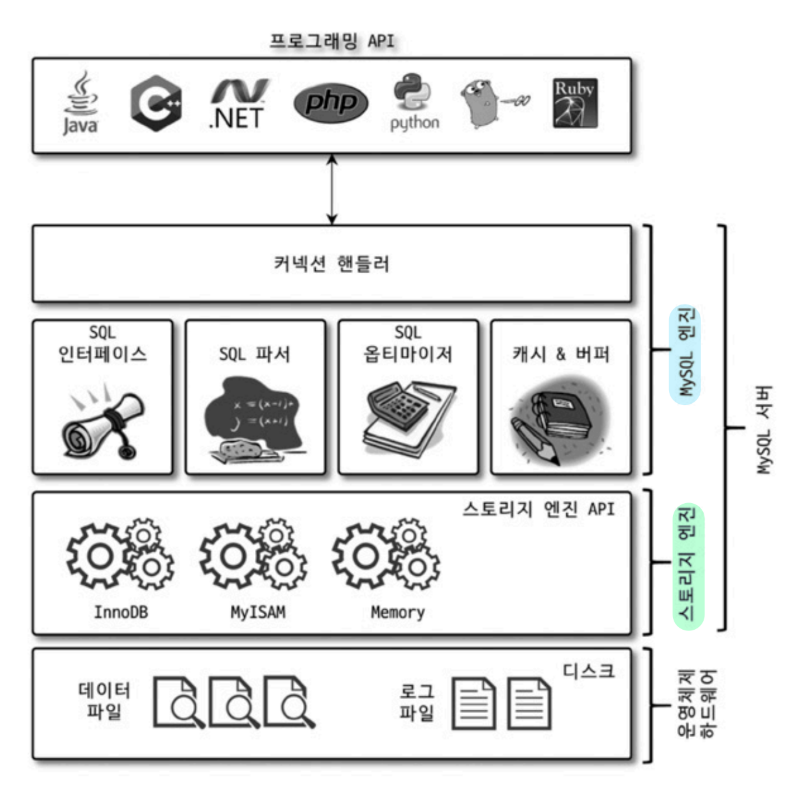
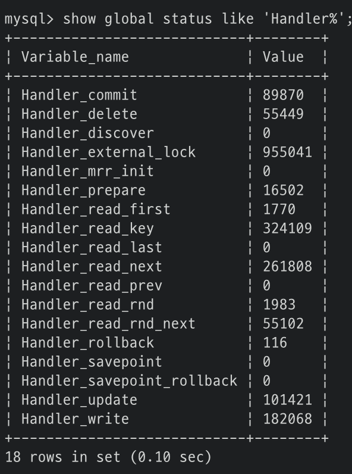
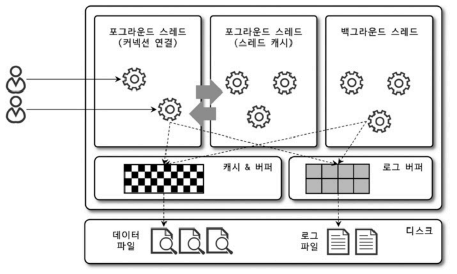
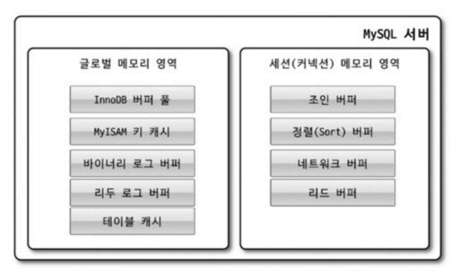
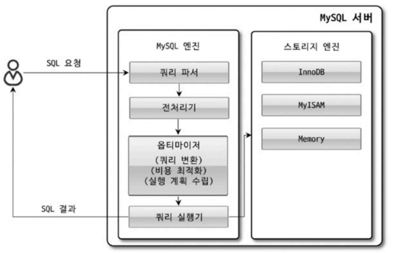
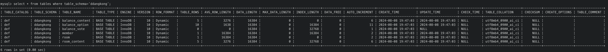
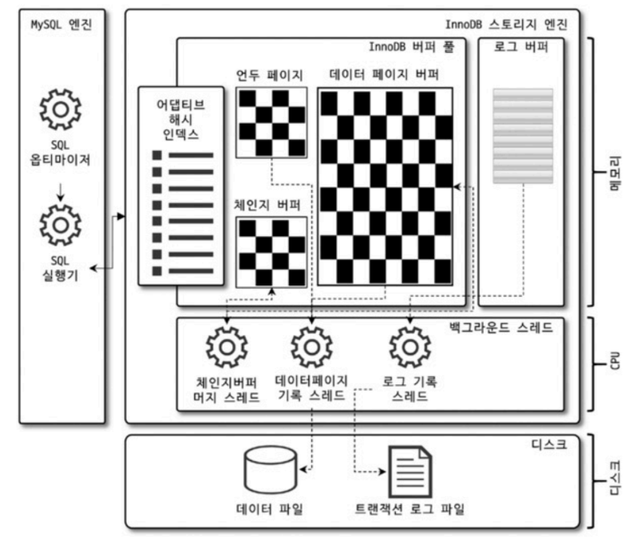
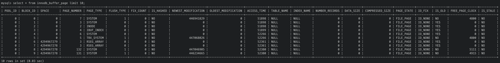
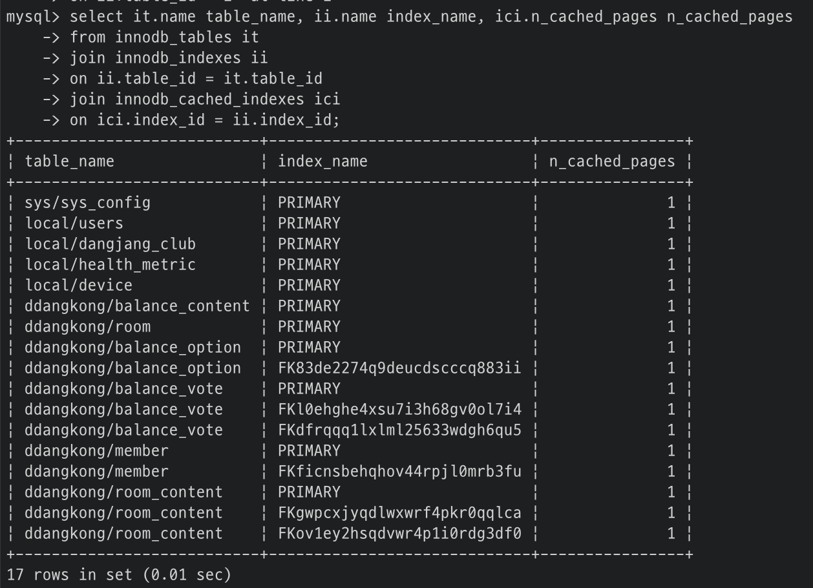
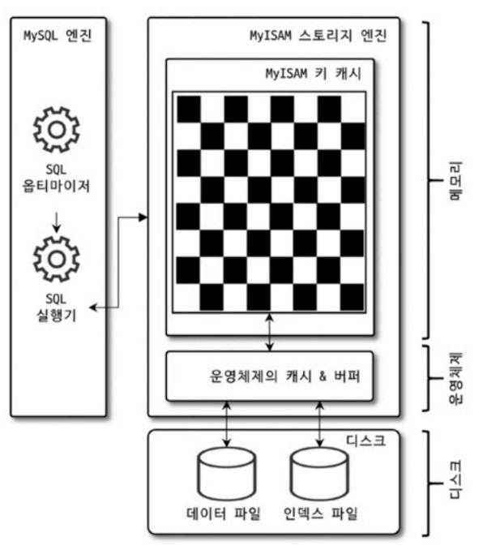

# 4. 아키텍처

- [4.1. MySQL 엔진 아키텍처](#41-mysql-엔진-아키텍처)
    - [4.1.1. MySQL의 전체 구조](#411-mysql의-전체-구조)
    - [4.1.2. MySQL 스레딩 구조](#412-mysql-스레딩-구조)
    - [4.1.3. 메모리 할당 및 사용 구조](#413-메모리-할당-및-사용-구조)
    - [4.1.4. 플러그인 스토리지 엔진 모델](#414-플러그인-스토리지-엔진-모델)
    - [4.1.5. 컴포넌트](#415-컴포넌트)
    - [4.1.6. 쿼리 실행 구조](#416-쿼리-실행-구조)
- [4.2. InnoDB 스토리지 엔진 아키텍처](#42-innodb-스토리지-엔진-아키텍처)
    - [4.2.1. 프라이머리 키에 의한 클러스터링](#421-프라이머리-키에-의한-클러스터링)
    - [4.2.2. 외래 키 지원](#422-외래-키-지원)
    - [4.2.3. MVCC(Multi Version Concurrency Control)](#423-mvccmulti-version-concurrency-control)
    - [4.2.4. 잠금 없는 일관된 읽기(Non-Locking Consistent Read)](#424-잠금-없는-일관된-읽기non-locking-consistent-read)
    - [4.2.5. 자동 데드락 감지](#425-자동-데드락-감지)
    - [4.2.6. 자동화된 장애 복구](#426-자동화된-장애-복구)
    - [4.2.7. InnoDB 버퍼 풀](#427-innodb-버퍼-풀)
    - [4.2.8. Double Write Buffer](#428-double-write-buffer)
    - [4.2.9. 언두 로그](#429-언두-로그)
    - [4.2.10. 체인지 버퍼](#4210-체인지-버퍼)
    - [4.2.11. 리두 로그 및 로그 버퍼](#4211-리두-로그-및-로그-버퍼)
    - [4.2.12. 어댑티브 해시 인덱스](#4212-어댑티브-해시-인덱스)
    - [4.2.13. InnoDB와 MyISAM, MEMORY 스토리지 엔진 비교](#4213-innodb와-myisam-memory-스토리지-엔진-비교)
- [4.3. MyISAM 스토리지 엔진 아키텍처](#43-myisam-스토리지-엔진-아키텍처)
    - [4.3.1. 키 캐시](#431-키-캐시)
    - [4.3.2. 운영체제의 캐시 및 버퍼](#432-운영체제의-캐시-및-버퍼)
    - [4.3.3. 데이터 파일과 프라이머리 키(인덱스) 구조](#433-데이터-파일과-프라이머리-키인덱스-구조)
- [4.4. MySQL 로그 파일](#44-mysql-로그-파일)
    - [4.4.1. 에러 로그 파일](#441-에러-로그-파일)
    - [4.4.2. 제너럴 쿼리 로그 파일(제너럴 로그 파일, General log)](#442-제너럴-쿼리-로그-파일제너럴-로그-파일-general-log)
    - [4.4.3. 슬로우 쿼리 로그](#443-슬로우-쿼리-로그)

## 4.1. MySQL 엔진 아키텍처

### 4.1.1. MySQL의 전체 구조


<br/>

MySQL 엔진
- 요청된 SQL을 분석하거나 최적화하는 등 DBMS의 두뇌 담당

스토리지 엔진
- 데이터를 디스크에 저장하거나 읽어오는 담당
- 스토리지 엔진은 **핸들러 API**를 제공하여 MySQL 엔진과 데이터를 주고받는다.



핸들러 API를 통해 얼마나 많은 데이터 작업이 있었는지 확인

### 4.1.2. MySQL 스레딩 구조



MySQL 서버는 프로세스 기반이 아닌 스레드 기반으로 작동한다.

#### 포그라운드 스레드 (= 클라이언트 스레드)
MySQL 커뮤니티 에디션은 전통적인 스레드 모델을 사용하기 때문에 커넥션 별로 포그라운드 스레드가 하나씩 생성되고 할당된다. 따라서 포그라운드 스레드는 최소한 MySQL에 **접속된 클라이언트 수만큼 존재**한다.

클라이언트의 요청을 마치고 커넥션이 종료되면 해당 커넥션을 담당하던 스레드는 다시 스레드 캐시로 되돌아간다. 스레드 캐시는 `thread_cache_size` 시스템 변수만큼 최대 스레드 수를 유지한다.

- InnoDB
    - **데이터 버퍼나 캐시에서 읽는 작업**은 포그라운드 스레드가 처리
    - 나머지 버퍼로부터 디스크까지 기록하는 작업은 **백그라운드 스레드**가 처리

- MyISAM
    - 데이터 버퍼, 캐시, 디스크 쓰기 작업까지 포그라운드 스레드가 처리

#### 백그라운드 스레드
- Insert Buffer를 병합하는 스레드
- 로그를 디스크로 기록하는 스레드
- InnoDB 버퍼 풀의 데이터를 디스크에 기록하는 스레드
- 데이터를 버퍼로 읽어 오는 스레드
- 잠금이나 데드락을 모니터링하는 스레드

MySQL 5.5 버전부터 `innodb_write_id_threads`, `innodb_read_id_threads` 시스템 변수로 데이터 쓰기, 읽기 스레드를 2개 이상 지정할 수 있다.
데이터를 읽는 작업은 주로 포그라운드 스레드에서 처리되기 떄문에 읽기 스레드를 크게 설정할 필요가 없다. 쓰기 스레드는 아주 많은 작업을 백그라운드 스레드에서 처리하므로 2 ~ 4 정도로 설정한다.

클라이언트의 요청에서 쓰기 작업은 버퍼링되어 처리될 수 있지만 읽기 작업은 절대 버퍼링될 수 없다.

### 4.1.3. 메모리 할당 및 사용 구조



#### 글로벌 메모리 영역
클라이언트 스레드 수와 무관하게 하나의 메모리 공간만 할당되며 N개라고 하더라도 모든 스레드에 의해 공유된다.
- 테이블 캐시
- InnoDB 버퍼 풀
- InnoDB 어댑티브 해시 인덱스
- InnoDB 리두 로그 버퍼

#### 로컬 메모리 영역
클라이언트 스레드마다 독립적으로 할당되는 메모리 공간이며 절대 공유되어 사용되지 않는다. 소트 버퍼와 조인 버퍼는 쿼리에 따라 필요할 때만 공간이 할당되고 필요하지 않은 경우 할당조차 하지 않을 수 있다.
> 쿼리에 order by, join 유무에 따라 할당이 다르다고 해석했는데 맞는지 모르겠다.
- 소트 버퍼
- 조인 버퍼
- 바이너리 로그 캐시
- 네트워크 버퍼

### 4.1.4. 플러그인 스토리지 엔진 모델
MySQL의 독특한 구조 중 하나는 플러그인 모델이다. 이를 통해 플러그인 형태로 빌드된 라이브러리를 다운로드해서 갈아 끼우거나 손쉽게 업그레이드할 수 있다. 스토리지 엔진뿐만 아니라 인증, 파서, 쿼리 재작성과 같은 플러그인도 제공한다.

### 4.1.5. 컴포넌트
플러그인의 단점
- 오직 MySQL 서버와 인터페이스할 수 있고, 플러그인끼리는 통신할 수 없음
- MySQL 서버의 변수나 함수를 직접 호출하기 때문에 안전하지 않음(캡슐화 x)
- 상호 의존 관계를 설정할 수 없어서 초기화가 어려움

이러한 단점을 보완하기 위해 컴포넌트가 구현되었다. (ex. MySQL 8.0의 비밀번호 검증 기능)

### 4.1.6. 쿼리 실행 구조



#### 쿼리 파서
- 클라이언트가 요청한 쿼리를 토큰으로 분리
    > 토큰 : MySQL이 인식할 수 있는 최소 단위의 어휘나 기호
- 토큰을 **트리 형태**의 구조로 구성 -> 파서 트리

-> 기본 문법 오류 탐지

#### 전처리기
- 파서 트리를 기반으로 쿼리 문장에 구조적 문제점 확인
- 테이블명, 컬럼명과 같은 객체를 매핑해 해당 객체의 존재 여부와 접근 권한 등을 확인

#### 옵티마이저
- 쿼리 문장을 어떻게 가장 저렴하고 빠르게 처리할지 결정

#### 실행 엔진
- 만들어진 계획대로 핸들러에게 요청 및 핸들러에게 받은 결과를 연결

#### 핸들러(스토리지 엔진)
- 실행 엔진의 요청에 따라 데이터를 디스크로 저장하거나 읽어오는 역할

#### 쿼리 캐시
- 쿼리 결과를 메모리에 저장하고, 동일 쿼리가 실행되면 즉시 결과 반환
- 데이터가 변경되면 관련 캐시도 모두 삭제해야 하기 때문에 심각한 동시 처리 성능 저하 유발
- **MySQl 8.0 버전부터 쿼리 캐시 기능 제거**

#### 스레드 풀
- MySQL 엔터프라이즈 에디션에서 제공하는 기능
    > skip 

#### 트랜잭션 지원 메타데이터
메타데이터는 테이블의 구조 정보와 스토어드 프로그램 등의 정보를 말한다. MySQL 5.7 버전까지 메타데이터를 파일 기반으로 관리했지만 트랜잭션을 지원하지 않기 때문에 일관성이 깨지는 문제가 발생했다. 따라서 MySQL 8.0 버전부터 메타데이터를 테이블에 저장하도록 개선되었다.

시스템 테이블은 사용자 인증, 권한 등 서버가 작동하기 위해 기본적으로 필요한 테이블을 말한다. 시스템 테이블과 메타데이터는 `mysql` 데이터베이스에 저장된다.

> `mysql` 데이터베이스에 저장된 메타데이터는 `information_schema` 데이터베이스에서 view 형태로 조회할 수 있다.
>
> 

## 4.2. InnoDB 스토리지 엔진 아키텍처



- 스토리지 엔진 중 거의 유일하게 레코드 기반의 잠금 제공
- 높은 동시성 처리
- 안정적이고 뛰어난 성능

### 4.2.1. 프라이머리 키에 의한 클러스터링

모든 테이블은 프라이머리 키 값의 순서대로 클러스터링되어 디스크에 저장된다.(clustered index) 따라서 프라이머리 키를 이용한 레이지 스캔은 상당히 빨리 처리되며 쿼리 실행 계획에서 다른 보조 인덱스에 비해 비중이 높게 설정된다.
모든 세컨더리 인덱스는 레코드의 주소 대신 프라이머리 키의 값을 논리적인 주소로 사용한다.

#### cf.
MyISAM 스토리지 엔진은 클러스터링 키를 지원하지 않는다. 프라이머리 키와 세컨터리 인덱스는 구조적인 차이가 없으며 프라이머리 키는 유니크 제약을 가진 세컨더리 인덱스일 뿐이다.

### 4.2.2. 외래 키 지원
MyISAM이나 MEMORY 테이블에서는 사용할 수 없다.

외래 키는 부모 테이블과 자식 테이블 모두 해당 컬럼에 인덱스 생성이 필요하다. 레코드 변경 시 반드시 부모 테이블과 자식 테이블에 데이터가 있는지 체크하는 작업이 필요하기 때문에 **lock이 여러 테이블로 전파되어 데드락이 발생**하는 경우가 많다.

```sql
SET foreign_key_checks=OFF;
```
일시적으로 외래 키 검증을 멈추고 작업을 진행할 수 있다.
GLOBAL, SESSION 모두 설정 가능한 변수이며 생략하면 SESSION 설정만 변경한다.

### 4.2.3. MVCC(Multi Version Concurrency Control)
잠금을 사용하지 않는 일관된 읽기를 제공하기 위함이며 InnoDB는 **언두 로그(Undo log)** 를 통해 하나의 레코드에 대해 여러 버전을 동시에 관리한다.

레코드가 변경될 경우 InnoDB 버퍼 풀은 변경된 값으로 업데이트, 이전 버전은 언두 로그에 저장된다.
COMMIT되면 지금의 상태를 영구적인 데이터로 만들고, ROLLBACK되면 언두 로그의 데이터를 InnoDB 버퍼 풀로 다시 복구한 후 언두 로그의 내용을 삭제한다. COMMIT이 되더라도 언두 로그의 데이터를 바로 삭제하는 것은 아니며 해당 언두 로그를 필요로 하는 다른 트랜잭션이 더 이상 없을 때 삭제된다.

### 4.2.4. 잠금 없는 일관된 읽기(Non-Locking Consistent Read)
MVCC 기술을 이용해 잠금을 걸지 않고 읽기 작업을 수행한다. SERIALIZABLE 외의 격리 레벨에서 순수한 SELECT 작업은 다른 트랜잭션의 변경 작업과 상관없이 항상 잠금을 대기하지 않고 바로 실행된다.

트랜잭션이 오랜 시간동안 활성 상태이면 언두 로그를 삭제하지 못하고 계속 유지해야 하기 때문에 MySQL 서버가 느려지거나 문제가 발생할 수 있다. 따라서 가능한 빠르게 롤백이나 커밋으로 트랜잭션을 종료해야 한다.

### 4.2.5. 자동 데드락 감지
InnoDB는 **데드락 감지 스레드**를 가지고 있어 주기적으로 작믐 대기 그래프를 검사하고 교착 상태에 빠진 트랜잭션 중 하나를 강제 종료한다. 데드락 트랜잭션의 종료 우선 순위는 언두 로그 레코드를 더 적게 가진 트랜잭션이 대상이 된다.

`innodb_table_locks` 시스템 변수를 활성화하면 테이블 레벨의 잠금까지 감지할 수 있다.

동시 처리 스레드가 많아지거나 각 트랜잭션이 가진 잠금 개수가 많아지면 데들가 감지 스레드가 느려진다. `innodb_deadlock_detect` 시스템 변수를 OFF로 설정하면 데드락 감지 스레드를 비활성화할 수 있다. 이 때는 `innodb_lock_wait_timeout` 시스템 변수를 사용하여 설정한 초까지 잠금을 획득하지 못하면 에러를 반환하도록 하는 것이 좋다.

#### cf.
PK나 세컨더리 인덱스를 기반으로 매우 높은 동시성 처리를 요구하는 서비스의 경우 `innodb_deadlock_detect`를 비활성화하면서 성능상의 비교를 할 수 있다.

### 4.2.6. 자동화된 장애 복구
디스크나 서버 하드웨어 이슈로 InnoDB 스토리지 엔진이 자동으로 복구하지 못할 경우 `innodb_force_recovery` 시스템 변수를 설정해서 복구모드로 MySQL 서버를 시작할 수 있다.

- 1(SRV_FORCE_IGNORE_CORRUPT)
    - 테이블 스페이스의 데이터나 인덱스 페이지에서 손상된 부분이 발견돼도 무시
- 2(SRV_FORCE_NO_BACKGROUND)
    - 백그라운드 스레드 중 메인 스레드를 시작하지 않음
- 3(SRV_FORCE_NO_TRX_UNDO)
    - 커밋되지 않고 종료된 트랜잭션은 롤백하지 않음
- 4(SRV_FORCE_NO_IBUF_MERGE)
    - 인서트 버퍼의 내용을 무시
- 5(SRV_FORCE_NO_UNDO_LOG_SCAN)
    - 언두 로그 모두 무시
- 6(SRV_FORCE_NO_LOG_REDO)
    - 리두 로그 모두 무시

### 4.2.7. InnoDB 버퍼 풀
디스크의 데이터 파일이나 인ㄴ덱스 정보를 메모리에 캐시하거나 쓰기 작업을 지연시켜 일괄 처리하는 버퍼 역할을 한다.

버퍼 풀 크기는 `innodb_buffer_pool_size` 시스템 변수로 설정할 수 있으며 동적으로 버퍼 풀 크기를 확장할 수 있다. 버퍼 풀은 내부적으로 128MB 청크 단위로 쪼개어 관리되기 때문에 크기를 줄이거나 늘릴 때 단위 크기로 사용된다.

내부 잠금 경합을 줄이기 위해 버퍼 풀을 여러 개로 쪼개어 관리하도록 개선되었다. `innodb_buffer_pool_instances` 시스템 변수만큼 여러 개로 분리해서 관리할 수 있으며 버퍼 풀을 위한 메모리 크기가 1GB 미만이면 1개만 생성된다.

#### 버퍼 풀 구조
버퍼 풀은 `innodb_page_size` 시스템 변수에 설정된 크기의 페이지로 쪼개서 데이터를 저장한다. 페이지는 LRU 리스트, 플러시 리스트, 프리 리스트 자료 구조로 관리된다.

LRU 리스트
- LRU: Old 서브리스트
- MRU: New 서브리스트
- 디스크로부터 읽어온 페이지를 최대한 오랫동안 버퍼풀 메모리에 유지해서 디스크 읽기를 최소화

플러시 리스트
- 디스크로 동기화되지 않은 데이터를 가진 **더티 페이지**의 변경 시점 목록

프리 리스트
- 버퍼 풀에서 실제 데이터로 채워지지 않고 비어있는 페이지들의 목록
- 새롭게 디스크의 데이터 페이지를 읽어와야 하는 경우 사용

#### 리두 로그
데이터가 변경되면 리두 로그에 기록하고 버퍼 풀의 페이지에도 반영(**더티 페이지**)한다. 리두 로그는 1개 이상의 고정 크기 파일을 연결해서 순환 고리처럼 사용한다. 데이터 변경이 계속해서 발생하면 이전에 기록됐던 로그 엔트리는 다른 로그 엔트리로 덮어 써지기 때문에 전체 리두 로그 파일에서 재사용 가능한 공간과 재사용 불가능한 공간을 구분해서 관리한다. 이 때 리두 로그에서 페이지와 연결되어 재사용 불가능한 공간을 **활성 리두 로그**라고 한다.

리두 로그에 기록될 때마다 로그 포지션(LSN, Log Sequence Number)은 계속 증가된 값을 갖게 된다. InnoDB에서 주기적으로 체크포인트 이벤트를 발생시키면 리두 로그와 버퍼 풀의 더티 페이지는 디스크로 동기화된다. 이 때 체크포인트 중 가장 최근 체크포인트 지점의 LSN이 활성 리두 공간의 시작점이다. 가장 최근 체크포인트 LSN과 마지막 리두 로그 엔트리의 LSN의 차이가 Checkpoint Age이며 이 것이 활성 리두 로그 공간의 크기이다.

#### 버퍼 풀 플러시
더티 페이지들을 성능상의 악영향없이 디스크에 동기화하기 위해 2개의 플러시 기능을 백그라운드로 실행한다.

1. 플러시 리스트 플러시
    - 주기적으로 플러시 리스트의 플러시 함수를 호출해서 오래된 순서대로 디스크에 동기화
    - 더티 페이지를 디스크로 동기화하는 **클리너 스레드** 동작
    - `innodb_page_cleaners` : 클리너 스래드 개수 조정
        - `innodb_page_cleaners` > `innodb_buffer_pool_instances`일 경우 `innodb_buffer_pool_instances` 값으로 자동 변경
        - `innodb_page_cleaners` < `innodb_buffer_pool_instances`일 경우 하나의 클리너 스레드가 여러 개의 버퍼 풀 인스턴스 처리
            > 가능하면 두 시스템 변수 값은 동일하게 설정
    - `innodb_page_max_dirty_page_pct` : 더티 페이지 비율 조정
    - `innodb_io_capacity` : 초당 디스크를 읽고 쓸 수 있는 용량
    - `innodb_page_max_dirty_page_pct_lwm` : 일정 수준 이상의 더티 페이지 비율이 발생하면 조금씩 디스크로 동기화
    - `innodb_adeptive_flushing` : 더티 페이지 비율, `innodb_io_capacity`, `innodb_io_capacity_max`에 의존하지 않고 새로운 어댑티브 플러시 알고리즘 적용
        - 리두 로그의 증가 속도를 분석해서 적절한 수준의 더티 페이지가 버퍼 풀에 유지될 수 있도록 디스크 쓰기 실행
    - `innodb_adeptive_flushing_lwm` : 활성 리두 공간이 설정한 임계 비율을 넘어서면 어댑티브 플러시 알고리즘 작동
    - `innodb_flush_neighbors` : 근접한 더티 페이지도 함께 묶어서 디스크 쓰기
        - HDD일 때 유용하므로 1 또는 2로 설정
        - SDD는 기본값인 비활성화 유지

2. LRU 리스트 플러시
    - LRU 리스트에서 사용 빈도가 낮은 페이지를 제거하기 위해 LRU 리스트 플러시 함수 호출
    - LRU 리스트의 끝 부분부터 시작해서 `innodb_lru_scan_depth` 시스템 변수에 설정된 개수만큼 페이지 스캔
    - 더티 페이지는 동기화, 클린 페이지는 프리 리스트로 이동
    - 버퍼 풀 인스턴스 별로 스캔하기 때문에 `innodb_buffer_pool_instances` * `innodb_lru_scan_depth` 만큼 수행

#### 버퍼 풀 상태 백업 및 복구
`innodb_buffer_pool_dump_now` 시스템 변수를 사용하여 현재 버퍼 풀의 상태를 백업한 후 서버를 다시 시작해서 `innodb_buffer_pool_load_now` 시스템 변수를 활성화하면 백업된 버퍼 풀의 상태를 다시 복구할 수 있다.
서버를 셧다운하고 다시 시작했을 때 디스크의 데이터가 버퍼 풀에 적재되어 있는 **워밍업** 상태로 만들기 위함이다.
LRU 리스트의 데이터 페이지의 메타 정보만 저장하기 때문에 버퍼 풀이 크더라도 백업 파일은 몇 십 MB이하이다.

자동으로 백업 및 복구를 실행할 경우 MySQL 설정 파일에 `innodb_buffer_pool_dump_at_shutdown`, `innodb_buffer_pool_load_at_startup` 설정을 추가한다.

#### 버퍼 풀의 적재 내용 확인
`information_schema` 데이터베이스의 `innodb_buffer_page` 테이블을 조회하면 버퍼 풀에 어떤 테이블의 페이지가 적재되어 있는지 확인할 수 있지만 버퍼 풀이 큰 경우 상당히 큰 부하를 일으킬 수 있다. MySQL 8.0부터는 `innodb_cached_indexes` 테이블을 이용해서 테이블의 인덱스 별로 데이터 페이지가 얼마나 적재돼 있는지 확인할 수 있다.

`innodb_buffer_page`



`innodb_cached_indexes`



### 4.2.8. Double Write Buffer
리두 로그는 공간 낭비를 막기 위해 페이지의 변경된 내용만 기록한다. 이로 인해 디스크로 플러시할 때 일부만 기록되는 파셜 페이지(Partial-page) 또는 톤 페이지(Torn-page) 현상이 발생할 수 있다. Innodb는 이러한 문제를 예방하기 위해 Double-Write 기법을 이용한다.

이 기능을 사용할지 여부는 `innodb_doublewrite` 시스템 변수로 제어할 수 있다. 데이터의 무결성이 매우 중요한 서비스라면 활성화를 고려할 수 있지만 서버 성능을 위해 리두 로그 동기화 설정(`innodb_flush_log_at_trx_commit`)을 1이 아닌 값을 설정했다면 Double-Write도 비활성화하는 것이 좋다.

### 4.2.9. 언두 로그
언두 로그는 트랜잭션과 격리 수준을 보장하기 위해 DML로 변경되기 이전의 데이터를 백업한 것이다.

문제점
- 100GB 크기의 테이블의 모든 레코드를 삭제할 경우 언두 로그에도 백업되어 언두 로그 크기가 100GB로 증가
- 트랜잭션이 완료되었더라도 다른 트랜잭션이 아직 활성 상태일 경우 언두 로그를 즉시 삭제할 수 없음

언두 로그 레코드가 얼마나 되는지 모니터링할 필요가 있다.
```sql
-- all version
SHOW ENGINE INNODB STATUS \G

-- after 8.0 version
SELECT count
FROM information_schema.innodb_metrics
WHERE SUBSYSTEM='transaction' AND NAME='trx_rseg_history_len';
```
<br>

MySQL 8.0.14 버전부터 `innodb_undo_tablespaces` 시스템 변수는 deprecated됐으며 언두 로그는 항상 시스템 테이블스페이스 외부의 별도 로그 파일에 기록되도록 개선됐다.
- 하나의 언두 테이블스페이스는 1개 이상, 128개 이하의 롤백 세그먼트를 가진다.
- 하나의 롤백 세그먼트는 InnoDB 페이지 크기를 16byte로 나눈 개수 만큼의 언두 슬롯을 가진다.
- 하나의 트랜잭션은 최대 4개까지의 언두 슬롯을 사용한다.

언두 테이블스페이스의 공간을 필요한 만큼만 남기고 나머지를 운영체제로 반납
- 자동 모드
    - `innodb_undo_log_truncate` 시스템 변수 활성화
    - InnoDB 스토리지 엔진의 **퍼지 스레드**가 주기적으로 언두 로그의 불필요한 공간 삭제 -> Undo Purge
    - `innodb_purge_rseg_truncate_frequency` 시스템 변수로 작업 주기 설정
- 수동 모드
    - `innodb_undo_log_truncate` 시스템 변수 비활성화 또는 언두 테이블스페이스 비활성화
    - 퍼지 스레드가 비활성 상태의 언두 테이블스페이스를 찾아서 불필요한 공간 삭제
    - 반납 완료 후 언두 테이블스페이스 다시 활성화
    - 엔두 테이블스페이스가 **최소 3개 이상**일 때만 작동 가능    

### 4.2.10. 체인지 버퍼
변경해야 할 인덱스 페이지가 버퍼 풀에 없으면 디스크로부터 바로 읽어와서 업데이트하지 않고, 임시 공간에 저장해두고 사용자에게 결과를 반환한다. 이 때 사용하는 임시 메모리 공간을 체인지 버퍼라고 한다.

중복 여부를 체크하는 유니크 인덱스는 체인지 버퍼를 사용할 수 없으며 MySQL 8.0부터 INSERT, DELETE, UPDATE로 인한 인덱스 변경 작업에 버퍼링이 될 수 있도록 개선됐다.
체인지 버퍼에 임시로 저장된 인덱스 레코드 조각은 이후 백그라운드 스레드에 의해 병합되며 이 스레드를 체인지 버퍼 머지 스레드라고 한다.

`innodb_change_buffering` 시스템 변수를 사용하여 종류별로 체인지 버퍼를 활성화할 수 있다.
- all : 모든 인덱스 관련 작업(inserts + deletes + purges)
- none : 버퍼링 안함
- inserts : 인덱스에 새로운 아이템을 추가하는 작업
- deletes : 인덱스에 기존 아이템을 삭제(삭제되었다는 마킹)하는 작업
- changes : inserts + deletes
- purges : 인덱스 아이템을 영구적으로 삭제하는 작업

체인지 버퍼 공간의 기본값은 버퍼 풀로 설정된 메모리 공간의 **25%**까지 사용할 수 있으며 최대 **50%**까지 사용하게 설정할 수 있다. `innodb_change_buffer_max_size` 시스템 변수로 조정할 수 있다.

### 4.2.11. 리두 로그 및 로그 버퍼
리두 로그는 영속성과 가장 연관있으며 하드웨어나 소프트웨어 등 여러 문제로 인해 MySQL 서버가 비정상적으로 종료됐을 때 데이터 파일에 기록되지 못한 데이터를 잃지 않게 해주는 안전장치이다.

`innodb_flush_log_at_trx_commit` 시스템 변수를 사용하여 리두 로그를 어느 주기로 디스크에 동기화할지 결정할 수 있다.
- 0 : 1초에 한 번씩 리두 로그를 디스크에 쓰고 동기화
- 1 : 매번 트랜잭션이 커밋될 때마다 디스크에 쓰고 동기화
- 2 : 매번 트랜잭션이 커밋될 때마다 디스크에 쓰지만 실질적인 동기화는 1초에 한 번씩 실행

0이나 2인 경우 `innodb_flush_log_at_timeout` 시스템 변수를 이용해 동기화 주기를 변경할 수 있다.

리두 로그 파일의 크기는 `innodb_log_file_size` 시스템 변수로 결정되며 리두 로그 파일의 개수는 `innodb_log_files_in_group` 시스템 변수로 결정한다. 따라서 전체 리두 로그 파일의 크기는 **두 시스템 변수의 곱**이다.
리두 로그 버퍼링에 사용되는 공간이 로그 버퍼이고 로그 버퍼의 크기는 기본값인 16MB 수준에서 설정하는 것이 적합하다.

#### 리두 로그 아카이빙
데이터 변경이 많아서 리두 로그가 덮어써지더라도 백업이 실패하지 않게 한다. 
아키이빙된 리두 로그가 저장될 디렉토리를 `innodb_redo_log_archive_dirs` 시스템 변수에 설정하고 `innodb_redo_log_archive_start` UDF를 실행한다. 아카이빙을 종료할 때는 `innodb_redo_log_archive_stop` UDF를 실행한다.

만약 아카이빙을 시작한 세션이 중간에 연결이 끊어진다면 InnoDB 스토리지 엔진은 아키이빙을 멈추고 아키이빙 파일도 삭제한다.

#### 리두 로그 비활성화
MySQL 8.0 버전부터 데이터를 복구하거나 대용량 데이터를 한 번에 적재하는 경우 리두 로그를 비활성화해서 시간을 단축시킬 수 있다.
```sql
ALTER INSTANCE DISABLE INNODB REDO_LOG;
```
리두 로그를 비활성화하고 작업을 실행했다면 작업 완료 후 리두 로그를 다시 활성화해야 한다.

### 4.2.12. 어댑티브 해시 인덱스
사용자가 수동으로 생성하는 인덱스가 아닌 InnoDB에서 사용자가 자주 요청하는 데이터에 대해 자동으로 생성하는 인덱스이며 `innodb_adaptive_hash_index` 시스템 변수로 활성화할 수 있다.
어댑티브 해시 인덱스는 B-Tree 검색 시간을 줄여주기 위한 기능이다. 자주 읽히는 데이터 페이지의 키 값을 이용해 해시 인덱스를 만들고, 필요할 때마다 어댑티브 해시 인덱스를 검색해서 레코드가 저장된 데이터 페이지를 즉시 찾아간다.

어랩티브 해시 인덱스는 하나만 존재하기 때문에 인덱스 키 값은 **B-Tree 인덱스의 고유 번호와 B-Tree 인덱스의 실제 키 값의 조합**으로 생성된다. 또한 버퍼 풀에 있는 데이터 페이지에 대해서만 관리되므로 버퍼 풀에 해당 데이터 페이지가 없어지면 어댑티브 해시 인덱스에서도 사라진다.

어댑티브 해시 인덱스는 하나인 이유로 잠금 경합이 심하다. 이러한 문제를 줄이기 위해 MySQL 8.0 버전부터 어댑티브 해시 인덱스의 파티션 기능을 제공한다. `innodb_adaptive_hash_index_parts` 시스템 변수를 사용하며 기본값은 8개이다.

- 어댑티브 해시 인덱스가 유효하지 않은 경우
    - 디스크 읽기가 많은 경우
    - 특정 패턴의 쿼리가 많은 경우(조인이나 LIKE 패턴 검색)
    - 매우 큰 데이터를 가진 테이블의 레코드를 폭넓게 읽는 경우

- 어댑티브 해시 인덱스가 유효한 경우
    - 디스크의 데이터가 InnoDB 버퍼 풀 크기와 비슷한 경우(디스크 읽기가 많지 않은 경우)
    - 동등 조건 검색(동등 비교와 IN 연산자)이 많은 경우
    - 쿼리가 일부 데이터에만 집중되는 경우

<br>

어댑티브 해시 인덱스가 불필요한 오버헤드를 만들고 있는지 판단해야 한다.
- 저장 공간으로 메모리를 사용하며 때로는 상당히 큰 메모리 공간을 사용할 수도 있다.
- 해시 인덱스에 값의 존재 유무에 상관없이 검색한다.
- 테이블의 스키마 변경 또는 삭제 시 이 테이블이 가진 모든 데이터 페이지의 내용을 어댑티브 해시 인덱스에서 제거해야 한다.

```sql
SHOW ENGINE INNODB STATUS\G
```
쿼리가 처리되기 위해 내부적으로 키 값의 검색이 몇 변 실행됐는지 확인하여 히트율과 어댑티브 해시 인덱스가 사용 중인 메모리 공간, 서버의 CPU 사용량을 종합해서 판단해야 한다.

### 4.2.13. InnoDB와 MyISAM, MEMORY 스토리지 엔진 비교
MySQL 5.5부터 InnoDB 스토리지 엔진이 기본 스토리지 엔진으로 채택됐으며 MySQL 8.0부터 모든 시스템 테이블도 InnoDB로 교체됐다.
MEMORY 스토리지 엔진은 MySQL 5.7 버전까지 내부 임시 테이블 용도로 사용했지만 MySQL 8.0부터 TempTable 스토리지 엔진으로 대체되었다. `internal_temp_mem_storage_engine` 시스템 변수를 통해 MEMORY 스토리지 엔진으로 변경할 수 있지만 얻을 수 있는 장점은 없어졌다.

## 4.3. MyISAM 스토리지 엔진 아키텍처


### 4.3.1. 키 캐시
키 캐시는 InnoDB의 버퍼 풀과 비슷한 역할을 하며 인덱스만을 대상으로 작동한다. 히트율이 99% 미만이라면 키 캐시를 조금 더 크게 설정하는 것이 좋다. 32bit 운영체제에서는 하나의 키 캐시에 4GB이상의 메모리 공간을 설정할 수 없고, 64bit 운영체제에서는  `OS_PER_PROCESS_LIMIT` 값에 설정된 크기만큼 메모리를 할당할 수 있다.

### 4.3.2. 운영체제의 캐시 및 버퍼
MyISAM 테이블의 데이터에 대해서는 디스크 I/O를 해결해 줄만한 캐시나 버퍼링 기능이 없기 때문에 항상 운영체제로 작업을 요청할 수 밖에 없다.
운영체제의 캐시 공간은 남은 메모리를 사용하므로 MyISAM의 키 캐시는 최대 물리 메모리의 40% 이상을 넘지 않게 설정해야 한다.

### 4.3.3. 데이터 파일과 프라이머리 키(인덱스) 구조
MyISAM 테이블은 프라이머리 키에 의한 클러스터링없이 데이터 파일이 힙 공간처럼 활용된다. 그래서 프라이머리 키 값과 무관하게 INSERT되는 순서대로 데이터 파일에 저장된다. 또한 저장되는 레코드는 모두 ROWID라는 물리적인 주솟값을 가지며 인덱스는 저장된 레코드의 ROWID 값을 포인터로 설정한다.
- 고정 길이 ROWID
- 가변 길이 ROWID

## 4.4. MySQL 로그 파일

### 4.4.1. 에러 로그 파일
에러나 경고 메시지가 출력되는 로그 파일로, `my.cnf`에서 `log_error` 파라미터에 정의된 경로에 생성된다.
- MySQL이 시작하는 과정과 관련된 정보성 및 에러 메시지
- 마지막으로 종료할 때 비정상적으로 종료된 경우 나타나는 InnoDB의 트랜잭션 복구 메시지
- 쿼리 처리 도주에 발생하는 문제에 대한 에러 메시지
- 비정상적으로 종료된 커넥션 메시지
- InnoDB의 모니터링 또는 상태 조회 명령의 결과 메시지
- MySQL의 종료 메시지

### 4.4.2. 제너럴 쿼리 로그 파일(제너럴 로그 파일, General log)
서버에서 실행되는 쿼리를 기록하며 `general_log_file` 파라미터에 정의된 경로에 생성된다.
`log_output` 파라미터로 파일 또는 테이블로 저장할지를 결정할 수 있다.

### 4.4.3. 슬로우 쿼리 로그
쿼리 튜닝
- 서비스가 적용되기 전에 전체적으로 튜닝
- 서비스 운영 중 MySQL 서버의 전체적인 성능 저하를 검사하거나 정기적인 점검을 위한 튜닝

슬로우 쿼리 파일은 `long_query_time` 시스템 변수에 설정한 초 이상의 시간이 소요된 쿼리를 모두 기록한다. 반드시 쿼리가 정상적으로 실행이 완료되어야 슬로우 쿼리 로그에 기록될 수 있다.
- `Time` : 쿼리가 종료된 시점.
- `User@Host` : 쿼리를 실행한 사용자의 계정
- `Query_time` : 쿼리가 실행되는 데 소요된 전체 시간.
- `Lock_time` : MySQL 엔진에서 관장하는 테이블 잠금에 대한 대기 시간
- `Rows_examined` : 쿼리가 처리되기 위해 몇 건의 레코드에 접근
- `Rows_sent` : 실제 몇 건의 처리 결과를 클라이언트로 전송