# 5장 - 트랜잭션과 잠금

# 5.1 트랜잭션

트랜잭션의 목적은 `완전성(원자성)` 을 보장하여 `데이터의 정합성` ****을 보장하는 것이다.

트랜잭션이라는 논리적인 작업 단위 내의 모든 작업 중
단 하나라도 실패하면 원 상태로 복구해서 작업의 일부만 적용되는 `Partial update 현상` 이 발생하지 않게 만들어주는 기능을 가진다.

> MyISAM, MEMORY와 같이 트랜잭션을 지원하지 않는 스토리지 엔진은 속도는 빠르지만 더 많은 고민거리를 만들어낸다.
> 

## 5.1.1 MySQL에서의 트랜잭션

트랜잭션은 트랜잭션 내부 작업의 개수와 상관없이 논리적인 작업 셋 자체가 100% 적용(Commit) 되거나 아무것도 적용되지 않아야 함(Rollback)을 보장한다.

> 트랜잭션은 꼭 여러 개의 변경 작업을 수행하는 쿼리가 조합됐을 때만 의미있는 개념은 아니다.
> 

### 트랜잭션 예제

```sql
# MyISAM 테이블 생성
CREATE TABLE tab_myisam ( fdpk INT NOT NUL, PRMI ARY KEY (fdpk) ) ENGINE=MyISAM;
# fdpk 값이 3인 레코드 생성
INSERT INTO tab_myisam (fdpk) VALUES (3);

# InnoDB 테이블 생성
CREATE TABLE tab_innodb ( fdpk INT NOT NULL, PRIMARY KEY (fdpk) ) ENGINE=INNODB; 
# fdpk 값이 3인 레코드 생성
INSERT INTO tab_innodb (fdpk) VALUES (3);
```

위는 트랜잭션을 지원하지 않는 MyISAM과 InnoDB 테이블을 각각 생성하고
각 테이블에 값이 3인 PK를 생성하는 로직이다.

```sql
# Auto Commit 활성화(Default)
SET autocommit=ON;

# MyISAM 테이블에 pk값이 각각 1,2,3일 레코드 삽입
INSERT INTO tab_myisam (fdpk) VALUES (1), (2), (3); 
# InnoDB 테이블에 pk값이 각각 1,2,3일 레코드 삽입
INSERT INTO tab_innodb (fdpk) VALUES (1), (2), (3);
```

이때 위와 같이 각 엔진의 테이블에 pk 값이 각각 1,2,3 레코드를 삽입하면 어떻게 될까?

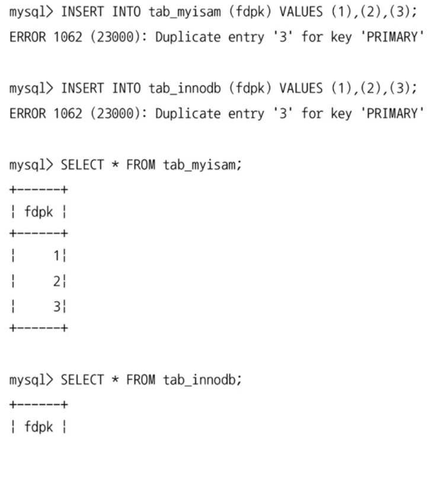

결과는 위와 같다.

두 테이블은 모두 1,2 까지 저장되었지만 3을 저장하는 과정에서 `PK 제약 조건` 에 포함된 `Unique 제약 조건` 에 의해 저장에 실패한다.

이때 트랜잭션 지원이 안되는 MyISAM은 3번 빼고 나머지 2개의 데이터는 저장이되며
트랜잭션 지원이 되는 InnoDB는 하나의 실패로 인해 모든 작업이 롤백되었다.

> 위 MyISAM의 결과와 같이 작업 단위 중, 작업의 일부가 실패해도 롤백되지 않는 현상을 `부분 업데이트(Partial Update)` ****라고 한다.
> 

트랜잭션이 지원되지 않는다면 부분 업데이트 현상은 계속해서 발생할 것이고
이는 데이터 정합성을 맞추는 데 상당히 어려운 문제를 만들어낼 것이다.

특히 트랜잭션에 포함된 데이터 저장 쿼리의 개수가 많다면
DB에 수없이 많은 쓰레기 데이터가 남아있게 되어 문제는 더욱 커진다.

```sql
try {
	START TRANSACTION;
	INSERT INTO tab_a ...;
	INSERT INTO tab_b ...;
	COMMIT:
} catch(exception) {
ROLLBACK; 
}
```

이러한 문제는 트랜잭션을 지원하는 InnoDB에서 처리한다면 위와 같이 깔끔하게 처리가 가능하다.

## 5.1.2 주의사항

트랜잭션 또한 DBMS의 커넥션과 동일하게 *꼭 필요한 최소의 코드에만 적용* 하는 것이 좋다.

이는 트랜잭션의 범위를 최소화하라는 의미이다.

### 주의사항 관련 예제

다음은 사용자가 게시판에 게시물을 작성한 후 저장 버튼을 클릭했을 때, 서버에서 처리하는 내용을 간단히만 정리한 내용이다.

<aside>
📃 **[게시물 작성 작업 플로우]**

1. 처리 시작
    
    → DB Connection 생성
    
    → Transaction 시작
    
2. 사용자의 로그인 여부 확인
3. 사용자의 글쓰기 내용의 오류 여부 확인
4. 업로드된 파일 확인 및 저장
5. 사용자의 입력 내용을 DBMS에 저장
6. 첨부 파일 정보를 DBMS에 저장
7. 저장된 내용 또는 기타 정보를 DBMS에서 조회
8. 게시물 등록에 대한 알림 메일 발송
9. 알림 메일 발송 이력을 DBMS에 저장
    
    → Transaction 종료
    
    → DB Connection 반납
    
10. 처리 완료
</aside>

이제 위 내용에서 트랜잭션 처리에 좋지 않는 영향을 미치는 부분을 나누어 살펴보자.

- **실제 DB 작업은 5번부터 시작되지만 1,2번 사이에서 트랜잭션을 시작한다.**
이는 불필요하게 데이터베이스 커넥션을 잡고있게 되는데, 커넥션의 개수는 제한적이기 때문에 문제가 된다.
결국 불필요한 커넥션 사용으로 인해 다른 작업에서 커넥션을 대기하는 상황으로 이어질 수 있다.
- **8번과 같은 네트워크를 통한 외부 접근 과정은 트랜잭션 내에서 제거하는 것이 좋다.**
네트워크 문제나 외부 시스템의 장애로 외부와의 연결이 느려져 길게 대기하는 경우 그 시간동안 트랜잭션이 묶여있게 된다.
- **공통된 작업끼리 분리하는 것이 좋다.**
현재 작업에서는 5,6 번이 공통된 작업이고, 7번은 단순 조회이기 때문에 트랜잭션이 필요하지 않으며, 9번은 5,6번과는 조금 다른 성격의 작업이기 때문에 5,6번과 분리해도 무방할 것이다. 이를 통해 트랜잭션을 빠르게 종료하여 리소스를 순환시킬 수 있을 것이다.

위 3가지가 반영된 플로우를 확인해보자.

<aside>
📃 **[게시물 작성 작업 플로우]**

1. 처리 시작
2. 사용자의 로그인 여부 확인
3. 사용자의 글쓰기 내용의 오류 여부 확인
4. 업로드된 파일 확인 및 저장
    
    → DB Connection 생성(또는 커넥션 풀에서 가져오기)
    
    → Transaction 시작
    
5. 사용자의 입력 내용을 DBMS에 저장
6. 첨부 파일 정보를 DBMS에 저장
    
    ← Transaction 종료
    
7. 저장된 내용 또는 기타 정보를 DBMS에서 조회
8. 게시물 등록에 대한 알림 메일 발송
    
    → Transaction 시작
    
9. 알림 메일 발송 이력을 DBMS에 저장
    
    ← Transaction 종료
    
    ← DB Connection 종료 (또는 커넥션 풀에 반납)
    
10. 처리 완료
</aside>

이는 최적의 예제가 아닐 수도 있으며 업무의 특성에 따라 크게 달라질 수 있다.

여기서 설명하려는 바는 트랜잭션이 활성화되어있는 시간과 범위를 최소화해야한다는 것이다.

위에서 설명한 실수로 인해 DBMS 서버가 높은 부하 상태로 빠지거나 위험한 상태로 빠지는 경우가 빈번히 발생한다.

<aside>
🚀 **[궁금 포인트]
불필요한 커넥션 사용이 다른 작업에서 커넥션을 대기하도록 만들 수 있어 좋지 않다고 했는데, 왜 위 개선된 작업 플로우에서는 트랜잭션 종료만 하고 Connection 반납은 하지 않을까?**

</aside>

<aside>
🚀 **[궁금 포인트]
조회 작업에서도 select ~ for update의 경우와 같이 Lock이 필요하면 트랜잭션이 있어야하지 않나?
트랜잭션이 없다면 잠금 시간 범위 조절이 안되기 때문에,  잠금이 바로 해제되어 동시성 제어가 안되는 것으로 알고 있다.**

</aside>

# 5.2 MySQL 엔진의 잠금

MySQL의 락은 크게 아래 두 가지로 나뉘어진다.

### MySQL 엔진 레벨 잠금

> 잠금 가능 범위: MySQL 서버에서 스토리지 엔진을 제외한 나머지 모든 부분
> 
- 모든 스토리지 엔진에도 영향을 미친다.
- 테이블 데이터 동기화를 위한 테이블 락 이외에도
    - 테이블 구조를 잠그는 메타데이터 락(Metadata Lock)
    - 사용자의 필요에 맞게 사용 가능한 네임드 락(Named Lock)을 제공한다.

### 스토리지 엔진 레벨 잠금

> 잠금 가능 범위: 스토리지 엔진 부분
> 
- 스토리지 엔진 간 상호 영향을 미치지 않는다.

## 5.2.1 글로벌 락

> **[영향 범위]** MySQL 서버 전체
- MySQL에서 제공하는 잠금 중 *가장 큰 범위*
> 

```sql
# 글로벌 락을 얻는 명령어
FLUSH TABLES WITH READ LOCK
```

위 글로벌 락 명령은 실행 시, MySQL 서버에 존재하는 모든 테이블을 닫고 잠금을 건다.

한 세션에서 글로벌 락을 흭득하면
SELECT를 제외한 대부분의 DDL, DML 문장 실행 시 글로벌 락이 해제될 때까지 **대기 상태** 로 남는다.

> 작업 대상 테이블이나 데이터베이스가 다르더라도 영향을 받는다.
> 

### 글로벌 락 수행 이전에 열려있던 트랜잭션이 존재하면

글로벌 락 쿼리를 수행했을 때,
이미 읽기 잠금을 걸기 위해 먼저 실행된 트랜잭션이 존재하면
그 트랜잭션이 완료될 때까지 기다렸다가 글로벌 락을 수행한다.

그 이유는 글로벌 락은 실행하기 전 모든 테이블을 먼저 FLUSH 해야하기 때문에
실행 중인 모든 종류의 쿼리가 완료되어야 하기 때문이다.

### 글로벌 락의 단점

글로벌 락은 최악의 케이스로 실행되면 MyQL 서버의 모든 테이블에 대한 CUD 쿼리가 오랜 시간동안 실행되지 못하고 기다리게 될 수 있다.

때문에 웹 서비스용으로 사용되는 MySQL 서버에는 가급적 사용하지 않는 것이 좋다.

> mysqldump 같은 백업 프로그램은 우리가 알지 못하는 사이에 이 명령을 내부적으로 실행하기 때문에, mysqldump를 통해 백업을 수행한다면 mysqldump 옵션에 따라 MySQL 서버에 어떤 잠금을 거는지 자세히 확인해보는 것이 좋다.
> 

### 언제 사용할까?

여러 데이터베이스에 존재하는 MyISAM이나 MEMORY 테이블에 대해 mysqldump로 일관된 백업을 받아야 할 때는 글로벌 락을 사용해야 한다.

### InnoDB에서의 글로벌 락(백업 락)

- InnoDB 스토리지 엔진은 트랜잭션을 지원하기 때문에 일관된 데이터 상태를 위해 모든 데이터 변경 작업을 멈출 필요는 없다.

이러한 InnoDB의 특징 때문에 좀 더 가벼운 락인 `백업 락` 이 생겨났다.

```sql
# 락 걸기
LOCK INSTANCE FOR BACKUP;

# (백업 실행 로직 수행)

# 락 해제
UNLOCK INSTANCE;
```

세션은 백업 락을 흭득하면 모든 세션에서 테이블 스키마나 사용자의 인증 관련 정보를 변경할 수 없게 된다.

- 데이터베이스 및 테이블 등 모든 객체 생성 및 변경, 삭제 불가
- REPAIR TABLE과 OPTIMIZE TABLE 명령 불가
- 사용자 관리 및 비밀번호 변경 불가

백업 락은 일반적인 테이블의 **데이터 변경**은 가능하다.

일반적인 MySQL 서버 구성은 `소스 서버(Source server)` , `레플리카 서버(Replica Server)` 로 구성되며, 백업은 주로 **레플리카 서버**에서 수행

하지만 백업이 **글로벌 락**을 흭득하면 복제는 백업 시간만큼 지연된다.
래플리카 서버에서 백업을 실행하는 도중 소스 서버에 문제가 생기면 레플리카 서버의 데이터가 최신 상태가 될 때가지 멈춰야 할 수도 있다.

XtraBackup, Enterprise Backup 툴은 복제가 진행되는 상태에서 일관된 백업 생성 가능하긴 하지만, 스키마가 변경되면 백업은 실패하고 그 시간만큼 다시 대기해야한다.

MySQL 서버의 **백업 락**은 복제는 정상적으로 실행되지만 백업은 실패하는 것을 막기 위해 DDL 명령이 실행되면 복제를 일시 중지하는 역할을 수행

<aside>
🚀 **글로벌 락과 백업 락 다시 한 번 파악해보자 이해가 안된다.**

</aside>

## 5.2.2 테이블 락

> **[영향 범위]** 개별 테이블 단위로 설정
`명시적` 또는 `묵시적` 으로 흭득 가능
> 

```sql
# 테이블 락 흭득 명령어
LOCK TABLES table_name [ READ | WRITE]
```

- 테이블 락은 MyISAM, InnoDB 스토리지 엔진 모두 사용 가능하다

### 명시적 테이블 락

- 명시적으로 흭득한 잠금은 `UNLOCK TABLES` 명령으로 잠금을 반납(해제)할 수 있다.
    - 특별한 상황이 아니라면 명시적 테이블 락도 거의 사용할 필요가 없다.
    - 글로벌 락과 동일하게 온라인 작업에 상당한 영향을 미치기 때문

### 묵시적 테이블 락

- MyISAM이나 MEMORY 테이블에 데이터를 변경하는 쿼리를 실행하면 발생한다.
    - MySQL 서버가 데이터 변경이 발생하는 테이블에 잠금을 설정하고, 데이터 변경 후 즉시 잠금을 해제하는 형태
    - 쿼리 실행 시 자동으로 설정됐다가, 완료 시 자동 해제

> InnoDB 테이블의 경우 스토리지 엔진에서 레코드 기반 잠금을 제공하기 때문에
대부분의 데이터 변경 쿼리(DML)에서는 무시되고
스키마 변경 쿼리(DDL)의 경우에만 영향을 미친다.
> 

## 5.2.3 네임드 락

> `GET_LOCK()` 함수를 이용해 임의의 문자열에 대해 잠금을 설정하는 경우 흭득 
(자주 사용되지 않는 락)
> 

테이블이나 레코드 또는 AUTO_INCREMENT와 같은 데이터베이스 객체가 아니라
단순히 **사용자가 지정한 문자열(String)** 에 대해 흭득하고 반납하는 잠금

DB 서버 1대에 N개의 웹 서버가 접속해서 서비스하는 상황에서 N대의 웹 서버가 어떤 정보를 동기화해야 하는 요건처럼
여러 클라이언트가 상호 동기화를 처리해야하는 문제 해결에 사용

### 관련 쿼리

```sql
# "mylock" 이라는 문자열에 대해 잠금을 흭득
# 이미 잠금을 사용 중이면 2초 동안만 대기하고 잠금을 해제한다.
SELECT GET_LOCK('mylock', 2);

# "mylock"이라는 문자열에 대해 잠금이 설정돼 있는지 확인
SELECT IS_FREE_LOCK('mylock');

# "mylock"이라는 문자열에 대해 흭득했던 잠금을 반납(해제)한다.
SELECT RELEASE_LOCK('mylock');
```

위 3개의 쿼리는 모두

- 정상적으로 락을 흭득하거나 해제한 경우에는 **`1`**
- 아니면 **`NULL`** 이나 **`0`**을 반환한다.

### 용도

- 많은 레코드에 대해 복잡한 요건으로 레코드를 변경하는 트랜잭션에서 유용
    - 배치 프로그램처럼 다수의 레코드를 한 번에 변경하는 쿼리는 데드락의 주 원인
        - 각 프로그램의 실행 시간을 분산하거나 프로그램 코드를 수정해서 데드락을 최소화할 수는 있지만 간단하지도 완벽한 해결책이지도 않다.
        - 이런 경우 동일 데이터를 변경하거나 참조하는 프로그램끼리 분류해서
        네임드 락을 걸고 쿼리를 실행하면 간단히 해결 가능

<aside>
🚀 **네임드 락을 쓴다고 해서 어떻게 데드락 해결이 가능한 거지?**

</aside>

### 중첩 사용

- MySQL 8.0부터는 네임드 락 중첩 사용이 가능
- 현재 세션에서 흭득한 네임드 락을 한 번에 모두 해제하는 기능도 추가

```sql
SELECT GET_LOCK('mylock_1', 10);

# (mylock_1에 대한 작업 실행)

SELECT GET_LOCK('mylock_2', 10);
# (mylock_2에 대한 작업 실행)

# mylock1,2 각각 해제 
SELECT RELEASE_LOCK('mylock_2');
SELECT RELEASE_LOCK('mylock_1');

# mylock1,2 동시 해제
SELECT RELEASE_ALL_LOCKS(); 
```

## 5.2.4 메타데이터 락

> 데이터베이스 객체(테이블이나 뷰 등)의 이름 또는 구조를 변경하는 경우 흭득
(명시적으로 흭득하거나 해제 불가능)
> 
- `RENAME TABLE tab_a TO tab_b` 같이 테이블의 이름을 변경하는 경우 자동으로 흭득하는 잠금으로
`RENAME TABLE` 명령의 경우 **원본 이름** 과 **변경될 이름** 두 개 모두 한꺼번에 잠금한다.

### 사용 예시 - 배치 프로그램

실시간으로 테이블을 교체해야하는 요건이 배치 프로그램에서 자주 발생

```sql
# (배치 프로그램에서 별도의 임시 테이블(rank_new)에 서비스용 랭킹 데이터를 생성

# (랭킹 배치가 완료되면 현재 서비스용 랭킹 테이블(rank)을 rank_backup으로 백업하고)
# (새로 만들어진 랭킹 테이블(rank_new)을 서비스용으로 대체하고자 하는 경우)
RENAME TABLE rank TO rank_backup , rank_new TO rank;
```

위 예제에서 `RENAME TABLE` 명령문에 두 개의 RENAME 작업을 한꺼번에 실행하면
애플리케이션에서 아무런 문제가 발생하지 않는다.

> **rank, rank_backup, rank_new** 에 트랜잭션 실행 시간동안 `메타데이터 락` 을 걸기 때문
> 

**[주의 사항]**

```sql
RENAME TABLE rank TO rank_backup;
RENAME TABLE rank_new TO rank;
```

하지만 위 와 같이 RENAME 작업을 2개로 나눠서 실행하면
아주 짧은 시간이지만 rank 테이블이 존재하지 않는 순간이 생기며,
그 순간 실행되는 쿼리는 **“Table not found ‘rank’”** 오류를 발생 

> **rank, rank_backup / rank, rank_backup** 단위로 `메타데이터 락` 을 걸기 때문
> 

# 5.3 InnoDB 스토리지 엔진 잠금

### 장점

- MySQL 제공 잠금과는 별개로 스토리지 엔진 내부에서 `레코드 기반 잠금 방식` 탑재
- MyISAM보다 훨씬 `뛰어난 동시성 처리` 제공

### 단점

잠금 방식이 MySQL 잠금, InnoDB 잠금 방식으로 이원화된 탓에 `MySQL 명령을 이용해 접근하기가 까다로움`

심지어 예전 MySQL 서버는 InnoDB 잠금 정보를 진단할 수 있는 도구가 한정적이고 내용도 어셈블리 코드같아서 이해하기 어려웠다.

- **lock_monitor**(innodb_lock_monitor 라는 이름의 InnoDB 테이블 생성후 InnoDB 잠금 정보를 덤프하는 방법)
- **SHOW ENGINE INNODB STATUS** 명령

### 단점 개선

최신 버전 MySQL은 InnoDB **트랜잭션 잠금**, **대기 중인 트랜잭션**을 조회할 수 있는 방법이 도입

**information_schema** DB에 존재하는 `INNODB_TRX`, `INNODB_LOCKS`, `INNODB_LOCK_WAITS` 테이블을 조인해서 조회 시 아래 정보 확인 가능

- 현재 어떤 트랜잭션이 잠금 대기중인지 조회
- 잠금을 어느 트랜잭션이 가지고 있는 지 조회

또한 장시간 잠금을 가지고 있는 클라이언트 탐색 및 종료가 가능하고
Performance Schema를 이용해 InnoDB 스토리지 엔진의 내부 잠금(세마포어)에 대한 모니터링 방법도 추가

<aside>
🚀 **세마포어가 뭘까?**

</aside>

## 5.3.1 InnoDB  스토리지 엔진의 잠금

- 레코드 기반의 잠금 기능 제공
- 상당히 작은 공간으로 잠금 정보가 관리되기 때문에 락 에스컬레이션은 발생하지 않는다.
    - 락 에스컬레이션: 레코드 락 → 페이지 락 과 같은 형태로 락 범위가 커지는 현상

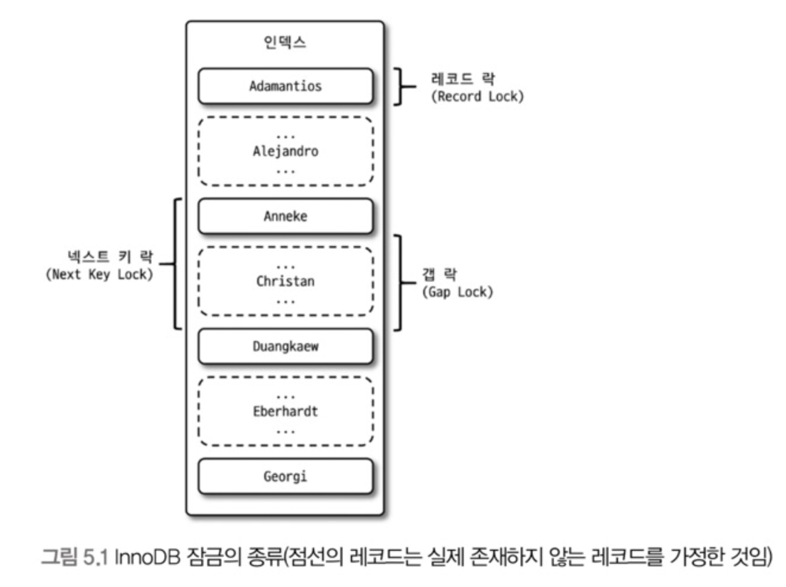

InnoDB 스토리지 엔진은 레코드 락뿐만 아니라
레코드와 레코드 사이의 간격을 잠그는 갭(GAP) 락이라는 것도 존재

### 5.3.1.1 레코드 락 (Record Lock)

레코드 자체만을 잠그는 것을 레코드 락이라고 한다.

다른 DBMS와는 다르게 레코드 자체가 아니라, **인덱스의 레코드를 잠근다**.
레코드 자체를 잠그는 것과 인덱스를 잠그는 것은 상당히 크고 중요한 차이를 만들어낸다.

- 인덱스를 하나도 생성하지 않은 테이블이라도 내부적으로 자동 생성된 클러스터 인덱스를 이용해 잠금을 설정

**프라이머리 키 또는 유니크 인덱스에 의한 변경 작업** 에서는 `레코드 락(Record Lock)` 사용

**보조 인덱스를 이용한 변경 작업** 은 이어서 설명할 `넥스트 키 락(Next Key Lock)` 또는 `갭 락(Gap Lock)`을 사용

### 5.3.1.2 갭 락

다른 DBMS와 또 다른 차이로 갭 락(Gap Lock)이 있다.

갭 락은 레코드와 바로 인접한 레코드 사이의 간격만을 잠그는 것을 의미한다.

갭 락을 사용하면 레코드와 레코드 사이 간격에  새로운 레코드가 생성(INSERT) 되는 것을 제어한다.

> 갭 락 그 자체보다는 이후 이어서 설명할 넥스트 키 락이 주로 사용된다.
> 

### 5.3.1.3 넥스트 키 락

레코드 락과 갭 락을 합쳐놓은 형태의 잠금이다.

STATEMENT 포멧의 바이너리 로그를 사용하는 MySQL 서버에서는 REPEATABLE READ 격리 수준을 사용해야 한다.

<aside>
🚀 **STATEMENT 포멧이란?**

</aside>

또한 **innodb_locks_unsafe_for_binlog** 시스템 변수가 비활성화되면(0으로 설정되면) 변경을 위해 검색하는 레코드에는 넥스트 키 락이 걸린다.

### 사용 목적

갭 락이나 넥스트 키 락은 모두 바이너리 로그에 기록되는 쿼리가 래플리카 서버에서 실행될 때 소스 서버에서 만들어낸 결과와 동일한 결과를 만들어내도록 보장하는 것이 주목적

그런데 의외로 이 두 락으로 인해 데드락이 발생하거나, 다른 트랜잭션을 기다리게 만드는 일이 자주 발생하니,
가능하면 바이너리 로그 포맷을 ROW 형태로 바꿔서 넥스트 키 락이나 갭 락을 줄이는 것이 좋다.

<aside>
📃 **[ROW 포맷 바이너리 로그는 8.0의 기본설정이다]**

5.5 버전까지는 ROW 포맷 바이너리 로그가 도입된 지 오래되지 않아 잘 사용되지 않았지만
5.7 8.0 버전으로 업그레이드 되면서 안정성이 높아졌고
STATEMENT 포맷의 바이너리 로그가 가지는 단점을 많이 해소해주어
8.0에서느 기본 설정으로 변경되었다.

</aside>

<aside>
🚀 **바이너리 로그란?**

</aside>

<aside>
🚀 **바이너리 로그 포맷을 ROW 형태로 바꾸면 왜 넥스트 키 락이나 갭 락이 줄어들지?**

</aside>

### 5.3.1.4 자동 증가 락

MySQL은 자동 증가하는 숫자 값 추출(채번)을 하기 위해 AUTO_INCREMENT 라는 칼럼 속성을 제공한다.

AUTO_INCREMENT 칼럼이 설정된 테이블에 여러 데이터가 동시 INSERT 되는 경우
각 레코드는 중복되지 않고 저장 순서대로 증가하는 일련번호 값을 가진다.

InnoDB 스토리지 엔진은 이를 위해 내부적으로
테이블 수준의 락인 **AUTO_INCREMENT 락**을 건다.

### MySQL 5.0 이전 버전 (자동 증가 락 방식)

INSERT, REPLACE 쿼리에서만 해당 락이 걸리며  UPDATE, DELETE 등의 쿼리에서는 걸리지 않으며
트랜잭션과 상관없이 INSERT, REPLACE 문장에서 채번 값을 가져오는 순간에만 락이 걸렸다 즉시 해제된다.

AUTO_INCREMENT 컬럼에 값을 명시적으로 설정해도 자동으로 증가 락이 걸린다.

AUTO_INCREMENT 락을 명시적으로 흭득, 해제 하는 방법은 없다. (아주 짧은 시간동안 걸리는 락이기에 문제되는 경우는 거의 없다)

### MySQL 5.1 이후 버전 (뮤택스 도입)

5.1 이상부터는 `innodb_autoinc_lock_mode` 라는 시스템 변수와 `뮤택스` 의 도입을 통해 자동 증가 락의 작동 방식을 변경할 수 있다.

- **innodb_autoinc_lock_mode=0 (Traditional)**
    - 5.0 버전과 동일한 방식으로 모든 INSERT 문장은 자동 증가 락을 사용
- **innodb_autoinc_lock_mode=1 (Consecutive mode)**
    - MySQL서버가 쿼리 실행 전 INSERT 되는 레코드의 건수를 정확히 예측할 수 있을 때는 자동 증가 락(Auto increment lock)을 사용하지 않고, 훨씬 잠금 시간이 짧고 가벼운 래치(뮤택스)를 이용해서 처리한다.
    - MySQL서버가 `INSERT ... SELECT` 쿼리와 같이 쿼리 실행 전 INSERT 되는 레코드의 건수를 정확히 예측할 수 없을 때는 5.0 버전의 자동 증가 락을 사용한다.
        - 하지만 자동 증가 락은 다수의 레코드가 INSERT 되기 전까지 다른 커넥션에서 INSERT를 수행하지 못하기 때문에
        대량 INSERT 시에는 여러 개의 자동 증가 값을 한 번에 할당받아서 INSERT 레코드에 사용한다.
        - 한 번에 할당받은 자동 증가 값이 남아서 사용 못하면 폐기하므로 대량 INSERT 문장 실행 이후 INSERT 되는 레코드의 자동 증가 값은 연속되지 않고 누락되는 경우가 발생할 수 있다.
    - 이 설정에선 최소한 하나의 INSERT 문장으로 INSERT되는 레코드들은 연속된 자동 증가 값을 가지게 되므로, 이 설정을 `연속 모드` 라고도 한다.
- **innodb_autoinc_lock_mode=2 (Interleaved mode)**
    - InnoDB 스토리지 엔진은 절대 자동 증가 락을 걸지 않고 경량화된 래치(뮤택스)를 사용
    - 이 설정에선 하나의 INSERT 문장으로 INSERT되는 레코드라고 하더라도 연속된 자동 증가 값을 보장하지 않는다.
    - `INSERT ... SELECT` 같이대량 INSERT 문장이 실행되는 중에도 다른 커넥션에서 INSERT를 수행할 수 있으므로 `동시 처리 성능` 이 높아진다.
        - 하지만 이 설정에서 자동 증가 기능은 유니크한 값이 생성된다는 것만 보장하며
        STATEMENT 포맷의 바이너리 로그를 사용하는 복제에서는 소스 서버와 래플리카 서버의 자동 증가 값이 달라질 수도 있기 때문에 주의해야한다.

<aside>
🚀 **INSERT … SELECT 쿼리란?**

`INSERT ... SELECT`는 SQL에서 데이터를 한 테이블에서 다른 테이블로 복사하는 데 사용되는 명령어이다. 이 구문은 주로 데이터를 효율적으로 이동하거나 복사할 때 사용되며, 한 번의 쿼리로 여러 행을 삽입할 수 있다.

</aside>

<aside>
📃 MySQL 5.7 까지는 innodb_autoinc_lock_mode 기본 값이 1이었다.
하지만 8.0 부터는 기본값이 2로 바뀌었다.

이는 바이너리 로그 포맷의 Default 값이 STATEMENT에서 ROW 포맷으로 변경되었기 때문이다.

</aside>

## 5.3.2 인덱스와 잠금

MySQL의 InnoDB 스토리지 엔진은 특이하게도 레코드 잠금이 아니라 인덱스 잠금이다.

때문에 InnoDB를 사용할 때는 인덱스 설계가 굉장히 중요하다.

왜인지는 아래 예제를 통해 살펴보자

### 예제 - 인덱스 설계의 중요성

`employees` 테이블이 있다.

employees 테이블은 first_name 칼럼만 멤버로 담긴 ix_firstname이라는 인덱스가 준비되어 있다.

employees 테이블에서 first_name=’Georgi’인 사원은 `253명` 있으며
first_name=’Georgi’이고 last_name=’Klassen’인 사원은 단 `1명` 있다.

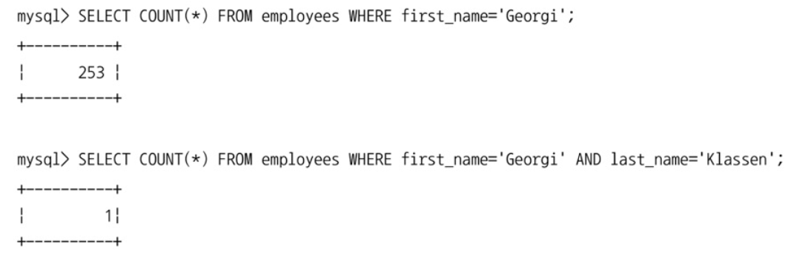

```sql
UPDATE employees SET hire_date=NOW() WHERE first_name=’Georgi’ AND last_name=’Klassen’;
```

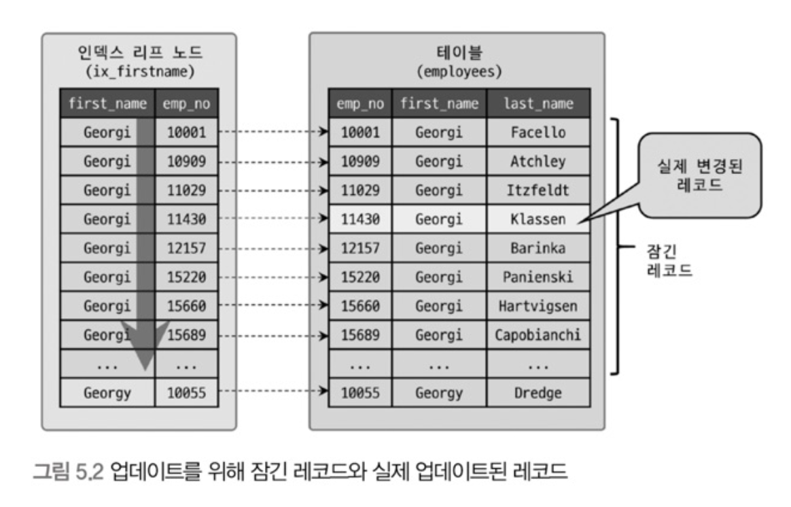

이때 만약 first_name=’Georgi’이고 last_name=’Klassen’인 사원의 입사일자를 오늘로 변경하는 쿼리를 날리면
InnoDB의 특징에 의해 first_name에 대한 인덱스를 조회하게 되고,
이에 따라 *first_name이 ‘Georgi’ 인 사원들의 레코드 253개가 모두 잠금 상태가 된다.*

만약 이때 인덱스가 존재하지 않고 데이터가 30여만건이 존재했다면,
30여만건에 대해 모두 잠금이 걸려 동시 요청에 대한 성능이 굉장히 떨어진다.

이것이 바로 InnoDB 사용 시, 인덱스 설계가 중요한 이유이다.

<aside>
💡 토미가 DB 수업 중에 MySQL에서 인덱스는 무조건적으로 설정해야한다고 했던 이유가
단순히 인덱스를 통한 조회 속도 향상뿐만이 아니라
인덱스 설정을 통한 동시처리 성능 향상도 있겠구나 싶었다.

</aside>

## 5.3.3 레코드 수준의 잠금 확인 및 해제

레코드 잠금은 단순한 구조인 테이블 잠금보다 고려할 사항이 더 많고 복잡한 잠금이다.

> 데이터 전체가 잠기는 테이블 잠금에 비해 레코드 잠금은 특정 레코드만 잠겨 잘 사용하지 않는 데이터가 오랫동안 잠금되어 있어도 발견하기 어렵다.
> 

예전의 MySQL은 레코드 잠금에 대한 메타 정보(딕셔너리 테이블)을 제공하지 않아 굉장히 복잡했지만
5.1버전부터는 레코드 잠금, 잠금 대기에 대한 조회가 가능

그리고 5.1과 8.0 버전은 그 확인법이 조금 다른데 8.0 기준으로 알아보자

### MySQL 8.0 부터의 레코드 잠금 확인

**performance_schema**의 `data_locks` , `data_lock_waits` 테이블에서 확인 가능

> 원래 이전 버전에서는 `information_scheme` 를 사용했는데 8.0버전부터는 조금씩 **Deprecated** 되고 `data_locks` , `data_lock_watis` 로 대체되고 있다.
> 

### 예제

아래 예제를 통해 레코드 잠금 확인에 대해 알아보자

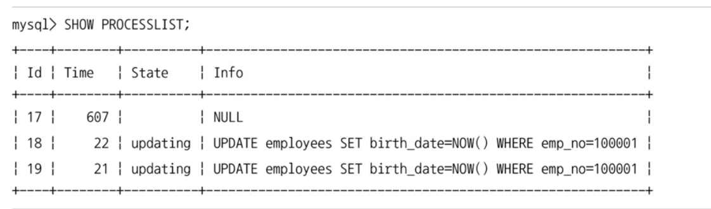

다음은 프로세스 리스트를 출력한 결과이다. (필요한 부분만 캡쳐된)

- 17번 쓰레드는 `UPDATE employees SET birth_date=NOW() WHERE emp_no=100001` 이 실행된 후 COMMIT되기 전 상태
- 18번 쓰레드는 17번 쓰레드 다음으로 동일한 작업을 대기중
- 19번 쓰레드는 18번 쓰레드 다음으로 동일한 작업을 대기중

이에 대한 잠금 순서를 확인하기 위해 `performance_schema` 의 `data_lock_waits` 테이블과 `information_schema` 의 `innodb_trx` 를 조인해서 잠금 대기 순서를 조회해보자

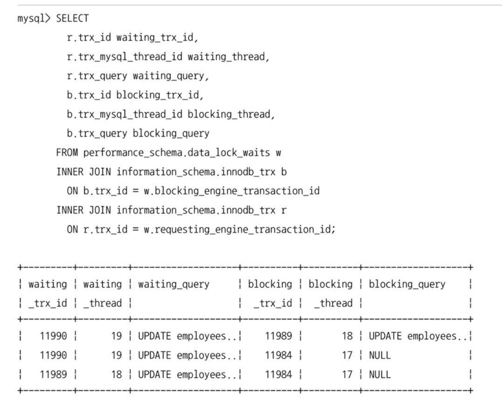

- 18번 쓰레드는 17번 쓰레드의 작업이 끝나 Lock을 흭득하기를 기다리고 있다.
- 19번 쓰레드는 17번 쓰레드와 18번 쓰레드의 작업이 끝나 Lock을 흭득하기를 기다리고 있다.

만약 여기서 이 정보보다 더 상세한 정보를 얻고 싶다면
`performance_schema` 의 `data_locks` 테이블이 가진 컬럼을 살펴보면 된다.

```sql
SELECT * FROM performance_schema.data_locks\G
```

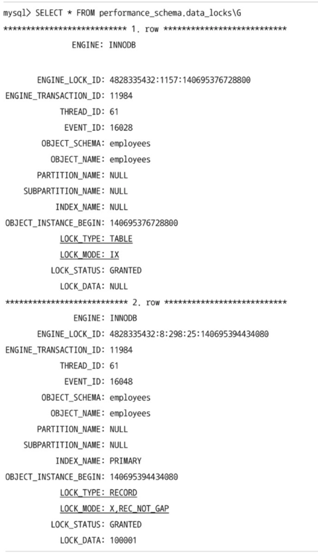

위 내용을 통해 `employees` 테이블에 대해

- IX 잠금(Intentional Exclusive) 을 가지고 있음
- 특정 레코드에 대해 쓰기 잠금을 가짐
- REC_NOT_GAP 이므로 갭 잠금이 포함되지 않음 등의 세부 정보를 흭득 가능

<aside>
🚀 **\G 옵션이 뭐지?**

`\G`는 MySQL의 커맨드 라인 클라이언트에서 사용하는 옵션으로, 결과를 수직 형식으로 출력하는 역할

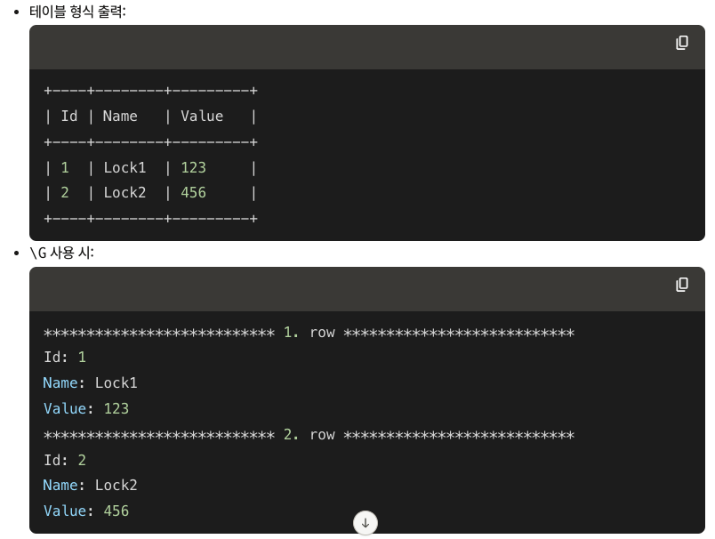

</aside>

여기서 17번 쓰레드가 잠금을 가진 상태로 멈춘다면, 다음 명령을 통해 강제 종료가 가능

```sql
KILL 17;
```

# 5.4 MySQL의 격리 수준 (Isolation level)

트랜잭션 격리 수준: 여러 트랜잭션이 동시에 처리될 때 특정 트랜잭션이 다른 트랜잭션에서 변경하거나 조회하는 볼 수 있게 허용할지 말지를 설정하는 것

격리 수준은 크게 4가지로 나뉜다.

- READ UNCOMMITED (DIRTY READ)
- READ COMMITED
- REPEATABLE READ
- SERIALIZABLE

> 격리 수준은 위에서 아래로 갈 수록 트랜잭션 간 데이터 격리 정도가 높아지고, 동시 처리 성능이 저하된다. (하지만 사실상 SERIALIZABLE 외에는 크게 성능 저하가 발생하지 않는다.)
> 

일반적인 온라인 서비스의 경우 `READ COMMITED` 또는 `REPEATABLE READ` 수준을 사용한다.

### InnoDB는 PHANTOM READ가 발생하지 않는다


원래 REPEATABLE READ 격리 수준은 PHANTOM READ라는 문제가 발생하지만,
InnoDB는 독특한 특성에 의해 해당 문제가 발생하지 않는다.

## 5.4.1 READ UNCOMMITED

트랜잭션에서 커밋되지 않은 변경사항이 다른 트랜잭션에서 보이는 격리 수준

### 예제

아래는 READ UNCOMMITED 격리 수준의 예제이다.

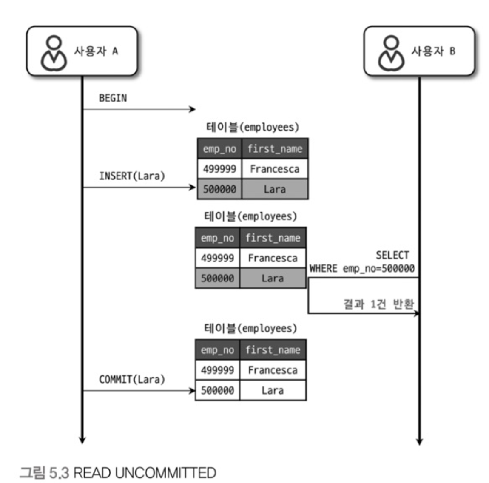

- 사용자 A의 트랜잭션에서 ID가 500000인 Lara 직원을 추가했다.
- 이때 사용자 B의 트랜잭션에서는 아직 Commit되지 않은 Lara의 정보를 조회할 수 있다.

### 문제점 (Dirty Read)

이때 만약 사용자 A가 트랜잭션을 롤백(Rollback)하게 된다면
사용자 B는 조회되던 데이터가 갑자기 조회되지 않는 문제가 발생하게 된다.

이처럼 데이터가 나타났다 사라졌다 하는 현상이 **더티 리드(Dirty Read)** 이다.

이러한 문제에 의해 RDBMS 표준에서는 격리 수준으로 인정하지 않을 정도로 정합성에 문제가 있는 수준이다.

MySQL에서는 최소한 `READ COMMITED` 수준 사용을 권장한다.

---

## 5.4.2 READ COMMITED

트랜잭션에서 커밋이 완료된 변경사항만 다른 트랜잭션에서 보이는 격리 수준

### 예제

아래는 사용자A가 ID가 500000인 Lara 사원의 이름을 Toto로 바꾸는 예제이다.

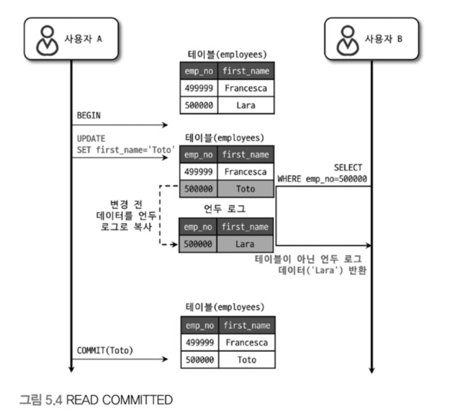

- 사용자A의 트랜잭션에서 ID가 500000인 Lara 사원의 이름을 Toto로 변경
    - 변경 사항은 테이블에 즉시 기록되고, 변경 전 데이터는 **언두 영역** 에 백업
- 사용자B의 트랜잭션에서 ID가 500000인 사원을 조회하고 Lara라는 이름을 조회
    - 사용자A의 트랜잭션이 커밋되지 않았기에 테이블이 아닌 **언두 영역** 에서 조회한 것
- 이후 사용자A가 트랜잭션을 커밋하면 그 후로는 Lara가 아니라 Tota라는 이름으로 조회

### 문제점 (NON-REPEATABLE READ)

`READ COMMITED` 수준은 얼핏보면 모든 문제를 해결해줄 것 같지만 사실 그렇지 않다.

이는 `NON-REPEATABLE READ` 라는 **데이터 부정합 문제** 를 일으킨다.

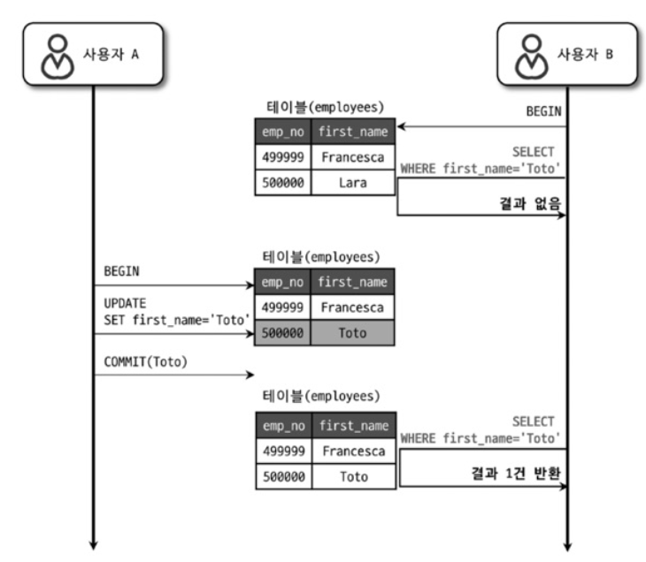

이 사진을 통해 알 수 있듯이 해당 격리 수준에서는
이전에는 조회되지 않던 데이터가 사용자A의 트랜잭션 커밋 이후로 조회되게 된다.

이는 별 문제가 없어보이지만
하나의 트랜잭션 내에서 똑같은 SELECT 쿼리를 실행했을 때 항상 같은 결과를 가져와야 한다는 **REPEATABLE READ 정합성** 에 어긋나는 것

이러한 문제로 인해서 데이터의 정합성이 깨지고, 그로 인해 애플리케이션에 버그가 발생하면 찾아내기 쉽지 않다.

---

## 5.4.3 REPEATABLE READ

하나의 트랜잭션 내에서 항상 같은 조회 결과를 보여주는 격리 수준

> MySQL InnoDB의 Default 설정
> 

InnoDB 스토리지 엔진은 트랜잭션 롤백에 대비해 변경되지 전 레코드를 언두(Undo) 공간에 백업해두고 실제 레코드 값을 변경하는 MVCC 방식을 사용

`REPEATABLE READ` 는 MVCC를 위해 존재하는 언두 공간에 백업된 이전 데이터를 이용해 동일 트랜잭션 내에서는 동일한 결과를 보여줄 수 있도록 보장

### READ COMMITED와 차이점

READ COMMITED도 MVCC를 이용해 커밋되기 전 데이터를 보여주지만
언두 영역에 백업된 레코드의 여러 버전 가운데 몇 번째 이전까지 찾아 들어가야 하느냐에 차이가 있다.

- 트랜잭션은 고유한 트랜잭션 번호(순차적으로 증가하는) 값을 가짐
- 언두 영역에 백업된 모든 레코드에는 변경 발생 트랜잭션 번호가 포함
- 언두 영역의 백업된 데이터는 InnoDB 스토리지 엔진이 불필요하다고 판단한 시점에 주기적으로 삭제
- REPEATABLE READ 격리 수준에서는 MVCC를 보장하기 위해 실행 중인 트랜잭션 가운데 가장 오래된 트랜잭션 번호보다 트랜잭션 번호가 앞선 언두 영역의 데이터는 삭제 불가능
    - 정확히 말해서 트랜잭션 번호의 구간 내에서 백업된 언두 데이터가 보존됨

### 예제

아래는 사용자 A가 emp_no가 500000인 사원의 이름을 변경하는 과정에서 사용자 B가 emp_no=50000인 사원을 SELECT 할 때 어떤 과정을 거쳐서 처리되는지
`REPEATABLE READ` 격리 수준의 작동 방식과 함께 설명한 예제이다.

- 먼저 예제의 앞 상황에서 6번 트랜잭션에 의해 Francesca, Lara 데이터가 INSERT된 상태이다.

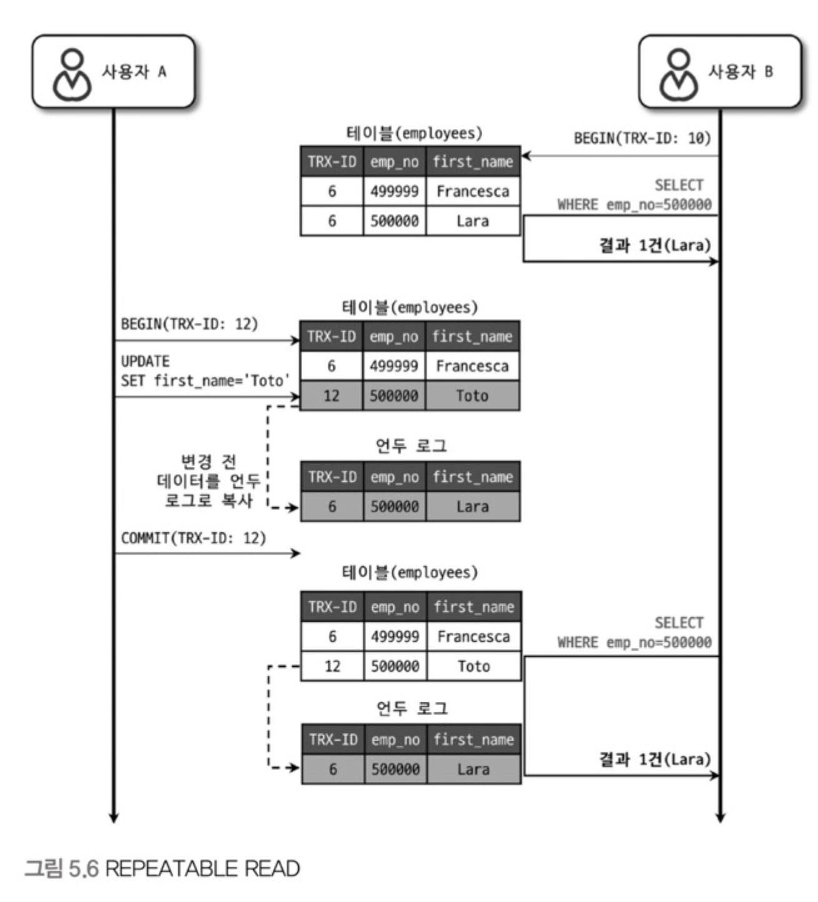

- 사용자B의 트랜잭션에서 emp_no가 500000인 사원의 이름을 조회하고 ‘Lara’ 라는 결과를 얻는다.
- 사용자A의 트랜잭션의 emp_no가 500000인 사원의 이름을 Tota로 업데이트하고 커밋한다.
    - 이때 언두 영역에 TRX-ID 6 의 정보가 백업된다.
- 사용자B는 A의 트랜잭션 커밋 이후 또다시 emp_no가 500000인 사원의 이름을 조회하고 ‘Lara’ 라는 결과를 얻는다.

이렇게 반복적으로 같은 값이 조회되는 것을 보장받을 수 있는 이유는 간단하다.

위에서 말했듯 트랜잭션은 순차적인 고유 번호를 받게 되는데
REPEATABLE READ 격리수준에서는 자신의 트랜잭션 번호 보다 낮은 트랜잭션 번호에서 변경한 것만 보이기 때문이다.

그래서 TRX-ID가 10인 B의 트랜잭션은 TRX-ID가 12인 사용자 A의 변경 사항을 조회하지 않고
언두 영역에서 가장 마지막으로 해당 레코드에 변경이 있던 TRX-ID 6의 변경사항을 조회한 것이다.

### 문제점 (PHANTOM READ)

REPEATABLE READ 에서도 PHANTOM READ라는 데이터 부정합 문제가 발생할 수 있다.

아래 예시는 사용자A 가 **employees** 테이블에 INSERT를 실행하는 도중
사용자 B가 `SELECT … FOR UPDATE` 쿼리로 **employees** 테이블을 조회한 경우이다.

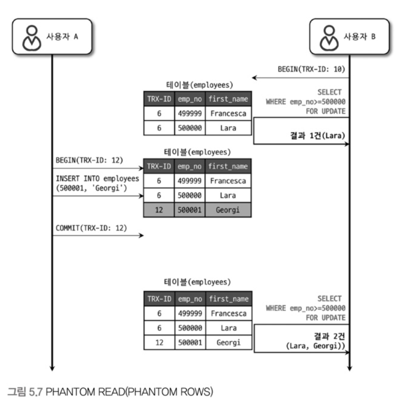

MVCC가 있기 때문에 문제가 발생할 상황이 아닌 것 같지만
`SELECT … FOR UPDATE` 나 `SELECT … LOOK IN SHARE MODE` 쿼리는 레코드에 쓰기 잠금을 걸어야하는데 언두 레코드에는 잠금을 걸 수 없다.

때문에 위 두 쿼리로 조회되는 레코드는
언두 영역의 변경 전 데이터를 가져오는 것이 아니라 현재 레코드의 값을 가져오기 때문에 문제가 발생한다.

이로 인해 하나의 트랜잭션에서는 조회 결과가 모두 같아야하는 데이터 정합성이 깨지고
레코드가 보였다 안보였다 하는 현상이 발생하는데 이를 `PHANTOM READ` 현상이라고 한다.

---

## 5.4.4 SERIALIZABLE

한 트랜잭션에서 읽고 쓰는 레코드를 다른 트랜잭션에서는 절대 접근할 수 없도록 하는 격리 수준

InnoDB 테이블에서는 기본적으로 순수한 조회 작업(INSERT … SELECT, CREATE TABLE … AS SELECT … 가 아닌)은 아무런 레코드 잠금도 설정하지 않는다.

> Non-locking consistent read(잠금이 필요 없는 일관된 읽기)
> 

하지만 SERIALIZABLE 격리 수준으로 설정되면 읽기 작업도 공유 잠금(S-Lock, 읽기 잠금)을 흭득해야하며
다른 트랜잭션은 그 레코드에 접근할 수 없게 된다.

SERIALIZABLE은 일반적인 DBMS에서 일어나는 PHANTOM READ 문제가 발생하지 않는다.

> 하지만 InnoDB 스토리지 엔진에서는 **갭 락** 과 **넥스트 키 락** 덕분에 REPEATABLE READ 격리 수준에서도 이미 해당 문제가 발생하지 않기 때문에 굳이 사용할 필요는 없는 격리 수준이다.
> 

### 문제점

- 동시 처리 성능 저하
