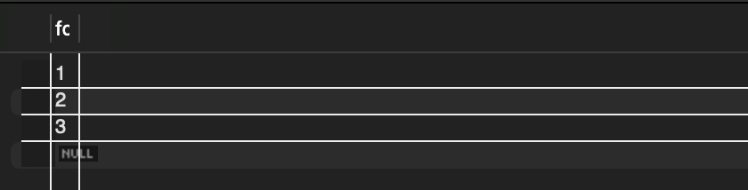

# 5장 트랜잭션과 잠금

- **트랜잭션**은 작업의 완전성을 보장해 주는 것이다.
- 작업 셋을 모두 완벽하게 처리되거나, 처리하지 못했을 때는 작업을 모두 원상태로 복구하게 만들어주는 기능이다.
    - 작업 일부분만 적용되는 현상(Partial update)이 발생하지 않게 만들어주는 기능이다.
- 잠금과 트랜잭션은 비슷해보이지만 다르다.
    - 잠금은 동시성을 제어하기 위한 기능
    - **트랜잭션은 데이터의 정합성을 보장하기 위한 기능**
- **격리 수준**이라는 것은 하나의 트랜잭션 내에세 또는 여러 트랜잭션 간의 작업 내용을 어떻게 공유하고 차단할지 결정하는 레벨을 의미한다.

# 5.1 트랜잭션

## 5.1.1 MySQL에서의 트랜잭션

- 트랜잭션은 꼭 여러 쿼리가 있을 때만 의미 있는 개념이 아니다.
- 하나의 쿼리가 있든 두 개 이상의 쿼리가 있든 관계 없이 논리적인 작업 셋 자체가 원자성을 보장해준다.
- 트랜잭션이 있는 InnoDB 테이블과 트랜잭션을 제공하지 않는 MyISAM테이블의 차이를 살펴보자.
    
    ```sql
    // MyISAM 테이블 생성 및 데이터 넣기
    CREATE TABLE tab_myisam (fdpk INT NOT NULL, PRIMARY KEY(fdpk)) ENGINE=MyISAM;
    INSERT INTO tab_myisam (fdpk) VALUES (3);
    
    // InnoDB 테이블 생성 및 데이터 넣기
    CREATE TABLE tab_innodb (fdpk INT NOT NULL, PRIMARY KEY(fdpk)) ENGINE=INNODB;
    INSERT INTO tab_innodb (fdpk) VALUES (3);
    
    // AUTO-COMMIT 활성화
    SET autocommit=ON;
    
    // 두 작업 모두 에러 발생
    INSERT INTO tab_myisam VALUES (1), (2), (3);
    INSERT INTO tab_innodb VALUES (1), (2), (3);
    ```
    
    - 위 작업을 하면 마지막 INSERT 문에서 둘 다 에러가 발생한다.
    - 두 개의 스토리지 엔진에서 결과가 어떻게 다를지 확인해보자.
        - MyISAM 테이블 - `SELECT * FROM tab_myisam;`
        
        
        
        - InnoDB 테이블 - `SELECT * FROM tab_myisam;`
        
        
        
    - 오류가 발생했음에도 MyISAM 테이블은 ‘1’, ‘2’ 가 INSERT 된 것을 볼 수 있다. 즉 ‘1’, ‘2’는 저장하고 ‘3’을 저장하려는 순간 오류가 발생한 것이다.
    - 하지만 이미 앞서 INSERT 된 ‘1’ , ‘2’ 를 그대로 두고 쿼리 실행을 종료해버린다.
        - MEMORY 스토리지 엔진도 마찬가지이다.
    - 반면 InnoDB는 트랜잭션의 원칙대로 INSERT 문장을 실행하기 전 상태로 그대로 복구한다.
- 이와 같이 트랜잭션이 없는 경우 부분 업데이트 현상이 발생할 수 있다.
- 부분 업데이트가 가능하다면 에러 발생시 재처리 작업을 해줘야해서 여간 까다로운 것이 아니다.
    
    
    
    - 위와 같이 에러 발생시 쓰레기 데이터가 테이블에 남지 않도록 지워주는 재처리 작업을 해줘야한다.
- 트랜잭션을 사용하면 아래와 같이 매우 깔끔하게 작성할 수 있게 되는 것이다.
    
    
    

## 5.1.2 주의사항

- 트랜잭션 작업의 단위는 최대한 짧게 가져가는 것이 중요하다.
    - 트랜잭션 작업 단위가 길다는 것은 그만큼 커넥션을 소유하고 있는 시간이 길다는 것은 여유 커넥션의 개수를 줄어든다는 것을 의미한다.
- 조회 작업 같은 경우 트랜잭션이 필요 없을
- 네트워크 작업이 있거나 외부 서버와 통신하는 작업의 경우는 반드시 트랜잭션에서 배제해야한다.
    - 외부 서버와 통신할 수 없는 상황이 발생하면 웹 서버 뿐만 아니라 DBMS 서버까지 위험해질 수 있다.

# 5.2 MySQL 엔진의 잠금

- MySQL에서 사용되는 락은 크게 2가지 레벨로 나뉜다.
    - **MySQL 엔진 레벨 잠금**
        - 스토리지 엔진을 제외한 나머지 부분
        - 모든 스토리지 엔진에 영향을 미친다.
    - **스토리지 엔진 레벨 잠금**
        - 스토리지 엔진 레벨 잠금은 스토리지 엔진 간 상호 영향을 미치지 않는다.
- MySQL 엔진에서는 제공하는 락
    - 테이블 동기화를 위한 테이블 락
    - 테이블 구조를 잠그는 메타데이터 락(Metadata Lock)
    - 사용자의 필요에 맞게 사용할 수 있는 네임드 락(Named Lock)

## 5.2.1 글로벌 락

- MySQL 잠금 가운데 가장 큰 범위의 락이다.
- `FLUSH TABLES WITH READ LOCK` 명령으로 획득한다.
- 한 세션이 글로벌 락을 획득하면 다른 세션은 SELECT를 제외한 대부분의 DDL, DML 문장을 실행하는 경우 글로벌 락이 해제될 때 까지 대기 상태로 남는다.
- 글로벌 락의 영향 범위는 MySQL 서버 전체이며, 작업 대상의 테이블이나 데이터베이스가 달라도 동일하게 영향을 받는다.
- 여러 데이터베이스가 존재하는 MyISAM 이나 MEMORY 테이블에 대해 mysqldump로 일관된 백업을 받아야 할 때 글로벌 락을 사용해야한다.
- `FLUSH TABLES WITH READ LOCK` 명령 실행과 동시에 MySQL 서버에 존재하는 모든 테이블을 닫고 잠금을 건다.
- 만약 글로벌 락 명령어 이전에 레코드나 테이블에 락을 걸고 사용하는 SQL이 실행 됐다면 먼저 실행된 SQL과 트랜잭션이 완료될 때 까지 기다려야한다.
- `FLUSH TABLES WITH READ LOCK` 명령은 테이블에 읽기 잠금을 걸기 전에 먼저 테이블을 플러시해야 하기 때문에 테이블에 실행 중인 모든 종류의  쿼리가 완료돼야 한다.
    - 그래서 작업 대기가 생각보다 오래 걸릴 수도 있다.
    - “테이블을 플러시 한다”라는 말은 테이블의 데이터를 디스크에 강제로 기록하고 메모리에 있는 캐시나 버퍼에 저장된 변경 사항들을 초기화한다는 말이다. 주로 DB의 데이터 일관성을 유지하고자 할 때나 특수한 상황에 수행한다.
- 해당 글로벌락은 모든 테이블에 큰 영향을 미치기 때문에 서비스용으로 사용되는 MySQL 서버에서는 가급적 사용하지 않는 것이 좋다.
- mysqldump 같은 백업 프로그램은 우리가 모르는 사리에 내부적으로 실행하고 백업할 때도 있다. 따라서 mysqldump에서 어떤 잠금을 걸게 되는지 자세히 확인해보는것이 좋다.

- InnoDB 스토리지 엔진은 트랜잭션을 지원하기 때문에 일관된 데이터 상태를 위해 모든 데이터 변경 작업을 멈출 필요는 없다.
    - *왜지? 백업도 트랜잭션으로 동작하면 되기 때문에?*
- InnoDB가 기본 스토리지 엔진으로 채택되면서 좀 더 가벼운 글로벌 락의 필요성이 생겼다.
    - 트랜잭션을 지원해 모든 작업을 멈출 필요가 없기 떄문
- 또한 MySQL 8.0 부터는 Xtrabackup 이나 Enterprise Backup과 같은 백업 툴들의 안정적인 실행을 위해 **백업 락**이 도입됐다.
    
    ```sql
    LOCK INSTANCE FOR BACKUP;
    
    -- 백업 실행
    
    UNLOCK INSTANCE;
    ```
    
- 특정 세션에서 백업 락을 획득하면 모든 세션에서 다음과 같은 테이블의 **스키마**나 **사용자의 인증 관련 정보**를 변경할 수 없게 된다.
    - 데이터베이스 및 테이블 등 모든 객체 생성 및 변경 삭제
    - REPAIR TABLE 과 OPTIMIZE TABLE 명령
    - 사용자 관리 및 비밀번호 변경
- 백업 락은 일반적인 테이블의 데이터 변경을 허용한다.
- 일반적인 MySQL 서버는 소스 서버(Source server)와 레플리카 서버(Replica server)로 구성된다.
- 주로 백업은 레플리카 서버에서 실행된다.
- 백업이 글로벌 락을 획득하면 복제는 백업 시간만큼 지연될 수 밖에 없다.
    - *왜 갑자기 복제 얘기가 나오는거야?*
    - *레플리카 서버는 매번 복제 작업을 하는거야?*
- 레플리카 서버에서 백업을 실행하는 도중에 소스 서버에 문제가 생기면 레플리카 서버의 데이터가 최신 상태가 될 때 까지 서비스를 멈춰야 할 수 있다.
    - *레플리카에서 백업을 하는 동안 소스 서버에 문제가 생기면 레플리카 백업 작업이 완료될 떄 까지 서비스를 멈춰야한다는 말이야?*
- 백업 락은 정상적으로 복제는 실행되지만 백업의 실패를 막기 위해 DDL(INSERT, UPDATE..) 명령이 실행되면 복제를 일시 중지하는 역할을 한다.
    - *왜 자꾸 복제 얘기가 나오는거야? 레플리카 서버에서 주로 백업을 하는데 레플리카 서버에서는 복제 작업을 주기적으로 하는거야? 그래서 복제 작업을 하다가 백업을 실패하는 경우가 발생해서 백업 락이 도입되었다 라는 것을 얘기하고 싶은건가?*

## 5.2.2 테이블 락

- **테이블 락(Table Lcok)**은 개별 레코드 단위로 설정되는 잠금이다.
- 명시적 테이블 락과 묵시적 테이블 락이 있다.
- **명시적 테이블 락**
    - `LCOK TABLES table_name [ READ | WRITE]` 명령으로 락을 건다
    - `UNLOCK TABLES` 명령으로 잠금을 반납한다.
    - 특별한 상황이 아니면 애플리케이션에서 사용할 필요가 거의 없다.
    - 글로벌 락과 동일하게 온라인 작업에 상당한 영향을 미친다.
- 묵시적 테이블 락
    - MyISAM 이나 MEMORY 테이블에 데이터를 변경하는 쿼리를 실행하면 발생한다.
    - MySQL 서버가 해당 테이블 잠금을 설정하고 데이터 변경 이후 즉시 잠금을 해제한다.
    - 즉, 묵시적 테이블 락은 쿼리가 실행되는 동안 자동으로 획득했다가 쿼리가 완료된 후 자동 해제한다.
    - InnoDB 테이블의 경우 스토리지 엔진 차원에서 레코드 기반의 잠금을 제공하기 때문에 단순 데이터 변경 쿼리로 인해 묵시적인 테이블 락이 설정되지 않는다.
        - *뭔솔?? 스토리지 엔진 차원에서 레코드 기반 잠금을 제공한다는 말은 무슨 말이고 이게 왜 락이 설정되지 않는 이유가 되는거야? → InnoDB 스토리지 엔진은 레코드 레벨 락을 제공해주고 있다. 그래서 데이터 변경 시 테이블 락을 걸지 않고 레코드 락을 사용하면 된다.*
    - 더 정확히는 InnoDB 테이블에도 테이블 락이 설정되지만 대부분의 데이터 변경(DML) 쿼리는 무시되고 스키마를 변경하는 쿼리(DDL)의 경우에만 영향을 미친다.
        - *영향을 미친다는 것은 잠금이 된다는 거야?*

## 5.2.3 네임드 락

- `GET_LOCK()` 함수를 이용해 임의의 문자열에 대한 잠금을 설정하는 락을 말한다.
- 단순히 사용자가 지정한 문자열에 대해 잠금을 획득하고 반납한다.
- 자주 사용되지는 않는다.
- 여러 클라이언트가 상호 동기화를 처리해야할 때나 많은 레코드에 대해서 복잡한 요건으로 레코드를 변경하는 트랜잭션에서 유용하게 사용된다.
    
    ```sql
    // "myLock"이라는 문자열에 대한 잠금을 획득한다.
    // 이미 잠금을 사용 중이면 2초 동안만 대기한다.
    SELECT GET_LOCK('myLock', 2);
    
    // "myLock"이라는 문자열에 대한 잠금이 설정돼 있는지 확인한다.
    SELECT IS_FREE_LOCK('myLock');
    
    // "myLock"이라는 문자열에 대한 잠금을 반납한다.
    SELECT RELEASE_LOCK('myLock');
    ```
    
    - 1 : 정상적으로 락을 획득하거나 반납한 경우
    -  or NULL : 아닌 경우
    - *문자열에 대해서 락을 왜 획득하지? 아직 잘 모르겠음 → 문자열을 락을 가지고 있는지 유무를 통해 분기 처리해줄 수 있음*
    - *락을 획득해도 잠금이 설정되어 있지 않는 것 같은데? IS_FREE_LOCK 해도  나옴*
- 배치 프로그램처럼 한 번에 많은 레코드를 변경하는 쿼리는 자주 데드락의 원인이 된다.
- 이런 경우 동일한 데이터를 변경하거나 참조하는 프로그램끼리 분류해서 네임드 락을 걸고 쿼리를 실행하면 아주 간단히 해결할 수 있다.
    - *뭔 소린지 이해가 안됨..*
- MySQL 8.0부터는 한 세션에서 네임드 락을 여러번 사용할 수 있게 됐으며, 현재 세션에서 획득한 네임드 락을 한 번에 모두 해제하는 기능도 추가됐다.
    
    ```sql
    SELECT GET_LOCK('my_lock_1', 10);
    SELECT GET_LOCK('my_lock_2', 10);
    
    // 모든 네임드 락 동시에 해제
    SELECT RELEASE_ALL_LOCKS();
    ```
    

## 5.2.4 메타데이터 락

- **메타데이터 락(Metadata Lock)**은 데이터베이스 객체(대표적으로 테이블이나 뷰 등)의 이름이나 구조를 변경하는 경우 획득하는 잠금이다.
- 명시적으로 획득하지 않고 `RENAME TABLE name_A To name_B` 와 같이 테이블 이름을 변경하는 경우 **자동으로 획득하는 잠금**이다.
- `RENAME TABLE` 명령의 경우 ‘원본 이름’과 ‘변경될 이름 ‘ 두 개 모두 한꺼번에 잠금을 설정한다.

```sql
RENAME TABLE exist_1_table TO new_name_table, exist_2_table TO exist_1_table;
```

- 위와 같이 하나의 `RENAME TABLE` 명령문에 두 개의 RENAME 작업을 한번에 처리할 수 있다.

```sql
RENAME TABLE exist_1_table TO new_name_table;
RENAME TABLE exist_2_table TO exist_1_table;
```

- 이렇게 2개로 나누면 아주 짧은 시간이지만 `rank` 테이블이 존재하지 않는 순간이 생기면 “Table not found rank”오류가 발생한다.
    - *근데 오류가 나는게 이상한 것 아닌가? 어차피 이름이 바뀐 상태인데?? 2번째 `exist_1_table` 는 바뀔 이름인데 왜 해당 테이블이 존재해야함??*

## 5.3 InnoDB 스토리지 엔진 잠금

- InnoDB 스토리지 엔진은 MySQL에서 제공하는 잠금과는 별개로 스토리지 엔진 내부에서 레코드 기반 락 방식을 제공한다.
    - 이 방식 때문에 훨씬 뛰어난 동시성 처리를 할 수 있다.
- 하지만 이원화된 잠금 처리 탓에 InnoDB 엔진에서 사용되는 잠금에 대한 정보를 MySQL명령을 이용해 접근하기가 까다로웠다.
- 하지만 최근들어 방법이 도입됐다.
    - 167페이지 참고

### 5.3.1 InnoDB 스토리지 엔진의 잠금


- InnoDB에서는 레코드와 레코드 사이의 간격을 잠그는 갭(GAP) 락이 존재한다.

### 5.3.1.1 레코드락

- 레코드 자체만 잠그는 락을 레코드 락(Record lock, Record only lock)이라고 한다.
    - 다른 사용 DBMS의 레코드 락과 동일한 역할을 한다.
- 한 가지 중요한 차이는 InnoDB 스토리지 엔진은 **레코드 자체가 아니라 인덱스의 레코드를 잠근다**는 것이다.
    - 이에 대해선 뒤에서 예시로 설명
- 프라이머리 키 또는 유니크 인덱스에 의한 변경은 다른 락을 사용하지 않고 레코드 자체에 대해서만 락을 건다.

### 5.3.1.2 갭 락

- 다른 DBMS와 차별되는 기능이다.
- 레코드 자체가 아니라 레코드와 바로 인접한 레코드 사이의 간격을 잠그는 것을 의미한다.
- 레코드와 레코드 사이 간격에 새로운 레코드가 생성(INSERT)되는 것을 제어한다.
- 갭 락 자체보다는 넥스트 키 락의 일부로 자주 사용된다.

### 5.3.1.3 넥스트 키 락

- 레코드 락과 갭 락을 합친거다.
- 갭 락이나 넥스트 키 락은 바이너리 로그에 기록을 쿼리가 레플리카 서버에서 실행될 때 소스 서버에서 만든 결과와 동일한 결과를 만들어내도록 보장하는 것이 주 목적이다.
- 그런데 의외로 넥스트 키 락과 갭락으로 인해 데드락이 발생하거나 다른 트랜잭션을 기다리게 만드는 경우가 자주 발생한다.
    - 따라서 바이너리 로그 포맷을 ROW 형태로 바꿔서 넥스트 키 락이나 갭락을 줄이는 것이 좋다.

### 5.3.1.4 자동 증가 락

- `AUTO_INCREMENT` 칼럼은 여러 레코드를 INSERT 하는 경우 중복되지 않고 저장된 순서대로 증가하는 일련의 번호를 가져야하기 때문에 내부적으로 `AUTO_INCREMENT` 락이라고 하는 테이블 수준의 잠금을 사용한다.
    - 따로 명시하지 않아도 자동으로 걸린다.
- INSERT 쿼리문 같이 새로운 레코드를 추가하는 쿼리에서만 락이 걸린다.
- `AUTO_INCREMENT` 값을 가져오는 순간에 락이 걸렸다가 즉시 해제된다.
- `innodb_autoinc_lock_mode` 시스템 변수로 자동 증가 락의 작동 방식을 변경할 수 있다.
    - 자세한 내용은 책 170p 나 MySQL 메뉴얼 참고

## 5.3.2 인덱스와 잠금

- InnoDB 에서 잠금은 레코드를 잠그는 것이 아니라 인덱스를 잠그는 방식으로 처리된다.
- 따라서 변경할 레코드를 찾기 위해 검색한 인덱스의 레코드를 모두 락을 걸어야 한다.
- 예시를 들어보자.
    
    
    
    - Member 테이블에서 last_name 이 인덱스로 걸려 있다고 가정해보자.
    - first_name 이 “Georgi” 이고 last_name  이 “Klassen”인 사원의 입사 일자를 오늘로 변경하는 작업을 하고자 한다.
        
        ```sql
        UPDATE member SET hire_date=now() WHERE first_name='Georgi' AND last_name='Klassen'
        ```
        
        다음과 같이 쿼리를 작성할 것이다.
        
    - 만약 `first_name='Georgi'` 인 사람이 250명이라면 어떤일이 벌어질까?
    - InnoDB는 인덱스를 잠그는 방식으로 처리되기 때문에 인덱스인 `first_name` 이 일치한 250명의 모든 레코드를 잠그고 `last_name='Klassen'` 인 레코드 하나만 업데이트 할 것이다.
    - 하나의 레코드를 수정하기 위해 250개의 레코드를 수정하는 것이다.
- 예시를 통해 느낄 수 있듯이 동시성이 상당히 떨어지는 경우가 발생한다.
- 만약 이 테이블의 인덱스가 없다면 어떻게 될까? 모든 테이블을 풀 스캔하면서 UPDATE 작업을 하는데, 이 과정에서 30여만 건의 **모든 레코드를 잠그게 된다**.
- InnoDB에서 인덱스 설계가 중요한 이유이다.

## 5.3.2 레코드 수준의 잠금 확인 및 해제

- 8.0 버전 부터는 `performance_schema` 의 `data_locks` 와 `data_lock_waits` 테이블로 레코드 수준 잠금과 잠금 대기 순서를 확인할 수 있다.


- 특정 스레드가 어떤 잠금을 가지고 있는지 더 자세히 확인하고 싶다면 `data_locks` 테이블이 가진 칼럼을 모두 살펴보면 된다.

```sql
SELECT * FROM performance_schema.data_locks;
```


- 특정 스레드를 강제 종료 하려면 `KILL {ID}` 를 하면 된다.

# 5.4 MySQL의 격리 수준


- InnoDB 에서는 REPEEATABLE READ 수준에서 PHANTOM READ 가 발생하지 않는다.

## 5.4.1 READ UNCOMMITTED


- 각 트랜잭션에서 변경 내용이 COMMIT 이나 ROLLBACK 여부 상관없이 다른 트랜잭션에서 보인다.
- 어떤 트랜잭션에서 처리한 작업이 완료되지 않았는데도 다른 트랜잭션에서 볼 수 있는 현상을 **더티 리드(Dirty read)**라고 한다.
- 더티 리드가 허용되는 격리 수준은 READ UNCOMMITTED다.
- READ UNCOMMITTED는 RDBMS 표준에서는 트랜잭션 격리 수준으로 인정하지 않을 정도로 정합성에 문제가 많은 격리 수준이다.

## 5.4.2 READ COMMITTED


- 오라클 DBMS에서 기본적으로 사용되는 격리 수준이다.
- 온라인 서비스에서 가장 많이 선택되는 격리 수준이다.
- 더티 리드 현상이 발생하지 않는다.
- 특정 레코드에 대해 업데이트를 진행하고 있는 트랜잭션이 있다면 다른 트랜잭션에서도 동일한 레코드가 필요한 경우 언두 영역에서 백업된 레코드를 가져오게 된다.

**[NON-REPEATABLE READ]**


- 예시를 보면 같은 트랜잭션 안에서 똑같은 SELECT 쿼리를 실행했는데 이전 SELECT 쿼리 사이에 다른 트랜잭션이 커밋되어 데이터가 변경이 된다면 다른 결과를 가져오게 된다.
    - “NON-REPEATABLE READ” 부정합
- 항상 같은 결과가 나와야 한다는 “REPEATABLE READ”정합성에 어긋나는 문제가 발생하는 것이다.
- 일반적인 웹 프로그램에서는 큰 문제가 없을 수 있지만 동일 데이터를 여러 번 읽고 변경하는 작업이 금전적인 처리와 연결되면 문제가 될 수 있다.
- READ COMMITTED 격리 수준에서는 트랜잭션 내부에서 SELECT 문장과 트랜잭션 외부에서 SELECT 문장은 차이가 별로 없다.
- 하지만 REPEATABLE READ 격리 수준에서는 트랜잭션 안에서 온종일 동일한 쿼리를 반복해도 동일한 결과만 바라보게 된다.

## 5.4.3 REPEATABLE READ

- InnoDB 스토리지 엔진에서 기본으로 사용하는 격리 수준이다.
- 바이너리 로그를 가진 MySQL 서버에서는 최소 REPEATABLE READ 격리 수준 이상을 사용해야한다.
- “NON-REPEATABLE READ” 부정합 문제가 발생하지 않는다.


- 모든 InnoDB의 트랜잭션은 고유한 트랜잭션 번호(순차적 증가값)을 가지며 언두 영역에 백업된 모든 레코드는 변경을 발생시킨 트랜잭션의 번호가 포함돼 있다.
- REPEATABLE READ 격리 수준에서는 MVCC를 보장하기 때문에 가장 오래된 트랜잭션 번호보다 트랜잭션 번호가 앞선(높은) 트랜잭션은 언두 영역에서 데이터를 삭제할 수 없다.
    - 따라서 장기간 트랜잭션이 종료되지 않으면 언두 영역이 백업된 데이터가 무한정으로 커질 수 있다.
- SELECT 쿼리는 자신의 트랜잭션 번호보다 작은 트랜잭션 번호에서 변경된 레코드만 참조하게 된다.

**[PHANTOM READ]**


- REPEATABLE READ에서 배운 것 처럼 두 번의 SELECT 결과는 동일해야한다. 하지만 두 번의 `SELECT … FRO UPDATE` 쿼리 결과는 서로 다르다.
- 다른 트랜잭션에서 수행한 변경 작업에 의해 레코드가 보였다 안 보였다 하는 현상을 **PHANTOM READ(PHANTOM ROW)**라고 한다.
- `SELECT … FRO UPDATE` 쿼리는 SELECT 하는 레코드에 쓰기 작업을 걸어야 하는데 **언두 레코드에는 잠금을 걸 수 없다.** 그래서 해당 레코드는 언두 영역의 변경 전 데이터를 가져오는 것이 아니라 현재 레코드의 값을 가져오게 되는 것이다.

- InnoDB 의 경우 SELECT FOR UPDATE 를 할 때 해당 조건에 만족하는 범위의 모든 레코드를 넥스트 키 락을 건다. 따라서 도중에 다른 트랜잭션에서 새로운 레코드를 추가한다 하더라도 동일한 결과를 가져오게 되어 PHANTOM 현상이 일어나지 않는다.(잠금은 트랜잭션이 종료될 때 까지 유지되기 때문)
    - 만약 SELECT … FOR UPDATE WHERE ID ≥ 2 인 경우 ID ≥ 2 를 만족하는 모든 레코드에 대해서 락을 건다.

## 5.4.4 SERIALIZABLE

- 가장 엄격한 격리 수준이다
- 그 만큼 동시 처리 성능이 다른 트랜잭션 격리 수준보다 떨어진다.
- InnoDB 테이블에서 기본적으로 순수한 SELECT 작업은 아무런 레코드 잠금을 설정하지 않는데 SERIALIZABLE로 설정하면 순수 조회 작업도 잠금을 획득해야한다.
- InnoDB 스토리지 엔진에서는 갭 락과 넥스트 키 락 덕분에 REPEABLE READ 격리 수준에서도 이미 PHANTOM READ 가 발생하지 않기 때문에 굳이 SERIALIZABLE 을 사용할 필요성은 없어 보인다.