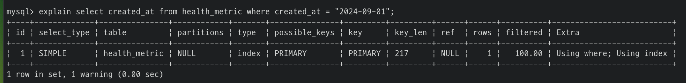

# 8. 인덱스

- [8.1. 디스크 읽기 방식](#81-디스크-읽기-방식)
    - [8.1.1. 하드 디스크 드라이브(HDD)와 솔리드 스테이트 드라이브(SSD)](#811-하드-디스크-드라이브hdd와-솔리드-스테이트-드라이브ssd)
    - [8.1.2. 랜덤 I/O와 순차 I/O](#812-랜덤-io와-순차-io)
- [8.2. 인덱스란?](#82-인덱스란)
    - [8.2.1. PK(Primary Key)](#821-pkprimary-key)
    - [8.2.2. Secondary Index](#822-secondary-index)
    - [8.2.3. B-Tree 알고리즘](#823-b-tree-알고리즘)
    - [8.2.4. Hash 알고리즘](#824-hash-알고리즘)
    - [8.2.5. UNIQUE 인덱스](#825-unique-인덱스)
- [8.3. B-Tree 인덱스](#83-b-tree-인덱스)
    - [8.3.1. 구조 및 특성](#831-구조-및-특성)
    - [8.3.2. B-Tree 인덱스 키 추가 및 삭제](#832-b-tree-인덱스-키-추가-및-삭제)
        - [8.3.2.1. 인덱스 키 추가](#8321-인덱스-키-추가)
        - [8.3.2.2. 인덱스 키 삭제](#8322-인덱스-키-삭제)
        - [8.3.2.3. 인덱스 키 변경](#8323-인덱스-키-변경)
        - [8.3.2.4. 인덱스 키 검색](#8324-인덱스-키-검색)
    - [8.3.3. B-Tree 인덱스 사용에 영향을 미치는 요소](#833-b-tree-인덱스-사용에-영향을-미치는-요소)
        - [8.3.3.1. 인덱스 키 값의 크기](#8331-인덱스-키-값의-크기)
        - [8.3.3.2. B-Tree 깊이](#8332-b-tree-깊이)
        - [8.3.3.3. 선택도(기수성)](#8333-선택도기수성)
        - [8.3.3.4. 읽어야 하는 레코드의 건수](#8334-읽어야-하는-레코드의-건수)
    - [8.3.4. B-Tree 인덱스를 통한 데이터 읽기](#834-b-tree-인덱스를-통한-데이터-읽기)
        - [8.3.4.1. 인덱스 레인지 스캔](#8341-인덱스-레인지-스캔)
        - [8.3.4.2. 인덱스 풀 스캔](#8342-인덱스-풀-스캔)
        - [8.3.4.3. 루스 인덱스 스캔](#8343-루스-인덱스-스캔)
        - [8.3.4.4. 인덱스 스킵 스캔](#8344-인덱스-스킵-스캔)
    - [8.3.5. 다중 컬럼(Multi-column) 인덱스](#835-다중-컬럼multi-column-인덱스)
    - [8.3.6. B-Tree 인덱스의 정렬 및 스캔 방향](#836-b-tree-인덱스의-정렬-및-스캔-방향)
        - [8.3.6.1 내림차순 인덱스](#8361-내림차순-인덱스)
    - [8.3.7. B-Tree 인덱스의 가용성과 효율성](#837-b-tree-인덱스의-가용성과-효율성)
        - [8.3.7.1. 비교 조건의 종류와 효율성](#8371-비교-조건의-종류와-효율성)
        - [8.3.7.2. 인덱스의 가용성](#8372-인덱스의-가용성)
        - [8.3.7.3. 가용성과 효율성 판단](#8373-가용성과-효율성-판단)
- [8.4. R-Tree 인덱스](#84-r-tree-인덱스)
    - [8.4.1. 구조 및 특성](#841-구조-및-특성)
        - [8.4.1.1. MBR](#8411-mbr)
    - [8.4.2. R-Tree 인덱스의 용도](#842-r-tree-인덱스의-용도)
- [8.5. 전문 검색 인덱스](#85-전문-검색-인덱스)
    - [8.5.1. 인덱스 알고리즘](#851-인덱스-알고리즘)
        - [8.5.1.1. 어근 분석 알고리즘](#8511-어근-분석-알고리즘)
        - [8.5.1.2. n-gram 알고리즘](#8512-n-gram-알고리즘)
        - [8.5.1.3. 불용어 변경 및 삭제](#8513-불용어-변경-및-삭제)    
    - [8.5.2. 전문 검색 인덱스의 가용성](#852-전문-검색-인덱스의-가용성)
- [8.6. 함수 기반 인덱스](#86-함수-기반-인덱스)
    - [8.6.1. 가상 컬럼을 이용한 인덱스](#861-가상-컬럼을-이용한-인덱스)
    - [8.6.2. 함수를 이용한 인덱스](#862-함수를-이용한-인덱스)
- [8.7. 멀티 밸류 인덱스](#87-멀티-밸류-인덱스)
- [8.8. 클러스터링 인덱스](#88-클러스터링-인덱스)
    - [8.8.1. 세컨더리 인덱스에 미치는 영향](#881-세컨더리-인덱스에-미치는-영향)
    - [8.8.2. 클러스터링 인덱스의 장점과 단점](#882-클러스터링-인덱스의-장점과-단점)
    - [8.8.3. 클러스터링 테이블 사용 시 주의사항](#883-클러스터링-테이블-사용-시-주의사항)
- [8.9. 유니크 인덱스](#89-유니크-인덱스)
    - [8.9.1. 유니크 인덱스 vs 일반 세컨더리 인덱스](#891-유니크-인덱스-vs-일반-세컨더리-인덱스)
        - [8.9.1.1. 인덱스 읽기](#8911-인덱스-읽기)
        - [8.9.1.2. 인덱스 쓰기](#8912-인덱스-쓰기)
    - [8.9.2. 유니크 인덱스 사용 시 주의사항](#892-유니크-인덱스-사용-시-주의사항)
- [8.10. 외래키](#810-외래키)
    - [8.10.1. 자식 테이블의 변경이 대기하는 경우](#8101-자식-테이블의-변경이-대기하는-경우)
    - [8.10.1. 부모 테이블의 변경 작업이 대기하는 경우](#8102-부모-테이블의-변경-작업이-대기하는-경우)

## 8.1. 디스크 읽기 방식
- 성능 튜닝은 디스크 I/O를 줄이는 것이 관건

### 8.1.1. 하드 디스크 드라이브(HDD)와 솔리드 스테이트 드라이브(SSD)
- SSD는 HDD에서 데이터 저장용 플래터(원판)를 제거하고 플래시 메모리를 장착해서 사용한다.
- 디스크 원판을 기계적으로 회전시킬 필요가 없기 때문에 데이터 I/O가 빠르다.
- 플래시 메모리는 전원이 공급되지 않아도 데이터가 삭제되지 않는다.
- 초당 처리 횟수: CPU > Memory > SSD > HDD
- SSD는 HDD보다 랜덤 I/O가 훨씬 빠르다.
- 순차 I/O는 SSD가 HDD보다 조금 빠르거나 거의 비슷하다.
- 그러나 데이터베이스는 랜덤 I/O 작업이 대부분이다.

### 8.1.2. 랜덤 I/O와 순차 I/O
- I/O는 HDD의 플래터(원판)을 돌려서 읽어야 할 데이터가 저장된 위치로 디스크 헤더를 이동시킨 다음 데이터를 읽는 것.
- 디스크의 성능은 디스크 헤더의 위치 이동없이 얼마나 많은 데이터를 한 번에 기록하냐에 결정된다.
- 여러 번 쓰기 또는 읽기 요청하는 랜덤 I/O 작업은 부하가 훨씬 크다.
- 데이터베이스는 랜덤 I/O 작업이 대부분이기 때문에 MySQL은 그룹 커밋, 바이너리 로그 버퍼, InnoDB 로그 버퍼 등의 기능을 제공한다.
- SSD도 랜덤 I/O는 순차 I/O보다 전체 throughput이 떨어진다.
- 쿼리를 튜닝하는 것은 랜덤 I/O 자체를 줄이는 목적이다. -> 쿼리를 처리하는데 필요한 데이터만 읽도록 개선
- 인덱스 레인지 스캔: 랜덤 I/O
- 풀 테이블 스캔: 순차 I/O -> 다량의 레코드를 읽을 때는 풀 테이블 스캔을 사용하도록 유도할 때도 있다.
    > 순차 I/O가 랜덤 I/O보다 더 빠르게 많은 레코드를 읽을 수 있음 <br/>
    [B-Tree 인덱스](#83-b-tree-인덱스)에서 추가 설명

## 8.2. 인덱스란?
- 컬럼 값과 해당 레코드가 저장된 주소를 key-value로 인덱스를 만들어 둔다.
- 컬럼 값을 주어진 순서로 미리 정렬한다.
    - 저장될 때마다 항상 값을 정렬하는 과정이 선행되어 느리다.
    - 이미 정렬되어 있기 때문에 빠르게 값을 찾을 수 있다.
- 데이터 파일은 저장된 순서대로 별도의 정렬없이 그대로 저장한다.
- 인덱스는 데이터의 쓰기(INSERT, UPDATE, DELETE) 성능은 희생하고, 읽기(SELECT) 속도를 높이는 기능이다.

### 8.2.1. PK(Primary Key)
- 레코드를 대표하는 컬럼의 값으로 생성된 인덱스
- 식별자라고도 함
- NOT NULL, UNIQUE

### 8.2.2. Secondary Index
- PK를 제외한 나머지 인덱스
- UNIQUE 인덱스는 PK를 대체할 수 있는 대체키

### 8.2.3. B-Tree 알고리즘
- 가장 일반적으로 사용되는 인덱스 알고리즘
- 컬럼 값을 변형하지 않고 원래 값을 사용해서 인덱싱

### 8.2.4. Hash 알고리즘
- 컬럼 값으로 해시값을 계산해서 인덱싱
- 값을 변형해서 인덱싱하기 때문에 `'김%'`와 같이 값의 일부만 검색하거나 범위 검색에서는 사용 불가
- 주로 메모리 기반의 데이터베이스에서 사용

### 8.2.5. UNIQUE 인덱스
- 유니크 여부는 옵티마이저에게 중요한 힌트
- 유니크 인덱스에 대해 동등 조건(`=`)으로 검색하는 것은 항상 1건의 레코드만 찾으면 된다는 것을 옵티마이저에게 알려주는 효과

## 8.3. B-Tree 인덱스
1. 특정 노드에 key가 k개면 자식 노드는 `k + 1`개가 있어야 한다.
2. 차수(degree)가 M일 때 key는 `[M/2] - 1` ~ `M - 1`개를 포함할 수 있다.
3. 노드 내 key는 정렬되어 있다.
4. 브랜치 노드는 `[M/2]` ~ `M`개의 자식 노드를 가질 수 있다.
5. 모든 리프 노드는 같은 레벨이다.
    > B-Tree 생성 실습 <br>
    https://www.cs.usfca.edu/~galles/visualization/BTree.html


<br/>

B* Tree
1. B Tree에서 균형을 유지하기 위한 노드 생성, 추가 연산을 최소화하기 위해 등장했다.
2. 노드가 꽉 차면 분할하지 않고 형제 노드에 재분배한다.
3. B Tree보다 노드의 채우기율이 더 높고, 결과적으로 트리의 높이가 낮아져 검색, 삽입, 삭제 연산의 효율이 향상된다.
4. 차수(degree)가 M일 때 key는 `[2M/3] - 1` ~ `M - 1`개를 포함할 수 있다.
5. 브랜치 노드는 `[2M/3]` ~ `M`개의 자식 노드를 가질 수 있다.

B+ Tree
- 모든 value는 리프 노드에만 존재한다.
- 모든 리프 노드는 **Linked List**로 연결되어 있다.
- 리프 노드를 제외한 상위 노드는 자식 노드의 포인터 주솟값을 가진다.

### 8.3.1. 구조 및 특성


- 리프 노드는 실제 데이터 레코드를 찾아가기 위한 주솟값을 가진다.
- 데이터는 항상 INSERT된 순서대로 저장되어 있지 않다.
    - 중간 레코드가 삭제되어 빈 공간이 생기면 다음 INSERT는 삭제된 공간을 재활용하도록 설계되어 있다.
- InnoDB 테이블에서 레코드는 클러스터되어 저장되므로 PK 순서로 정렬되어 저장된다.
- MyISAM은 세컨더리 인덱스가 물리적인 주소를 가지지만 InnoDB는 PK를 주소처럼 사용한다.
    - 반드시 PK를 저장하고 있는 B-Tree를 다시 한 번 탐색해야 한다.

### 8.3.2. B-Tree 인덱스 키 추가 및 삭제

#### 8.3.2.1. 인덱스 키 추가
- B-Tree에 저장될 때 키 값을 이용해 적절한 위치를 탐색한다.
- 위치가 결정되면 레코드의 키 값과 주소를 리프 노드에 저장한다.
- 리프 노드가 꽉 차면 리프 노드가 분리되며 상위 브랜치 노드까지 처리 범위가 넓어진다.
- 테이블에 레코드를 추가하는 작업 비용을 1이라고 가정하면, 대략적으로 인덱스에 키를 추가하는 작업 비용을 1.5 정도로 예측한다.
- InnoDB 스토리지 엔진은 인덱스 키 추가 작업을 체인지 버퍼를 통해 지연시킬 수 있다.
- PK나 UNIQUE 인덱스는 중복 체크가 필요하기 때문에 즉시 B-Tree에 추가되거나 삭제된다.

#### 8.3.2.2. 인덱스 키 삭제
- 키 값이 저장된 B-Tree의 리프 노드를 찾아서 삭제 마크한다.
- 마킹 작업은 디스크 쓰기가 필요하므로 디스크 I/O가 수반되지만 MySQL 5.5 이상부터 버퍼링되어 지연 처리할 수 있다.

#### 8.3.2.3. 인덱스 키 변경
- 기존 키 값을 삭제한 후 새로운 키 값을 추가하는 형태로 처리된다.
- InnoDB 스토리지 엔진은 이 작업 모두 체인지 버퍼로 지연 처리할 수 있다.

#### 8.3.2.4. 인덱스 키 검색
- 인덱스 설정은 쓰기 작업에 따른 추가 비용을 감당하면서 읽기 작업을 빠르게 하기 위해서이다.
- 인덱스 트리 탐색은 SELECT뿐 아니라 UPDATE, DELETE에서도 사용된다.
- 100% 일치 또는 left-most part만 일치하는 경우에 사용할 수 있다.
- 키 값의 뒷 부분만 검색(ex. `LIKE %course`)하는 용도로는 사용할 수 없다.
- 키 값 변경 후 비교되는 경우에도 사용할 수 없다.
- InnoDB 스토리지 엔진의 레코드 잠금은 넥스트 키락(갭락)이 탐색한 인덱스를 잠근 후 테이블의 레코드를 잠그는 방식이다.
    - UPDATE나 DELETE 쿼리가 실행될 때 적절한 인덱스가 없으면 불필요하게 많은 레코드를 잠근다.
    - full table scan이 발생하면 테이블의 모든 레코드를 잠글 수 있다.
    > 인덱스 설정이 매우 중요한 이유

### 8.3.3. B-Tree 인덱스 사용에 영향을 미치는 요소
- 인덱스 컬럼의 크기, 레코드 건 수, 유니크 인덱스 키의 개수 등에 영향을 받는다.

#### 8.3.3.1. 인덱스 키 값의 크기
- **디스크에 데이터를 저장하는 가장 기본 단위**는 페이지(Page) 또는 블록(Block)이라고 한다.
    - 디스크의 모든 읽기 및 쓰기 작업의 최소 작업 단위
    - 버퍼 풀에서 데이터를 버퍼링하는 기본 단위
    - 인덱스도 페이지 단위로 관리
- MySQL의 B-Tree에서 자식 노드의 수는 인덱스 페이지의 크기와 키 값의 크기에 따라 결정된다.
    - `innodb_page_size` 시스템 변수로 4KB ~ 64KB 사이의 값으로 페이지 크기를 조절할 수 있다.
    - 기본값은 16KB이다.
- 키 값의 크기가 커지면 한 페이지에 저장할 수 있는 키 개수가 줄어든다.
    - 한 페이지에 저장된 키 개수가 300개이고, SELECT 쿼리로 레코드 500개를 읽는다면 최소 2번 이상 디스크를 읽어야 한다.
    - 키 값의 크기가 커지면 디스크로부터 읽어야 하는 횟수가 늘어나고 그만큼 느려진다.
    - 전체적인 인덱스의 크기가 커지기 때문에 인덱스를 캐시하는 InnoDB 버퍼 풀의 효율이 떨어진다.

#### 8.3.3.2. B-Tree 깊이
- 깊이를 직접 제어할 수 있는 방법은 없다.
- 키 값의 크기가 커지면 하나의 깊이마다 가질 수 있는 키 개수가 줄어든다.
    - 하나의 인덱스 페이지가 담을 수 있는 키 값의 개수가 줄어든다.
    - 같은 레코드 건수를 탐색하더라도 깊이가 깊어져서 디스크 읽기가 더 많이 필요하다.

#### 8.3.3.3. 선택도(기수성)
- 모든 인덱스 키 값 가운데 유니크한 값의 수를 의미한다.
- 전체 인덱스 키 값은 100개이고 유니크한 값의 수는 10이면 기수성은 10이다.
    - ex) 인덱스가 설정된 country 컬럼의 전체 개수는 100개, 유니크한 개수는 10개
- 키 값에서 중복된 값이 많을수록 기수성과 선택도는 낮아진다.
- 선택도가 높을수록 김색 대상이 줄어들어 빠르게 처리된다.
- 정렬과 grouping과 같은 작업을 위해 인덱스를 설정하는 경우도 있다.
    - 인덱스가 항상 검색에만 사용되는 것은 아니므로 여러 상황을 고려해서 인덱스를 설계해야 한다.
- MySQL 서버는 인덱스된 컬럼에 대해 전체 레코드 건수나 유니크한 값의 수 등의 통계 정보를 가지고 있다.
- 기수성이 낮으면 불필요한 레코드 조회가 많아진다.
    - 인덱스나 쿼리의 효율성에 큰 영향을 미친다.

#### 8.3.3.4. 읽어야 하는 레코드의 건수
- 인덱스를 통해서 레코드를 읽는 것은 인덱스를 거치지 않고 바로 레코드를 읽는 것보다 비용이 든다.
- 전체 테이블을 읽어서 필요없는 레코드를 버릴지, 인덱스를 통해서 필요한 레코드만 읽을지에 대해 어느 쪽이 더 효율적인지 판단해야 한다.
- 일반적으로 인덱스를 통해 읽는 것은 테이블에서 직접 읽는 것보다 4 ~ 5배 비용이 더 발생하는 작업으로 예측한다.
- 인덱스를 통해 읽어야 할 레코드의 건수가 **전체 테이블 레코드의 20 ~ 25%를 넘어서면** 테이블을 모두 읽어서 필요한 레코드만 필터링하는 것이 더 효율적이다.

### 8.3.4. B-Tree 인덱스를 통한 데이터 읽기

#### 8.3.4.1. 인덱스 레인지 스캔
- 인덱스에 접근하는 세 방식 가운데 가장 빠르다.
- 검색해야 할 인덱스의 범위가 결정됐을 때 사용하는 방식이다.
- 루트 노드부터 시작해 리프 노드를 찾아 필요한 레코드의 시작 지점을 찾는다.
- 순서대로 스캔하면서 리프 노드의 끝에 도달하면 리프 노드 간의 링크를 통해 다음 리프 노드를 찾아간다.
- 레코드 한 건 한 건마다 랜덤 I/O가 한 번씩 발생한다.
- 모두 읽으면 지금까지 읽은 레코드를 반환하고 쿼리를 종료한다.
- **커버링 인덱스**를 통해서 랜덤 I/O를 생략할 수 있다.
    ```sql
    SELECT * FROM member WHERE id = 1; -- 모든 컬럼이 필요하기 때문에 데이터 페이지 접근 필요
    SELECT id FROM member WHERE id = 1; -- id 인덱스로 쿼리에 필요한 모든 데이터 반환
    ```
<br/>


- `Handler_read_key`: 인덱스 탐색한 횟수
- `Handler_read_next`: 인덱스 스캔을 정순으로 한 횟수
- `Handler_read_prev`: 인덱스 스캔을 역순으로 한 횟수
- `Handler_read_first`: `MIN()`으로 인덱스의 첫 번째 레코드를 읽은 횟수
- `Handler_read_next`: `MAX()`로 인덱스의 마지막 레코드를 읽은 횟수

#### 8.3.4.2. 인덱스 풀 스캔
- 인덱스의 처음부터 끝까지 모두 읽는 방식이다.
- 대표적으로 A, B, C 순서로 다중 컬럼 인덱스를 설정했을 때 B 또는 C 컬럼으로 검색할 때 사용된다.
- 쿼리가 인덱스에 명시된 컬럼만으로 조건을 처리할 수 있는 경우 주로 이 방식이 사용된다.
- 데이터 레코드까지 모두 읽어야 한다면 이 방식으로 처리되지 않는다.
- 테이블 풀 스캔보다 효율적이다.

<br/>

- 다중 컬럼 인덱스 설정

    

- 전체 데이터를 읽으므로 table full scan

    

- 커버링 인덱스를 적용하여 index full scan

    

#### 8.3.4.3. 루스 인덱스 스캔
- 다른 DBMS의 인덱스 스킵 스캔과 유사하다.
- 중간에 필요하지 않은 키 값은 스킵하고 다음으로 넘어간다.
- GROUP BY 또는 집합 함수 가운데 `MAX()`, `MIN()` 함수에 대해 최적화할 때 사용된다.


```sql
-- 다중 컬럼 인덱스 생성
CREATE INDEX ix_dept_no_emp_no ON dept_emp(dept_no, emp_no);

-- 조회
SELECT dept_no, MIN(emp_no)
FROM dept_emp
WHERE dept_no BETWEEN 'd002' AND 'd004'
GROUP BY dept_no;
```
- `dept_no` 그룹 별 첫 번째 레코드의 `emp_no` 값을 읽는다.
- 조건에 만족하지 않는 레코든느 무시하고 다음 레코드로 이동한다.

#### 8.3.4.4. 인덱스 스킵 스캔
- MySQL 8.0 버전부터 다중 컬럼 인덱스의 일부만으로 인덱스를 탐색할 수 있는 **인덱스 스킵 스캔 최적화** 기능이 도입됐다.
- 루스 인덱스 스캔은 GROUP BY 작업을 처리하기 위해 인덱스를 사용할 때만 적용된다.
- 인덱스 스킵 스캔은 WHERE 조건절 탐색에서도 사용할 수 있다.

<br/>

- 테이블 생성
    > 인덱스를 설정한 컬럼 외에 다른 컬럼이 없으면 스킵 스캔이 동작하지 않고 인덱스 풀 스캔이 됨 why???

    

- 인덱스 추가
    ```sql
    CREATE INDEX test_ix ON employees(gender, birthday);
    ```
    

- skip scan off
    - 커버링 인덱스를 통해 인덱스 풀 스캔이 적용된 것과 같다.

    

- skip scan on
    - 인덱스 스킵 스캔이 적용되어 인덱스 레인지 스캔
    - 옵티마이저는 gender 컬럼에서 유니크한 값을 모두 조회한 후 쿼리에 gender 컬럼의 조건을 추가해 쿼리를 다시 실행
    - `WHERE gender = 'M' AND birthday >= '1997-05-23';`, `WHERE gender = 'F' AND birthday >= '1997-05-23';`
    - enum이 아닌 어떤 타입이라도 인덱스에 존재하는 모든 값을 추출하고 그 결과를 이용해 스킵 스캔을 실행한다.

    

[ 단점 ]
1. WHERE 조건절에 조건이 없는 인덱스의 선행 컬럼의 유니크한 값의 개수가 적어야 함
    - 유니크한 값의 개수가 많으면 옵티마이저가 스캔해야 할 인덱스 시작 지점을 검색하는 작업이 많이 필요하다.
    - 오히려 더 느려질 수도 있다.
    - **유니크한 값이 소량일 때만 적용 가능**한 최적화이다.
2. 쿼리가 인덱스에 존재하는 컬럼만으로 처리 가능해야 함(커버링 인덱스)
    - 인덱스 외에 다른 컬럼이 필요하면 **table full scan**으로 실행 계획을 수립한다.

### 8.3.5. 다중 컬럼(Multi-column) 인덱스
- 두 개 이상의 컬럼으로 구성된 인덱스를 다중 컬럼 인덱스(또는 복합 컬럼 인덱스)라고 한다.
- 인덱스의 두 번째 컬럼은 첫 번째 컬럼에 의존해서 정렬된다.
    - 인덱스 내에서 각 컬럼의 위치(순서)가 중요하다.

### 8.3.6. B-Tree 인덱스의 정렬 및 스캔 방향
- 인덱스를 어느 방향으로 읽을지는 쿼리에 따라 옵티마이저가 결정한다.
- MySQL 8.0 버전부터 정렬 순서를 혼합한 인덱스를 생성할 수 있다.
    ```sql
    CREATE INDEX ix_teamname_userscore ON employees (team_name ASC, user_score DESC);
    ```
- `ORDER BY ... DESC`일 경우 정순으로 읽어서 마지막 레코드를 가져오는 것이 아닌, 역순으로 읽어서 첫 번째 레코드를 가져온다.

#### 8.3.6.1. 내림차순 인덱스
- MySQL은 `ORDER BY ... DESC`일 경우 역순으로 읽는다.
- 역순 스캔은 정순 스캔보다 느리다.
    - 페이지 잠금이 인덱스 정순 스캔에 적합한 구조
    - 페이지 내에서 인덱스 레코드가 단방향으로만 연결된 구조
- `ORDER BY ... DESC`가 많은 레코드를 조회하면서 빈번하게 발생하면 내림차순 인덱스가 더 효율적이다.
- 쿼리가 인덱스의 앞쪽 또는 뒤쪽만 집중적으로 읽어서 인덱스의 특정 페이지 잠금에 병목이 발생하는지 파악해야 한다.

### 8.3.7. B-Tree 인덱스의 가용성과 효율성

#### 8.3.7.1. 비교 조건의 종류와 효율성
- 다중 컬럼 인덱스에 따라 WHERE 조건 순서를 설정해야 한다.
1. A, B 순서의 다중 컬럼 인덱스로 `WHERE A = 1 AND B >= 100`을 탐색할 경우
    - A = 1, B >= 100인 레코드를 찾은 후 A = 1이 아닐 때까지 쭉 읽으면 된다.
2. B, A 순서의 다중 컬럼 인덱스로 `WHERE A = 1 AND B >= 100`을 탐색할 경우
    - B >= 100, A = 1인 레코드를 찾고, 이후 모든 레코드에 대해 A = 1인지 비교하는 과정이 필요하다.
- 인덱스를 통해 읽은 레코드가 나머지 조건에 맞는지 비교하는 작업을 **필터링**이라고 한다.
- 2번 케이스의 A = 1은 필터링이며 비교 작업의 법위를 좁히는 데 아무런 도움을 주지 못하고, 쿼리의 조건에 맞는지 검사하는 용도로만 사용된다.
- 작업 범위를 결정하는 조건은 많으면 많을수록 쿼리 처리 성능을 높인다.
- 필터링 조건은 많다고 하더라도 쿼리 처리 성능을 높이지 못한다.

#### 8.3.7.2. 인덱스의 가용성
- B-Tree 인덱스는 왼쪽 값을 기준으로 해서 오른쪽 값이 정렬되어 있다.
- 하나의 컬럼 내 LIKE 뿐 아니라 다중 컬럼 인덱스에도 적용된다.
- 왼쪽 부분이 없으면 **인덱스 레인지 스캔 방식을 적용할 수 없다.**
    ```sql
    -- first_name index
    SELECT * FROM employees WHERE first_name LIKE '%mer';

    -- first_name, last_name index
    SELECT * FROM employees WHERE last_name = 'prin';
    ```

#### 8.3.7.3. 가용성과 효율성 판단
- 다음 조건은 인덱스를 사용할 수 없다.
- 경우에 따라서 필터링 조건으로 인덱스를 사용할 수 있다.
1. NOT-EQUAL
    - `<>`
    - `NOT IN`
    - `NOT BETWEEN`
    - `IS NOT NULL`
2. LIKE '%??' (앞 부분이 아닌 뒷 부분 일치)
    - `LIKE '%prin'`
    - `LIKE '_prin'`
    - `LIKE '%prin%'`
3. 스토어드 함수나 다른 연산자로 인덱스 컬럼 변형
    - `SUBSTRING(first_name, 1, 1)`
    - `DAYOFMONTH(created_at)`
4. NOT-DETERMINISTIC 속성의 스토어드 함수가 비교 조건
    - `first_name = deterministic_function()`
5. 데이터 타입이 서로 다른 비교
    - `first_name = 1`
6. 문자열 데이터 타입의 콜레이션이 다름
    - `utf8_bin_first_name = euckr_bin_first_name`

[ 다중 컬럼 인덱스 ]
```sql
INDEX ix_test (column_1, column_2, column_3, ..., column_n);
```
- 작업 범위 결정 조건으로 인덱스를 사용하지 못하는 경우
    - column_1 컬럼에 대한 조건이 없는 경우
    - column_1 컬럼의 비교 조건이 인덱스 사용 불가 조건 중 하나인 경우
- 작업 범위 결정 조건으로 인덱스를 사용하는 경우
    - column_1 ~ column_(i - 1) 컬럼까지 동등 비교 형태
    - column_i 컬럼에 대해 다음 연산자 중 하나로 비교
        - 동등 비교(`=` 또는 `IN`)
        - 크다 작다 형태(`>` 또는 `<`)
        - LIKE로 좌측 일치 패턴(`LIKE 'prin%'`)

## 8.4. R-Tree 인덱스
- 공간 인덱스는 R-Tree 인덱스 알고리즘을 이용해 2차원 데이터를 인덱싱하고 검색하는 목적의 인덱스이다.
- MySQL의 공간 확장 기능
    - 공간 데이터를 저장할 수 있는 데이터 타입
    - 공간 데이터의 검색을 위한 공간 인덱스(R-Tree 알고리즘)
    - 공간 데이터의 연산 함수(거리 또는 포함 관계 처리)

### 8.4.1. 구조 및 특성
- 여러 가지 기하학적 도형(Geometry) 정보를 관리할 수 있는 데이터 타입을 제공한다.


- `GEOMETRY`는 나머지 3개의 슈퍼 타입이다.

#### 8.4.1.1. MBR


- Minimum Bounding Rectangle의 약자이다.
- 도형을 감싸는 최소 크기의 사각형을 의미한다.
- MBR들의 포함 관계를 B-Tree 형태로 구현한 인덱스가 R-Tree이다.


- 최상위 레벨: R1, R2
    - 루트 노드에 저장되는 정보
- 차상위 레벨: R3, R4, R5, R6
    - 중간 크기의 MBR, R-Tree의 브랜치 노드
- 최하위 레벨: R7 ~ R14
    - 각 도형 데이터의 MBR

### 8.4.2. R-Tree 인덱스의 용도
- MBR 정보를 이용해 B-Tree 형태로 구축한 인덱스이며 공간(Spetial) 인덱스라고도 한다.
- WGS84(GPS) 기준의 위도, 경도 좌표 저장에 주로 사용된다.
- CAD/CAM 소프트웨어 또는 회로 디자인 등과 같이 좌표 시스템에 기반을 둔 정보에 대해 모두 적용할 수 있다.
- `ST_Contains()`, `ST_Within()` 등과 같이 **포함 관계를 비교하는 함수로 탐색하는 경우에만** 인덱스를 사용할 수 있다.
- `ST_Distance()`, `ST_Distance_Sphere()` 함수는 공간 인덱스를 효율적으로 사용하지 못한다.


```sql
-- 'square box'에 포함된 좌표 px만 검색
SELECT * FROM location WHERE ST_Contains('square box', px);

SELECT * FROM location WHERE ST_Within(px, 'square box');
```
- 기준점 P로부터 반경 5km 이내의 점들을 탐색하려면 `ST_Contains()` 또는 `ST_Within()` 함수를 사용하여 MBR 포함 관계 비교를 수행한다.
- 거의 동일한 비교를 수행하지만 파라미터를 반대로 사용해야 한다.
- 점 P6은 반경 5km 이상 떨어져 있지만 MBR 내에는 포함된다.

```sql
SELECT * FROM location
    WHERE ST_Contains('square box', px) AND ST_Distance_Sphere(p, px) <= 5 * 1000;
```
- 점 P6을 제거하고자 할 경우 `ST_Distance_Sphere()` 함수로 한 번 더 필터링해야 한다.

## 8.5. 전문 검색 인덱스
- MySQL의 B-Tree 인덱스는 실제 컬럼 값이 1MB이더라도 전체 값을 인덱스 키로 사용하는 것이 아니라 1,000Byte(MyISAM) 또는 3,072Byte(InnoDB)까지만 잘라서 사용한다.
    - InnoDB의 `innodb_default_row_format` 시스템 변수가 DYNAMIC, COMPRESSED이면 3,072Byte이다.
    - REDUNDANT, COMPACT일 경우 767Byte까지 가능하다.
    - 기본값은 DYNAMIC이다.
- 문서 내용 전체를 인덱스화해서 특정 키워드가 포함된 문서를 검색하는 전문(Full Text) 검색에는 일반적인 B-Tree 인덱스를 사용할 수 없다.
- 문서 전체에 대한 분석과 검색을 위한 인덱싱 알고리즘을 **전문 검색(Full Text search) 인덱스**라고 한다.

### 8.5.1. 인덱스 알고리즘
- 문서 내용에서 사용자가 검색하게 될 키워드를 분석하고, 빠른 검색용으로 키워드로 인덱스를 구축한다.
- 인덱싱 기법은 어근 분석, n-gram 분석 알고리즘이 있다.

#### 8.5.1.1. 어근 분석 알고리즘
- 전문 검색 인덱스는 두 가지 과정을 거쳐 색인 작업이 수행된다.
1. 불용어(Stop Word) 처리
    - 검색에서 가치가 없는 단어를 모두 필터링해서 제거하는 작업
    - 개수가 많지 않기 때문에 상수로 정의해서 사용하는 경우가 많음
    - 불용어 자체를 데이터베이스화해서 사용자가 추가하거나 삭제할 수 있게 구현하는 경우도 있음
    - MySQL 서버에는 불용어가 소스코드로 정의되어 있음
    - 사용자가 별도로 불용어를 정의할 수 있는 기능 제공
2. 어근 분석(Stemming)
    - 검색어로 선정된 단어의 뿌리인 원형을 찾는 작업
     - 오픈소스 형태소 분석 라이브러리 MeCab을 플러그인 형태로 사용할 수 있게 지원

#### 8.5.1.2. n-gram 알고리즘
- MeCab을 위한 형태소 분석은 만족할 만한 결과를 위해 많은 노력과 시간이 필요하고 범용적으로 적용하기 어렵다.
- 이런 단점을 보완하기 위해 n-gram 알고리즘이 도입되었다.
- 단순히 키워드를 검색해내기 위한 인덱싱 알고리즘이다.
- 본문을 무조건 몇 글자씩 잘라서 인덱싱하며 인덱스의 크기가 상당히 큰 편이다.
- `n`은 인덱싱할 키워드의 최소 글자 수이다.
    - 2글자 단위로 키워드를 쪼개서 인덱싱하는 2-gram(또는 Bi-gram) 방식이 많이 사용된다.
- 각 글자를 중첩해서 토큰으로 구분한다.
    - 6글자 단어면 2-gram 알고리즘에서는 (6 - 1)개의 토큰으로 구분
    - ex) master -> ma, as, st, te, er
- 중복된 토큰은 하나의 인덱스 엔트리로 병합되어 저장된다.

<br>

```text
To be or not to be. That is the question
```


- MySQL 서버는 토큰들에 대해 불용어를 걸러내는 작업을 수행한다.
- 불용어와 동일하거나 일부를 포함하는 경우 필터링된다.
- MySQL 서버에 내장된 불용어는 `information_schema.innodb_ft_default_stopword` 테이블에서 확인할 수 있다.
- 이렇게 구분된 토큰을 B-Tree 인덱스에 저장한다.

#### 8.5.1.3. 불용어 변경 및 삭제
불용어 처리 자체를 완전히 무시
1. 스토리지 엔진에 관계없이 MySQL 서버의 모든 전문 검색 인덱스에 대해 불용어 처리 무시
    - `my.cnf`에서 `ft_stopword_file` 시스템 변수를 빈 문자열로 설정
        ``` text
        ft_stopword_file=''
        ```
    - 서버가 시작될 때만 인지하기 때문에 설정을 변경하면 MySQL 서버를 재시작
2. InnoDB 스토리지 엔진을 사용하는 테이블의 전문 검색 인덱스만 불용어 처리 무시
    - `innodb_ft_enable_stopword` 시스템 변수를 OFF로 설정
        ```sql
        SET GLOBAL innodb_ft_enable_stopword=OFF;
        ```
    - 동적인 시스템 변수이므로 서버가 실행 중인 상태에서도 변경 가능

사용자 정의 불용어 사용
1. 불용어 목록을 파일로 저장하고 파일 경로 저장
    - `my.cnf`에서 `ft_stopword_file` 시스템 변수에 파일 경로 설정
        ```text
        ft_stopword_file='/data/my_stopword.txt'
        ```
2. 불용어 목록을 테이블로 저장
    - InnoDB 스토리지 엔진을 사용하는 테이블에서만 사용 가능
    - `innodb_ft_server_stopword_table` 또는 `innodb_ft_user_stopword_table` 시스템 변수 사용
        - 여러 전문 검색 인덱스가 서로 다른 불용어를 사용해야 할 경우 `innodb_ft_user_stopword_table`
        ```sql
        SET GLOBL innodb_ft_server_stopword_table='{db명}/{불용어 table명}';
        ALTER TABLE {전문 검색 table명} ADD FULLTEXT INDEX {index명}({column명, ...}) WITH PARSER ngram;
        ```
    - 불용어 목록을 변경한 후 전문 검색 인덱스가 생성되어야 변경된 불용어가 적용
        
### 8.5.2. 전문 검색 인덱스의 가용성
- 두 가지 조건을 충족해야 한다.
    1. 쿼리 문장이 전문 검색을 위한 문법 사용(`MATCH ... AGAINST ...`)
        ```sql
        SELECT * FROM tb_test WHERE body LIKE '%내용%';
        ```
        - 전문 검색 인덱스를 사용하지 않고 **테이블 풀 스캔으로 쿼리를 처리**한다.
        ```sql
        SELECT * FROM tb_test WHERE MATCH(body) AGAINST('내용' IN BOOLEAN MODE);
        ```
        - 전문 검색 인덱스를 사용한다.
        - 전문 검색 인덱스를 구성하는 컬럼들은 `MATCH`에 모두 명시되어야 한다.
    2. 테이블이 전문 검색 대상 컬럼에 대해 전문 인덱스 보유
        ```sql
        CREATE FULLTEXT INDEX {index명} ON {table명}({column명}) WITH PARSER ngram;
        ```
        

## 8.6. 함수 기반 인덱스
- 인덱스 컬럼 값을 변형해서 탐색할 경우 인덱스를 사용하지 않는다.
- 함수 기반 인덱스를 활용하면 인덱스를 사용할 수 있다.
- MySQL 8.0 버전부터 지원한다.
- B-Tree 인덱스와 인덱싱할 값을 계산하는 과정의 차이만 있고 실제 인덱스의 내부적인 구조 및 유지관리 방법은 같다.
- 가상 컬럼을 이용한 인덱스, 함수 기반 인덱스가 있으며 내부적인 구현이 동일하기 때문에 **성능 차이는 발생하지 않는다.**

### 8.6.1. 가상 컬럼을 이용한 인덱스


```sql
ALTER TABLE employees
ADD full_name VARCHAR(40) AS (CONCAT(first_name, ' ', last_name)) VIRTUAL,
ADD INDEX ix_fullname (full_name);
```


- 가상 컬럼을 추가하고 해당 가상 컬럼에 인덱스를 생성한다.


- 가상 컬럼에 생성된 인덱스로 실행 계획이 만들어진다.


- 가상 컬럼은 새로운 컬럼을 추가하는 것과 같기 때문에 실제 테이블의 구조가 변경되는 단점이 있다.

### 8.6.2. 함수를 이용한 인덱스


```sql
CREATE INDEX ix_fullname ON employees ((CONCAT(first_name, ' ', last_name)));
```


- 함수를 직접 사용하는 인덱스를 생성한다.


- 함수 기반 인덱스로 실행 계획이 만들어진다.
- 테이블의 구조는 변경하지 않고, 계산된 결괏값의 검색을 빠르게 만들어준다.
- 반드시 **함수 기반 인덱스에 명시된 표현식이 그대로 사용**되어야 한다.
- 표현식이 다르면 결과가 같더라도 옵티마이저는 다른 표현식으로 간주한다.


## 8.7. 멀티 밸류 인덱스
- 하나의 데이터 레코드가 여러 개의 키 값을 가질 수 있는 형태의 인덱스이다.
- JSON 배열 타입의 필드에 저장된 원소들에 대한 인덱스를 생성하기 위해 도입되었다.
- MySQL 8.0 버전부터 지원한다.
    - MySQL 8.0.21 버전에서는 CHAR/VARCHAR 타입에 대해서는 지원하지 않는다.
- 반드시 다음 함수를 이용해서 탐색해야 옵티마이저가 인덱스를 활용한 실행 계획을 수립한다.
    1. `MEMBER OF()`
    2. `JSON_CONTAINS()`
    3. `JSON_OVERLAPS()`

```sql
-- JSON 타입의 credit_info 컬럼 존재
CREATE INDEX mx_creditscores ( (CAST(credit_info->'$.credit_scores' AS UNSIGNED ARRAY)) );

-- 인덱스를 사용한 조회
SELECT * FROM user WHERE 360 MEMBER OF(credit_info->'$.credit_scores');
```

## 8.8. 클러스터링 인덱스
- PK에 대해서만 적용된다.
- PK 값이 비슷한 레코드끼리 묶어서 저장하는 것을 클러스터링 인덱스라고 표현한다.
- 프라이머리 키 값에 의해 레코드의 저장 위치가 결정된다.
- 클러스터링 인덱스의 리프 노드에는 레코드의 모든 컬럼이 같이 저장된다.
- PK 우선 순위
    1. PK가 있으면 기본적으로 PK를 선택
    2. NOT NULL 옵션의 유니크 인덱스 중에서 첫 번째 인덱스를 선택
    3. 자동으로 유니크한 값을 가지도록 증가되는 컬럼을 내부적으로 추가한 후 선택
- 3번의 경우 사용자에게 노출되지 않으며 쿼리에서도 사용할 수 없다. 아무 의미없는 숫자 값으로 클러스터링되므로 가능하면 PK를 명시적으로 생성하도록 한다.

### 8.8.1. 세컨더리 인덱스에 미치는 영향
- MyISAM 또는 MEMORY 테이블은 PK와 세컨더리 인덱스의 구조적인 차이가 없다.
InnoDB는 세컨더리 인덱스가 레코드의 주소가 아닌 PK를 저장한다.

### 8.8.2. 클러스터링 인덱스의 장점과 단점
#### 장점
- PK로 검색할 때 처리 성능이 매우 빠름
- 테이블의 모든 세컨더리 인덱스가 PK를 가지고 있기 때문에 **커버링 인덱스로 처리될 수 있는 경우가 많음**

#### 단점
- 모든 세컨더리 인덱스가 PK를 가지고 있기 때문에 PK 값의 크기가 클 경우 전체적으로 인덱스의 크기가 커짐
- 세컨더리 인덱스로 탐색할 때 PK로 다시 검색해야 하므로 처리 성능이 느림
- INSERT할 때 PK에 의해 레코드의 저장 위치가 결정되기 때문에 처리 성능이 느림
- PK를 변경할 때 DELETE 후 INSERT하는 작업이 필요하기 때문에 처리 성능이 느림

### 8.8.3. 클러스터링 테이블 사용 시 주의사항
1. 모든 세컨더리 인덱스가 PK를 포함하기 때문에 PK 크기가 커지면 세컨더리 인덱스 크기도 커진다.
2. PK에 의해 레코드의 위치가 결정되므로 PK로 탐색하면 빠르게 처리된다. 따라서 컬럼 크기가 크더라도 업무적으로 해당 레코드를 대표할 수 있다면 그 컬럼을 PK로 설정하는 것이 좋다.
3. PK가 없으면 자동으로 유니크한 값을 가지도록 증가되는 컬럼을 내부적으로 추가해서 선택한다. 이것은 AUTO_INCREMENT와 같지만 사용자가 전혀 접근할 수 없다. ROW 기반 복제, InnoDB Cluster는 모든 테이블이 PK를 가져야 정상적인 복제 성능을 보장하기 때문에 PK를 꼭 생성하자.
4. 세컨더리 인덱스도 필요하고 PK 크기도 크다면 AUTO_INCREMENT 컬럼을 PK로 설정할 수 있다. INSERT 위주의 테이블은 AUTO_INCREMENT를 사용한 인조 신별자를 PK로 설정하는 것이 성능 향상에 도움이 된다.

## 8.9. 유니크 인덱스
- MySQL에서는 인덱스없이 유니크 제약만 설정할 수 없다.
- 유니크 인덱스는 NULL도 저장될 수 있다.
- PK는 NOT NULL, UNIQUE이다.
- MyISAM, MEMORY에서 PK는 NOT NULL의 유니크 인덱스와 같다.
- InnoDB에서 PK는 클러스터링 키 역할도 하기 때문에 유니크 인덱스와 근본적으로 다르다.

### 8.9.1. 유니크 인덱스 vs 일반 세컨더리 인덱스
- 인덱스의 구조상 아무런 차이가 없다.

#### 8.9.1.1. 인덱스 읽기
- 유니크하지 않은 세컨더리 인덱스에서 레코드를 추가로 읽는 작업은 디스크 읽기가 아닌 CPU에서 컬럼값을 비교하는 작업이기 때문에 성능상 영향이 거의 없다.
- 중복된 값을 허용하기 때문에 읽어야할 레코드가 많아서 느린 것이고 **인덱스 자체의 특성때문에 느린 것은 아니다.**

#### 8.9.1.2. 인덱스 쓰기
- 유니크 인덱스는 쓰기 작업 때 중복 여부를 체크하는 과정이 필요하기 때문에 유니크하지 않은 세컨더리 인덱스보다 느리다.
- MySQL에서 **중복 여부를 체크할 때 읽기 잠금**을 사용하고 **쓰기를 할 때는 쓰기 잠금**을 사용하기 때문에 데드락이 빈번히 발생한다.
- 유니크 인덱스는 중복 여부 체크때문에 체인지 버퍼를 사용할 수 없다.
- 따라서 일반 세컨더리 인덱스보다 변경 작업이 더 느리다.

### 8.9.2. 유니크 인덱스 사용 시 주의사항
- 유니크 인덱스도 일반 세컨더리 인덱스와 동일하기 때문에 중복해서 만들 필요가 없다.


## 8.10. 외래키
- InnoDB 스토리지 엔진에서만 생성할 수 있다.
- 자동으로 연관 테이블의 컬럼에 인덱스가 생성된다.
- 테이블의 변경(쓰기 잠금)이 발생하는 경우에만 잠금 경합(잠금 대기)이 발생한다.
- 외래키와 연관되지 않은 컬럼의 변경은 최대한 잠금 경합(잠금 대기)을 발생시키지 않는다.
- 외래 키를 물리적으로 생성하려면 잠금 경합까지 고려해서 모델링해야 한다.
- 자식 테이블에 레코드를 추가할 경우 외래키가 부모 테이블에 있는지 체크할 때 **연관 테이블에 읽기 잠금**을 건다.
- 잠금이 다른 테이블로 확장되면 그만큼 쿼리의 동시 처리에 영향을 미친다.

### 8.10.1. 자식 테이블의 변경이 대기하는 경우


1. 1번 커넥션이 `tb_parent` 테이블에서 `id = 2` 레코드의 쓰기 잠금 획득
2. 2번 커넥션이 `tb_child` 테이블에서 `tb_parent` 테이블의 외래키 컬럼인 `pid` 변경
3. 부모 테이블에서 변경 작업이 끝나지 않았으므로 완료될 때까지 대기
4. 1번 커넥션의 트랜잭션 종료 시 2번 커넥션 작업 처리

-> 자식 테이블에서 외래키 변경(INSERT, UPDATE) 시 부모 테이블의 해당 레코드에 쓰기 잠금이 걸려있으면 잠금이 해제될 때까지 기다린다.

### 8.10.2. 부모 테이블의 변경 작업이 대기하는 경우


1. 1번 커넥션이 `tb_child` 테이블에서 `id = 100` 레코드의 쓰기 잠금 획득
2. 2번 커넥션이 `tb_parent` 테이블에서 `tb_child`가 참조하고 있는 레코드 삭제
3. 자식 테이블에서 변경 작업이 끝나지 않았으므로 완료될 때까지 대기
4. 1번 커넥션의 트랜잭션 종료 시 2번 커넥션 작업 처리

> 예제에서는 `ON DELETE CASCADE`를 사용함

