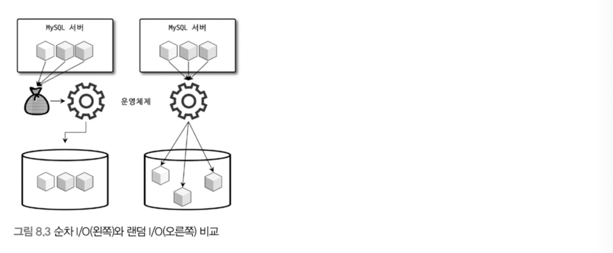

# 8장 인덱스

# 8.1 디스크 읽기 방식

인덱스에 대해 알아보기 전에 디스크 읽기 방식에 대해서 먼저 알아보자.

데이터베이스의 성능 튜닝은 어떻게 디스크 I/O를 줄이느냐이다.

## 8.1.1 하드 디스크 드라이브(HDD)와 솔리드 스테이트 드라이브(SDD)

하드 디스크는 기계식 장치여서 항상 디스크 장치가 병목이 된다. 이를 대체하기 위해 전자식 저장 매체인 SSD가 등장하였다.

SSD는 플레시 메모리를 장착하고 있는데 기계식 장치가 아니여서 하드 디스크에 비해 매우 빠르다. 플레시 메모리는 전원이 공급되지 않아도 데이터가 삭제되지 않는다.

SSD의 장점은 랜덤 I/O가 HDD에 비해 훨씬 빠르다는 것이다.

## 8.2.2 랜덤 I/O와 순차 I/O



데이터를 읽을 때, 하드 디스크 드라이버의 플래터(원판)를 돌려서 읽어야할 데이터가 저장된 위치로 디스크 헤더를 이동시킨 다음에 데이터를 읽게 된다.

이러한 작업을 순차 I/O 의 경우 한번만 이동하고, 랜덤 I/O 의 경우 여러번 이동한다(위 사진 예시의 경우, 순차는 1번인데 랜덤I/O는 디스크 헤드를 3번 이동하는 것이다). 따라서 **랜덤 I/O가 순차I/O 에 비해 작업 부하가 훨씬 더 크다.**

데이터베이스 대부분의 작업은 이런 작은 데이터를 빈번하게 읽고 쓰기 때문에 MySQL 서버는 그룹 커밋이나 바이너리 로그 버퍼 또는 InnoDB 로그 버퍼 등의 기능이 내장되어 있다.

SSD 는 HDD에 비해 랜덤 I/O의 성능이 더 좋긴 하지만 그럼에도 여전히 순차 I/O 보다는 전체 스루풋(Throughput)이 떨어진다.

일반적으로 쿼리를 튜닝하는 것은 이러한 **랜덤 I/O 자체를 줄여주는 것**이 목적이라고 할 수 있다.

<aside>
💡 **참고**

1.	**그룹 커밋(Group Commit)**: 그룹 커밋은 여러 트랜잭션을 한 번에 디스크에 기록하는 방법입니다. 여러 트랜잭션을 하나로 묶어 한 번의 디스크 쓰기 작업으로 처리하기 때문에, 디스크 헤드의 이동 횟수를 줄이고 랜덤 I/O에 따른 부하를 감소시킵니다.

2.	**바이너리 로그(Binary Log)**: 바이너리 로그는 데이터베이스에서 발생한 변경 사항을 기록하는 로그 파일입니다. MySQL은 바이너리 로그를 통해 데이터 복구와 복제를 수행하는데, 이 로그는 순차적으로 기록됩니다. 이를 통해 랜덤 I/O를 줄이고 성능을 개선할 수 있습니다.

3.	**InnoDB 로그 버퍼(InnoDB Log Buffer)**: InnoDB 로그 버퍼는 로그 데이터를 메모리에 임시로 저장한 후, 일정 시간마다 또는 특정 조건이 충족될 때 디스크에 기록합니다. 이 방식은 여러 개의 작은 I/O 작업을 하나의 큰 I/O 작업으로 묶어 처리함으로써, 랜덤 I/O 횟수를 줄이고 성능을 향상시킵니다.

</aside>

# 8.2 인덱스란?

인덱스는 책의 마지막에 있는 “찾아보기”와 같이 비유할 수 있다. 그렇다면 책의 내용은 데이터 파일에 비유할 수 있고, “찾아보기”를 통해 할 수 있는 페이지 번호는 데이터 파일에 저장되는 레코드의 주소에 비유할 수 있다.

DBMS에서 테이블의 모든 데이터를 검색해서 원하는 데이터를 가져오려면 시간이 오래 걸린다. 그래서 **칼럼의 값**과 그에 해당하는 **레코드가 저장된 주소**를 **키와 값의 쌍(Key-Value pair)**으로 삼아 인덱스를 만들어둔다.

인덱스는 칼럼의 **값을 주어진 순서대로 미리 정렬해서 보관**해둔다.

그렇기에 저장하는 과정은 정렬해서 넣어야하기에 복잡하고 느리지만, 조회 작업은 정렬되어 있기 때문에 매우 빠르다.

결론적으로 인덱스는 **데이터의 저장**(INSERT, UPDATE, DELETE) 성능을 **희생**하고 그 대신 **데이터의** **읽기** 속도를 높이는 기능이다.

**[역할로 구분]**

인덱스를 역할로 구분하면 다음과 같이 구분할 수 있다.

- 프라이머리 키: 그 레코드를 대표하는 칼럼의 값으로 만들어진 인덱스를 의미한다. 해당 레코드를 식별할 수 있는 기준값이 되기 때문에 식별자라고도 부른다. 프라이머리 키는 NULL 값이나 중복을 허용하지 않는 것이 특징이다.
- 보조 키(세컨더리 인덱스): 프라이머리 키를 제외한 나머지 모든 인덱스를 세컨더리 인덱스(Secondary Index)라고 분류한다. 유니크 인덱스는 프라이머리 키와 성격이 비슷하고 프라이머리 키를 대체해서 사용할 수 있다고 해서 대체 키라고도 하는데 그냥 세컨더리 인덱스로 분류하기도 한다.

**[데이터 저장 방식으로 구분]**

데이터 저장 방식(알고리즘)으로 구분하면 다음과 같이 구분할 수 있다.

- B-Tree 인덱스: 가장 일반적으로 사용되는 인덱스 알고리즘이다. 칼럼의 값을 변경하지 않고 원래의 값을 이용해 인덱싱하는 알고리즘이다. R-Tree 도 B-Tree의 응용 알고리즘이다.
- Hash 알고리즘: 칼럼의 값을 해시값으로 계산해서 인덱싱하는 알고리즘으로 매우 빠른 검색을 지원한다. Prefix 와 같이 값의 일부만 검색하거나 범위 검색을 할 때는 해시 인덱스를 사용할 수 없다. 주로 메모리 기반의 데이터베이스에서 많이 사용한다.

**[데이터 중복 여부로 구분]**

단순히 값이 1개만 존재하는지, 2개 이상 존재할 수 있는지를 의미한다. 유니크 인지 유무는 MySQL의 처리 방식의 변화나 차이점이 상당히 많다.

- 유니크 인덱스(Unique)
- 유니크하지 않는 인덱스(Non-Unique)

**[기능별로 구분]**

- 전문 검색용 인덱스
- 공간 검색용 인덱스

# 8.3 B-Tree 인덱스

- 가장 범용적이다.
- B는 Balance 를 의미한다.
- 칼럼의 원래 값을 변형시키지 않고 인덱스 구조체 내에서 항상 정렬된 상태를 유지한다.
- 전문 검색과 같은 특수한 요건이 아닌 경우 대부분 거의 B-Tree를 사용한다.

## 8.3.1 구조 및 특성


B-Tree는 트리 구조로 다음과 같이 나눌 수 있다.

- 루트 노드(Root node): 최상위에 하나의 노드
- 브랜치 노드(Branch node): 루트, 리프가 아닌 노드
- 리프 노드(Leaf node): 가장 하위에 있는 노드, 항상 실제 데이터 레코드를 찾아가기 위한 주솟값을 가지고 있다.

인덱스의 키 값은 모두 정렬되어 있고 데이터 파일은 임의의 순서로 저장되어 있다. 테이블이 레코드를 삭제하게 되면 빈 공간이 생기는데, INSERT는 가능한 한 삭제된 공간을 재활용하도록 설계되어 있기 때문에 항상 INSERT된 순서로 저장되는 것이 아니다.

<aside>
💡 **참고**

InnoDB 테이블에서 레코드는 클러스터되어 디스크에 저장되기 때문에 기본적으로 프라이머리 키 순서로 정렬되어 저장된다.

</aside>

**[MyISAM 데이터 레코드와 B-Tree의 리프 노드 관계]**


MyISAM 테이블의 생성 옵션에 따라 “레코드 주소”는 레코드가 테이블에 INSERT 된 순번이거나 데이터 파일 내의 위치(Offset)다.

자세한 구조는 4.3.3절에 ‘데이터 파일과 프라이머리 키 구조’의 ROWID 설명을 참조하다.

**[InnoDB 데이터 레코드와 B-Tree의 리프 노드 관계]**


MyISAM 테이블은 세컨더리 인덱스가 물리적인 주소를 가진다. 반면에  InnoDB 테이블은 프라이머리 키를 주소처럼 사용하기 때문에 논리적인 주소를 가진다고 볼 수 있다.

- 왜 InnoDB 는 세컨더리 인덱스가 실제 주소가 아닌 프라이머리 키를 저장할까?
    
    InnoDB 테이블은 레코드가 클러스터링 되어 저장된다. 즉, 프라이머리 키 순서에 따라 데이터가 정렬되어 저장된다.
    
    이러한 구조 덕분에 프라이머리 키를 통한 조회 작업 속도가 매우 빠르다. 다만, 프라이머리 키의 변경이나 데이터의 변경이 일어나면 둘 다 같이 변경이 일어나야한다.
    
    만약 세컨더리 인덱스가 데이터의 실제 주소를 저장하고 있다면 프라이머리 키의 변경이나 데이터의 변경시 세컨더리 인덱스도 업데이트 되어야 한다. 이는 비효율적이고 성능 저하에 원인이 된다.
    
    따라서 InnoDB 테이블에서 세컨더리 인덱스는 프라이머리 키를 가지게 하여 이러한 문제를 피한다.
    

따라서 모든 세컨더리 인덱스 검색은 프라이머리 키를 조회하고, 이 프라이머리 키로 실제 데이터를 조회하기 위해 B-Tree를 다시 검색해야한다. 

간단히 생각해보면 이러한 작업은 InnoDB 스토리지 엔진을 사용하는 테이블은 성능이 떨어질 것 처럼 보이지만 사실 MyISAM 인덱스 구조와 InnoDB 인덱스 구조는 각각의 장단점이 있다. 이는 8.8절에서 자세히 살펴보자.

## 8.3.2 B-Tree 인덱스 키 추가 및 삭제

테이블의 레코드를 저장하거나 변경하는 경우 인덱스 키 추가나 삭제 작업이 발생한다.

### 8.3.2.1 인덱스 키 추가

- 스토리지 엔진에 따라 새로운 키 값이 즉시 인덱스에 저장될 수도 있고 그렇지 않을 수도 있다.
- 저장될 때는 B-Tree 상의 적절한 위치를 검색하고 위치가 결정되면 레코드의 키 값과 레코드의 주소 정보를 B-Tree 리프 노드에 저장한다.
- 리프 노트가 꽉 차서 더이상 저장할 수 없는 경우 리프 노드가 분리되야 한다.
- 이러한 작업 탓에 B-Tree에서 상대저긍로 쓰기(새로운 키를 추가하는 작업)에 비용이 많이 든다.
- 테이블에 레코드를 추가하는 작업의 비용이 1이러면 인덱스에 키를 추가하는 작업은 1.5 정도로 예측한다.
- 이러한 비용은 디스크로 부터 인덱스 페이지를 읽고 쓰기를 해야 해서 걸리는 시간이다.
- InnoDB 의 경우 인덱스 키 추가 작업을 지연 처리할 수 도 있다. 하지만 프라이머리 키나 유니크 인덱스의 경우 중복 체크가 필요하기 때문에 즉시 B-Tree에 추가하거나 삭제한다.
    - 체인지 버퍼에 대해선 4.2.10절 참고

### 8.3.2.2 인덱스 키 삭제

- 인덱스 삭제 작업도 디스크 I/O 가 필요한 작업이기 때문에 InnoDB 의 경우 버퍼링되어 지연 처리될 수 있다.
    - MySQL 서버가 내부적으로 처리하므로 특별히 걱정할 필요는 없다.

### 8.3.2.3 인덱스 키 변경

- 인덱스 값에 따라 트리 구조가 짜여 있어서 단순히 인덱스 값만 변경하여 처리할 수 없다.
- 따라서 해당 키 값을 삭제하고 새로운 키 값을 추가하는 형태로 처리된다.
- 해당 작업도 InnoDB의 경우 지연 처리한다.

### 8.3.2.4 인덱스 키 검색

- 인덱스를 사용하는 가장 큰 이유는 빠른 검색을 위해서이다.
- 루트 노드부터 시작하여 브랜치 노드를 거쳐 최종적으로 리프 노드까지 이동하면서 비교 작업을 수행하는데 이를 “트리 탐색”이라 한다.
- SELECT 뿐만 아니라 UPDATE 나 DELETE 를 처리하기 위해 검색 작업을 사용한다.
- 검색은 100% 일치하거나 값의 앞부분만 일치하는 경우에도 사용된다.
- 인덱스 키 값에 변형이 가해진 후 비교되는 경우 B-Tree의 빠른 검색을 사용할 수 없다.
- InnoDB의 경우 검색을 수행한 인덱스를 잠근 후 테이블의 레코드를 잠그는 방식으로 구현되어 있기 때문에 인덱스가 없다면 불필요하게 많은 레코드를 잠근다.

## 8.3.3 B-Tree 인덱스 사용에 영향을 미치는 요소

### 8.3.3.1 인덱스 키 값의 크기

- InnoDB 스토리지 엔진은 디스크를 저장하는 기본 단위가 페이지 또는 블록이라고 한다.
    - 디스크의 모든 읽기 쓰기 작업의 최소 단위이다.
- 인덱스도 결국 페이지 단위로 관리된다.

- B-Tree는 자식 노드의 개수가 가변적인 구조이다.
- 인덱스의 페이지 크기와 키 값의 크기에 따라서 자식 노드의 개수가 정해진다.
- 페이지의 크기는 `innodb_page_size` 로 정할 수 있지만 기본값은 16KB이다.


- 자식 노드 주소는 여러 복합적인 정보가 담긴 영역이며 페이지 종류별로 대략 6바이트에서 12바이트까지 다양한 크기를 가질 수 있다.(예시에서는 12바이트라고 가정)
- 하나의 인덱스 페이지에서 몇 개의 키를 저장할 수 있을지 계산해보자.
    - 하나의 페이지 16KB
    - 키 값 16바이트라고 가정
    - 자식 노드 주소 12바이트로 가정
    - 16 * 1024 / (16+12) = 582 개를 저장할 수 있다.
- 키 값의 크기가 2배로 커진다면 16 * 1024 / (32+12) = 372 개를 저장할 수 있다.
- SELECT 쿼리가 500개를 읽어야한다면 인덱스 키 값의 크기가 커지면 한번 읽을 횟수가 2번으로 늘어난 것이다.
- 따라서 인덱스 키 값이 클 수록 디스크로부터 읽어야하는 횟수가 늘어나고 그만큼 느려진다.
- 또한 버퍼 풀에 캐시할 수 있는 레코드 수가 줄어든다.

### 8.3.3.2 B-Tree 깊이

- 깊이 또한 상당히 중요하지만 직접 제어할 방법이 없다.
- 깊이가 3이고 한 페이지에 582개 레코드를 읽을 수 있으면 최대 582^3 개의 키 값을 담을 수 있다.
- 인덱스 키 값의 크기가 커질수록 디스크 읽기는 더 많이 필요하다.

### 8.3.3.3 선택도(기수성)

- 인덱스에서 선택도(Selectivity) 또는 기수성(Cardinality)은 거의 같은 의미로 사용되며 모든 인덱스 키 값 가운데 유니크한 값의 수를 의미한다.
    - 키 값은 100개인데 유니크한 값의 수가 10개라면 기수성은 10이다.
- 인덱스는 선택도가 높을수록 검색 대상이 줄어들기 때문에 그만큼 빨리 처리된다.
- 선택도가 좋지 않더라도 정렬이나 그루핑과 같은 작업을 위해 인덱스를 만드는 것이 더 나은 경우도 있다.


- 전체 레코드 건수가 1만 건이며, country 칼럼만 인덱스로 생성된 상태이다.
- 케이스 A의 경우 위 쿼리를 실행하면 평균 1000건 결과가 조회 된다.
- 케이스 B의 경우 위 쿼리를 실행하면 평균 10건 결과가 조회 된다.

- 케이스 A의 경우 1건의 레코드를 위해 999건의 레코드를 더 읽은 것이지만 B는 9건만 더 읽은 것이다.
    - 필요한 만큼의 레코드만 정확히 읽을 수 있다면 좋지만 현실적으로 불가능하다. 따라서 B 정도의 낭비는 무시할 수 있다.
- **즉 유니크한 값의 개수는 인덱스나 쿼리의 효율성에 큰 영향을 미친다.**

### 8.3.3.4 읽어야 하는 레코드의 건수

- 인덱스를 통해 테이블 레코드를 읽는 것은 인덱스를 거치지 않고 레코드를 읽는 것 보다 높은 비용이 드는 작업이다
- 만약 100만건의 레코드를 조회해야한다면 전부 조회하고 50만건을 버릴지, 아니면 인덱스를 통해 50만건만 읽어 올지 어느것이 효율적인지 판단해야한다.
- 직접 레코드 1건을 조회하는 것이 1이라면 인덱스를 통해 조회하는 작업은 **4~5** 정도로 예측한다.
- 따라서 조회할 레코드의 개수가 전체 레코드의 20~25% 를 넘어서면 인덱스를 사용하는 것 보단 모든 레코드를 읽어서 필요한 레코드만 필터링하는 방식이 더 효율적이다.

## 8.3.4 B-Tree 인덱스를 통한 데이터 읽기

- 인덱스를 언제 사용하고 언제 사용하지 말지에 대해 판단하기 위해선 MySQL이 어떻게 인덱스를 이용해서 실제 레코드를 읽어 내는지 알아야한다.
- 인덱스를 이용하는 대표적인 세 가지 방법에 대해 알아보자.

### 8.3.4.1 인덱스 레인지 스캔

- 3개 방법중 접근 방식이 가장 빠른 방식
- 인덱스 레인지 스캔은 검색해야 할 인덱스의 범위가 결정됐을 때 사용하는 방식이다.
- **값의 수**나 검색 **결과** **레코드 건 수**와 관계없이 **레인지 스캔**이라고 표현한다.

```sql
SELECT * FROM employees WHERE first_name BETWEEN 'Ebbe' AND 'Gad';
```


- 위 쿼리가 동작하는 방식을 보여주는 예시이다.
- 리프 노드까지 도달해야 비로소 필요한 레코드의 시작 지점을 알 수 있다.
- 시작 지점을 찾으면 그때부터는 **리프 노드**의 레코드만 순서대로 읽으면 된다.
- 리프 노드의 끝까지 읽으면 **리프 노드 간의 링크**를 이용해 다음 리프 노드를 찾아간다.
- 최종적으로 스캔을 멈춰야 할 위치에 다다르면 지금까지 읽은 레코드를 사용자에게 반환하고 쿼리를 끝낸다.
- 위 과정은 인덱스만 읽은 경우를 보여준다.


- 실제 레코드까지 읽는 과정을 살펴보자.
- 어떤 방식으로 스캔하든 관계없이 인덱스 칼럼의 정순 또는 역순으로 정렬된 상태로 레코드를 가져오게 된다.
    - 인덱스 자체의 정렬 특성 때문에 자동으로 그렇게 된다.
- 레코드 한 건 단위로 랜덤 I/O 가 한 번씩 일어난다.
- 따라서 인덱스를 통해 데이터 레코드를 읽는 작업은 비용이 많이 드는 작업으로 분류된다.
    - 그래서 이전에 말했듯이 인덱스를 통한 레코드 조회가 전체 레코드의 20~25% 를 넘으면 테이블의 데이터를 직접 읽는 것이 효율적이다.
- 인덱스 레인지 스캔은 다음 3단계를 거친다.
    1. 인덱스에서 조건에 만족하는 값이 저장된 위치를 찾는다. 이 과정을 인덱스 탐색(Index seek)라고 한다.
    2. 1번 결과 위치부터 필요한 만큼 인덱스를 차례대로 쭉 읽는다. 이 과정을 인덱스 스캔(Index scan)이라고 한다. (1번과 2번을 합쳐서 인덱스 스캔으로 통칭하기도 한다)
    3. 2번에서 읽어 들인 인덱스 키와 레코드 주소를 이용해 레코드가 저장된 페이지를 가져오고 최종 레코드를 읽어온다.
- 쿼리가 필요로 하는 데이터에 따라 3번 과정이 필요하지 않을 수 있는데 이를 **커버링 인덱스**라고 한다.


- MySQL 서버에서는 1번과 2번 단계 작업이 얼마나 수행되었는지 확인할 수 있다.
    - `Handler_read_key` : 1번 단계 실행 횟수
    - `Handler_read_next` : 2번 단계에서 인덱스 정순으로 읽은 레코드 건수
    - `Handler_read_prev` : 2번 단계에서 인덱스 역순으로 읽은 레코드 건수

### 8.3.4.2 인덱스 풀 스캔

- 인덱스의 처음부터 끝까지 모두 읽는 방식을 인덱스 풀 스캔이라고 한다.
- 일반적으로 인덱스의 크기는 테이블 크기보다 작으므로 인덱스만 필요로 할 때 사용한다.
- 쿼리가 인덱스에 명시된 칼럼만으로 조건을 처리할 수 있는 경우 주로 이 방식이 사용된다.
    - 인덱스 뿐만 아니라 데이터 레코드까지 모두 읽어야한다면 절대 이 방식으로 처리되지 않는다.


- 인덱스의 맨 앞 또는 맨 뒤로 이동하여 처음부터 끝까지 스캔하는 방식이다.
- 인덱스 전체 크기는 테이블 자체의 크기보다 훨씬 작으므로 인덱스 풀 스캔은 테이블 전체를 읽는 것보다는 적은 디스크 I/O로 쿼리를 처리할 수 있다.
- 이 방식은 인덱스를 사용하긴 하지만 일반적으로 인덱스를 생성하는 목적이 아니다. 이 방식은 “인덱스를 사용하지 못한다” 또는 “인덱스를 효율적으로 사용하지 못한다” 라고 표현한다.
- 책에서 특별히 언급없이 “인덱스를 사용한다”라고 하면 인덱스 레인지 스캔이나 루스 인덱스 스캔 방식으로 인덱스를 사용한다는 것을 의미한다.

### 8.3.4.3 루스 인덱스 스캔


- 오라클과 같은 DBMS의 “인덱스 스킵 스캔”과 비슷하다.
- 앞서 봤던 “인덱스 레인지 스캔”, “인덱스 풀 스캔”은 루스 인덱스 스캔과 상반된 의미로 “타이트(Tight) 인덱스 스캔”으로 분류된다.
- 루스 인덱스 스캔은 말 그대로 **느슨하게** 또는 **듬성 듬성** 인덱스를 읽는 것을 의미한다.
- 인덱스 레인지 스캔과 비슷하게 동작하지만 중간에 필요하지 않는 인덱스 키 값은 무시(SKIP)하고 다음으로 넘어가는 형태로 처리된다.
- 주로 GROUP BY 또는 집계 함수 가운데 MAX() 또는 MIN() 함수에 대해 최적화를 하는 경우에 사용된다.

```sql
SELECT dept_no MIN(emp_no)
	FROM dept_emp
	WHERE dep_no BETWEEN 'd002' AND 'd004'
	GROUP BY dept_no;
```

- 위 쿼리에서 `dept_emp` 테이블은 `dept_no` , `emp_no` 라는 두 개의 칼럼으로 인덱스가 생성돼 있다. 또한 이 인덱스는 (`dept_no` , `emp_no` ) 조합으로 정렬까지 돼 있다. 따라서 위 그림과 같이 `dept_no` 그룹별로 첫 번째 레코드의 `emp_no` 값만 읽으면 된다.
- 즉, WHERE 조건에 만족하는 모든 범위를 스캔할 필요가 없다는 것을 옵티마이저는 알고 있기 때문에 필요한 레코드만 스캔하고 나머진 스킵하게 된다.
- 루스 인덱스 스캔을 사용하려면 여러 조건을 만족해야하는 이는 10장에서 살펴보겠다.

### 8.3.4.4 인덱스 스킵 스캔

- 데이터베이스 서버에서 인덱스의 핵심은 값이 정렬되어 있다는 것이다.
- 이로 인해 인덱스를 구성하는 칼럼의 순서가 매우 중요하다.

```sql
ALTER TABLE employees
	AND INDEX ix_gender_birthdate (gender, birth_date);
```

이 인덱스를 사용하려면 WHERE 조건절에 gender 칼럼에 대한 비교 조건이 필수이다.

```sql
// 인덱스를 사용하지 못하는 쿼리
SELECT * FROM employees WHERE birth_date>='1969-11-02'
```

```sql
// 인덱스를 사용하는 쿼리
SELECT * FROM employees WHERE gender='F' AND birth_date>='1969-11-02'
```

하지만 8.0 버전부터는 옵티마이저가 gender 칼럼을 건너뛰어서 birth_date 칼럼만으로도 인덱스 검색을 할 수 있도록 해주는 **인덱스 스킵 스캔(Index skip scan)** 최적화 기능이 도입됐다.


우선 인덱스 스킵 스캔을 비활성화 하고 확인해보면 `type` 칼럼에 `index` 라고 표시되어 있는 것을 볼 수 있다. 이는 인덱스 풀 스캔을 했다는 의미이다.

(위 예제 쿼리는 인덱스가 있는 `gender` 와 `birth_date` 만 조회했기 때문에 인덱스 풀 스캔을 한 것이다. 만약 다른 모든 칼럼을 가져와야 했단 테이블 풀 스캔을 실행했을 것이다.)


인덱스 스킵 스캔을 활성화 하고 확인해보면 `type` 칼럼에 `range` 라고 표시되어 있는 것을 볼 수 있다. 이는 꼭 필요한 부분만 읽었다는 것을 의미한다.

`Extra` 칼럼에 “Using index for skip scan” 이라고 되어 있는데 `ix_gender_birthdate` 인덱스에 대해 인덱스 스킵 스캔을 활용해 조회했다는 것을 의미한다.


MySQL 옵티마이저는 우선 `gender` 칼럼에 유니크한 값을 모두 조회해서 주어진 쿼리에 `gender` 칼럼 조건을 추가해 쿼리를 다시 실행하는 형태로 처리한다.

`gender` 칼럼의 유니크한 값은 ‘F’, ‘M’ 이라고 하면 아래와 같이 실행된다.

```sql
> SELECT gender, birth_date FROM employees WHERE gender='M' AND birth_date>='1969-11-02'
> SELECT gender, birth_date FROM employees WHERE gender='F' AND birth_date>='1969-11-02'
```

인덱스 스킵 스캔은 8.0에 새롭게 도입된 기능이여서 아직 다음과 같은 단점이 있다.

- WHERE 조건절에 조건이 없는 인덱스의 선행 칼럼의 유니크한 값의 개수가 적어야함
- 쿼리가 인덱스에 존재하는 칼럼만으로 처리 가능해야 함(커버링 인덱스)

만약 유니크한 값의 개수가 많다면 인덱스에서 스캔해야 할 시작 지점을 검색하는 작업이 많이 필요해진다. 이는 오히려 쿼리 처리 성능을 느리게 만들 수 있다.

따라서 인덱스의 선행 칼럼이 가진 유니크한 값의 개수가 소량일 때만 적용 가능한 최적화이다.


또한 인덱스 칼럼 외의 나머지 칼럼도 필요한 경우 인덱스 스킵 스캔을 사용하지 못한다. 하지만 이 제약 사항은 옵티마이저가 개선되면 충분히 해결될 수 있는 부분으로 보인다.

## 8.3.5 다중 칼럼(Multi-column) 인덱스

- 인덱스가 2개 이상의 칼럼으로 구성되면 **다중 칼럼 인덱스** 또는 **복합 칼럼 인덱스**라고 부른다.


- 인덱스 칼럼 위치에 따라서 정렬이 결정된다. 첫 번째 칼럼을 기준으로 정렬 한 다음 이후 칼럼 순서대로 정렬을 하게 된다.
- 따라서 각 칼럼의 순서가 상당히 중요하다.

## 8.3.6 B-Tree 인덱스의 정렬 및 스캔 방향

- 인덱스의 키 값은 항상 오름차순이거나 내림차순이다.
- 오름차순으로 정렬되어 있다고 해도 내림차순으로 읽을 수 있고 그 반대도 가능하다.
    - 어떤 방향으로 읽을지는 쿼리에 따라 옵티마이저가 실시간으로 만들어내는 실행 계획에 따라 결정된다.

### 8.3.6.1 인덱스의 정렬

```sql
CREATE INDEX ix_teamname_userscore ON employees (team_name ASC, user_score DESC);
```

- 8.0 부터는 칼럼 단위로 정렬 순서를 혼합해서 사용할 수 있다.

 

**[인덱스 스캔 방향]**

```sql
SELECT *
	FROM employees
	ORDER BY first_name DESC
	LIMIT 1;
```

- 인덱스는 항상 오름차순으로 정렬되어 있지만 최대값부터 거꾸로 읽으면 내림차순으로 값을 가져올 수 있다는 것을 옵티마이저는 이미 알고 있다.


- 쿼리의 `ORDER BY` 처리나 `MIN()` 또는 `MAX()` 함수 등의 최적화가 필요한 경우에도 MySQL 옵티마이저는 인덱스의 읽기 방향을 전환해서 사용하도록 실행 계획을 만들어 낸다.

**[내림차순 인덱스]**

```sql
> SELECT * FROM employees ORDER BY first_name ASC LIMIT 10;
> SELECT * FROM employees ORDER BY first_name DESC LIMIT 10;
```

- 위 쿼리는 실제 내림차순인지 오름차순인지 관계없이 인덱스를 읽는 순서만 변경해서 해결할 수 있다는 것을 살펴봤다.

```sql
> CREATE INDEX is_firstname_asc ON employees (first_name ASC);
> CREATE INDEX is_firstname_desc ON employees (first_name DESC);
```

- first_name 칼럼이 역순으로 정렬하는 요건만 있다면 위 2개의 인덱스 중에서 어떤 것을 선택하는게 성능이 좋을까?

- 우선 용어를 정리하자.


- 오름차순 인덱스(Ascending index): 작은 값의 인덱스 키가 B-Tree 왼쪽으로 정렬된 인덱스
- 내림차순 인덱스(Descending index): 큰 값의 인덱스 키가 B-Tree 왼쪽으로 정렬된 인덱스
- 인덱스 정순 스캔(Forward index scan): 인덱스 리프 노드의 왼쪽 페이지부터 오른쪽으로 스캔
- 인덱스 역순 스캔(Backward index scan): 인덱스 리프 노드의 오른쪽 페이지부터 왼쪽으로 스캔

- 대략 1천만 건의 레코드를 준비해서 성능을 비교해보자.

```sql
CREATE TABLE t1 (
		tid INT NOT NULL AUTO_INCREMENT,
		...
		PRIMARY KEY(tid)
)
```


- `LIMITE ... OFFSET` 에 의해 실제 MySQL 서버는 테이블의 모든 레코드를 스캔해야한다.
- 결과를 확인해보면 **역순 정렬 쿼리**가 정순 정렬 쿼리보다 **28.9% 더 시간이 걸린**다는 것을 확인할 수 있다.
- 역순 스캔이 정순 스캔에 비해 느릴 수 밖에 없는 두 가지 이유가 있다.
    1. 페이지 잠금이 인덱스 정순 스캔에 적합한 구조
    2. 페이지 내에서 인덱스 레코드가 단방향으로만 연결된 구조
    
    
    
- 만약 내림차순으로 조회하는 쿼리를 자주 사용하게 된다면 인덱스를 내림차순으로 생성하는 것이 더 효율적일 수 있다.

## 8.3.7 B-Tree 인덱스의 가용성과 효율성

### 8.3.7.1 비교 조건의 종류와 효율성

다중 칼럼 인덱스에서는 각 칼럼의 순서와 그 칼럼에 사용되는 조건이 동등 비교, 아니면 크다 또는 작다 같은 범위 조건인지에 따라 각 인덱스 칼럼의 활용 형태가 달라지며 효율 또한 달라진다.

```sql
SELECT * 
FROM dept_emp 
WHERE dept_no='d002' AND emp_no >= 10114;
```

- 케이스 A: `INDEX(dept_no, emp_no)`
- 케이스 B: `INDEX(emp_no, dept_no)`

위 쿼리를 실행할 때 두 케이스 중 어떤 케이스가 더 효율적일까?


케이스 A의 경우 `dept_no='d002' AND emp_no >= 10114"` 인 레코드를 찾고 그 이후 `dept_no` 가 ‘d002’가 아닐 때까지 인덱스를 쭉 읽으면 된다.

반면 케이스 B의 경우 `emp_no >= 10114 AND dept_no='d002'` 인 레코드를 찾고 그 이후 모든 레코드에 대해서 `dept_no` 가 ‘d002’인지 비교하는 과정을 거쳐야한다.

이유는 다중 칼럼의 경우 N 번째 칼럼에 대해 우선 정렬하고 같은 칼럼에 한해 N+1 번째 칼럼에 대해 정렬하게 되는데 케이스 B의 경우에는 `emp_no` 가 같은 경우에 대해서 조회하는 것이 아니기 때문에 결국 `dept_no` 가 항상 ‘d002’라고 보장할 수 없다. 따라서 매번 `dept_no` 가 ‘d002’인지 비교하는 과정이 필요하다. (`emp_no >= 10114`  레코드가 전부 ‘d002’ 라고 보장할 수 없다. 반면에 케이스 A의 경우 `dept_no='d002' AND emp_no >= 10114"`  를 만족하는 레코드를 찾고 그 이후에 `dept_no='d002'` 인 애들은 모두 `emp_no >= 10114` 를 만족한다고 보장할 수 있다. 왜냐면 N 번째 칼럼이 같기 때문에 `emp_no` 기준으로 정렬되어 있으니까)

공식 명칭은 아니지만 케이스 A 인덱스에서 두 조건(`dept_no='d002' AND emp_no >= 10114`) 과 같이 작업의 범위를 결정하는 조건을 ‘**작업 범위 결정 조건**’ 이라고 하고 케이스 B 인덱스의 `dept_no='d002'` 같이 단순히 거름종이 역할만 하는 조건을 ‘**필터링 조건**’ 또는 ‘**체크 조건**’이라고 한다.

- 작업 범위를 결정하는 조건은 많을수록 쿼리 처리 성능을 높이지만 체크 조건은 많을수록 오히려 쿼리 실행을 느리게 만들 때가 많다.

### 8.3.7.2 인덱스의 가용성

- 아래 사진에서 왼쪽 케이스 A는 first_name 이 인덱스
- 오른쪽 케이스 B는 dept_no, emp_no 가 인덱스


- B-Tree 인덱스의 특징은 왼쪽 값에 기준해서 오른쪽 값이 정렬돼 있다는 것이다.
- 값의 **왼쪽 부분이 없으면 인덱스 레인지 스캔 방식의 검색이 불가능**하다.
- 다중 칼럼에서도 왼쪽 칼럼의 값을 모르면 인덱스 레인지 스캔을 사용할 수 없다.

```sql
SELECT * FROM employees WHERE first_name LIKE '%mer';
```

- 위 쿼리는 인덱스 레인지 스캔 방식으로 인덱스를 이용할 수 없다.
    - 이유는 왼쪽 부터 한 글자씩 비교하면서 일치하는 레코드를 찾아야하는데 왼쪽 부분이 고정되어 있지 않기 때문이다.

```sql
SELECT * FROM dept_emp WHERE emp_no>=10144;
```

- 워 퀴리도 선행 칼럼인 `dept_no` 조건 없이 `emp_no` 값 만으로 검색하면 인덱스를 효율적으로 사용할 수 없다.
- 왼쪽 값 기준 규칙은 `GROUP BY` 절이나 `ORDER BY` 절에서도 똑같이 적용된다.

### 8.3.7.3 가용성과 효율성 판단

- 다음 조건에서는 인덱스의 특성상 작업 범위 결정 조건으로 사용할 수 없다.
- 경우의 따라 체크 조건으로 인덱스를 사용할 수는 있다.


- 다른 DBMS에서는 NULL 값은 인덱스에 저장되지 않지만 MySQL에서는 NULL 값도 인덱스에 저장된다.

```sql
> ... WHERE column IS NULL ..
```

- 다중 칼럼으로 만들어진 인덱스는 어떤 조건에서 사용될 수 있고 어떤 경우에 사용할 수 없는지 살펴보자.

```sql
INDEX ix_test (column_1, column_2, column_3 .., column_n)
```

- 작업 범위 결정 조건으로 인덱스를 사용하지 **못하는** 경우
    - column_1 칼럼에 대한 조건이 없는 경우
    - column_1 칼럼 비교 조건이 위 인덱스 사용 불가 조건인 경우
- 작업 결정 조건으로 인덱스를 **사용하는 경우**
    - column_1 ~ column_n 까지 동등 비교 형태(`=` or `IN` )로 비교
    - column_i 칼럼에 대해 다음 연산자 중 하나로 비교
        - 동등 비교
        - 크다 작다 형태 (`>` or `<`)
        - `LIKE` 좌측 일치 패턴 `LIKE 김%`

# 8.4 R-Tree 인덱스

- **공간 인덱스(Spatial Index)**는 R-Tree 인덱스 알고리즘을 이용하여 2차원 데이터를 인덱싱하고 검색하는 목적의 인덱스이다.
- R-Tree 인덱슨느 2차원 공간 개념 값이다.
- MySQL의 **공간 확장(Spatial Extension)**을 이용하면 간단하게 위치 기반 서비스를 구현할 수 있다.
- MySQL의 공간 확장에는 크게 세 가지 기능이 있다.
    - 공간 데이터를 저장할 수 있는 **데이터 타입**
    - 공간 데이터의 검색을 위한 **공간 인덱스(R-Tree 알고리즘)**
    - 공간 데이터의 **연산 함수**(거리 또는 포함 관계의 처리)
- 더 자세한 내용은 12.2절 공간 검색 참고

## 8.4.1 구조 및 특성

- MySQL에서는 공간 정보의 저장 및 검색을 위해 여러 가지 **기하학적 도형(Geomery) 정보**를 관리할 수 있다.


- 마지막 GEOMETRY는 나머지 3개의 슈퍼 타입으로 앞선 3개 객체를 모두 저장할 수 있다.

- 공간 정보 검색을 위한 R-Tree를 이해하려면 MBR에 대한 개념을 알고 있어야한다.
- **MBR(Minimun Bounding Rectangle):** 해당 도형을 감싸는 최소 크기의 사각형을 의미한다.
- 이 사각형들의 포함 관계를 B-Tree 형태로 구현한 인덱스가 R-Tree 인덱스이다.


- 이 도형들의 MBR은 3개의 레벨로 나눠서 그릴 수 있다.
    - 최상위 레벨: R1, R2
    - 차상위 레벨: R3 ~ R6
    - 최하위 레벨: R7 ~ R14
- 최하위 레벨의 MBR은 각 도형 데이터의 MBR을 의미한다. 리프 노드에 저장되는 정보이다.
- 차상위 레벨의 MBR은 중간 크기의 MBR(도형 객체의 그룹)이다. 브랜치 노드에 저장되는 정보이다.
- 최상위 레벨의 MBR은 R-Tree 루트 노트에 저장되는 정보이다.


## 8.4.2 R-Tree 인덱스의 용도

- R-Tree의 R 은 Rectangle의 R이다,
- 일반적으로 GPS 기준의 위도, 경도 좌표 저장에 주로 사용된다.
- CAD/CAM 소프트웨어 또는 회로 디자인 등과 같이 좌표 시스템에 기반을 둔 정보에 대해서도 모두 적용할 수 있다.
- 그림 8.22에서도 알 수 있듯이 R-Tree는 각 도형의 포함 관계를 이용해 만들어진 인덱스이다. 따라서 **ST_Contains**() 또는 **ST_Within**() 등과 같은 **포함 관계를 비교하는 함수로 검색**을 수행하는 경우에만 인덱스를 활용할 수 있다.
    - 대표적으로 “현재 사용자의 위치로부터 반경 5km 이내의 음식점 검색” 등과 같이 검색에 사용할 수 있다.
- 현재 출시되는 버전의 MySQL에서는 거리를 비교하는 ST_Distance() 와 ST_Distance_Sphere() 함수는 공간 인덱스를 효율적으로 사용하지 못하기 때문에 **ST_Contains**() 또는 **ST_Within**() 를 이용해 거리 기반의 검색을 해야한다.


- 기준점(P)를 기준으로 반경 5km 이내의 점(위치)를 검색하려면 5km 반경을 그리는 원을 만들고 그 원을 포함하는 최소 사각형(MBR)으로 포함 관계 비교를 수행하면 된다.
- `P6` 는 5키로 반경 외에 있지만 포함해도 무방하다면 다음과 같이 ST_Contains() 나 ST_Within() 비교만 수행하는 것이 좋다.

```sql
SELECT * FROM tb_location
		WHERE ST_Contains(사각 상자, px);
```

```sql
SELECT * FROM tb_location
		WHERE ST_Within(px, 사각 상자);
```

두 함수 동일한 비교를 수행하지만 파라미터는 반대로 사용해야한다.

P6를 반드시 제거해야한다면 다음과 같이 ST_Contains() 비교 결과에 대해 ST_Distance_Sphere() 함수를 이용해 필터링해야한다.

```sql
SELECT * FROM tb_location
		WHERE ST_Contains(사각 상자, px)
				AND ST_Distance_Sphere(p, px)<=5*1000 /* 5km */
```

## 8.5 전문 검색 인덱스

- 지금까지 살펴본 인덱스 알고리즘은 일반적으로 크지 않은 데이터에 대한 인덱싱 알고리즘이었다.
- 문서의 내용 전체를 인덱스화해서 특정 키워드가 포함된 문서를 검색하는 전문(Full Text) 검색에는 일반적인 용도의 B-Tree 인덱스를 활용할 수 없다.
- 문서 전체에 대한 분석과 검색을 위한 인덱싱 알고리즘을 **전문 검색(Full Text search) 인덱스**라고 한다.
    - 일반화된 기능의 명칭이지 전문 검색 알고리즘의 이름을 지칭하는 것이 아니다.

## 8.5.1 인덱스 알고리즘

- 전문 검색에서는 문서 본문의 내용에서 사용자가 검색하게 될 키워드를 분석해 내고, 빠른 검색용으로 사용할 수 있게 이런 키워드로 인덱스를 구축한다.
- 문서의 키워드를 인덱싱하는 기법에 따라 크게 단어의 **어근 분석**과 **n-gram 분석** 알고리즘으로 구분할 수 있다.

### 8.5.1.1 어근 분석 알고리즘

- 다음 두 가지의 중요한 과정을 거쳐서 색인 작업이 수행된다.
    - 불용어(Stop word) 처리: 별 가치 없는 단어를 필터링하여 제거하는 작업
        - 불용어의 개수는 별로 많이 않아 상수로 정의해서 사용하는 경우가 많다.
        - MySQL 서버에 불용어가 소스코드에 정의돼 있지만 사용자가 직접 추가할 수도 있따.
    - 어근 분석(Stemming): 단어의 뿌리인 원형을 찾는 작업
        - 어근 분석은 한국의 경우 문장의 형태소를 분석하는 MeCab을 사용할 수 있다.
        - 이는 일본어를 위한 분석 프로그램이다. 하지만 한글 분석이 가능하다.
        - 한글에 맞게 완성도를 갖추는 작업은 많은 시간과 노력이 필요하다.

### 8.5.1.2 n-gram 알고리즘

- 어근 분석은 범용적으로 적용하기 쉽지 않다, 그래서 n-gram 알고리즘이 도입됐다.
- n-gram 알고리즘은 무조건 몇 글자씩 잘라서 인덱싱하는 방법이다.
- 이 알고리즘은 국가별 언어에 대한 이해와 준비 작업이 필요 없다.
- 하지만 인덱스의 크기가 상당히 큰 편이다.
- n-gram 에서 n 은 인덱싱할 키워드의 최소 글자 수를 의미한다.
- 2-gram 방식을 많이 사용한다. 여기서도 이 방식 위주로 알아보자.

> To be or not to be. That is the question
> 
- 위 문장을 10개의 단어로 구분할 수 있고, 2글자씩 중첩해서 토큰으로 분리한다.
- 2글자씩 토큰으로 분리하기 때문에 10글자 단어라면 10-1 개의 토큰으로 구분된다.


- 위와 같이 토근을 구분한 다음에 불용어를 걸러내는 작업을 수행한다.
- 불용어와 동일하거나 불용어를 포함하는 경우 걸러서 버린다.
- 불 용어는 다음과 같이 확인할 수 있다.

```sql
SELECT * FROM information_schema.INNODB_FT_DEFAULT_STOPWORD;
```


- MySQL 서버에 내장된 불용어는 위와 같다.


- 최종적으로 MySQL 서버에서 실제로 저장되는 인덱스 엔트리는 위와 같다.
- 출력(최종 인덱스 등록)에 해당하는 부분만 전문 검색 인덱스에 등록된 것이다.
- 이렇게 구분된 토큰을 단순히 B-Tree 인덱스에 저장한다.
    - 물론 성능 향상을 위한 다른 기능이 있지만 여기까지만 이해하자.

### 8.5.1.3 불용어 변경 및 삭제

- 불용어 제거가 오히려 사용자를 혼란스럽게 만들 수 있다. 따라서 불용어 처리 자체를 무시하거나 내장된 불용어 대신 사용자가 정의한 불용어를 사용할 수 있는 방법이 있다.

**[불용어 처리 무시]**

MySQL 서버의 설정 파일(my.cnf)의 `ft_stopword_file` 시스템 변수에 빈 문자열을 설정하면 된다.

또는 `innotdb_ft_enable_stopword` 변수를 OFF 설정하면 InnoDB 스토리지 엔진을 사용하는 테이블의 전문 검색 인덱스에 대해서만 불용어 처리를 무시할 수 있다.

**[사용자 정의 불용어 사용**]

`ft_stopword_file` 에 사용자가 정의한 파일의 경로를 설정하면 된다.


또는 위와 같이 InnoDB 스토리지 엔진을 사용할 테이블을 지정하는 방법이다.

해당 설정 이후에 점문 검색 인덱스가 생성돼야만 변경된 불용어가 적용된다는 점에 주의하자.

## 8.5.2 전문 검색 인덱스의 가용성

- 전문 검색 인덱스를 사용하려면 두 가지 조건을 갖춰야한다.
    - 쿼리 문장이 전문 검색을 위한 문법
    - 테이블이 전문 검색 대상 칼럼에 대해서 전문 인덱스 보유

```sql
CREATE TABLE tb_test (
		doc_id INT,
		doc_body TEXT,
		PRIMARY KEY (doc_id),
		FULLTEXT KEY fx_docbody (doc_body) WITH PARSER ngram
) ENGINE=InnoDB;
```

- 위와 같이 전문 검색 인덱스를 생성한다.

```sql
SELECT * FRPM tb_test WHERE doc_body LIKE '%애플%';
```

- 위 쿼리를 사용하면 테이블의 처음부터 끝까지 읽는 풀 테이블 스캔으로 쿼리가 처리된다.

```sql
SEELCT * FROM tb_test
		WHERE MATCH(doc_body) AGINST('애플', IN BOOLEAN MODE);
```

- 반드시 위와 같이 `MATCH (...) AGINST (...)` 구문으로 검색 쿼리를 작성해야 하며 전**문 검색 인덱스를 구성하는 칼럼들은 모두** MATCH 절 괄호 안에 명시돼야한다.

# 8.6 함수 기반 인덱스

- 칼럼의 값을 변형해서 인덱스를 구축해야 할 때가 있는데 이때 함수 기반 인덱스를 활용한다.
- 8.0부터 지원하기 시작했다.
- 함수 기반 인덱스는 두 가지 방법으로 구분할 수 있다.
    - 가상 칼럼을 이용한 인덱스
    - 함수를 이용한 인덱스
- 인덱스 내부 구조 및 유지관리 방법은 B-Tree 인덱스와 동일하다.

## 8.6.1 가상 칼럼을 이용한 인덱스


- 위 같은 테이블에 first_name 과 last_name 을 합쳐서 검색해야하는 요건이 생겼다면 이전 버전에서는 full_name 칼럼을 추가하고 모든 레코드에 대해 full_name 을 업데이트 해줘야 인덱스 생성이 가능했다.

```sql
ALTER TABLE user
		ADD full_name VARCHAR(30) AS (CONCAT(first_name, ' ', last_name)) VIRTUAL,
		ADD INDEX ix_fullname (full_name);
```

- 가상 칼럼을 추가하여 그 가상 칼럼에 인덱스를 생성할 수 있다.


- 가상 칼럼은 테이블에 새로운 칼럼을 추가하는 것과 같은 효과를 내기 때문에 실제 테이블의 구조가 변경된다는 단점이 있다.
- VIRTUAL 과 STORED 옵션 차이는 15.8절에서 확인

## 8.6.2 함수를 이용한 인덱스


- 8.0 부터는 인덱스 생성에 함수 구문을 사용할 수 있어서 테이블 구조를 변경하지 않고 함수를 직접 사용하는 인덱스를 생성할 수 있게 됐다.
- 이 방법은 테이블 구조를 변경하지 않고 계산된 결괏값의 검색을 빠르게 만들어준다.
- 함수 생성 시 명시한 표현식과 쿼리의 WHERE 절이 다르다면 함수 기반 인덱스를 사용하지 못한다.

# 8.7 멀티 벨류 인덱스

- 전문 검색 인덱스를 제외한 모든 인덱스는 레코드 1건이 1개의 인덱스를 가진다.
- 멀티 벨류(Multi-Value) 인덱스는 하나의 데이터 레코드가 여러 개의 키 값을 가질 수 있는 형태의 인덱스다,
- 최근 RDBMS들이 JSON 타입을 지원하기 시작하면서 JSON의 배열 타입의 필드에 저장된 원소(Element)들에 대한 인덱스 요건이 발생했다.
- MySQL은 8.0 이전에는 JSON 타입의 칼럼만 지원했었다.
    - 하지만 배열 형태에 대한 인덱스 생성이 되지 않았다.
    - 8.0 이후부터는 배열 형태에 대한 인덱스도 지원한다.

```sql
CREATE TABLE user(
		user_id BIGINT AUTO_INCREMENT PRIMARY KEY,
		first_name VARCHAR(10),
		last_name VARCHAR(10),
		credit_info JSON,
		INDEX mx_creditscores ( 
				(CAST(credit_info->'$.credit_score' AS UNSIGNED ARRAY)) 
		)
}
```

```sql
INSERT INTO user 
VALUES (1, 'Matt', 'Lee', 
		'{"credit_scores":[360, 353, 351]}'
);
```

- 멀티 벨류 인덱스를 활용하기 위해서는 일반적인 조건 방식은 사용하면 안되고 반드시 다음 **함수**들을 이용해서 검색해야 옵티마이저가 인덱스를 활용할 수 있다.
    - MEMBER OF()
    - JSON_CONTAINS()
    - JSON_OVERLAPS()


# 8.8 클러스터링 인덱스

- 클러스터링이란 여러 개를 하나로 묶는다는 의미이다.
- MySQL 서버에서 클러스터링은 테이블의 레코드를 비슷한 것(프라이머리 키 기준)들끼리 묶어서 저장하는 형태로 구현된다.
- 비슷한 것들을 동시에 조회하는 경우가 많다는 점에 착안한 것이다.
- InnoDB 스토리지 엔진에서만 지원한다.

## 8.8.1 클러스터링 인덱스

- 클러스터링 인덱스는 **프라이머리 키**에 대해서만 적용되는 내용이다.
- 중요한 것은 프라이머리 키 값에 의해 레코드의 저장 위치가 결정된다는 것이다.
    - 프라이머리 키 값이 변경되면 레코드 저장 위치도 변경된다
- 프라이머리 키 값으로 클러스터링 된 테이블은 프라이머리 값 자체에 대한 의존도가 상당히 높기 때문에 신중히 프라이머리 키를 결정해야한다.
- 프라이머리 키 값에 의해 레코드의 저장 위치가 결정되기 때문에 인덱스 알고리즘이라기 보다는 **테이블 레코드의 저장 방식**이라고 볼 수 있다.
- ‘클러스터링 인덱스’ 와 ‘클러스터링 테이블’은 동의어로 사용된다.
- 프라이머리 키 기반의 검색이 매우 빠르다.
- 대신 레코드의 저장이나 프라이머리 키의 변경이 상대적으로 느리다.

<aside>
💡

**주의**

일반적으로 B-Tree 인덱스도 인덱스 키 값으로 이미 정렬되어 저장된다.

어떻게 보면 클러스터링 된 것으로 생각할 수 있는데 일반적인 B-Tree 인덱스를 클러스터링 인덱스라고 부르지 않는다.

테이블의 레코드가 **프라이머리 키 값**으로 정렬된 경우만 **클러스터링 인덱스** 또는 **클러스터링 테이블**이라고 부른다.

</aside>


- 세컨더리 인덱스를 위한 B-Tree의 리프 노드와 유사해보이지만 차이점이 있다.
- 클러스터링 인덱스의 **리프 노드에는 레코드의 모든 칼럼이 같이 저**장돼 있음을 볼 수 있다.
- 즉, 클러스터링 테이블은 그 자체가 하나의 거대한 인덱스 구조로 관리되는 것이다.


- 프라이머리 키 값이 변경되면 위 그림과 같이 레코드가 3번 페이지에서 2번 페이지로 이동한 것을 볼 수 있다.

<aside>
💡

**주의**

이전에 말했든 MyISAM 이나 기타 InnoDB를 제외한 테이블의 데이터 레코드는 프라이머리 키 값이 변경된다고 해서 실제 데이터 레코드의 위치가 변경되지 않는다.

한번 결정된 위치는 절대 바꾸지 않고, 레코드의 저장된 주소는 MySQL 내부적으로 레코드를 식별하는 아이디로 인식된다(ROW-ID).

</aside>

**[프라이머리 키가 없는 경우]**

- 프라이머리 키가 없는 경우 InnoDB 테이블은 어떻게 클러스터링 테이블을 구성할까?
- 다음 우선순위대로 프라이머리 키를 대체할 칼럼을 선택한다.
    1. 프라이머리 키가 있으면 기본적으로 프라이머리 키를 클러스터링 키로 선택
    2. NOT NULL 옵션의 유니크 인덱스 중에서 첫 번째 인덱스를 클러스터링 키로 선택
    3. 자동으로 유니크한 값을 가지도록 증가하는 칼럼을 내부적으로 추가한 후 클러스터링 키로 선택

- 클러스터링 키 후보를 찾지 못하면 3번과 같이 내부적으로 일련번호 칼럼을 생성한다.
    - 이렇게 자동으로 추가된 프라이머리 키는 쿼리 문장에서 명시적으로 사용할 수 없으며 우리에게 아무 혜택을 주지 않는다.
- 클러스터링 인덱스는 테이블당 하나만 가질 수 있는 엄청난 혜택이므로 가능하다면 프라이머리 키를 명시적으로 생성하자.

## 8.8.2 세컨더리 인덱스에 미치는 영향

- 프라이머리 키가 세컨더리 인덱스에 어떤 영향을 끼칠까?
- MyISAM 이나 MEMORY 테이블 같이 클러스터링 되지 않은 테이블은 INSERT 될 때 처음 저장된 공간에서 절대 이동하지 않는다.
- 프라이머리 키나 세컨더리 인덱스의 각 키는 그 레코드의 주소(ROWID)를 이용해 실제 데이터 레코드를 찾아온다.
- 따라서 MyISAM 이나 MEMORY 에서는 프라이머 키와 세컨더리 인덱스의 구조적으로 아무런 차이가 없다.
- InnoDB 테이블에서 세컨더리 인덱스가 실제 레코드 주소를 가지고 있다면 클러스터링 키 값이 변경될 때마다 레코드의 주소가 변경되고 그때마다 해당 테이블의 모든 인덱스에 저장된 주소값을 변경해야할 것이다.
- 이런 오버헤드를 제거하기 위해 InnoDB 테이블(클러스터링 테이블)의 모든 세컨더리 인덱스는 해당 레코드가 저장된 주소가 아니라 프라이머리 키 값을 저장하도록 구현되어 있다.

```sql
CREATE TABLE employees (
		emp_no INT NOT NULL,
		first_name VARCHAR(20) NOT NULL,
		PRIMARY KEY (emp_no)
		INDEX ix_firstname (first_name)
);
```

```sql
SELECT * FROM employees WHERE first_name='Aamer';
```

- MyISAM: `ix_firstname` 인덱스를 검색해 레코드 주소를 확인한 후, 레코드의 주소를 이용해 최종 레코드를 가져온다.
- InnoDB: `ix_firstname` 인덱스를 검색해서 프라이머리 키 값을 확인 후, 프라이머리 키 인덱스를 검색해서 최종 레코드를 가져옴

- InnoDB 방식이 좀 더 복잡핟. 하지만 프라이머리 키(클러스터링 인덱스)는 더 큰 장점을 제공하고 있기 떄문에 성능 저하에 대해 너무 걱정하지 않아도 된다.

## 8.8.3 클러스터링 인덱스의 장점과 단점

클러스터링되지 않는 일반 프라이머리 키와 클러스터링 인덱스를 비교해보자.

**[장점]**

- 프라이머리 키(클러스터링 키)로 검색할 때 처리 성능이 매우 빠름(특히, 프라이머리 키를 범위 검색하는 경우 매우 빠름)
- 테이블의 모든 세컨더리 인덱스가 프라이머리 키를 가지고 있기 때문에 인덱스만으로 처리될 수 있는 경우가 많음(이를 **커버링 인덱스**라고 함 자세한건 10장 참고)

**[단점]**

- 모든 세컨더리 인덱스가 클러스터링 키를 갖고 있기 떄문에 클러스터링 키 값이 클 경우 전체적인 인덱스의 크기가 커짐
- 세컨더리 인덱스를 통해 검색할 때 프라이머리 키로 다시 한번 검색해야하므로 처리 성능이 느림
- INSERT 할 때 프라이머리 키에 의해 레코드 저장 위치가 결정되기 때문에 처리 성능이 느림
- 프라이머리 키 값을 변경할 때 레코드를 DELETE 하고 INSERT 하는 작업이 필요하기 떄문에 처리 성능이 느림

전반적으로 클러스터링 인덱스의 장점은 빠른 읽기(SELECT)이며, 단점은 느린 쓰기(INSERT, UPDATE, DELETE)라는 것을 알 수 있다.

일반적인 웹 서비스와 온라인 트랜잭션 환경에서는 쓰기와 읽기 비율이 2:8 또는 1:9이기 때문에 **빠른 읽기를 가져가는게 매우 중요**하다.

## 8.8.4 클러스터링 테이블 사용 시 주의사항

### 8.8.41 클러스터링 인덱스 키의 크기

- 앞서 얘기했듯이 프라이머리 키의 크기가 커지면 세컨더리 인덱스의 크기도 자동으로 크기가 커진다(세컨더리 인덱스가 프라이머리 키를 가지고 있기 때문)
- 일반적으로 세컨더리 인덱스가 4~5개 정도 생성된다는 것을 고려하면 세컨더리 인덱스 크기는 급격히 증가한다.


- 프라이머리 키가 10바이트인 경우와 50바이트인 경우를 비교해보자.

- 레코드 건수가 100만 건만 돼도 인덱스의 크기는 190MB 나 증가했다.
- 인덱스가 커질수록 같은 성능을 내기 위해 그 만큼 메모리가 더 필요해지므로 InnoDB 테이블의 프라이머리 키는 신중하게 선택하자.

### 8.8.4.2 프라이머 키는 AUTO-INCREMENT보다는 업무적인 칼럼으로 생성(가능한 경우)

- 프라이머 키를 클러스터링 키로 사용하면 검색이 매우 빠르게 처리된다.
- 프라이머리 키는 의미만큼이나 중요한 역할을 하기 때문에 대부분 검색에서 상당히 빈번하게 사용되는 것이 일반적이다.
- 따라서 가능한 업무적으로 해당 레코드를 대표할 수 있는 칼럼을 프라이머리 키로 설정하자.

### 8.8.4.3 프라이머리 키는 반드시 명시할 것

- 프라이머리 키가 없으면 내부적으로 일련번호 칼럼을 추가하고 사용자는 전혀 접근(사용할 수 없다)
- ROW 기반의 복제나 InnoDB Cluster 에서는 모든 테이블이 프라이머리 키를 가져야만 정상적인 복제 성능을 보장하기 하므로 프라이머리 키는 꼭 생성하자.

### 8.8.4.4 AUTO-INCREMENT 칼럼을 인조 식별자로 사용할 경우

- 여러 개의 칼럼을 복합으로 프라이머리 키를 만들 경우 프라이머리 키의 크기가 길어질 때가 가끔 있다.
- 프라이머리 키의 크기가 길어도 세컨더리 인덱스가 필요없다면 그대로 프라이머리 키를 사용하는 것이 좋다.
- 세컨더리 인덱스가 필요하다면 AUTO_INCREMENT 칼럼을 추가하 이를 프라이머리 키로 설정하면 된다.
    - 이렇게 프라이머리 키를 대체하기 위해 인위적으로 추가된 프라이머리 키를 인조 식별자(Surrogate key)라고 한다.
- 로그 테이블 같이 조회보다는 INSERT 위주의 테이블은 AUTO_INCREMENT를 이용한 인조 식별자를 프라이머리 키로 설정하는 것이 성능 향상에 도움된다.

# 8.9 유니크 인덱스

- 유니크는 인덱스라기 보단 제약 조건에 가깝다
- 유니크 인덱스는 말 그대로 인덱스에 같은 값이 2개 이상 저장될 수 없을 의미한다.
- 유니크 인덱스에서 NULL도 저장될 수 있는데, NULL은 특정 값이 아니므로 2개 이상 저장될 수 있다.
- MySQL에서 프라이머리 키는 기본적으로 NULL을 허용하지 않는 유니크 속성이 자동으로 부여된다.
- MyISAM 이나 MEMORY 테이블에서 프라이머리 키는 사실 NULL을 허용하지 않는 유니크 인덱스와 같다.
- 하지만 InnoDB에서는 프라이머리 키는 클러스터링 키의 역할을 하기 때문에 유니크 인덱스와 근본적으로 다르다.

## 8.9.1 유니크 인덱스와 일반 세컨더리 인덱스의 비교

- 유니크 인덱스와 유니크하지 않는 일반 세컨더리 인덱스는 사실 인덱스 **구조상** 아무런 차이점이 없다.
- 읽기와 쓰기 성능 관점에서 살펴보자.

### 8.9.1.1 인덱스 읽기

- 유니크 인덱스는 생각보다 빠르지 않다.
    - 유니크하지 않은 세컨더리 인덱스는 중복된 값을 허용해서 읽어야할 레코드가 많아서 느리다.
    - 인덱스 자체의 특성 때문에 느린 것이 아니다.
    - 유니크하지 않는 세컨더리 인덱스에서 한 번 더 해야하는 작업이 있기는 한데 디스크 읽기가 아니라 CPU에서 칼럼값을 비교하는 작업이기 때문에 성능상 영향이 거의 없다.

### 8.9.1.2 인덱스 쓰기

- 유니크 인덱스는 키 값을 쓸 때 중복값이 있는지 체크하는 작업이 필요하다.
- 이 과정에서 읽기 잠금을 해야하고 쓰기를 할 때는 쓰기 잠금을 사용해야한다.
    - 이 과정에서 데드락이 아주 빈번히 발생한다.
- 유니크 인덱스는 중복 체크를 해야하기 떄문에 작업 자체를 버퍼링하지 못한다.
- 유니크 인덱스는 일반 세컨더리 인덱스보다 변경 작업이 더 느리게 작동한다.

## 8.9.2 유니크 인덱스 사용 시 주의사항

- 유니크 인덱스를 필요한 경우에 사용하는 것은 좋지만 성능이 좋아질 것을 생각하고 불필요하게 유니크 인덱스를 생성하지 말자.
- 유니크 인덱스와 일반 다른 인덱스를 중복 생성하지 말자.
    - 중복으로 만들어줄 필요가 없다. 둘이 같은 역할을 동일하게 수행한다.
- 프라이머리 키와 유니크 인덱스를 동일하게 생성하는 것도 불필요한 중복이다.
- 유일성이 꼭 보장돼야 하는 칼럼에 대해 유니크 인덱스를 생성하되, 꼭 필요하지 않다면 유니크 인덱스보다는 유니크하지 않는 세컨더리 인덱스를 생성하는 것을 고려하자.

# 8.10 외래키

- 외래키는 InnoDB 스토리지 엔진에서만 생성할 수 있다.
- 외래키 제약이 설정되면 자동으로 연관된 테이블의 칼럼에 인덱스까지 생성된다.
- 외래키가 제거되지 않는 상태에서 자동으로 생성된 인덱스를 제거할 수 없다.

- InnoDB의 외래키 관리에는 중요한 두 가지 특징이 있다.
    - 테이블의 변경(쓰기 잠금)이 발생하는 경우에만 잠금 경합(잠금 대기)이 발생한다.
    - 외래키와 연관되지 않는 칼럼의 변경은 최대한 잠금 경합(잠금 대기)을 발생시키지 않는다.


위 테이블을 예제로 살펴보자.

## 8.10.1 자식 테이블의 변경이 대기하는 경우


- 커넥션-2 에서 자식 테이블의 외래 키 칼럼의 변경을 할 때 부모 테이블의 확인이 필요하다.
    - 이 사앹에서 부모 테이블의 해당 레코드가 쓰기 잠금이 걸려 있으면 해당 쓰기 잠금이 해제될 떄 까지 기다린다.
- 자식 테이블의 외래키가 아닌 칼럼에 대한 변경은 외래키로 인한 잠금 확장이 발생하지 않는다.

## 8.10.2 부모 테이블의 변경 작업이 대기하는 경우


- 자식 테이블에서 레코드를 변경하면 쓰기 잠금을 획득한다.
- 이 상태에서 부모 테이블에서 해당 자식 테이블의 레코드가 참조하고 있는 레코드(id 가 1인 레코드)를 삭제하려고 하면 자식테이블의 레코드에 대한 쓰기 잠금이 해제될 떄 까지 기다려야한다.
- 외래키의 특성(ON DELETE CASECADE) 때문에 부모 레코드가 삭제되면 자식 레코드도 동시에 삭제되는 식으로 작동하기 때문이다.

- 따라서 외래 키를 생성할 때는 잠금 경합까지 고려해 모델링 하는 것이 좋다.