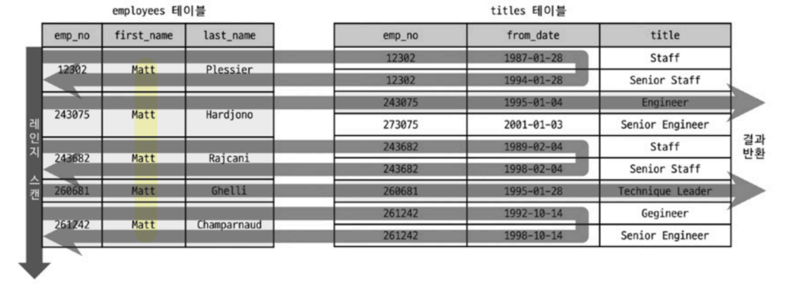
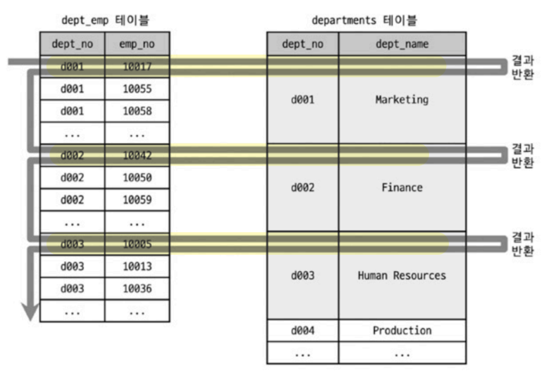
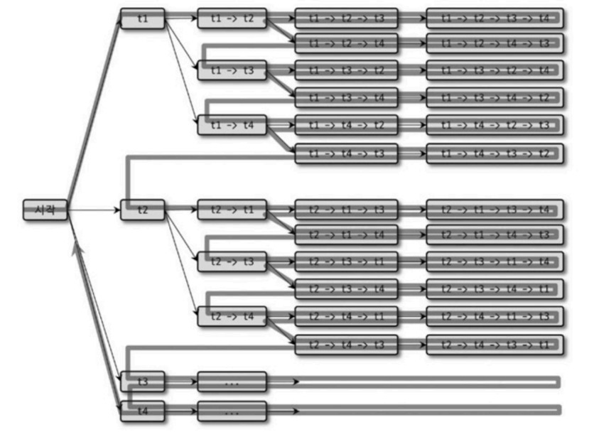
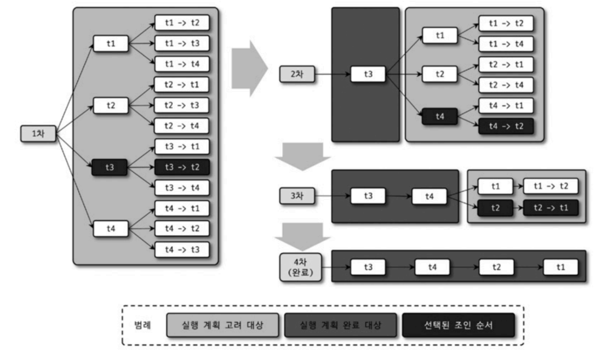
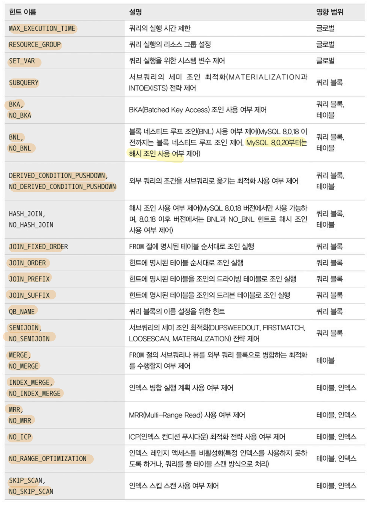
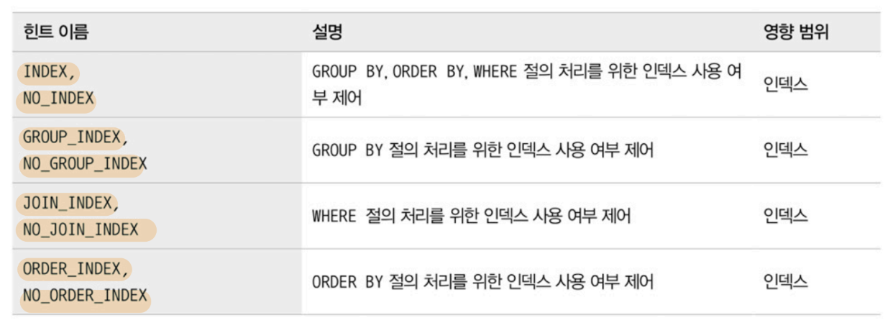

# 9. 옵티마이저와 힌트

- [9.1. 개요](#91-개요)
    - [9.1.1. 쿼리 실행 절차](#911-쿼리-실행-절차)
    - [9.1.2. 옵티마이저의 종류](#912-옵티마이저의-종류)
- [9.2. 기본 데이터 처리](#92-기본-데이터-처리)
    - [9.2.1. 풀 테이블 스캔과 풀 인덱스 스캔](#921-풀-테이블-스캔과-풀-인덱스-스캔)
    - [9.2.2. 병렬 처리](#922-병렬-처리)
    - [9.2.3. ORDER BY 처리 (Using filesort)](#923-order-by-처리-using-filesort)
        - [9.2.3.1. 소트 버퍼](#9231-소트-버퍼)
        - [9.2.3.2. 정렬 알고리즘](#9232-정렬-알고리즘)
        - [9.2.3.3. 정렬 처리 방법](#9233-정렬-처리-방법)
        - [9.2.3.4. 정렬 관련 상태 변수](#9234-정렬-관련-상태-변수)        
    - [9.2.4. GROUP BY 처리](#924-group-by-처리)
        - [9.2.4.1. 인덱스 스캔을 이용하는 GROUP BY(타이트 인덱스 스캔)](#9241-인덱스-스캔을-이용하는-group-by타이트-인덱스-스캔)
        - [9.2.4.2. 루스 인덱스 스캔을 이용하는 GROUP BY](#9242-루스-인덱스-스캔을-이용하는-group-by)
        - [9.2.4.3. 임시 테이블을 사용하는 GROUP BY](#9243-임시-테이블을-사용하는-group-by)
    - [9.2.5. DISTINCT 처리](#925-distinct-처리)
        - [9.2.5.1. SELECT DISTINCT ...](#9251-select-distinct-)
        - [9.2.5.2. 집합 함수와 함께 사용된 DISTINCT](#9252-집합-함수와-함께-사용된-distinct)
    - [9.2.6. 내부 임시 테이블 활용](#926-내부-임시-테이블-활용)
        - [9.2.6.1. 메모리 임시 테이블과 디스크 임시 테이블
](#9261-메모리-임시-테이블과-디스크-임시-테이블)
        - [9.2.6.2. 임시 테이블이 필요한 쿼리](#9262-임시-테이블이-필요한-쿼리)
        - [9.2.6.3. 임시 테이블이 디스크에 생성되는 경우](#9263-임시-테이블이-디스크에-생성되는-경우)
        - [9.2.6.4. 임시 테이블 관련 상태 변수](#9264-임시-테이블-관련-상태-변수)
- [9.3. 고급 최적화](#93-고급-최적화)
    - [9.3.1. 옵티마이저 스위치 옵션](#931-옵티마이저-스위치-옵션)
        - [9.3.1.1. MRR과 배치 키 액세스(BKA)](#9311-mrr과-배치-키-액세스bka)
        - [9.3.1.2. 블록 네스티드 루프 조인](#9312-블록-네스티드-루프-조인)
        - [9.3.1.3. 인덱스 컨디션 푸시다운](#9313-인덱스-컨디션-푸시다운)
        - [9.3.1.4. 인덱스 확장](#9314-인덱스-확장)
        - [9.3.1.5. 인덱스 머지](#9315-인덱스-머지)
        - [9.3.1.6. 인덱스 머지 - 교집합](#9316-인덱스-머지---교집합)
        - [9.3.1.7. 인덱스 머지 - 합집합](#9317-인덱스-머지---합집합)
        - [9.3.1.8. 인덱스 머지 - 정렬 후 합집합](#9318-인덱스-머지---정렬-후-합집합)
        - [9.3.1.9. 세미 조인](#9319-세미-조인)
        - [9.3.1.10. Table Pull-out](#93110-table-pull-out)
        - [9.3.1.11. First match](#93111-first-match)
        - [9.3.1.12. Loose Scan](#93112-loose-scan)
        - [9.3.1.13. Materialization](#93113-materialization)
        - [9.3.1.14. Duplicated Weed-out
](#93114-duplicated-weed-out)
        - [9.3.1.15. Condition Fanout Filter
](#93115-condition-fanout-filter)
        - [9.3.1.16. Derived Merge
](#93116-derived-merge)
        - [9.3.1.17. Invisible Index](#93117-invisible-index)
        - [9.3.1.18. Skip Scan
](#93118-skip-scan)
        - [9.3.1.19. Hash Join](#93119-hash-join)
        - [9.3.1.20. Prefer Ordering Index
](#93120-prefer-ordering-index)
    - [9.3.2. 조인 최적화 알고리즘](#932-조인-최적화-알고리즘)
        - [9.3.2.1. Exhaustive 알고리즘](#9321-exhaustive-알고리즘)
        - [9.3.2.2. Greedy 알고리즘](#9322-greedy-알고리즘)
- [9.4. 쿼리 힌트](#94-쿼리-힌트)
    - [9.4.1. 인덱스 힌트](#941-인덱스-힌트)
        - [9.4.1.1. STRAIGHT_JOIN
](#9411-straight_join)
        - [9.4.1.2. USE INDEX / FORCE INDEX / IGNORE INDEX](#9412-use-index--force-index--ignore-index)
        - [9.4.1.3. SQL_CALC_FOUND_ROWS](#9413-sql_calc_found_rows)
    - [9.4.2. 옵티마이저 힌트](#942-옵티마이저-힌트)
        - [9.4.2.1. 옵티마이저 힌트 종류](#9421-옵티마이저-힌트-종류)
        - [9.4.2.2. MAX_EXECUTION_TIME](#9422-max_execution_time)
        - [9.4.2.3. SET_VAR](#9423-set_var)
        - [9.4.2.4. SEMIJOIN & NO_SEMIJOIN](#9424-semijoin--no_semijoin)
        - [9.4.2.5. SUBQUERY](#9425-subquery)
        - [9.4.2.6. BNL & NO_BNL & HASHJOIN & NO_HASHJOIN](#9426-bnl--no_bnl--hashjoin--no_hashjoin)
        - [9.4.2.7. JOIN_FIXED_ORDER & JOIN_ORDER & JOIN_PREFIX & JOIN_SUFFIX
](#9427-join_fixed_order--join_order--join_prefix--join_suffix)
        - [9.4.2.8. MERGE & NO_MERGE
](#9428-merge--no_merge)
        - [9.4.2.9. INDEX_MERGE & NO_INDEX_MERGE](#9429-index_merge--no_index_merge)
        - [9.4.2.10. NO_ICP](#94210-no_icp)
        - [9.4.2.11. SKIP_SCAN & NO_SKIP_SCAN
](#94211-skip_scan--no_skip_scan)
        - [9.4.2.12. INDEX & NO_INDEX
](#94212-index--no_index)

## 9.1. 개요
- 옵티마이저는 쿼리의 실행 계획 수립
- 어떻게 최소 비용, 최적의 방법으로 쿼리를 실행할지 결정

### 9.1.1. 쿼리 실행 절차
1. 사용자의 SQL 쿼리를 잘개 쪼개서 MySQL 서버가 이해할 수 있는 수준으로 분리(parse tree) -> MySQL 서버
    - SQL 문법 확인
2. parse tree를 확인하면서 어떤 테이블부터 읽고 어떤 인덱스를 이용해 테이블을 읽을지 선택 -> MySQL 서버
    - 불필요한 조건 제거, 복잡한 연산 단순화
    - 여러 테이블을 조인할 경우 어떤 순서로 테이블을 읽을지 결정
    - 각 테이블에 사용된 조건과 인덱스 통계 정보를 이용해 사용할 인덱스 결정
    - 가져온 레코드들을 임시 테이블에 넣고 다시 가공해야 하는지 결정

     -> **실행 계획**
3. 결정된 읽기 순서, 인덱스로 스토리지 엔진에서 데이터 읽기 -> MySQL 서버, 스토리지 엔진

### 9.1.2. 옵티마이저의 종류
- 규칙 기반 최적화 (Rule-based optimizer, RBO)
    - 옵티마이저에 내장된 우선순위에 따라 실행 계획을 수립하는 방식.
    - 통계 정보(레코드 건수, 선택도, 컬럼값 분포도 등)을 고려하지 않아 같은 쿼리에 대해서 거의 항상 같은 실행 방법을 만듦. 
    - 데이터의 분포도는 다양하기 때문에 오래전부터 많은 DBMS에서 거의 사용되지 않음
- 비용 기반 최적화 (Cost-based optimizer, CBO)
    - 쿼리를 처리하기 위한 여러 가지 방법을 만들고 각 단위 작업의 비용(부하) 정보와 대상 테이블의 예측된 통계 정보를 이용해 실행 계획별 비용 산출
    - 산출된 비용 중 최소 비용의 처리 방식을 선택해 최종적으로 쿼리 실행

## 9.2. 기본 데이터 처리

### 9.2.1. 풀 테이블 스캔과 풀 인덱스 스캔
- 풀 테이블 스캔 선택
    1. 테이블의 레코드 건수가 너무 작아서 인덱스로 읽는 것보다 풀 테이블 스캔이 더 빠른 경우 (일반적으로 테이블이 페이지 1개로 구성된 경우)
    2. WHERE 절이나 ON 절에 인덱스를 이용할 수 있는 적절한 조건이 없는 경우
    3. 인덱스 레인지 스캔을 사용할 수 있더라도 옵티마이저가 판단한 조건 일치 레코드 건수가 너무 많은 경우
- 대부분 DBMS는 풀 테이블 스캔할 때 한꺼번에 여러 개의 블록이나 페이지를 읽어오는 기능 내장
- MySQL에는 한꺼번에 몇 개씩 페이지를 읽어올지에 대한 시스템 변수가 없음
- MySQL에서 풀 테이블 스캔할 때 디스크로부터 페이지를 하나씩 읽어 오는 것은 MyISAM 스토리지 엔진만 해당 (InnoDB x)
- InnoDB 스토리지 엔진은 특정 테이블의 연속된 데이터 페이지가 읽히면 **백그라운드 스레드에서 read ahead 작업** 실행
    > Read ahead: 어떤 영역의 데이터가 앞으로 필요할 것으로 예측해서 요청이 오기 전에 미리 디스크를 읽어서 InnoDB 버퍼 풀에 적재해 두는 것
- 처음 몇 개의 데이터 페이지는 포그라운드 스레드가 읽기 실행, 특정 시점부터는 백그라운드 스레드가 한 번에 4개, 8개씩 페이지를 읽으면서 계속 그 수를 증가시킴, 최대 64개의 데이터 페이지까지 읽어서 InnoDB 버퍼풀에 적재
- 포그라운드 스레드는 버퍼 풀에서 적재된 데이터 페이지를 사용
- `innodb_read_ahead_threshold` 시스템 변수로 언제 Read ahead를 시작할지 임계값 설정
- Read ahead는 풀 테이블 스캔뿐만 아니라 풀 인덱스 스캔에서도 사용
```sql
SELECT COUNT(*) FROM employees
```
- 위와 같이 레코드의 건수만 필요한 쿼리라면 테이블이 아닌 용량이 작은 인덱스를 선택하고 풀 인덱스 스캔 (디스크 읽기 횟수를 줄임)

### 9.2.2. 병렬 처리
- MySQL 8.0 버전부터 쿼리 병렬 처리 가능 (일부 용도에 한정)
    - 하나의 쿼리를 여러 스레드가 작업을 나누어 동시에 처리
- `innodb_parallel_read_threads` 시스템 변수로 하나의 쿼리를 최대 몇 개의 스레드로 처리할지 결정
- 쿼리를 병렬로 처리하게 하는 힌트나 옵션은 없음.
- WHERE 조건 없이 단순히 테이블의 전체 건수를 가져오는 쿼리만 병렬로 처리
- 스레드 개수를 CPU 코어 개수보다 크게 설정하면 오히려 성능이 떨어질 수 있음

### 9.2.3. ORDER BY 처리 (Using filesort)
1. 인덱스
    - 장점
        - 이미 인덱스가 정렬되어 있어 순서대로 읽으면 되므로 매우 빠름
    - 단점
        - INSERT, UPDATE, DELETE 작업 시 인덱스 추가/삭제 작업이 필요하므로 느림
        - 디스크 공간 더 많이 필요
        - 인덱스의 개수가 늘어날수록 InnoDB 버퍼 풀을 위한 추가 메모리 필요
2. Filesort
    - 장점
        - 인덱스가 필요없기 때문에 인덱스의 단점이 장점으로 작용
        - 메모리에서 처리되기 때문에 정렬해야 할 레코드가 많지 않으면 매우 빠름
    - 단점
        - 정렬 작업이 쿼리 실행 시점에 처리되기 때문에 정렬할 레코드가 많아질수록 쿼리 속도가 느림

- 정렬을 인덱스를 이용하도록 튜닝하는 것이 불가능한 경우
    1. 정렬 기준이 너무 많아서 요건별로 모두 인덱스를 생성하는 것이 불가능한 경우
    2. GROUP By의 결과 또는 DISTINCT 같은 처리의 결과를 정렬해야 하는 경우
    3. UNION의 결과와 같이 임시 테이블의 결과를 다시 정렬해야 하는 경우
    4. 랜덤하게 결과 레코드를 가져와야 하는 경우
- 별도의 정렬 처리를 수행했으면 실행 게획의 Extra 컬럼에 `Using filesort` 메시지가 표시됨

#### 9.2.3.1. 소트 버퍼
- 정렬을 수행하기 위해서 별도의 메모리 공간을 할당받아 사용하며 이 메모리 공간을 소트 버퍼(Sort buffer)라고 함
- 정렬이 필요한 경우에만 할당
- 버퍼 크기는 정렬할 레코드의 크기에 따라 가변적으로 증가
- 최대 사용 가능한 버퍼 크기는 `sort_buffer_size` 시스템 변수로 설정
- 소트 버퍼는 쿼리 실행이 완료되면 즉시 시스템으로 반납
- 정렬할 레코드 수가 할당된 소트 버퍼보다 크면 여러 조각으로 나눠서 처리, 이 때 **임시 저장을 위해 디스크 사용**
    - 레코드 일부를 소트 버퍼에서 정렬 -> 디스크에 저장 -> 반복 -> 정렬된 레코드를 다시 병합하면서 정렬
    - 멀티 머지: 정렬된 레코드를 다시 병합하는 작업
    - 수행한 멀티 머지 횟수는 `Sort_merge_passes` 상태 변수에 누적 집계
- 버퍼 크기를 매우 크게 할당하더라도 성능이 항상 빠른 것은 아님
    - 큰 메모리 할당 공간때문에 성능이 훨씬 떨어질 수 있음
- 56KB ~ 1MB가 적절한 소트 버퍼 크기
- 소트 버퍼는 세션 메모리 영역에 할당
    - 클라이언트마다 할당되는 공간
    - 커넥션이 많을수록, 정렬 작업이 많을수록 소트 버퍼로 소비되는 메모리 공간이 커짐
    - OOM이 발생할 수 있음
    - 운영체제의 OOM killer는 여유 메모리를 확보하기 위해 메모리를 가장 많이 사용하는 프로세스를 강제 종료하기 때문에 MySQL 서버가 1순위가 될 수 있음

#### 9.2.3.2. 정렬 알고리즘
```sql
-- 옵티마이저 트레이스 활성화
SET OPTIMIZER_TRACE="enabled=on", END_MARKERS_IN_JSON=on;
SET OPTIMIZER_TRACE_MAX_MEM_SIZE=1000000;

-- 쿼리 실행

-- 트레이스 내용 확인
SELECT * FROM INFORMATION_SCHEMA.OPTIMIZER_TRACE \G;
```
- 옵티마이저 트레이스 기능으로 어떤 정렬모드를 사용하는지 확인
    - `sort_algorithm`: 사용한 정렬 알고리즘
    - `sort_mode`: 사용한 정렬 모드
        - `<sort_key, rowId>`: 정렬 키와 레코드의 Row ID만 가져와서 정렬 -> **Two pass**
        - `<sort_key, additional_fields>`: 정렬 키와 레코드 전체를 가져와서 정렬, 레코드의 컬럼들은 **고정 사이즈**로 메모리에 저장 -> **Single pass**
        - `<sort_key, packed_additional_fields>`: 정렬 키와 레코드 전체를 가져와서 정렬, 레코드의 컬럼들은 **가변 사이즈**로 메모리에 저장 -> **Single pass**

싱글 패스
- 정렬 대상 컬럼을 포함하여 SELECT 대상이 되는 컬럼 전부를 소트 버퍼에 담아서 정렬을 수행하는 방식
- 테이블을 한 번만 읽고 소트 버퍼에 모두 담기 때문에 더 많은 소트 버퍼 공간 필요
- 최신 버전에서 일반적으로 사용
- 정렬 대상 레코드의 크기나 건수가 작은 경우 성능이 빠름

투 패스
- 정렬 대상 컬럼과 PK만 소트 버퍼에 담아서 정렬 수행, 정렬된 순서대로 다시 PK로 테이블을 읽어서 SELECT할 컬럼을 가져오는 방식
- 테이블을 두 번 읽어야 함
- 정렬 대상 레코드의가 크기나 건수가 많을 경우 효율적
- MySQL은 두 가지 경우에 투 패스 정렬 방식 사용
    1. 레코드 크기가 `max_length_for_sort_data` 시스템 변수 값보다 클 경우
    2. BLOB, TEXT 타입의 컬럼이 SELECT 대상에 포함될 때

> `SELECT * FROM ...`와 같이 필요하지 않은 컬럼까지 가져올 경우 소트 버퍼를 비효율적으로 사용할 가능성이 크다. 따라서 SELECT 시 꼭 필요한 컬럼만 조회하도록 작성해야 한다. 특히 정렬이 필요하거나 임시 테이블을 사용하는 SELECT라면 더더욱 신경써야 한다.

#### 9.2.3.3. 정렬 처리 방법
- 3가지 처리 방법 중 하나로 정렬을 처리, 아래로 갈수록 처리 속도는 떨어짐
    1. 인덱스를 사용한 정렬 (별도 표기 없음)
    2. 조인에서 드라이빙 테이블만 정렬 (`Using filesort`)
    3. 조인에서 조인 결과를 임시 테이블로 저장 후 정렬 (`Using temporary; Using filesort`)
- 정렬 처리를 위해 인덱스를 사용할 수 있는지 검토
- 사용할 수 없다면 WHERE 조건에 일치하는 레코드를 검색해 소트 버퍼에 저장하면서 정렬 처리(filesort)
- 정렬 대상 레코드를 최소화하기 위해 두가지 방법 중 하나를 선택
    1. 조인의 드라이빙 테이블만 정렬 후 조인 수행
    2. 조인이 끝나고 일치하는 레코드를 모두 가져온 후 정렬 수행
    - 1번이 레코드 건수가 더 적기 떄문에 더 효율적으로 처리

1. 인덱스를 사용한 정렬
    - `ORDER BY`에 명시된 컬럼이 제일 먼저 읽는 테이블(조인일 경우 드라이빙 테이블)에 속해야 함
    - `ORDER BY`의 순서대로 인덱스가 있어야 함 (다중 컬럼 인덱스)
    - `WHERE`절에 첫 번째로 읽는 테이블의 컬럼에 대한 조건이 있다면 그 조건과 `ORDER BY`가 같은 인덱스를 사용할 수 있어야 함
    - 해시 인덱스나 전문 검색 인덱스는 인덱스를 사용한 정렬을 사용할 수 없음
    - R-Tree 인덱스도 불가능
    - 여러 테이블이 조인되는 경우 Nested-loop 조인에서만 사용 가능
    - 인덱스는 정렬되어 있기 때문에 순서대로 읽기만 하고 정렬을 위한 추가 작업은 수행하지 않음
        - 인덱스를 사용한 정렬일 때 `ORDER BY`로 명시하더라도 추가적인 작업이 발생하지 않음
        - 쿼리의 실행 계획이 변경되면 명시하지 않은 쿼리는 기대했던 결과를 가져오지 못할 수 있기 때문에 명시하는 것이 좋음
        - 성능 상의 손해가 없음
    - 조인 버퍼가 사용된 조인은 순서가 변경될 수 있기 때문에 주의
2. 조인의 드라이빙 테이블만 정렬
    - 조인하기 전에 드라이빙 테이블의 레코드를 먼저 정렬 한 후 조인 실행
    - 드라이빙 테이블의 컬럼만으로 `ORDER BY`를 작성해야 함
3. 임시 테이블을 이용한 정렬
    - 정렬의 3가지 방법 중 정렬할 레코드 건수가 가장 많기 때문에 가장 느림

정렬 처리 방법 성능
- `ORDER BY`나 `GROUP BY`와 같은 작업은 `WHERE` 조건을 만족하는 레코드를 `LIMIT` 만큼 가져와서 처리할 수 없다.
- 조건을 만족하는 레코드를 모두 가져와서 정렬, 그루핑 작업을 수행한 후 LIMIT으로 건수를 제한할 수 있다.
- WHERE 조건을 잘 튜닝해도 잘못된 `ORDER BY`나 `GROUP BY`때문에 쿼리가 느려질 수 있다.
1. 스트리밍 처리
    - 조건에 일치하는 레코드를 검색할 때마다 바로바로 클라리언트로 전송
    - OLTP 환경에서는 쿼리 요청으로부터 첫 번째 레코드를 전달받기 까지의 응답 시간이 중요
    - 스트리밍 처리는 얼마나 많은 레코드를 조회하느냐에 상관없이 빠른 응답 시간 보장
    - LIMIT이 걸려있으면 쿼리 전체 실행 시간을 상당히 줄일 수 있음
2. 버퍼링 처리
    - `ORDER BY`나 `GROUP BY`와 같은 작업은 스트리밍 처리 불가
    - 결과를 먼저 모아서 MySQL 서버에서 일괄 가공해야 하기 때문에 모든 결과를 스토리지 엔진으로부터 가져올 때까지 기다려야 함
- 3가지 정렬 방법 중 인덱스를 사용한 정렬 방식만 스트리밍 처리 방식
- 가능하다면 인덱스를 사용한 정렬로 유도
- 최소한 드라이빙 테이블만 정렬해도 되는 수준으로 유도
- MySQL 서버는 정렬 위해 퀵 소트와 힙 소트 알고리즘 사용
    - LIMIT 10을 만족하는 상위 10건을 정렬하기 위해 더 많은 작업이 필요할 수 있음
    - 인덱스를 사용하지 못하는 쿼리를 페이징 처리할 경우 LIMIT을 걸더라도 쿼리가 기대만큼 빨라지지 않음

#### 9.2.3.4. 정렬 관련 상태 변수
```sql
SHOW STATUS LIKE 'Sort%';
```
- `Sort_merge_passes`: 멀티 머지 처리 횟수
- `Sort_range`: 인덱스 레인지 스캔을 통해 검색 결과에 대한 정렬 작업 횟수
- `Sort_scan`: 풀 테이블 스캔을 통해 검색된 결과에 대한 정렬 작업 횟수
- `Sort_rows`: 지금까지 정렬한 전체 레코드 건수

### 9.2.4. GROUP BY 처리
- 스트리밍 처리를 할 수 없음
- `HAVING`절은 `GROUP BY`의 결과에 대해 필터링 역할
    - 인덱스를 사용할 수 없음
- 인덱스로 `GROUP BY` 작업을 처리하는 경우
    1. 인덱스를 차례대로 읽는 인덱스 스캔
    2. 인덱스를 건너뛰면서 읽는 루스 인덱스 스캔
- 인덱스를 사용할 수 없으면 임시 테이블 사용

#### 9.2.4.1. 인덱스 스캔을 이용하는 GROUP BY(타이트 인덱스 스캔)
- 조인의 드라이빙 테이블에 속한 컬럼만으로 그루핑할 때 `GROUP BY` 컬럼에 이미 인덱스가 있으면 해당 인덱스로 그루핑 작업 및 조인 처리
- 인덱스를 통해 처리되는 쿼리는 이미 정렬된 인덱스를 읽는 것이기 때문에 쿼리 실행 시점에 추가적인 정렬이나 내부 임시 테이블이 필요하지 않음
- 그룹 함수 등으로 그룹값을 처리하면 임시 테이블 필요
- 실행 계획의 Extra 컬럼에 별도의 메시지가 표시되지 않음

#### 9.2.4.2. 루스 인덱스 스캔을 이용하는 GROUP BY
- 실행 계획의 Extra 컬럼에 `Using index for group-by` 메시지 표시
- 단일 테이블에 대해 수행하는 `GROUP BY` 처리만 가능
- prefix index(컬럼값의 앞쪽 일부만으로 생성된 인덱스)는 사용 불가능
- 인덱스 레인지 스캔과 달리 유니크한 값의 개수가 적을수록 성능 향상 -> 분포도가 좋지 않은 인덱스
- `MIN()`, `MAX()`와 같이 집합 함수를 사용할 경우 루스 인덱스 스캔 사용 불가

#### 9.2.4.3. 임시 테이블을 사용하는 GROUP BY
- 실행 계획의 Extra 컬럼에 `Using temporary` 메시지 표시
- 인덱스를 전혀 사용할 수 없을 때 임시 테이블 사용
- MySQL 8.0 이전에는 `GROUP BY` 컬럼을 기준으로 묵시적인 정렬까지 수행했지만 MySQL 8.0 이후부터 더 이상 수행하지 않음
    - 묵시적인 정렬을 제거하기 위해 `ORDER BY NULL`을 추가하지 않아도 됨
- 내부적으로 `GROUP BY` 절의 컬럼들로 구성된 유니크 인덱스를 가진 임시 테이블을 만들어서 중복 제거와 집합 함수 연산 수행
- 조인의 결과를 한 건씩 가져와 임시 테이블에서 중복 체크를 하면서 INSERT 또는 UPDATE 실행
    - 별도의 정렬 작업을 수행하지 않음

### 9.2.5. DISTINCT 처리
- 집합 함수와 같이 `DISTINCT` 처리가 인덱스를 사용하지 못하면 항상 임시 테이블 필요
- 실행 계획의 Extra 컬럼에는 `Using temporary` 메시지가 표시되지 않음

#### 9.2.5.1. SELECT DISTINCT ...
- `GROUP BY`와 동일한 방식으로 처리
- 레코드를 유니크하게 조회하는 것이고 특정 컬럼만 유니크하게 조회하는 것이 아님
```sql
SELECT DISTINCT first_name, last_name FROM employees;

SELECT DISTINCT(first_name), last_name FROM employees; -- 의미없는 괄호
```
- 이 때는 first_name, last_name의 조합이 유니크한 레코드를 가져오는 것
- `DISTINCT`는 함수가 아니기 때문에 괄호를 사용하더라도 의미 없는 괄호로 해석하고 제거해버림

#### 9.2.5.2. 집합 함수와 함께 사용된 DISTINCT
- `COUNT()`, `MIN()`, `MAX()`와 같은 집합 함수 내에서 사용될 경우 그 집합 함수의 인자로 전달된 컬럼값이 유니크한 것들을 조회

### 9.2.6. 내부 임시 테이블 활용
- MySQL 엔진이 사용하는 임시 테이블을 처음에 메모리에 생성됐다가 테이블이 커지면 디스크로 이동
- 특정 케이스에서는 바로 디스크에 생성
- 사용자가 생성한 임시 테이블(CREATE TEMPORARY TABLE)과 달리 내부적인 임시 테이블은 쿼리가 완료되면 자동 삭제

#### 9.2.6.1. 메모리 임시 테이블과 디스크 임시 테이블
- MySQL 8.0 버전부터 메모리는 `TempTable` 스토리지 엔진 사용
    - MEMORY -> TempTable (가변 길이 타입 지원)
- 디스크에 저장되는 임시 테이블은 `InnoDB` 스토리지 엔진 사용
    - MyISAM -> InnoDB (트랜잭션 지원)
- `internal_tmp_mem_storage_engine` 시스템 변수로 메모리용 임시 테이블 설정
- `temptable_max_ram` 시스템 변수로 최대 메모리 크기 설정 (default 1GB)
    - 메모리의 임시 테이블 크기가 시스템 변수 이상으로 커지면 디스크로 기록
    - 2가지 저장 방식 중 하나를 선택
        - MMAP 파일
        - InnoDB 테이블
    - 어떤 방식을 선택할지는 `temptable_use_mmap` 시스템 변수로 설정
    - MMAP 파일로 전환하는 것이 오버헤드가 더 적기 때문에 기본값이 ON임 
- 메모리를 거치지 않고 바로 디스크에 생성되는 경우 `internal_tmp_disk_storage_engine` 시스템 변수로 설정

#### 9.2.6.2. 임시 테이블이 필요한 쿼리
1. `ORDER BY`와 `GROUP BY`에 명시된 컬럼이 다른 쿼리
2. `ORDER BY`와 `GROUP BY`에 명시된 컬럼이 조인의 드라이빙 테이블이 아닌 쿼리
3. `DISTINCT`와 `ORDER BY`가 동시에 쿼리에 존재하는 경우 또는 `DISTINCT`가 인덱스로 처리되지 못하는 쿼리
4. `UNION`이나 `UNION DISTINCT`가 사용된 쿼리(select_type 컬럼이 UNION RESULT인 경우)
5. 쿼리의 실행 계획에서 select_type이 DERIVED인 쿼리

- 실행 계획의 Extra 컬럼에 `Using temporary` 메시지 표시
- 3, 4, 5는 표시되지 않음
- 5는 유니크 인덱스가 없는 내부 임시 테이블 생성
    - 유니크 인덱스가 있는 임시 테이블보다 처리 성능이 상당히 느림
- MySQL 8.0 버전부터 `UNION ALL`을 사용한 쿼리는 임시 테이블을 사용하지 않음
- `UNION`과 `UNION DISTINCT`는 동일하게 동작함

#### 9.2.6.3. 임시 테이블이 디스크에 생성되는 경우
- `UNION`이나 `UNION ALL`에서 SELECT되는 컬럼 중에 길이가 512byte 이상인 컬럼이 있는 경우
- `GROUP BY`나 `DISTINCT` 컬럼에서 512byte 이상인 컬럼이 있는 경우
- 메모리 임시 테이블의 크기가 `temptable_max_ram` 시스템 변수보다 큰 경우
- MySQL 8.0.13 버전부터 TempTable 메모리 임시테이블을 사용할 때 BLOB, TEXT 컬럼을 가진 임시 테이블도 메모리에 생성하도록 개선

#### 9.2.6.4. 임시 테이블 관련 상태 변수
- `Using temporary`만 보면 임시 테이블이 어디에 생성됐는지, 몇 개 생성됐는지 알 수 없음
```sql
-- 현재 세션 상태 값 초기화
FLUSH STATUS;

-- 쿼리 실행

-- 상태 조회
SHOW SESSION STATUS LIKE 'Created_tmp%';
```
- `Created_tmp_tables`: 쿼리 처리를 위해 생성된 내부 임시 테이블 개수를 누적하는 상태 값, 메모리와 디스크를 구분하지 않음
- `Created_tmp_disk_tables`: **디스크**에 생성된 내부 임시 테이블 개수를 누적하는 상태 값

## 9.3. 고급 최적화
- 조인 관련된 옵티마이저 옵션
- 옵티마이저 스위치
    - MySQL 5.5 버전부터 지원

### 9.3.1. 옵티마이저 스위치 옵션
- `optimizer_switch` 시스템 변수를 이용해서 제어

|옵티마이저 스위치 이름|기본값|설명|
|--|--|--|
|batched_key_access|off|BKA 조인 알고리즘을 사용할지 여부 설정|
|block_nested_loop|on|Block Nested Loop 조인 알고리즘을 사용할지 여부 설정|
|engine_condition_pushdown|on|Engine Condition Pushdown 기능을 사용할지 여부 설정|
|index_condition_pushdown|on|Index Condition Pushdown 기능을 사용할지 여부 설정|
|use_index_extensions|on|Index Extension 최적화를 사용할지 여부 설정|
|index_merge|on|Index Merge 최적화를 사용할지 여부 설정|
|index_merge_intersection|on|Index Merge Intersection 최적화를 사용할지 여부 설정|
|index_merge_sort_union|on|Index Merge Sort Union 최적화를 사용할지 여부 설정|
|index_merge_union|on|Index Merge Union 최적화를 사용할지 여부 설정|
|mrr|on|MRR 최적화를 사용할지 여부 설정|
|mrr_cost_based|on|비용 기반 MRR 최적화를 사용할지 여부 설정|
|semijoin|on|세미 조인 최적화를 사용할지 여부 설정|
|firstmatch|on|FirstMatch 세미 조인 최적화를 사용할지 여부 설정|
|loosescan|on|LooseScan 세미 조인 최적화를 사용할지 여부 설정|
|materialization|on|Materialization 최적화를 사용할지 여부 설정 (Materialization 세미 조인 최적화 포함)|
|subquery_materialization_cost_based|on|비용 기반 Materialization 최적화를 사용할지 여부 설정|

- default를 설정하면 기본값 적용
- 글로별, 세션별 모두 설정할 수 있는 시스템 변수
```sql
SELECT /*+ SET_VAR(optimizer_switch='condition_fanout_filter=off') */ ... FROM ...
```
- `SET VAR` 옵티마이저 힌트를 이용해 현재 쿼리에만 설정 가능

#### 9.3.1.1. MRR과 배치 키 액세스(BKA)
- MRR은 Multi-Range Read의 약어
- 기존의 네스티드 루프 조인은 드라이빙 테이블의 레코드를 한 건 읽어서 드리븐 테이블의 일칳라는 레코드를 찾아서 조인하는 방식
- 내부 구조상 조인 처리는 MySQL 엔진, 실제 레코드 검색은 스토리지 엔진이 담당
- 이러한 방식은 스토리지 엔진에서 아무런 최적화를 수행할 수 없음
- 단점을 보완하기 위해 드라이빙 테이블의 레코드를 읽어서 조인 버퍼에 버퍼링
- 조인 버퍼가 가득차면 MySQL 엔진이 버퍼링된 레코드를 스토리지 엔진으로 한 번에 요청
- 이러한 방식이 MRR이며 MRR을 응용해서 실행되는 조인 방식이 BKA(Batched Key Access) 조인
- BKA 조인 최적화의 default는 off
    - 부가적인 정렬 작업이 필요해지면서 오히려 성능이 안좋아지는 경우 발생

#### 9.3.1.2. 블록 네스티드 루프 조인
- 대부분의 조인은 네스티드 루프 조인이며 `ON`절 컬럼에 모두 인덱스가 있어야 함 (드리븐 테이블)
- 이중 for문과 유사하게 동작
    - 드라이빙 테이블의 레코드를 읽어서 다른 버퍼 공간에 저장하지 않고 바로 드리븐 테이블의 레코드를 찾아서 반환
- 블록 네스티드 루프 조인은 실행 계획의 Extra 컬럼에 `Using join buffer` 메시지 표시
    - 조인 버퍼 사용
- 어떤 방식으로도 드리븐 테이블의 풀 테이블 스캔이나 인덱스 풀 스캔을 피할 수 없다면 옵티마이저는 드라이빙 테이블에서 읽은 레코드를 조인 버퍼에 캐시한 후 드리븐 테이블과 조인 버퍼를 조인해서 처리
    - 조인의 순서가 거꾸로인 것처럼 실행
    - 드리븐 테이블의 결과를 기준으로 조인 버퍼에 캐시된 드라이빙 테이블과 병합
    - 일반적으로 조인 후 결과는 드라이빙 테이블의 순서에 의해 결정되지만, 조인 버퍼가 사용되면 정렬 순서가 변경될 수 있음
- 조인 버퍼 크기는 `join_buffer_size` 시스템 변수로 설정
- MySQL 8.0.20 버전부터 블록 네스티드 루프 조인은 **해시 조인 알고리즘으로 대체**

#### 9.3.1.3. 인덱스 컨디션 푸시다운
- MySQL 5.6 버전부터 도입
- 인덱스가 체크 조건으로 사용되면 스토리지 엔진이 레코드를 읽은 후 MySQL 엔진이 필터링
- 컨디션 푸시다운을 사용하면 체크 조건도 스토리지 엔진에게 전달하여 불필요한 레코드 읽기 제거

#### 9.3.1.4. 인덱스 확장
- 세컨더리 인덱스에 자동으로 추가된 PK를 활용할지 여부를 결정
- 옵티마이저는 세컨더리 인덱스 마지막에 PK가 있다는 것을 인지하고 실행 계획 수립
- `ORDER BY pk`를 하더라도 세컨더리 인덱스를 통해 처리

#### 9.3.1.5. 인덱스 머지
- 대부분 옵티마이저는 테이블 별로 하나의 인덱스만 사용하도록 실행 계획 수립
- 인덱스 머지 실행 계획을 사용하면 하나의 테이블에 2개 이상의 인덱스를 사용해 쿼리 처리
- 쿼리에 사용된 가각이 조건이 서로 다른 인덱스를 사용할 수 있고, 그 조건을 만족하는 레코드가 많을 것으로 예상되면 인덱스 머지 실행 계획 선택
- 3개의 세부 실행 계획
    1. `index_merge_intersection`
    2. `index_merge_sort_union`
    3. `index_merge_union`
- 여러 개의 인덱스를 사용하지만 각각의 결과를 어떻게 병합할지에 따라 구분

#### 9.3.1.6. 인덱스 머지 - 교집합
- 실행 계획의 Extra 컬럼에 `Using intersect(인덱스명1, 인덱스명2)` 메시지 표시
- 여러 개의 인덱스를 탐색해서 그 결과의 **교집합**만 반환

#### 9.3.1.7. 인덱스 머지 - 합집합
- 실행 계획의 Extra 컬럼에 `Using union(인덱스명1, 인덱스명2)` 메시지 표시
- WHERE 절에 사용된 2개 이상의 조건이 인덱스를 사용하면서 **OR** 연산자로 연결된 경우
    - 하나라도 인덱스를 사용하지 못하면 풀 테이블 스캔으로 밖에 처리할 수 없음
- 인덱스의 결과를 **합집합**으로 반환
- 두 인덱스 결과에서 중복을 제거하려면 정렬 작업이 필요
- 실행 계획에 정렬했다는 표시는 없지만 PK로 이미 정렬되어 있기 때문에 하나씩 가져와 비교하면서 중복 레코드 제거
- 중복 제거를 수행할 때 우선순위 큐 사용

#### 9.3.1.8. 인덱스 머지 - 정렬 후 합집합
- 실행 계획의 Extra 컬럼에 `Using sort_union(인덱스명1, 인덱스명2)` 메시지 표시
- 인덱스 머지 작업 중에 결과의 정렬이 필요할 경우 인덱스 머지 최적화의 sort union 알고리즘 사용

#### 9.3.1.9. 세미 조인
- 다른 테이블과 조인을 수행하지 않고 조건에 일치하는 레코드가 있는지만 체크하는 형태의 쿼리
- 서브 쿼리
- 세미 조인 최적화가 없었을 때는 테이블을 풀스캔하면서 레코드마다 서브쿼리의 조건과 일치하는지 비교했었음
- `= (subquery)`, `IN (subquery)` 세미 조인 쿼리 최적화 방법
    1. 세미 조인 최적화
    2. IN-to-EXISTS 최적화
    3. MATERIALIZATION 최적화
- `<> (subquery)`, `NOT IN (subquery)` 안티 세미 조인 쿼리 최적화 방법
    1. IN-to-EXISTS 최적화
    2. MATERIALIZATION 최적화

세미 조인 최적화
1. Table Pull-out
    - 사용 가능하면 항상 세미 조인보다 좋은 성능을 보임
    - 별도의 옵티마이저 옵션 제공 x
2. Duplicated Weed-out
3. First Match
4. Loose Scan
5. materialization

#### 9.3.1.10. Table Pull-out
- 서브쿼리에 사용된 테이블을 아우터 쿼리로 끄집어낸 후 쿼리를 조인 쿼리로 재작성하는 형태
- 실행 계획의 id 값이 같으면 두 테이블이 서브쿼리가 아닌 조인으로 처리됐음을 의미
- Extra 컬럼에 메시지가 표시되지 않음
- 실행 계획의 id 컬럼을 확인하거나 `EXPLAIN` 명령 직후 `SHOW WARNINGS` 명령으로 옵티마이저가 재작성한 쿼리 확인
- 제한 사항 및 특성
    - 세미 조인 서브쿼리에서만 사용 가능
    - 서브쿼리 부분이 유니크 인덱스나 PK 룩업으로 결과가 1건인 경우만 사용 가능
    - 기존 쿼리에서 가능했던 최적화 방법이 사용 불가능한 것은 아니므로 MySQL에서는 가능하다면 Table Pull-out 최적화를 최대한 적용
    - 서브쿼리의 모든 테이블이 아우터 쿼리로 끄집어낼 수 있다면 서브쿼리 자체는 없어짐
    - 서브쿼리를 조인으로 풀어서 사용하는 튜닝 방법을 적용할 필요없음

#### 9.3.1.11. First match



- `EXISTS(subquery)` 형태로 튜닝한 것과 비슷한 방법
- 실행 계획의 id 값이 같고, Extra 컬럼에 `FirstMatch(e)` 메시지 표시
- 일치하는 레코드 1건만 찾으면 더이상 서브 쿼리 테이블을 탐색하지 않음
- MySQL 5.5 버전에서 수행했던 `IN-to-EXISTS` 최적화 방법과 거의 비슷하게 처리
    - First match는 조인 형태로 처리하기 때문에 동등 조건 전파가 서브쿼리뿐만 아니라 아우터 쿼리의 테이블까지 전파할 수 있음
    - First match는 서브쿼리의 모든 테이블에 최적화를 수행할지, 일부 테이블에 대해서만 수행할지 취사선택 가능
- 제한 사항 및 특성
    - 서브쿼리는 그 서브쿼리가 참조하는 모든 아우터 테이블이 먼저 조회된 이후에 실행
    - 실행 계획의 Extra 컬럼에 `FirstMatch(table-N)` 메시지 표시
    - 상관 서브쿼리(Correlated subquery)에서도 사용 가능
    - `GROUP BY`나 집합 함수가 사용된 서브쿼리에서는 사용 불가
- `optimizer_switch` 시스템 변수에서 `semijoin`, `firstmatch` 옵션이 모두 ON으로 활성화되어야 사용할 수 있음

#### 9.3.1.12. Loose Scan



- 루스 인덱스 스캔과 비슷한 읽기 방식
- 서브쿼리로 사용된 테이블이 드라이빙 테이블로 실행
- 실행 계획의 id 값이 같고, Extra 컬럼에 `LooseScan` 메시지 표시
- 서브쿼리가 루스 인덱스 스캔을 사용할 수 있는 조건이 갖춰져야 함

#### 9.3.1.13. Materialization
- 내부 임시 테이블 생성
- 실행 계획의 table 컬럼에 임시 테이블 표시
- 실행 계획의 select_type 컬럼에 `MATERIALIZED` 표시
- 서브쿼리가 먼저 실행된 후 임시 테이블 생성, 임시 테이블과 아우터 테이블 조인
- 다른 서브쿼리 최적화와 달리 서브쿼리 내에 `GROUP BY`절이 있어도 사용 가능
- 제한 사항 및 특성
    - `IN(subquery)`에서 서브쿼리는 상관 서브쿼리(Correlated subquery)가 아니어야 함
    - 서브쿼리는 `GROUP BY`나 집합 함수들이 사용되어도 구체화(materialization) 사용 가능
    - 내부 임시 테이블 사용
- `optimizer_switch` 시스템 변수에서 `semijoin`, `materialization` 옵션이 모두 ON으로 활성화되어야 사용할 수 있음

#### 9.3.1.14. Duplicated Weed-out
- 세미 조인 서브쿼리를 일반적인 `INNER JOIN`으로 바꿔서 실행하고 마지막에 중복된 레코드를 제거하는 방법
- 원본 쿼리를 `INNER JOIN` + `GROUP BY`로 바꿔서 실행하는 것과 동일한 작업으로 쿼리 처리
- 실행 계획의 id 값이 같고, Extra 컬럼에 `Start temporary`, `End temporary` 메시지 표시
- 제한 사항과 특성
    - 상관 서브쿼리(Correlated subquery)에서도 사용 가능
    - `GROUP BY`나 집합 함수가 사용된 서브쿼리에서는 사용 불가
    - 서브쿼리의 테이블을 조인으로 처리하기 때문에 최적화할 수 있는 방법이 많음

#### 9.3.1.15. Condition Fanout Filter
- 조인을 실행할 때 테이블의 순서는 쿼리의 성능에 매우 큰 영향
- 옵티마이저는 여러 테이블이 조인되는 경우 가능하다면 일치하는 레코드 건수가 적은 순서대로 조인
- 최적화가 활성화되면 옵티마이저는 나머지 조건에 대해서 얼마나 조건을 충족할 수 있는지 고려
- 실행 계획의 filtered 컬럼에 반영
- 옵티마이저가 조건을 만족하는 레코드 건수를 정확하게 예측할 수 있다면 더 빠른 실헹 계획을 만들어 낼 수 있을 것
- 다음과 같은 컬럼의 조건들에 대해 조건을 만족하는 레코드의 비율을 계산
    1. `WHERE` 조건절에 사용된 컬럼에 대해 인덱스가 있는 경우
    2. `WHERE` 조절절에 사용된 컬럼에 대해 히스토그램이 존재하는 경우
- 실행 계획을 수립할 때 인덱스 통계 정보만 사용하는 것이 아닌 다음 순서대로 사용 가능한 방식 선택
    1. 레인지 옵티마이저
        - 인덱스의 데이터를 살펴보고 레코드 건수 예측 (실행 계획 수립 단계 때 빠르게 소량의 데이터를 읽음)
    2. 히스토그램
    3. 인덱스 통계
    4. 추측

#### 9.3.1.16. Derived Merge
- 예전 버전의 MySQL은 `FROM`절에 사용된 서브쿼리를 먼저 실행해서 임시 테이블 생성
- 이 때의 임시 테이블을 파생 테이블(derived table)이라고 함
- 실행 계획의 select_type 컬럼에 `DERIVED` 표시
- 서브 쿼리 테이블을 읽어서 임시 테이블에 INSERT한 후 다시 임시 테이블을 읽어야 하기 때문에 레코드를 복사하고 읽는 오버헤드 추가
- 임시 테이블이 커지면 디스크에 쓰여짐
- MySQL 5.7 버전부터 파생 테이블로 만들어지는 서브쿼리를 외부 쿼리와 병합해서 서브쿼리 부분을 제거하는 최적화 도입
- `derived_merge` 옵션으로 활성화 여부 결정
- 다음과 같은 조건의 서브쿼리는 옵티마이저가 자동으로 외부 쿼리로 병합할 수 없음
    - `SUM()`, `MIN()`, `MAX()`와 같은 집계 함수와 윈도우 함수 사용
    - `DISTINCT` 사용
    - `GROUP BY`나 `HAVING` 사용
    - `LIMIT` 사용
    - `UNION` 또는 `UNION ALL` 포함
    - `SELECT`절에 사용
    - 값이 변경되는 사용자 변수 사용
- 이 때는 서브쿼리를 외부 쿼리로 수동 병합해서 작성하는 것이 쿼리 성능 향상에 도움

#### 9.3.1.17. Invisible Index
- MySQL 8.0 버전부터 인덱스의 가용 상태를 제어할 수 있는 기능 추가
```sql
-- 해당 인덱스를 사용하지 못하도록 변경
ALTER TABLE {테이블명} ALTER INDEX {인덱스명} INVISIBLE;

-- 해당 인덱스를 사용하도록 변경
ALTER TABLE {테이블명} ALTER INDEX {인덱스명} VISIBLE;
```
- 인덱스를 삭제하지 않고 해당 인덱스를 사용하지 못하게 제어
- `use_invisible_indexes` 옵티마이저 옵션을 ON으로 설정하면 `INVISIBLE`인 인덱스라도 옵티마이저가 사용할 수 있음

#### 9.3.1.18. Skip Scan
- 인덱스의 선행 컬럼이 조건절에 사용되지 않더라도 후행 컬럼 조건만으로도 인덱스 사용
- 인덱스의 선행 컬럼의 유니크 개수가 많을 경우 인덱스 스킵 스캔 최적화가 비효율적일 수 있음

#### 9.3.1.19. Hash Join
- MySQL 8.0.18 버전부터 지원
- 네스티드 루프 조인보다 항상 빠르지 않음
- 첫 번째 레코드를 찾는데 시간이 오래 소요, 최종 레코드를 찾는 데까지는 오래 걸리지 않음
- 반면, 네스티드 루프는 첫 번째 레코드를 찾는 데 상대적으로 빠르며 최종 레코드를 찾는데 시간이 오래 소요
- 해시 조인 -> Best Throughput 전략
- 네스티드 루프 조인 -> Best Response-time 전략
- 일반적인 웹 서비스는 온라인 트랜잭션(OLTP) 서비스이기 때문에 스루풋도 중요하지만 응답 속도가 더 중요
- 조인 조건의 컬럼이 인덱스가 없거나 조인 대상 테이블 중 일부의 레코드 건수가 매우 적은 경우 해시 조인 적용
- MySQL 8.0.20 버전부터 조인 버퍼를 사용하는 블록 네스티드 루프 조인은 더 이상 사용되지 않고, 네스티드 루프 조인을 사용할 수 없는 쿼리는 해시 조인이 사용
- 실행 계획의 Extra 컬럼에 `Using join buffer (hash join)` 메시지 표시
1. 빌드 단계
    - 레코드 건수가 적어 해시 테이블로 만들기 용이한 테이블로 메모리에 해시 테이블 생성 -> 빌드 테이블
2. 프로브 단계
    - 나머지 테이블의 레코드를 읽어서 해시 테이블의 일치 레코드를 찾음 -> 프로브 테이블
- 실행 계획에서 빌드, 프로브 테이블을 식별하기 어려우므로 `EXPLAIN FORMAT=TREE` 또는 `EXPLAIN ANALIZE` 명령 사용
- 해시 테이블의 레코드 건수가 많아 조인 버퍼 공간이 부족하면 빌드 테이블과 프로브 테이블을 청크로 분리
    1. 빌드 테이블로 해시 테이블 생성 -> A
    2. 조인 버퍼보다 커지면 나머지는 청크 단위로 쪼갬 -> B, C, D, ...
    3. 프로브 테이블과 해시 테이블(A) 조인 -> A' (1차 조인 결과)
    4. 프로브 테이블을 청크 단위로 쪼갬
    5. 빌드 테이블 청크로 해시 테이블 구축
    6. 프로브 테이블 청크를 순회하면서 해시 테이블(B, C, D, ...) 조인 -> B', C', D', ... (2차 조인 결과)
    7. 반복
    > 왜 프로브 테이블도 청크 단위로 쪼갤까? 빌드 테이블 청크 N개를 순회하면서 프로브 테이블 하나와 조인하면 안되나?
- 만들어질 해시 테이블이 조인 버퍼보다 큰지 미리 알 수 없기 때문
- 2차 해시 함수를 이용해 두 테이블을 동일 개수의 청크로 쪼개 디스크에 저장
- 클래식 해시 조인 (Classic hash join) -> 메모리에서 모두 처리 가능한 경우
- 그레이스 해시 조인 (Grace hash join) -> 해시 테이블이 조인 버퍼 메모리보다 큰 경우

#### 9.3.1.20. Prefer Ordering Index
- `ORDER BY`나 `GROUP BY`가 인덱스를 사용해 처리 가능한 경우 쿼리의 실행 계획에서 해당 인덱스의 가중치를 높이 설정해서 실행
```sql
SELECT * FROM employees
WHERE hire_date BETWEEN '1985-01-01' AND '1985-02-01'
ORDER BY emp_no;
```
1. hire_date의 세컨더리 인덱스로 조건에 일치하는 레코드를 찾은 후 PK로 정렬해서 결과 반환
2. PK를 정순으로 읽으면서 조건에 일치하는지 비교 후 결과 반환
- 인덱스 가중치로 인해 옵티마이저는 2번을 선택
- WHERE 조건에 부합하는 레코드 건수가 많지 않으면 1번이 더 효율적일 것
- MySQL 8.0.21 버전부터 인덱스에 가중치를 부여하지 않도록 `prefer_ordering_index` 옵티마이저 옵션 추가
- 기본값은 ON이며 옵티마이저가 자주 실수한다면 OFF로 변경

### 9.3.2. 조인 최적화 알고리즘
```sql
SELECT * FROM t1, t2, t3, t4, ...
WHERE ...
```

#### 9.3.2.1. Exhaustive 알고리즘



- MySQL 5.0 버전까지 사용되던 조인 최적화 기법
- `FROM`절에 명시된 모든 테이블의 조합에 대해 실행 계획 비용을 계산해서 최적의 조합 1개를 찾는 방법
- 조합이 n!이기 때문에 실행 계획을 수립하는데 시간이 오래 소요

#### 9.3.2.2. Greedy 알고리즘



- exhaustive 알고리즘의 문제점을 해결하기 위해 MySQL 5.0 버전부터 도입
- 전체 테이블 중에서 `optimizer_search_depth` 시스템 변수에 정의된 개수의 테이블로 가능한 조인 조합 생성
- 생성된 조인 조합 중에서 최소 비용의 실행 계획 한 개 선정
- 반복
- `optimizer_search_depth` 시스템 변수의 기본값은 62이며 이 값에 따라 조인 최적화의 비용이 상당히 줄어들 수 있음
- `optimizer_search_depth`
    - 0 ~ 62까지의 정숫값 설정
    - 0이면 Greedy 검색을 위한 최적의 조인 검색 테이블 개수를 옵티마이저가 자동으로 결정
    - `optimizer_search_depth` < 조인 테이블 개수이면 `optimizer_search_depth`까지 exhaustive 검색, 나머지는 greedy 검색
    - `optimizer_search_depth` > 조인 테이블 개수이면 exhaustive 검색만 사용
- `optimizer_prune_level`
    - Heuristic 검색이 작동하는 방식 제어
    - `1`: 옵티마이저는 조인 순서 최적화에 경험 기반의 Heuristic 알고리즘 사용
    - `0`: 경험 기반의 Heuristic 알고리즘을 사용하지 않음
    - Heuristic 검색의 핵심은 다양한 조인 순서의 비용을 계산하는 도중에 이미 계산했던 비용보다 큰 경우 언제든지 중간에 계산 포기
    - 아우터 조인으로 연결되는 테이블은 우선순위에서 제거하는 등 경험 기반의 최적화도 Heuristic 검색 최적화에 포함되어 있음
    - Heuristic 검색 최적화는 조인 대상 테이블이 몇 개 없어도 상당한 성능 차이를 보여줌
    - **특별한 요건이 없다면 `0`으로 설정하지 말자**

## 9.4. 쿼리 힌트
- MySQL 서버는 우리 서비스의 비즈니스를 온전히 이해하지 못함
- 이런 경우 옵티마이저에게 쿼리 실행 계획을 어떻게 수립해야 할지 알려줄 필요가 있음
- 힌트 사용

### 9.4.1. 인덱스 힌트
- SQL 문법에 맞게 사용해야 하기 때문에 ANSI-SQL 표준 문법을 준수하지 못함
- SELECT, UPDATE 명령에만 사용 가능

#### 9.4.1.1. STRAIGHT_JOIN
- 옵티마이저 힌트인 동시에 조인 키워드 (저자는 옵티마이저 힌트가 아닌 것들을 인덱스 힌트로 분류)
- SELECT, UPDATE, DELETE 쿼리에서 여러 테이블이 조인되는 경우 조인 순서를 고정
- 여러 테이블이 조인될 때 어떤 테이블이 드라이빙 테이블이 되고 드리븐 테이블이 되는지 알 수 없음
- 옵티마이저는 그때그때 각 테이블의 통계 정보, 쿼리 조건을 기반으로 갖아 최적이라고 판단되는 순서로 조인
- 일반적으로 조인을 하기 위한 컬럼들의 인덱스 여부로 조인 순서 결정
- 인덱스에 문제가 없을 경우 레코드가 적은 테이블을 드라이빙으로 선택
```sql
SELECT STRAIGHT_JOIN ... FROM {테이블명1, 테이블명2, 테이블명3, ...}

SELECT /*! STRAIGHT_JOIN */ ... FROM {테이블명1, 테이블명2, 테이블명3, ...}
```
- `SELECT` 바로 뒤에 사용
- `FROM`절의 테이블 순서대로 조인 수행
- 다음 기준에 맞게 조인 순서가 결정되지 않을 경우에만 힌트로 조인 순서를 조정하는 것이 좋음
    - 임시 테이블(인라인 뷰 또는 파생 테이블)과 일반 테이블 조인: 임시 테이블을 드라이빙 테이블로 선정, 일반 테이블의 인덱스가 없으면 레코드 건수가 적은 쪽을 드라이빙 테이블로 선정
    - 임시 테이블끼리 조인: 임시 테이블은 항상 인덱스가 없기 때문에 크기가 작은 테이블을 드라이빙 테이블로 선정
    > 왜지? 조인 버퍼때문?
    - 일반 테이블끼리 조인: 두 테이블 모두 인덱스가 없으면 조건을 만족하는 레코드가 적은 테이블을 드라이빙 테이블로 선정, 그 외에는 인덱스가 없는 테이블을 드라이빙 테이블로 선정
    > 인덱스가 없는게 드라이빙 테이블이 되어야 네스티드 루프 조인 가능
- STRAIGHT_JOIN 힌트와 비슷한 역할을 하는 옵티마이저 힌트
    - JOIN_FIXED_ORDER -> STRAIGHT_JOIN와 동일한 효과
    - JOIN_ORDER
    - JOIN_PREFIX
    - JOIN_SUFFIX
    > 나머지 3개는 일부 테이블의 조인 순서에 대해서만 제안

#### 9.4.1.2. USE INDEX / FORCE INDEX / IGNORE INDEX
- 사용하려는 인덱스를 가지는 테이블 뒤에 힌트 명시
- PK는 `"PRIMARY"`라고 명시
- `USE INDEX`
    - 옵티마이저에게 특정 테이블의 인덱스를 사용하도록 권장
    - 대부분 사용자의 힌트를 채택하지만 항상 그 인덱스를 사용하는 것은 아님
- `FORCE INDEX`
    - `USE INDEX`보다 옵티마이저에게 미치는 영향이 더 강함
- `IGNORE INDEX`
    - 특정 인덱스를 사용하지 못하게 하는 용도로 사용
    - 때로는 옵티마이저가 풀 테이블 스캔을 사용하도록 유도
- 세 인덱스 힌트 모두 용도 명시 가능 (선택 사항)
- 용도를 명시하지 않으면 주어진 인덱스를 3가지 용도로 사용(사용 가능한 경우)
    - `USE INDEX FOR JOIN`: 테이블 간의 조인뿐만 아니라 레코드를 검색하기 위한 용도까지 포함
    - `USE INDEX FOR ORDER BY`: `ORDER BY` 용도로만 사용
    - `USE INDEX FOR GROUP BY`: `GROUP BY` 용도로만 사용
- 용도는 옵티마이저가 대부분 최적으로 선택하기 때문에 용도까지는 크게 고려하지 않아도 됨
- 전문 검색 인덱스가 있으면 이를 선택하는 경우도 많음
- 옵티마이저는 PK나 전문 검색 인덱스에 가중치를 두고 실행 계획을 수립하기 때문
- 최적의 실행 계호기은 데이터 성격에 따라 시시각각 변함
- 지금 PK를 사용하는 것이 좋은 계획이었다고 하더라도 내일은 달라질 수 있기 때문에 가능하다면 옵티마이저가 당시 통계 정보를 바탕으로 선택하게 하는 것이 가장 좋음
> 힌트는 최후의 보루 느낌

#### 9.4.1.3. SQL_CALC_FOUND_ROWS
- `SQL_CALC_FOUND_ROWS` 힌트가 포함된 쿼리는 LIMIT을 만족하는 수만큼의 레코드를 찾아도 끝까지 검색 수행
    - 최종적으로 LIMIT만큼의 결과를 반환함
- `SQL_CALC_FOUND_ROWS` 힌트가 사용된 쿼리 실행 후 `FOUND_ROWS()` 함수를 사용하면 조건을 만족하는 레코드가 몇 건인지 확인 가능
1. ```sql
    SELECT SQL_CALC_FOUND_ROWS * FROM employees WHERE first_name='Georgi' LIMIT 0, 20;
    SELECT FOUND_ROWS() AS total_record_count;
    ```
    - 쿼리 2번 실행
    - first_name 조건을 처리하기 위해 세컨더리 인덱스를 사용해서 인덱스 레인지 스캔으로 읽어옴
    - `SQL_CALC_FOUND_ROWS` 힌트 때문에 20건이 아닌 전체 레코드 253건 읽어야 함
    - 랜덤 I/O 253번 발생
2. ```sql
    SELECT COUNT(*) FROM employees WHERE first_name='Georgi';
    SELECT * FROM employees WHERE first_name='Georgi' LIMIT 0, 20;
    ```
    - 쿼리 2번 실행
    - first_name 조건을 처리하기 위해 세컨더리 인덱스를 사용해서 인덱스 레인지 스캔으로 읽어옴
    - 커버링 인덱스이기 때문에 I/O는 발생하지 않음
    - 2번째 쿼리에서도 first_name 조건을 처리하기 위해 세컨더리 인덱스를 사용해서 인덱스 레인지 스캔으로 읽어옴
    - LIMIT 제한으로 20건만 읽음
    - 랜덤 I/O 20번 발생
- `SQL_CALC_FOUND_ROWS` 힌트를 사용하면 매우 느릴 수 있음
- SELECT 문장이 UNION(또는 UNION DISTINCT)으로 연결된 경우에는 `FOUND_ROWS()` 함수로 정확한 레코드 건수를 가져올 수 없음
- `SQL_CALC_FOUND_ROWS` 힌트는 개발자의 편의를 위해 만들어진 것

### 9.4.2. 옵티마이저 힌트
- MySQL 5.6 버전부터 추가되기 시작
- 다른 RDBMS에서는 주석으로 해석되기 때문에 ANSI-SQL 표준을 준수

#### 9.4.2.1. 옵티마이저 힌트 종류
- 영향 범위에 따라 4개로 분류
    1. 인덱스: 특정 인덱스의 이름 사용
    2. 테이블: 특정 테이블의 이름 사용
    3. 쿼리 블록: 힌트가 명시된 쿼리 블록에 대해서만 영향
    4. 글로벌(쿼리 전체): 전체 쿼리에 대해 영향





```sql
SELECT /*+ INDEX(employees ix_firstname) */ ... FROM employees ...
```
- 모든 인덱스 수준의 힌트는 반드시 테이블명 선행
- SELECT로 시작하는 서브쿼리 영역을 쿼리 블록이라고 함
- 특정 쿼리 블록에 영향을 미치는 옵티마이저 힌트는 외부 쿼리 블록에서도 사용할 수 있음
- `QB_NAME()`를 사용해서 쿼리 블록에 이름 부여
```sql
SELECT /*+ JOIN_ORDER(e, s@subq1) */ COUNT(*) FROM employees e
WHERE e.emp_no IN (SELECT /*+ QB_NAME(subq1) */ s.emp.no FROM salaries s)
```

#### 9.4.2.2. MAX_EXECUTION_TIME
- 유일하게 쿼리 실행 계획에 영향을 미치지 않는 힌트
- 쿼리 최대 실행 시간 설정
- 밀리초 단위의 시간 설정
- 쿼리가 지정된 시간을 초과하면 쿼리 실패

#### 9.4.2.3. SET_VAR
- 쿼리에서 시스템 변수 제어
- 실행 계획을 바꾸는 용도뿐만 아니라 조인 버퍼나 소트 버퍼 크기를 일시적으로 증가시켜 대용량 처리 쿼리 성능을 향상시키는 용도로도 사용
- 모든 시스템 변수를 제어할 수 없음

#### 9.4.2.4. SEMIJOIN & NO_SEMIJOIN
- 세미조인 최적화 힌트는 외부 쿼리가 아닌 서브쿼리에 명시
- `QB_NAME()` 힌트를 사용하여 세미 조인 힌트를 외부 쿼리 블록에 명시할 수 있음
- 특정 세미 조인 최적화 전략을 사용하지 않게 하려면 `NO_SEMIJOIN` 힌트 명시

#### 9.4.2.5. SUBQUERY
- 세미 조인 최적화가 사용되지 못할 때 사용하는 최적화 방법
- 세미 조인 최적화는 주로 `IN(subquery)` 형태의 쿼리에 사용될 수 있지만 안티 세미 조인 최적화에는 사용될 수 없음
- 이 때는 `IN-to-EXISTS`, `Materialization` 최적화 사용

#### 9.4.2.6. BNL & NO_BNL & HASHJOIN & NO_HASHJOIN
- MySQL 8.0.20 버전부터 해시 조인 알고리즘이 블록 네스티드 루프 조인 대체
- MySQL 8.0.18 버전까지만 `HASHJOIN`, `NO_HASHJOIN` 힌트 유효
- MySQL 8.0.20 버전 이후는 해시 조인 힌트를 사용하려면 `BNL`, `NO_BNL` 힌트를 사용하도록 변경

#### 9.4.2.7. JOIN_FIXED_ORDER & JOIN_ORDER & JOIN_PREFIX & JOIN_SUFFIX
- `STRAIGHT_JOIN` 힌트는 FROM절에 테이블 순서를 종니 순서에 맞게 변경해야 하는 번거로움
- 또한 테이블 일부에만 순서를 적용할 수 없음
- `JOIN_FIXED_ORDER`: `STRAIGHT_JOIN` 힌트와 동일
- `JOIN_ORDER`: 힌트에 명시된 테이블의 순서대로 조인
- `JOIN_PREFIX`: 드라이빙 테이블만 강제
- `JOIN_SUFFIX`: 드리븐 테이블만 강제

#### 9.4.2.8. MERGE & NO_MERGE
- 예전 버전의 MySQL은 `FROM`절에 사용된 서브쿼리를 항상 내부 임시 테이블로 생성
- MySQL 5.7, 8.0 버전에서는 가능하면 임시 테이블을 사용하지 않도록 `FROM`절의 서브쿼리를 외부 쿼리와 병합하는 최적화 도입
- 때로는 내부 임시 테이블을 생성하는 것이 나을 수도 있음
- `MERGE` 힌트를 사용하면 서브 쿼리를 외부 쿼리와 병합
- `NO_MERGE` 힌트를 사용하면 파생 테이블 사용

#### 9.4.2.9. INDEX_MERGE & NO_INDEX_MERGE
- 하나의 테이블에서 여러 개의 인덱스를 동시에 사용하는 것을 인덱스 머지라고 함
- 항상 성능 향상을 보장할 수 없음
- `INDEX_MERGE` 힌트를 사용하면 인덱스 머지 사용
- `NO_INDEX_MERGE` 힌트를 사용하면 인덱스 머지 사용 x

#### 9.4.2.10. NO_ICP
- 인덱스 컨디션 푸시다운(ICP, Index Condition Pushdown)은 항ㅅ아 성능 향상에 도움이 되므로 옵티마이저는 이를 최대한 사용하는 방향으로 실행 계획 수립
- ICP를 비활성하는 힌트만 존재

#### 9.4.2.11. SKIP_SCAN & NO_SKIP_SCAN
- 인덱스의 유니크 개수가 많으면 인덱스 스킵 스캔의 성능은 오히려 떨어짐
- 힌트로 인덱스 스킵 스캔 사용 여부 제어

#### 9.4.2.12. INDEX & NO_INDEX
- 인덱스 힌트를 대체하는 용도
- 테이블명과 인덱스명을 함께 명시
