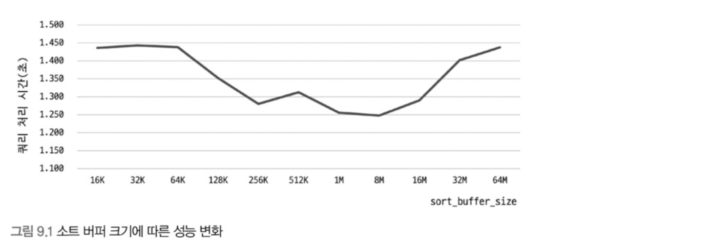

# 9장 옵티마이저와 힌트

# 9.1 개요

## 9.1.1 쿼리 실행 절차

MySQL 서버에서 쿼리가 실행되는 과정은 크게 3단계로 나뉜다.

1. 사용자로부터 요청된 SQL 문장을 쪼개서 MySQL 서버가 이해할 수 있는 수준으로 분리(파스 트리)한다.
    - 1단계를 “SQL 파싱”일고 하며, MySQL 서버의 “SQL 파서”라는 모듈로 처리한다. SQL 문장이 잘못되면 이 단계에서 걸린다.
    - 파스 트리가 만들어진다.
2. 파싱 정보(파스 트리)를 확인해 어떤 테이블 부터 읽고 어떤 인덱스를 이용해 테이블을 읽을지 선택한다.
    - 불필요한 조건 제거 및 복잡한 연산 단순화
    - 여러 테이블 조인시 테이블 읽을 순서 결정
    - 사용할 인덱스 결정
    - 가져온 레코드를 다시 가공해야할지 결정
    - 최적화 및 실행 단계 수립 단계이며 MySQL 서버의 옵티마이저에서 처리한다.
    - 이 단계가 끝나면 실행 계획이 만들어진다.
3. 2단계에서 결정된 테이블 읽기 순서나 선택된 인덱스를 이용해 스토리지 엔진으로 부터 데이터를 가져온다.

첫 번째 단계와 두 번째 단계는 거의 MySQL엔진에서 처리하고 세 번째 단계는 MySQL 엔진과 스토리지 엔진이 동시에 참여해 처리한다.

## 9.1.2 옵티마이저 종류

옵티마이저는 DB 서버에서 두뇌 같은 역할을 담당한다.

옵티마이저는 크게 2가지로 나눌 수 있다.

- 규칙 기반 최적화 방법(Rule-Based optimizer, RBO)
    - 과거에 사용하던 방식
    - 상대적으로 느린 CPU 연산 탓에 비용 계산 과정이 부담스럽다는 이유로 사용했던 방식
    - 내장된 우선순위에 따라 실행 계획을 수립하는 방식
- 비용 기반 최적화 방법(Cost-based optimizer, CBO)
    - 여러 가지 가능한 방법을 만들고 각 단위 작업의 비용 정보와 대상 테이블의 예측된 통계 정보를 이용해 실행 계획별 비용을 산출하는 방식
    - 최소 비용인 방식을 선택해 최종 쿼리를 실행한다.

# 9.2 기본 데이터 처리

모든 RDBMS는 데이터를 정렬하거나 그루핑하는 등의 기본 데이터 가공 기능을 가지고 있다.

결과물이 동일해도 RDBMS마다 그 결과를 만들어내는 과정이 천차만별이다.

MySQL 서버가 어떤 알고리즘을 사용하는지 살펴보자.

## 9.2.1 풀 테이블 스캔과 풀 인덱스 스캔

MySQL 옵티마이저는 다음 조건일 경우 풀 테이블 스캔을 선택한다.

- 테이블 레코드 건수가 너무 작아서 풀 테이블 스캔이 더 빠른 경우(일반적으로 테이블이 페이지 1개로 구성된 경우)
- WHERE, ON 절에 인덱스를 이용할 수 있는 적절한 조건이 없는 경우
- 인덱스 레이닞 스캔을 사용할 수 있는 쿼리여도 옵티마이저가 판단하기에 조건 일치 레코드 건수가 너무 많은 경우(B-Tree를 샘플링해서 조사한 통계 정보 기준)

일반적으로 DBMS는 풀 테이블 스캔을 실행하면 한번에 여러 개의 블록이나 페이지를 읽어오는 기능을 내장하고 있다.

InnoDB는 특정 테이블의 연속된 데이터 페이지가 읽히면 백그라운드 스레드에 의해 리드 어헤드(Read ahead) 작업이 자동으로 시작된다.

**리드 어헤드**란 어떤 영역의 데이터가 앞으로 필요해지리라는 것을 예측해서 요청이 오기 전에 미리 디스크에서 읽어 InnoDB 버퍼 풀에 가져다 두는 것을 의미한다.

풀 테이블 스캔이 실행되면 처음 몇 개의 데이터 페이지는 포그라운드 스레드가 페이지 읽기를 실행하지만 특정 시점 부터는 백그라운드 스레드로 넘겨서 한번에 4개 또는 8개씩 읽으면서 계속 그 수를 증가시키고 한 번에 최대 64 데이터 페이지까지 읽게 되어 상당히 빨리 처리된다.

MySQL 서버에선 `innodb_read_ahead_threshold` 변수로 리드 어헤드 시작 임계값을 설정할 수 있따.

데이터 웨어하우스용으로 MySQL을 사용하면 위 값을 낮게 설정하면 좋다.

리드 어헤드는 풀 인덱스 스캔에서도 동일하게 사용된다.

```sql
SELECT COUNT(*) FROM employees;
```

위 쿼리는 풀 테이블 스캔을 할 것 처럼 보이지만 풀 인덱스 스캔을 할 가능성이 높다.

단순히 레코드 건수만 필요하기 때문에 용량이 작은 인덱스를 선택하는 것이 디스크 읽기 횟수를 줄일 수 있기 때문이다.

테이블 자체의 용량이 작아서 훨씬 빠른 처리가 가능하다.

```sql
SELECT * FROM employees;
```

하지만 위 쿼리는 인덱스 외의 칼럼도 필요하기 때문에 풀 테이블 스캔을 한다.

## 9.2.2 병렬 처리

8.0 버전부터는 MySQL에서 쿼리의 병렬 처리가 가능해졌다.

> 여기서 말하는 병렬 처리는 하나의 쿼리를 여러 스레드가 나누어 동시에 처리하는 것을 의미한다.
> 

**[설정]**

`innodb_prarallel_read_threads` 변수로 하나의 쿼리를 최대 몇개의 스레드를 이용해 처리할 지 설정할 수 있다.

**[조건]**

```sql
SELECT COUNT(*) FROM salaries;
```

아무런 WHERE 조건 없이 단순히 테이블의 전체 건수를 가져오는 쿼리만 병렬로 처리할 수 있다.

**[주의]**

병렬 처리용 스레드 개수가 늘어날수록 쿼리 처리 속도가 줄어들지만, **서버에 장착된 CPU의 코어 개수를** 넘어서는 경우 오히려 성능이 떨어질 수 있다.

## 9.2.3 ORDER BY 처리(Using filesort)

대부분의 SELECT 쿼리에서 정렬은 필수적으로 사용된다.

레코드를 정렬 처리하는 방법은 크게 2가지로 나뉜다.

### 인덱스를 이용한 방법

**장점**

- INSERT, UPDATE, DELETE 쿼리가 실행될 때 이미 인덱스가 정렬돼 있어서 순서대로 읽기만 하면 되므로 매우 빠르다.

**단점**

- INSERT, UPDATE, DELETE 작업 시 부가적인 인덱스 추가/삭제 작업이 필요하므로 느리다.
- 인덱스 때문에 디스크 공간이 더 많이 필요하다.
- 인덱스 개수가 늘어날수록 InnoDB 버퍼 불을 위한 메모리가 많이 필요하다.

모든 정렬을 인덱스를 이용하도록 튜닝하는 것은 거의 불가능하다.

- 정렬 기준이 많은 경우 모두 인덱스를 생성하는 것이 불가능한 경우
- GROUP BY 나 DISTINCT 같은 처리 결과를 정렬하는 경우
- UNION 같이 임시 테이블의 결과를 정렬하는 경우
- 랜덤하게 결과를 레코드를 가져와야 하는 경우

### Filesort 를 이용한 방법

**장점**

- 인덱스를 생성하지 않아도 되어서 인덱스 사용시 단점이 장점으로 바뀐다.
- 정렬할 레코드가 많지 않으면 메모리에서 Filesort가 처리되므로 충분히 빠르다.

**단점**

- 정렬이 쿼리 실행시 처리되므로 정렬 처리할 레코드 대상이 많아질수록 쿼리 응답 속도가 느려진다.

Filesort 를 사용했는지 실행 계획의 Extra 칼럼에 “Using fileosrt” 메시지가 표시되는지로 확인할 수 있다.

### 9.2.3.1 소트 버퍼

- 일반적으로 정렬을 수행하기 위해 별도의 메모리 공간을 할당 받아서 사용하게 되는데 이 공간을 **소트 버퍼(Sort buffer)**라고 한다.
- 소트 버퍼의 공간은 정렬해야할 레코드에 따라 가변적으로 증가하지만 최대 사용 가능한 공간은 `sort_buffer_size` 라는 변수로 설정할 수 있다.
- 소트 버퍼는 정렬이 완료되면 시스템에 다시 반납된다.

**[소트 버퍼 최대 공간보다 큰 데이터를 정렬해야한다면?]**

- 레코드를 여러 조각으로 나눠서 처리하게 되는데 이 과정에서 임시 저장을 위해 디스크를 사용한다.
- 레코드를 정렬하고 디스트에 임시 저장하고, 다음 레코드를 가져와서 정렬해서 디스크에 저장하는 과정을 반복한다.
- 각 버퍼의 크기만큼 정려된 레코드를 다시 가져와서 정렬을 수행해야하는데 이 병합 작업을 **멀티 머지(Multi-merge)**라고 한다.
- 멀티 머지 횟수는 `Sort_merge_passes`라는 상태 변수에서 누적 집계된다.

**[소트 버퍼 공간을 크게 설정한다면?]**

소트 버퍼를 크게 설정하면 디스크를 사용하지 않아 더 빨라질 것이라고 생각할 수 있는데 실제로 벤치마크에서는 큰 차이를 보이지 않는다.

```sql
SELECT * FROM salaries
	ORDER BY to_date
```



256KB ~ 8MB에서는 최적의 성능을 보였으나 그 이상 커지면 성능이 떨어진다.

리눅스 계열의 운영체제에서는 너무 큰 소트 버퍼는 큰 메모리 공간 할당 때문에 성능이 훨씬 떨어질 수 있다.

소트 버퍼의 메모리 영역은 세션(로컬) 메모리 영역(세션 메모리 영역은 4.1.3절 참고)이다. 즉, 정렬을 위해 할당되는 메모리 공간이 여러 클라이언트가 공유하는 공간이 아니다. 따라서 커넥션이 많아질수록, 정렬 작업이 많을수록 소프 버퍼로 소비되는 메모리 공간이 커진다. 

소트 버퍼의 크기를 **10MB**이상 설정하면 대량의 레코드를 정렬하는 쿼리가 여러 커넥션에서 동시에 실행하면 메모리 부족 현상을 겪을 수 있다. 이는 MySQL 서버 강제종료로 이어질 수 있다.

**[적절한 소트 버퍼 크기는?]**

작가의 경험상 56KB ~ 1MB 미만이 적절해보인다.

**[언제 소트 버퍼 크기를 늘릴까?]**

소트 버퍼를 크게 설정하면 빠른 성능은 얻을 수 없지만 디스크 I/O 사용량은 줄일 수 있다. 따라서 서버의 데이터가 많거나 디스크의 I/O 성능이 낮은 장비라면 소트 버퍼를 크게 설정하는게 도움이 될 수 있다. 그러나 너무 크게 설정하면 메모리 부족 현상을 겪을 수 있기에 주의하자.

그리고 대량 데이터의 정렬이 필요한 경우 해당 세션의 소트 버퍼 크기만 일시적으로 크게 늘려서 쿼리를 실해앟고 다시 줄이는 것도 좋은 방법이다.

### 9.2.3.2 정렬 알고리즘

레코드 정렬할 때 소트 버퍼에 레코드 전체를 담을지 또는 정렬 기준 칼럼만 담을지에 따라 
“**싱글 패스(Single-pass)**” 와 “**투 패스(Two-pass)**” 2가지 정렬 모드로 나뉜다.

**[어떤 정렬 모드가 사용되는지 확인]**

```sql
SET OPTIMIZER_TRACE="enabled=on", END_MARKERS_IN_JSON=on;
SET OPTIMIZER_TRACE_MAX_MEM_SIZE=1000000;
```

위 명령어를 치면 옵티마이저 트레이스를 활성화 할 수 있다.


`filesort_summary` 색션의 `sort_algorithm` 필드에 정렬 알고리즘이 표시된다.

`sort_mode` 필드에는 `<fixed_sort_key, packed_additional_fields>` 가 표시된 것을 확인할 수 있다.

더 정확히는 MySQL 서버에서 정렬 방식을 다음 3가지가 있다.

<aside>
💡

**정렬 방식 3가지**

<sort_key, rowid>: 정렬 키와 레코드의 로우 아이디만 가져와서 정렬하는 방식

- 투 패스 정렬 방식

<sort_key, additional_fields>: 정렬 키와 레코드 전체를 가져와서 정렬하는 방식, 레코드의 칼럼들이 고정 사이즈 메모리 저장

- 싱글 패스 정렬 방식

<sort_key, packed_additional_fields>: 정렬 키와 레코드 전체를 가져와서 정렬하는 방식, 레코드의 칼럼들이 가변 사이즈 메모리 저장

- 싱글 패스 정렬 방식
- 5.7부터 도입된 방식으로 메모리 공간을 효율적으로 사용하기 위해 도
</aside>

### 싱글 패스 정렬 방식

SELECT 대상이 되는 칼럼은 전부 담아와서 정렬을 수행하는 방식

```sql
SELECT emp_no, first_name, last_name
		FROM employees
		ORDER BY first_name;
```


처음 DB에서 조회할 때 정렬에 필요하지 않는  `last_name` 도 모두 전부 읽어서 소트 버퍼에 담고 정렬을 수행한다. 그리고 정렬이 완료되면 정렬 내용 그대로 클라이언트에 넘겨준다.

### 투 패스 정렬 방식

정렬 대상 칼럼과 프라이머리 키 값만 소트 버퍼에서 가져와서 정렬하는 방식, 정렬 이후 정렬 순서대로 다시 프라이머리 키로 테이블을 읽어서 SELECT할 칼럼을 가져온다.


싱글 패스 정렬 방식 도입 이전부터 사용하던 방식이다.

**[어떤 방식이 더 좋을까?]**

투 패스 방식은 테이블을 두 번 읽어야 하기 떄문에 상당히 불합리하다. 반면에 싱글 패스 정렬 방식은 더 많은 소트 버퍼 공간이 필요하다.

정렬 대상 레코드의 크기나 건수가 작은 경우 싱글 패스 방식이 빠른 성능을 보인다.

정렬 대상 레코드의 크기나 건수가 많은 경우 투 패스 방식이 효율적이다.

**[그래서 어떤 방식을 사용할까?]**

최신 버전에서는 일반적으로 싱글 패스 방식을 주로 사용한다.

하지만 다음 경우에는 싱글 패스가 아니라 투 패스 방식을 사용한다.

- 레코드의 크기가 `max_length_for_sort_data` 변수 값보다 클 때
- BLOB이나 TEXT 타입의 칼럼이 SELECT 대상에 포함될 때

**[필요한 칼럼만 가져와서 정렬하자]**

모든 칼럼(*) 을 가져와서 정렬을 하게 되면 정렬 버퍼를 몇 배에서 몇 십배 까지 비효율적으로 사용할 가능성이 크다. 정렬이 필요한 SELECT는 불필요한 칼럼을 SELECT 하지 않게 쿼리를 작성하는 것이 효율적이다.

### 9.2.3.3 정렬 처리 방법

쿼리에 ORDER BY가 사용되면 반드시 3가지 처리 방법 중 하나로 정렬되어 처리된다. 

일반적으로 아래로 갈 수록 처리 속도는 떨어진다.


인덱스를 이용할 수 있다면 “Filesort” 과정 없이 순서대로 읽어서 반환한다.

인덱스를 활용할 수 없다면 2가지 방법 중 하나를 선택한다.

1. **조인의 드라이빙 테이블만 정렬한 다음 조인을 수행**
    - 드라이빙 테이블이란 기준이 되는 테이블을 말한다. 여기선 조인의 기준이 되는 테이블을 말함
2. **조인이 끝나고 일치하는 레코드를 모두 가져온 뒤 정렬을 수행**

일반적으로 조인이 수행되면 레코드 건수가 배로 늘어나기 때문에 드라이빙 테이블만 정렬한 뒤 조인을 수행하는 것이 효율적이다.

### 인덱스를 이용한 정렬

**[조건]**

- ORDER BY에 명시된 칼럼이 제일 먼저 읽는 테이블에 속해야 한다.
- ORDER BY 순서대로 생성된 인덱스가 있어야 한다.
- WHERE 절에 첫 번째로 읽는 테이블의 칼럼에 대한 조건이 있다면 그 조건과 ORDER BY는 같은 인덱스를 사용할 수 있어야한다.
- B-Tree 계열(R-Tree 제외) 인덱스여야 한다.
- 여러 테이블이 조인되는 경우 네스티드-루프(Nested-loop) 방식의 조인에서만 이용할 수 있다.

<aside>
💡

**네스티드-루프 방식의 조인**

 말 그대로 **중첩된 반복문(nested loop)** 형태로 데이터를 비교하는 방식입니다. 이 방식은 한 테이블의 각 레코드에 대해 다른 테이블의 레코드들을 하나씩 비교하면서 매칭되는 데이터를 찾아내는 방식입니다.

```sql
SELECT *
FROM A
JOIN B ON A.id = B.id;
```

네스티드 루프 방식으로 이 쿼리가 수행되면:

```
1.	A 테이블의 첫 번째 레코드(id=1)를 선택합니다.
2.	B 테이블의 모든 레코드를 하나씩 순차적으로 읽으며 id=1인 레코드가 있는지 찾습니다.
3.	B 테이블에서 매칭되는 레코드를 찾으면 결과로 반환하고, 없다면 다음 A 테이블의 레코드를 선택하여 반복합니다.

```

</aside>

**[ORDER BY는 생략하지 말자]**


인덱스를 이용해 정렬해야하는 경우 실제 인덱스 값에 따라 정렬되어 있기 때문에 ORDER BY 를 생략해도 동일한 결과를 얻을 수 있다.

하지만 추후 인덱스 조건이 변경될 가능성도 있고 ORDER BY를 추가한다 하더라도 정렬이 필요 없는 경우 불필요한 정렬 작업을 수행하지 않기 때문에 ORDER BY를 추가해도 성능상 손해가 없다. 따라서 추후 버그로 이어지지 않게 ORDER BY를 명시해두자.

### 조인의 드라이빙 테이블만 정렬

일반적으로 조인 실행시 레코드의 건수가 배로 늘어나기 때문에 드라이빙 테이블의 정렬 이후 조인을 실행하는 것이 좀 더 효율적이다.

이 방법으로 처리되려면 드라이빙 테이블의 칼럼만으로 ORDER BY 절을 작성해야한다.

```sql
SELECT *
		FROM employees e, salaries s
		WHERE s.emp_no=e.emp_no
		AND e.emp_no BETWEEN 100002 AND 100010
		ORDER BY e.last_name;
```

**[옵티마이저가 employess 테이블을 드라이빙 테이블로 선택하는 이유]**

- WHERE 검색 조건 `e.emp_no BETWEEN 100002 AND 100010` 은 employees 테이블의 프라이머리 키로 검색하면 작업량을 줄일 수 있다.
- 드리븐 테이블(salaries)의 조인 칼럼인 emp_no 칼럼에 인덱스가 있다.

**[과정]**

ORDER BY절에 명시된 칼럼은 프라이머리 키와 연관이 없기 떄문에 인덱스를 이용한 정렬이 불가능하다.

그런데 ORDER BY절의 정렬 칼럼이 드라이빙 테이블(employees)에 포함된 칼럼이다.

따라서 옵티마이저는 드라이빙 테이블만 검색하여 정렬을 수행하고 salaries 테이블을 조인한다.


### 임시 테이블을 이용한 정렬

2개 이상의 테이블을 조인해서 그 결과를 정렬해야 한다면 임시 테이블이 필요하다.(앞서 살펴본 `조인의 드라이빙 테이블만 정렬`은 예외로 임시 테이블을 사용하지 않는다.)

그리고 임시 테이블을 정렬하는 과정을 거친다.

조인 이후 정렬하기 때문에 레코드 건수가 많아 가장 느린 정렬 방법이다.

```sql
SELECT *
		FROM employees e, salaries s
		WHERE s.emp_no=e.emp_no
		AND e.emp_no BETWEEN 100002 AND 100010
		ORDER BY s.salary;
```

위 칼럼은 앞선 예시에서 ORDER BY 부분만 다르다.

앞선 예시와 똑같은 이유로 employees 가 드라이빙 테이블이다.

즉, 위 쿼리는 ORDER BY 절의 기준이 드라이빙 테이블이 아니라 드리븐 테이블에 있는 칼럼이다.

따라서 정렬 수행 이전에 테이블을 읽어야하므로 이 쿼리는 조인된 데이터를 가지고 정렬을 수행할 수 밖에 없다.


실행 계획을 보면 Extra 칼럼에 “Using temporary; Using filesort”라는 코멘트를 통해 조인된 데이터를 가지고 정렬을 수행한 것을 알 수 있다.


### 정렬 처리 방법의 성능 비교

**[LIMIT를 제대로 활용하지 못하게 하는 ORDER BY, GROUP BY]**

주로 웹 서비스용 쿼리에서는 ORDER BY 와 함께 LIMIT를 거의 필수적으로 사용하는 경향이 있다.

일반적으로 LIMIT는 테이블의 처리 결과의 일부분만 가져와서 작업량을 줄이는 역할을 한다.

하지만 ORDER BY나 GROUP BY 같은 작업은 WHERE 조건을 만족하는 레코드를 LIMIT 건수만큼 가져와서 처리할 수 없다. 우선 조건에 만족하는 레코드를 전부 가져와서 정렬이나 그루핑 작업 이후 비로서 LIMIT로 건수를 제한할 수 있다. 따라서 아무리 WHERE 조건이 인덱스를 잘 활용하도록 튜닝해도 ORDER BY나 GROUP BY 때문에 쿼리가 느려지는 경우가 자주 발생한다.

왜 이러한 조건은 LIMIT를 제대로 활용하지 못할까? 이를 이해하기 위해 쿼리가 처리되는 방법을 “**스트리밍 처리**” 와 “**버퍼링 처리**” 라는 2가지 방식으로 구분해보자.

### 스트리밍(Streaming) 방식

처리할 데이터가 얼마나 많은지 상관없이 조건에 일치하는 레코드가 검색될 때 마다 클라이언트에게 전송하는 방식이다. 곧 바로 조건에 일치하는 레코드를 보내주기 때문에 첫 번째 레코드를 매우 빠르게 받을 수 있다.


웹 서비스에서는 첫 번째 레코드를 전달 받기 까지의 응답 시간이 중요하다. 

스트리밍 방식으로 처리되는 쿼리는 LIMIT 처럼 결과 건수를 제한하는 조건들은 쿼리의 전체 실행 시간을 상당히 줄여줄 수 있다.

풀 테이블 스캔의 결과를 바로 클라이언트로 스트리이밍 되기 때문에 LIMIT 조건을 넘어가면 쿼리를 종료할 수 있기에 LIMIT는 전체 실행 시간을 상당히 줄여준다.

### 버퍼링(Buffering) 방식

ORDER BY나 GROUP BY는 우선 WHERE 조건에 일치하는 모든 레코드를 가져온 이후 정렬하거나 그루핑 한 뒤 차례대로 보내야하기 때문에 쿼리 결과를 스트리밍되는 것이 불가능하다.

모든 레코드를 검색한 후 정렬 작업을 하는 동안 클라이언트는 아무것도 하지 못하고 기다려야하기 때문에 응답 속도가 느려진다.


버퍼링 방식은 쿼리 결과를 먼저 모아서 일괄 가공해야한다. 따라서 LIMIT처럼 결과 건수를 제한하는 조건이 있어도 네트워크 전송되는 레코드 건수를 줄일 수 는 있지만 MySQL 서버가 해야하는 작업량에는 그다지 변화가 없다. 

“SELECT * FROM bigtable” 같은 쿼리는 MySQL 서버는 레코드를 읽자마자 클라이언트로 그 결과를 반환한다. MySQL 서버는 스트리밍 방식으로 처리되지만 클라이언트의 JDBC 라이브러리가 버퍼링처리한다.

### 비교

정렬 처리 방법 3가지 방법 중에서 인덱스를 이용한 정렬 방식만 스트리망 형태의 처리이며 나머지는 버퍼링된 후에 정렬된다. 즉, 인덱스를 활용한 정렬 방식만 LIMIT로 제한된 건수만큼 읽으면서 바로 클라이언트에 전달할 수 있다. 그외 방식은 필요한 모든 레코드를 읽은 후 정렬한 다음에야 비로소 LIMIT 제한된 건수만큼 잘라서 클라이언트에 전송할 수 있다.

```sql
SELECT *
		FROM tb_test1 t1, tb_test2 t2
		WHERE t1.col1=t2.col1
		ORDER BY t1.col2
		LIMIT 10;
```

tb_test1 레코드: 100건

tb_test2 레코드: 1000건


먼저 드라이빙되어 조인이 되는지도 중요하지만 어떤 정렬 방식으로 처리되는지가 더 큰 성능 차이를 만든다.

가능하면 인덱스 정렬을 유도하고 그렇지 못하면 최소한 드라이빙 테이블만 정렬해도 되는 수준으로 유도하는 것도 좋은 튜닝 방법이다.

**[인덱스를 사용하지 못해도 LIMIT 조건이 아무런 도움이 안되는 것은 아니다]**

레코드가 1000건인 쿼리에 LIMIT 10이 있다면 서버는 레코드를 모두 정렬하는 것이 아니라 필요한 순서대로 정렬해서 상위 10건만 정렬이 채워지면 정렬을 멈추고 반환한다.

하지만 MySQL 서버는 퀵 소트와 힙 소트 알고리즘을 사용하는데 이는 상위 10건을 정렬하기 위해 많은 작업이 필요할 수 있음을 의미한다.

결론적으로 인덱스를 사용하지 못하는 쿼리에서 LIMIT으로 5~10 건만 조회한다고 쿼리가 기대한 것 만큼 아주 빨라지지 않는다.

### 9.2.3.4 정렬 관리 상태 변수

정렬 처리 수행 횟수를 다음 명령어로 확인할 수 있다.

```sql
FLUSH STATUS;
SHOW STATUS LIKE 'Sort%';
```

자세한 내용은 책 305p 참조

## 9.2.4 GROUP BY 처리

GROUP BY는 스트리밍 처리할 수 없게 하는 처리 중 하나다.

HAVING 절은 GROUP BY 결과에 대해 필터링 역할을 수행하는데 GROUP BY에 사용된 조건은 인덱스를 사용해 처리할 수 없으므로 HAVING 절을 튜닝하려고 인덱스를 생성하거나 다른 방법을 고민할 필요 없다.

GROUP BY 작업도 인덱스를 사용하는 경우와 그렇지 못한 경우로 나눌 수 있다.

- 인덱스 스캔 : 인덱스를 차례대로 읽는 방법
- 루스 인덱스 스캔:   인덱스를 건너뛰면서 읽는 방법

인덱스를 사용하지 못하는 쿼리에서는 GROUP BY 작업은 임시 테이블을 사용한다.

### 9.2.4.1 인덱스 스캔을 이용하는 GROUP BY(타이트 인덱스 스캔)

GROUP BY 칼럼으로 인덱스가 있다면 인덱스를 차례대로 읽으면서 그루핑 작업을 수행하고 그 결과로 조인을 처리한다.

GROUP BY가 인덱스를 사용해서 처리한다 해도 그룹 함수(Aggregation function) 등의 그룹값을 처리해야 해서 임시 테이블이 필요할 때도 있다. 하지만 이미 정렬된 인덱스를 읽는 것이므로 쿼리 실행 시점에 추가적인 정렬이나 내부 임시 테이블은 필요하지 않는다.

이러한 그루핑 방식을 사용하는 쿼리의 실행 계획에서는 별도의 표시가 되지 않는다.

### 9.2.4.2 루스 인덱스 스캔을 이용한 GROUP BY

루스(Loose) 인덱스 스캔 방식은 인덱스의 레코드를 건너뛰면서 필요한 부분만 읽어서 가져오는 것을 의미한다.

루스 인덱스 스캔을 사용하면 실행 계획의 Extra 칼럼에 “Using index for group-by” 가 표시된다.

salaries 테이블의 인덱스는 (emp_no, from_date)로 생성돼 있다.

```sql
EXPLAIN
		SELECT emp_no
		FROM salaries
		WHERE from_date='1985-03-01'
		GROUP BY emp_no;
```

위 쿼리 문장에서 WHERE 조건이 from_date이기 때문에 인덱스 레인지 스캔 접근 방식을 활용할 수 없다.(첫 번째 인덱스로 먼저 정렬되어 있고 그 이후에 두 번째 인덱스로 정렬되어있기 때문)

하지만 실행 계획을 보면 다음과 같이 인덱스 레인지 스캔(range 타입)을 이용했으며, Extra 칼럼에 GROUP BY 처리까지 인덱스를 사용했다는 것을 확인할 수 있다.


이 쿼리가 어떻게 실행됐는지 순서대로 살펴보자.


이해가 잘 안되면 10.3.12.24.2절을 참고하자

루스 인덱스 스캔 방식은 단일 테이블에 대해 수행되는 GROUP BY 처리만 사용할 수 있다.

또한 프리픽스 인덱스는 루스 인덱스 스캔을 사용할 수 없다.

인덱스 레인지 스캔과 반대로 루스 인덱스 스캔은 유니크한 값이 적을수록 성능이 향상된다.

루스 인덱스 스캔으로 처리되는 쿼리는 별도의 임시 테이블이 필요하지 않다.


위는 루스 인덱스 스캔을 사용할 수 없는 쿼리 패턴이다.

참고로 8.0 버전 부터는 루스 인덱스 스캔과 동일한 방식으로 작동하는 **인덱스 스킵 스캔(Index Skip Scan)**이 도입되었다. 따라서 레코드 검색하는 부분까지 최적화가 가능해 졌다고 한다. 인덱스 스킵 스캔 또한 선행 칼럼의 유니크한 값의 개수가 많으면 인덱스 스킵 스캔 최적화를 사용하지 않게 된다.

### 9.2.4.3 임시 테이블을 사용하는 GROUP BY

GROUP BY 기준 칼럼이 인덱스를 전혀 사용하지 못할 때는 이 방식으로 처리된다.

```sql
EXPLAIN
		SELECT e.last_name, AVG(s.salary)
		FROM employees e, salaries s
		WHERE s.emp_no=e.emp_no
		GROUP BY e.last_name;
```


실행 계획을 보면 Extra 칼럼에 “Using temporary” 라는 표시를 보면 임시 테이블이 사용된 것을 알 수 있다.

임시 테이블이 사용된 이유는 emplyees 테이블을 풀 스캔하기 때문이 아니라 인덱스를 전혀 사용할 수 없는 GROUP BY이기 때문이다.

8.0 이전에는 그루핑되는 칼럼에 대해 정렬까지 함께 수행해주었지만 8.0 이후부터는 그루핑이 되어도 묵시적인 정렬을 하지 않는다.(따라서 위에 Extra 칼럼에 “Using filesort”가 없다)

<aside>
💡

**참고**

5.7 버전까지는 그루핑 되면 묵시적으로 정렬을 하기 때문에 만약 정렬을 하고 싶지 않다면 `ORDER BY NULL` 을 해주면 됐다.

정렬을 수행하지 않기 때문에 성능 향상을 볼 수 있었다.

하지만 8.0부터는 정렬을 수행하지 않기 때문에 따로 구문을 추가하지 않아도 된다.

</aside>

**[임시 테이블 생성]**

8.0에서는 GROUP BY 절의 칼럼들로 구성된 유니크 인덱스를 가진 임시 테이블을 만들어서 중복 제거와 집합 함수 연산을 수행한다. 그리고 조인의 결과를 한 건 씩 가져와서 임시 테이블에 중복 체크하면서 INSERT 또는 UPDATE를 실행한다.

따라서 위 쿼리는 아래와 같은 임시 테이블을 만든다.

```sql
CREATE TABLE (
		last_name VARCHAR(16),
		salary INT,
		UNIQUE INDEX ux_lastname(last_name)
);
```

## 9.2.5 DISTINCT 처리

특정 칼럼의 유니크한 값만 조회하는 DISTINCT는 2가지 경우로 구분할 수 있다.

- 집합 함수(MIN(), MAX() 또는 COUNT())와 같이 사용되는 경우
- 집합 함수가 없는 경우

이렇게 구분하는 이유는 DISTINCT 키워드가 영향을 미치는 범위가 달라지기 때문이다.

또한 집합 함수와 같이 사용하는 쿼리의 실행 계획에서 DISTINCT 처리가 인덱스를 활용하지 못하는 경우 항상 임시 테이블이 필요하다. 하지만 실행 계획의 Extra 칼럼에는 “Using temporay”가 출력이 되지 않는다.

### 9.2.5.1 SELECT DISTINCT …

SELECT DISTINCT는 GROUP BY와 동일한 방식으로 처리된다. 특히 8.0버전 부터는 GROUP BY에서 정렬을 묵시적으로 수행하지 않기 때문에 아래 두 쿼리는 내부적으로 동일한 동작을 하게 된다.

```sql
SELECT DISTINCT emp_no FROM salaries;

SELECT emp_no FROM salaries GROUP BY emp_no;
```

**[DISTINCT 는 모든 칼럼에 대해 적용된다]**

DISTINCT는 SELECT하는 레코드를 유니크하게 SELECT하는 것이다.

**특정 칼럼**만 유니크하게 조회하는 것이 **아니다.**

```sql
SELECT DISTINCT fist_name, last_name FROM employees;
```

따라서 위 쿼리는 fist_name만 유니크한 값을 가져오는 것이 아니라 (first_name, last_name) 조합 전체가 유니크한 레코드를 가져온다.

```sql
SELECT DISTINCT(fist_name), last_name FROM employees;
```

위와 같이 수행해도 DISTINCT 는 함수가 아니기 때문에 의미 없는 괄호로 해석하고 제거하게 된다. 따라서 위 두 쿼리는 동일한 결과를 반환한다.

SELECT 절에서 사용되는 DISTINC 키워드는 조회되는 모든 칼럼에 영향을 미친다. 하지만 이어서 설명할 집합 함수와 함께 사용하는 경우는 조금 다르다.

### 9.2.5.2 집합 함수와 함께 사용된 DISTINCT

집합 함수 내에서 DISTINCT는 조금 다르게 해석된다.

집합 함수 내에서 DISTINCT는 그 집합 함수의 인자로 전달된 **칼럼값**이 유니크한 것들을 가져온다.

```sql
EXPLAIN
		SELECT COUNT(DISTINCT s.salary)
		FROM employees e, salaries s
		WHERE e.emp_no=s.emp_no
		AND e.emp_no BETWEEN 100001 AND 100100;
```

위 쿼리는 내부적으로 `COUNT(DISTINCT s.salary)` 를 처리하기 위해 임시 테이블을 사용한다.

하지만 이 쿼리의 실행 계획에는 임시 테이블을 사용한다는 메시지(”Using temporary”)가 보이지 않는다.


위 경우 employees 테이블과 salaries 테이블을 조인한 결과에서 salary 칼럼의 값만 저장하기 위한 임시 테이블을 만들어서 사용한다.

임시 테이블의 salary 칼럼에는 유니크 인덱스가 생성되기 때문에 레코드 건수가 많아진다면 상당히 느려질 수 있는 형태의 쿼리다.

```sql
EXPLAIN
		SELECT COUNT(DISTINCT s.salary)
					 COUNT(DISTINCT e.last_name)
		FROM employees e, salaries s
		WHERE e.emp_no=s.emp_no
		AND e.emp_no BETWEEN 100001 AND 100100;
```

위 쿼리는 이전 쿼리와 실행 계획이 동일하게 나온다. 하지만 s.salary 칼럼 값을 저장하는 테이블과 e.last_name칼럼의 값을 저장하는 테이블 즉, 2개의 임시 테이블을 생성된다.

위 쿼리는 DISTINCT 처리를 위해 인덱스를 이용할 수 없어서 임시 테이블을 사용했다.

**[인덱스된 칼럼 DISTINCT]**

```sql
SELECT COUNT(DISTINCT emp_no) FROM employees; 
SELECT COUNT(DISTINCT emp_no) FROM dept_emp GROUP BY dept_no;
```


위 쿼리는 인덱스된 칼럼에 대해 DISTINCT 처리를 수행할 때는 인덱스를 풀 스캔하거나 레인지 스캔하면서 임시 테이블 없이 최적화된 처리를 수행할 수 있다.


## 9.2.6 내부 임시 테이블 활용

내부 임시 테이블은 MySQL 엔진이 스토리지 엔진으로부터 받은 레코드를 정렬하거나 그루핑 할 때 사용되는 내부적인 임시 테이블(Internal Temporary Table)을 말한다.

내부 임시 테이블은 “CREATE TEMPORARY TABLE”명령으로 만들어지는 임시 테이블과는 다르다.

임시 테이블은 처음에는 메모리에 생성했다가 테이블의 크기가 커지면 디스크로 옮겨진다.(바로 디스크에 생성하는 예외 케이스도 있다.)

내부 임시 테이블은 다른 세션이나 쿼리에서는 볼 수 없으며 쿼리의 처리가 완료되면 자동으로 삭제된다.

### 9.2.6.1 메모리 임시 테이블과 디스크 임시 테이블

8.0 이전에는 다음과 같은 엔진을 사용했다.

- 메모리 임시 테이블 → MEMORY 스토리지 엔진
- 디스크 임시 테이블 → MyISAM 스토리지 엔진

하지만 8.0 이후는 다음과 같은 엔진을 사용한다.

- 메모리 임시 테이블 → TempTable 스토리지 엔진
- 디스크 임시 테이블 → InnoDB 스토리지 엔진

**[8.0 이전]**

MEMORY 스토리지 엔진은 가변 길이 타입을 지원하지 않았기 때문에 임시 테이블이 만들어질 때 최대 길이 만큼 메모리를 할당하여 메모리 낭비가 심했다.

또한 MyISAM은 트랜잭션이 지원이 안된다는 문제점이 있다.

**[8.0 이후]**

TempTable은 가변 길이 타입을 지원하여 메모리 낭비를 줄였다. 또한 InnoDB의 사용으로 트랜잭션이 지원이 가능해졌다.

`internal_tep_eme_storage_engine` 변수로 임시 테이블을 MEMROY와 TempTable 중 선택할 수 있다. 기본값은 TempTable 이다.

`temptable_max_ram` 변수로 메모리 공간에 사용 가능한 최대 크기를 지정할 수 있는데 기본값은 1GB이다. 이 이상으로 커지면 메모리 임시 테이블을 디스크에 기록하게 된다. 이때 2가지 디스크 저장 방식 중 하나를 선택해야한다.

- MMAP 파일로 디스크에 기록
    - 오버헤드가 InnoDB 테이블 전환보다 작기 때문에 기본값으로 설정되어 있다.
    - `temptable_use_mmap` 변수 값으로 설정할 수 있다.(기본값이 ON)
- InnoDB 테이블로 기록

<aside>
💡

**[주의] MySQL 서버는 임시 테이블을 생성할 때 파일 오픈 후 즉시 삭제를 실행한다.**

파일 오픈 후 삭제를 실행하면 바로 파일이 삭제되지 않고 파일을 참조하는 모든 프로세스가 종료된 이후에 파일이 삭제된다.

이렇게 함으로써 임시 테이블이 즉시 사라지게 보장하고 다른 스레드나 외부 사용자가 임시 테이블을 변경, 삭제 및 조회를 못하게 한다.

`lsof -p 'pidof' mysql'` 명령어로 임시 테이블이 몇 개나 사용되는지 확인할 수 있는데 모두 “deleted” 상태로 나온다. 이는 임시 테이블의 사용이 완료된 것 뿐만 아니라 **사용되는 중도 포함**된다는 것을 기억하자.

</aside>

### 9.2.6.2 임시 테이블이 필요한 쿼리

다음은 대표적으로 내부 임시 테이블을 생성하는 케이스이다. 이 외에도 인덱스를 사용하지 못할 때 내부 임시 테이블을 생성해야 할 때가 많다.

1. ORDER BY와 GROUP BY에 명시된 칼럼이 다른 쿼리
2. ORDER BY나 GROUP BY에 명시된 칼럼이 조인의 순서상 첫 번째 테이블이 아닌 쿼리
3. DISTINCT와 ORDER BY가 동시에 존재하는 경우 또는 DISTINCT가 인덱스로 처리되지 못하는 쿼리
4. UNION이나 UNION DISTINCT가 사용된 쿼리(select_type 칼럼이 UNION RESULT인 경우)
5. 쿼리의 실행 계쵝에서 select_type이 DERIVED인 쿼리

임시 테이블을 사용하는지는 실행계획 Extra 칼럼에 “Using temporary”라는 메서지가 표시된다.

3~5번의 경우에는 임시 테이블을 사용하지만 “Using temporary”라는 메서지가 표시되지 않는다.

1~4번은 유니크 인덱스를 가지는 임시 테이블이 생성된다.

5번은 유니크 인덱스가 없는 내부 임시 테이블이 생성된다. 

유니크 인덱스가 있는 내부 임시 테이블은 상대적으로 처리 성능이 상당히 느리다.

8.0 이전에는 UNION ALL이 임시 테이블을 사용했는데 8.0부터는 임시 테이블을 사용하지 않는다.

### 9.2.6.3 임시 테이블이 디스크에 생성되는 경우

대표적으로 다음 경우에 임시 테이블이 디스크에 생성된다.

- UNION이나 UNION ALL에서 SELECT되는 칼럼 중에서 길이가 512바이트 이상인 크기의 칼럼이 있는 경우
- GROUP BY나 DISTINCT 칼럼에서 512바이트 이상인 크기의 칼럼이 있는 경우
- 메모리 임시 테이블의 크기가 (MEMORY 스토리지 엔진에서) tmp_table_size 또는 max_heap_table_size 시스템 변수보다 크거나 (TempTable 스토리지 엔진에서) temptable_max_ram 시스템 변수 값보다 큰 경우

8.0.13 이전까지는 **BLOB**이나 **TEXT** 칼럼이 포함되면 디스크에 임시 테이블을 생성했지만 이후 부턴 메모리에 임시 테이블을 생성할 수 있게 됐다.

### 9.2.6.4 임시 테이블 관련 상태 변수

“Using tempoary”가 임시 테이블을 생성했다는 것은 알려주지만 몇 개의 임시 테이블이 생성되었는지, 메모리에 처리됐는지 디스크에 처리됐는지 알 수 없다.

더 자세한 정보를 알려면 `SHOW SESSION STATUS LIKE 'Created_tmp%'` 로 확인하자


`FLUSH STATUS` 를 통해 상태 값을 초기화 한 뒤, 쿼리를 실행하고 다시 상태 조회 명령을 실행해보자.

- `Created_tmp_disk_tables`: 쿼리의 처리를 위해 만들어진 내부 임시 테이블의 개수 누적 값. 메모리, 디스크 둘을 구분하지 않고 누적한다.
- `Created_tmp_tables`: **디스크**에 내부 임시 테이블이 만들어진 개수만 누적해서 가지고 있다.

# 9.3 고급 최적화

옵티마이저 옵션은 두 가지로 구분한다.

- 조인 관련 옵티마이저 옵션
- 옵티마이저 스위치 옵션

## 9.3.1 옵티마이저 스위치 옵션

고급 최적화 기능을 활성화할지를 제어하는 용도로 사용된다.

optimizer_swtich 시스템 변수를 이용해 제어하는데 해당 변수에는 여러 개의 옵션을 세트로 묶어서 설정하는 방식으로 사용된다.

| **옵티마이저 스위치 이름** | **기본값** | **설명** |
| --- | --- | --- |
| batched_key_access | off | BKA 조인 알고리즘을 사용할지 여부 설정 |
| block_nested_loop | on | Block Nested Loop 조인 알고리즘을 사용할지 여부 설정 |
| engine_condition_pushdown | on | Engine Condition Pushdown 기능을 사용할지 여부 설정 |
| index_condition_pushdown | on | Index Condition Pushdown 기능을 사용할지 여부 설정 |
| use_index_extensions | on | Index Extension 최적화를 사용할지 여부 설정 |
| index_merge | on | Index Merge 최적화를 사용할지 여부 설정 |
| index_merge_intersection | on | Index Merge Intersection 최적화를 사용할지 여부 설정 |
| index_merge_sort_union | on | Index Merge Sort Union 최적화를 사용할지 여부 설정 |
| index_merge_union | on | Index Merge Union 최적화를 사용할지 여부 설정 |
| mrr | on | MRR 최적화를 사용할지 여부 설정 |
| mrr_cost_based | on | 비용 기반의 MRR 최적화를 사용할지 여부 설정 |
| semijoin | on | 세미 조인 최적화를 사용할지 여부 설정 |
| firstmatch | on | FirstMatch 세미 조인 최적화를 사용할지 여부 설정 |
| loosescan | on | LooseScan 세미 조인 최적화를 사용할지 여부 설정 |
| materialization | on | Materialization 최적화를 사용할지 여부 설정 (Materialization 세미 조인 최적화 포함) |
| subquery_materialization_cost_based | on | 비용 기반의 Materialization 최적화를 사용할지 여부 설정 |

옵션값은 “on”, “off”, “default” 3개 중 하나이다.

**[글로벌 or 세션별]**

옵션들은 글로벌로도 설정할 수 있고 세션별로 저장할 수도 있다.

```sql
// MySQL 서버 전체적으로 옵티마이저 스위치 설정
SET GLOBAL optimizer_switch='index_merge=on,index_merge_union=on,...';

// 현재 커넥션의 옵티마이저 스위치만 설정
SET SESSION optimizer_switch='index_merge=on,index_merge_union=on,...';
```

**[현재 쿼리에만 적용]**

`SET_VAR` 옵티마이저 힌트를 이용해 현재 쿼리에만 설정할 수 있다.

```sql
SELECT /** SET_VAR(optimizer_switch='condition_fanout_filter=off') */
	...
	FROM ...
```

### 9.3.1.1 MRR과 배치 키 액세스(mrr & batched_key_access)

MRR(Multi-Range-Read)는 DS-MRR(Disk Sweep Multi-Range-Read)라고도 한다. 

**[MySQL 서버에서 지금까지 지원하던 조인 방식]**

지금까지의 방식은 드라이빙 테이블의 레코드를 한 건 읽어서 드리븐 테이블의 일치하는 레코드를 찾아서 조인을 수행하는 방식이다. 이를 **네스티드 루프 조인(Nested Loop Join)**이라고 한다.

MySQL 서버 내부 구조상 조인 처리는 MySQL 엔진이 담당하고 실제 레코드를 검색하고 읽는 부분은 스토리지 엔진이 담당한다. 이때 드라이빙 테이블의 레코드 건별로 드리븐 테이블의 레코드를 찾으면 **레코드를 찾고 읽는 스토리지 엔진에서는 아무런 최적화를 수행할 수 없다**.

**[MRR] - 잘 이해 안됨.**

이러한 단점을 보완하기 위해 MySQL 서버는 드라이빙 테이블의 레코드를 읽어서 드리븐 테이블의 조인을 즉시 실행하지 않고 조인 대상을 버퍼링한다. 조인 버퍼에 레코드가 가득 차면 비로소 MySQL 엔진은 버퍼링된 레코드를 스토리지 엔진으로 한 번에 요청한다. 

이렇게 함으로써 스토리지 엔진은 읽어야 할 레코드들을 데이터 페이지에 정렬된 순서로 접근해서 디스크의 데이터 페이지 읽기를 최소화할 수 있다.

이러한 읽기 방식을 MRR이라고 한다.

**[BKA]**

MRR를 이용해 실행되는 조인 방식을 BKA(Batched Key Access) 조인이라고 한다. 

기본값은 비활성화로 되어 있는데 이는 BKA 조인을 사용하게 되면 부가적인 정렬 작업이 필요해지면서 성능이 더 않좋아 질 수 있기 때문이다.

### 9.3.1.2 블록 네스티드 루프 조인(block_nasted_loop)

**[네스티드 루프 조인]**

MySQL에서 사용되는 조인 방식은 대부분 네스티드 루프 조인(Nasted Loop Join)이다. 이는 조인의 연결 조건이 되는 칼럼에 모두 인덱스가 있는 경우 사용되는 조인 방식이다.

```sql
EXPLAIN
		SELECT *
		FROM employees e
				INNER JOIN salaries s ON s.emp_no=e.emp_no
						AND s.from_date<=NOW()
						AND s.to_date>=NOW()
		WHERE e.first_name='Amor';
```


이러한 형태의 조인은 마치 이중 중첩 루프처럼 작동한다 해서 **네스티드 루프 조인**이라고 한다.

```sql
for(row1 IN employees) {
		for(row2 IN slaries) {
				if (cnodition_matched) return (row1, row2);
		}
}
```

위 의사 코드를 통해서 파악할 수 있듯이 레코드를 읽어서 다른 버퍼 공간에 저장하기 않고 즉시 드리븐 테이블의 레코드를 찾아서 반환한다.

**[블록 네스티드 루프 조인]**

네스티드 루프 조인과의 가장 큰 차이점은 다음과 같다.

- **조인 버퍼**(join_buffer_size 시스템 설정으로 조정되는 조인을 위한 버퍼)가 사용되는지 여부
- 조인에서 드라이빙 테이블과 드리븐 테이블이 어떤 **순서**로 조인되는지

**[조인 버퍼 사용]**

조인 알고리즘에서 “Block”이라는 단어가 사용되면 조인용으로 별도의 버퍼가 사용됐다는 의미이다.

조인 쿼리의 실행 계획에서 “Using Join buffer”문구가 표시되면 그 실행 계획은 조인 버퍼를 사용했다는 것을 의미한다.

조인은 드라이빙 테이블에서 조건에 일치하는 레코드의 건수만큼 드리븐 테이블을 검색하면서 처리된다. 즉, 드라이빙 테이블을 쭉 읽으면서 일치하는 조건의 레코드가 나오면 드리븐 테이블을 조회한다는 것이다.

예를 들어, 드라이빙 테이블에서 일치하는 레코드가 1,000건이었는데, 드리븐 테이블의 조인 조건이 인덱스를 이요할 수 없다면 **1,000번의 풀 테이블 스캔을 해야한다는 의미**이다.  그래서 드리븐 테이블을 검색할 떄 인덱스를 이용할 수 없다면 쿼리는 상당히 느려진다.

어떤 방식으로도 드리븐 테이블의 풀 테이블 스캔이나 인덱스 풀 스캔을 피할 수 없다면 옵티마이저는 드라이빙 테이블에서 읽은 레코드를 메모리에 캐시한 후 드리븐 테이블과 이 메모리 캐시를 조인하는 형태로 처리한다.

메모리의 캐시를 **조인 버퍼(Join buffer)**라고 한다. `join_buffer_size` 변수로 크기를 제한할 수 있다. 조인이 완료되면 조인 버퍼는 바로 해제된다.

**[블록 네스티드 루프 조인]**

```sql
SELECT *
FROM dept_emp de, employees e
WHERE de.from_date>'1995-01-01' AND e.emp_no<10090
```

위 쿼리는 두 테이블의 조인을 수행한다. 각 테이블의 WHERE 조건은 있지만 조인 조건은 없다. 따라서 dept_emp 테이블을 읽을 때 조인 버퍼를 이용해 블록 네스티드 루프 조인을 한다는 것을 Extra 칼럼의 내용으로 알 수 있다.


1. dept_emp 테이블의 ix_fromdate 인덱스를 이용해(from_date > '1995-01-01') 조건을 만족하는 레코드를 검색한다.
2. 조인에 필요한 나머지 칼럼을 모두 dept_emp 테이블로부터 읽어서 조인 버퍼에 저장한다.
3. employees 테이블의 프라이머리 키를 이용해(emp_no < 109004) 조건을 만족하는 레코드를 검색한다.
4. 3번에서 검색된 결과(employees)에 2번의 캐시된 조인 버퍼의 레코드(dept_emp)를 결합해서 반환한다.


**[조인의 결과의 정렬 순서가 흐트러질 수 있다.]**

여기서 중요한 것은 조인의 결과의 정렬 순서가 흐트러질 수 있다는 것이다. 여기서 드라이븐 테이블은 dept_emp 테이블이다. 하지만 실제로 드라이븐 테이블의 결과를 조인 버퍼에 담아두고, 드리븐 테이블을 먼저 읽은 다음에 조인 버퍼에서 일치하는 레코드를 찾는 방식으로 처리된다. 일반적으로 조인 수행 결과는 드라이빙 테이블의 순서에 의해 결정되지만 조인 버퍼가 사용되는 조인에서는 정렬 순서가 흐트러질 수 있다.

**[8.0.18버전 이후부턴 해시 조인 알고리즘이 도입]**

8.0.20 부터는 아에 블록 네스티드 루프 조인이 해시 조인 알고리즘으로 대체되었다. 따라서 Extra 칼럼에서 더이상 “Using join Buffer(block nested loop)”가 표시되지 않을 수 있다.

### 9.3.1.3 인덱스 컨디션 푸시다운(index_condition_pushdown)

MySQL 5.6 버전부터 도입된 기능이다.

우선 인덱스 컨디션 푸시 다운의 기능을 살펴보기 위해 해당 기능을 비활성화한 쿼리를 살펴보자.

```sql
ALTER TABLE employees ADD INDEX ix_lastname_firstname (last_name, first_name);

SET optimizer_switch='index_condition_pushdown=off';

SHOW VARIABLES LIKE 'optimizer_swtich' \G
```

```sql
SELECT * FROM employees
WHERE last_name='Action'
AND first_name LIKE '%sal';
```

위 쿼리에서 `last_name='Action'` 조건은 위에서 생성한 `ix_lastname_firstname` 인덱스를 레인지 스캔으로 사용할 수 있다. 하지만 `first_name LIKE '%sal'` 조건은 사용할 수 없다. 따라서 조건을 모두 읽은 후 사용자가 원하는 결과인지 하나씩 비교해보는 조건(체크 조건 또는 필터링 조건이라고 함)이 사용된다.


위 쿼리의 실행 계획을 보면 Extra 칼럼에 “Using where”가 표시된다. 이는 InnoDB 스토리지 엔진이 읽어서 반환해준 레코드가 인덱스를 사용할 수 없는 WHERE 조건인지 검사하는 과정이다. 이는 `first_name LIKE '%sal'` 때문에 발생한 것이다.

**[실제 과정]**


우선 레인지 스캔으로 `last_name='Action'` 에 일치하는 레코드가 3개가 반환되었다. 이 중 단 1건만 `first_name LIKE '%sal'`  조건에 일치한다.

만약 `last_name='Action'` 에 일치하는 레코드가 10만 건이나 되는데 그중 `first_name LIKE '%sal'`  조건에 일치하는 레코드가 1건이라면 어떨까? 99,999건의 불필요한 레코드 읽기가 발생하는 것이다.

**[왜 두번째 조건도 인덱스의 first_name을 이용하지 않을까?]**

인덱스의 first_name 칼럼을 사용했다면 불필요한 2건의 레코드는 읽을 필요가 없었을텐데 말이다. 이는 `first_name LIKE '%sal'`  조건을 누가 처리하는가에 따라 인덱스에 포함된 first_name을 읽을지 또는 테이블의 fist_name 칼럼을 이용할지 결정된다.

인덱스를 비교하는 작업은 InnoDB 스토리지 엔진이 수행한다. 하지만 테이블의 레코드에서 first_name 조건을 비교하는 작업은 MySQL 엔진이 수행한다. 5.5버전까지는 인덱스를 범위 제한 조건으로 사용하지 못하는 first_name 조건은 MySQL 엔진이 스토리지 엔진으로 전달해주지 못했다. 그래서 불필요한 2건의 테이블 읽기를 수행할 수 밖에 없었다.

**[개선된 방식]**

5.6부터는 인덱스 범위 조건을 사용하지 못하더라고 인덱스를 포함한 칼럼 조건이 있다면 모두 스토리지 엔진으로 전달할 수 있게 핸들러 API가 개선되었다.


그래서 이제는 레코드 1건에 대해서만 테이블 읽기를 수행할 수 있다.

**[실행 계획]**

```sql
SET optimizer_switch='index_condition_pushdown=on';

SHOW VARIABLES LIKE 'optimizer_swtich' \G
```

옵션을 활성화하고 다시 쿼리를 실행해서 실행 계획을 살펴보자.


그러면 “Using index condition”이라고 나와있다. 

인덱스 컨디션 푸시 다운 기능을 사용하면 쿼리 성능을 몇십 배로 향상 시킬 수도 있는 중요한 기능이기에 잘 활용하자.

### 9.3.1.4 인덱스 확장(use_index_extensions) - 잘 이해 안됨

use_index_extensions 옵티마이저 옵션은 InnoDB 스토리지 엔진을 사용하는 테이블에서 세컨더리 인덱스에 자동으로 추가된 프라이머리 키를 활용할 수 있게 할지를 결정하는 옵션이다.

```sql
CREATE TABLE dept_emp (
    emp_no INT NOT NULL,
    dept_no CHAR(4) NOT NULL,
    from_date DATE NOT NULL,
    to_date DATE NOT NULL,
    PRIMARY KEY (dept_no, emp_no),
    KEY ix_fromdate (from_date)
) ENGINE=InnoDB;
```

dept_emp 테이블은 다음과 같다.

- 프라이머리 키: (`dept_no`, `emp_no`)
- 세컨더리 인덱스 ix_fromdate: `from_date`

그런데 **세컨더리 인덱스는 데이터 레코드를 찾아가기 위해서 프라이머리 키인 `dept_no`, `emp_no`) 칼럼을 순서대로 포함한다**.

그래서 최종적으로 `ix_fromdate` 세컨더리 인덱스는 (`from_date` , `dept_no`, `emp_no`) 조합으로 인덱스를 생성한 것과 흡사하게 작동할 수 있게 된다.


위 실행 계획을 살펴보면 from_date 칼럼(3바이트) 와 dept_emp 칼럼(16바이트)까지 사용했다는 것을 알 수 있다.


WHERE 조건에 dept_no 조건을 빼면 dept_emp 칼럼을 사용하지 않아 `from_date` 칼럼을 위한 3바이트만 표시된 것을 확인할 수 있다.

### 9.3.1.5 인덱스 머지(index_merge)

일반적으로 하나의 테이블에 하나의 인덱스만 사용하도록 계획을 수립한다.

하지만 인덱스 머지 실행 계획을 사용하며 하나의 테이블에 대해 2개 이상의 인덱스를 활용해 쿼리를 처리한다.

쿼리에 사용된 각각의 조건이 서로 다른 인덱스를 활용할 수 있고 그 조건을 만족하는 레코드의 건수가 많을 것으로 예상 될 떄 인덱스 머지를 사용하게 된다.

인덱스 머지 실행 계획은 3개의 세부 실행 계획으로 나누어 볼 수 있다.

- index_merge_intersection
- index_merge_sort_union
- index_merge_union

### 9.3.1.6 인덱스 머지 - 교집합(index_merge_intersection)

```sql
EXPLAIN 
		SELECT *
		FROM employees
		WHERE first_name='Georgi' AND emp_no BETWEEN 10000 AND 20000;
		
```

- emp_no: 프라이머리 키
- first_name: 인덱스 ix_fristname


위 쿼리 실행 계획을 보면 “Using intersect”라고 표시된 것을 볼 수 있다. 즉 여러 개의 인덱스를 각각 검색해서 그 결과의 교집합만 반환했다는 것을 의미한다.

first_name 칼럼의 조건과 emp_no 칼럼의 조건 중 하나라도 충분히 효율적으로 처리할 수 있었다면 옵티마이저는 인덱스 머지 교집합을 사용하지 않았을 것이다. 즉, 두 조건 모두 상대적으로 많은 레코드를 가져와야한다는 것을 예측할 수 있다.


인덱스 머지 실행 계획이 아니였다면 다음 2가지 방식으로 처리해야 했을 것 이다.

1. first_name 조건에 만족하는 레코드 253건을 검색한 다음 데이터 페이지에서 레코드를 찾고 emp_no 칼럼
2. emp_no 조건에 만족하는 레코드 10000건을 검색한 다음 데이터 페이지에서 레코드를 찾고 first_name 칼럼의 조건에 일치하는 레코드들을 반환하는 형태의 조건에 일치하는 레코드들을 반환하는 형태


실제 두 조건에 만족하는 레코드는 총 14개이다. 따라서 1번 방식으로 하면 253번의 데이터 페이지 읽기를 실행하지만 14건만 의미있는 작업이다. 2번은 9986건은 의미 없는 작업인 것이다.  매우 비효율적인 것이다. 그래서 옵티마이저는 두 결과의 교집합만 찾아서 반환한 것이다.

**[비활성화]**

그런데 `ix_fristname` 인덱스는 프라이머리 키인 `emp_no` 칼럼도 자동으로 포함하고 있기에 이 방식이 더 성능이 좋은 것이라고 생각할 수 있다. 그렇다면 `index_merge_intersection`을 비활성화하면 된다.


### 9.3.1.7 인덱스 머지 - 합집합(index_merge_union)

인덱스 머지는 WHERE 조건이 각각의 인덱스를 사용하고 OR 연산자로 연결된 경우 사용되는 최적화이다.

```sql
SELECT *
FROM employees
WHERE first_name='Matt' OR hire_date='1987-03-31';
```

- first_name, hire_date 는 각각 `idx_firstname`, `ix_hiredate`로 인덱스 되어 있다.


위 쿼리는 “Using union”을 통해 알 수 있듯이 인덱스 머지 최적화가 `idx_firstname` 인덱스 검색 결과와 `ix_hiredate` 인덱스 검색 결과를 “Union” 알고리즘으로 병합(합집합)했다는 것을 의미한다.

**[중복 값은 어떻게 제거 되었지?]**

위 쿼리에서는 `first_name='Matt'` 이고 `hire_date='1987-03-31'`  인 사람이 있다면 각각의 결과에 포함되었을 것이다. 하지만 그 사원에 정보는 두번 출력되지 않는다.


이 그림에서 알 수 있듯이 각각의 first_name 칼럼과 hire_date 칼럼의 검색 결과는 프라이머리 키 기준으로 정렬되어 있다. 따라서 하나씩 가져오면서 프라이머리 키인 emp_no 칼럼의 값이 중복된 값을 정렬 없이 걸러낼 수 있는 것이다.

이렇게 정렬된 두 집합의 결과를 하나씩 가져와 중복 제거를 수행할 때 사용되는 알고리즘(9.12의 깔대기)을 **우선순위 큐**라고 한다.

**[주의]**

OR 연산자는 AND 연산자와 다르게 하나라도 제대로 인덱스를 사용하지 못하면 항상 풀 테이블 스캔으로 밖에 처리하지 못한다.

### 9.3.1.8 인덱스 머지 - 정렬 후 합집합(index_merge_sort_union)

인덱스 머지 작업을 하는 도중에 결과의 정렬이 필요한 경우 MySQL 서버는 인덱스 머지 최적화의 ‘Sort union’ 알고리즘을 사용한다.

```sql
EXPLAIN
		SELECT * FROM employees
		WHERE first_name='Matt'
			OR hire_date BETWEEN '1987-03-01' AND '1987-03-31'
```

위 쿼리는 아래와 같이 2개의 쿼리로 분리해서 생각할 수 있다.

```sql
SELECT * FROM employees WHERE first_name='Matt';

SELECT * FROM employees WHERE hire_date BETWEEN '1987-03-01' AND '1987-03-31';
```

첫 번째 쿼리는 emp_no로 정렬되어서 출력된다(emp_no 가 프라이머리 키이고 범위 지정이 안돼 있어서?)

두 번째 쿼리는 emp_no 칼럼으로 정렬 돼 있지 않다는 것을 알 수 있다. 왜 정렬이 안되지???

그래서 위 예제 결과는 중복을 제거하기 위해 우선순위 큐를 활용할 수 없다.(정렬되어 있어야 비교하면서 중복 제거를 하는게 우선순위 큐 이기 때문)

따라서 중복 제거를 위해 emp_no 칼럼으로 정렬한 다음에 중복 제거를 수행한다.


중복제거를 위해 정렬을 수행하기 때문에 “Using sort_union”이라고 나온다.

### 9.3.1.9 세미 조인(semijoin)

실제 조인을 수행하지 않고 단지 다른 테이블에서 조건에 일치하는 레코드가 있는지 확인하는 형태의 쿼리를 세미 조인(Semi-Join)이라고 한다.

```sql
SELECT *
FROM employees e
WHERE e.emp_no IN (
		SELECT de.emp_no 
		FROM dept_emp de 
		WHERE de.from_date='1995-01-01'
		);
```

세미 조인 최적화 기능이 없었을 때는 위 쿼리는 employees 테이블을 풀 스캔하면서 한 건씩 서브 쿼리 조건에 일치하는지 비교했다.


57건만 조회하면 되는 작업을 대략 30만건 조회한 것을 볼 수 있다.

<aside>
💡

예전 세미 조인 쿼리 방식을 확인하려면 `optimizer_switch='semojoin=off'` 를 하자

테스트 이후에는 반드시 default 상태로 복구해둬야한다. `optimizer_switch='default'`

그렇지 않으면 성능이 떨어지는 것을 확인할 수 있다.

</aside>

이후로는 세미 조인 최적화 방식에 대해 알아보자.

### 9.3.1.10 테이블 풀-아웃(Table Pull-out)

서브 쿼리에서 사용되는 테이블을 아우터 쿼리로 끄집어낸 후 조인 쿼리로 재작성하는 형태의 최적화이다.

항상 적용되기 때문에 따로 옵션을 설정할 수 없다.

```sql
SELECT *
FROM employees e
WHERE e.emp_no IN (
		SELECT de.emp_no 
		FROM dept_emp de 
		WHERE de.dept_no='d009'
		);
```

위 예시가 IN 형태의 세미조인에서 가장 빈번하게 사용되는 예시일 것이다.


실행 계획을 보면 id가 1로 동일한 것을 볼 수 있다. 이를 통해 서브 쿼리 형태가 아니라 조인으로 처리됐다는 것을 알 수 있다.

더 자세히 확인하는 방법은 SHOW WARNINGS 명령어로 확인하는 것이다.


위에서 `IN` 이 아니라 `JOIN`이 사용된 것을 볼 수 있다.

**[Table pullout 제한 사항]**

- Table pullout 최적화는 세미 조인 서브쿼리에서만 사용 가능하다.
- Table pullout 최적화는 서브쿼리 부분이 UNIQUE 인덱스나 프라이머리 키 룩업으로 결과가 1건인 경우에만 사용 가능하다.
- Table pullout이 적용된다고 하더라도 기존 쿼리에서 가능했던 최적화 방법이 사용 불가능한 것은 아니므로 MySQL에서는 가능한 Table pullout 최적화를 최대한 적용한다.
- Table pullout 최적화는 서브쿼리의 테이블을 아우터 쿼리로 가져와서 조인으로 풀어쓰는 최적화를 수행하는데, 만약 서브쿼리의 모든 테이블이 아우터 쿼리로 끄집어 낼 수 있다면 서브쿼리 자체는 없어지다.
- MySQL에서는 “최대한 서브쿼리를 조인으로 풀어서 사용해라”라는 튜닝 가이드가 많은데, Table pullout 최적화는 사실 이 가이드를 그대로 실행하는 것이다. 이제부터는 서브쿼리를 조인으로 풀어서 사용할 필요가 없다.

### 9.3.1.11 퍼스트 매치(firstmatch)

First Match 최적화 전략은 IN(subquery) 형태의 세미 조인을 EXISTS(subquery) 형태로 튜닝한 것과 비슷한 방법으로 실행된다. 

```sql
SELECT *
FROM employees e
WHERE e.emp_no IN (
		SELECT t.emp_no 
		FROM titles t 
		WHERE t.from_date BETWEEN '1995-01-01' AND '1995-01-30'		
		);
```


위 실행 결과를 보면 id가 1이기에 조인된 결과임을 알 수 있다.

그리고 Extra 에 “FirstMatch(e)”라는 문구가 출력됐다. 이로 퍼스트 매치가 사용된 것을 확인할 수 있다.

FirstMatch 는 서브 쿼리에서 일치하는 레코드 1건만 찾으면 더이상의 titles 테이블 검색을 하지 않는다는 것을 의미한다. 실제 의미론적으로 EXISTS(subquery)와 동일하게 처리된다.


먼저 왼쪽 employees는 인덱스 레인지 스캔의 결과이다.

1. emp_no 가 12302 인 레코드를 titles  테이블과 조인해서 from_date가 `BETWEEN '1995-01-01' AND '1995-01-30'` 에 만족하는 레코드를 찾는다. 일치하는 값이 없기에 반환되는 값이 없다.
2. 다음 emp_no 가 243075 레코드를 titles 테이블과 조인하고 from_date 조건을 검사한다. 이때 일치하는 첫 번째 레코드를 찾았기 때문에 해당 레코드는 더이상 titles 테이블을 검색하지 않고 즉시 최종 결과로 반환된다.
3. 이 과정을 반복한다.

`firstmatch` 옵션이 모두 ON으로 활성화한 경우 사용할 수 있다.

**[제약 사항]**

- FirstMatch는 서브쿼리에서 하나의 레코드만 검색되면 더 이상의 검색을 멈추는 단축 실행 경로(Short-cut path)이기 때문에 FirstMatch 최적화에서 서브쿼리는 그 서브쿼리가 참조하는 모든 아우터 테이블이 먼저 조회된 이후에 실행된다.
- FirstMatch 최적화가 사용되면 실행 계획의 Extra 칼럼에는 "FirstMatch(table=N)" 문구가 표시된다.
- FirstMatch 최적화는 상관 서브쿼리(Correlated subquery)에서도 사용될 수 있다.
- FirstMatch 최적화는 GROUP BY나 집합 함수가 사용된 서브쿼리의 최적화에는 사용될 수 없다.

### 9.3.1.12 루즈 스캔(Loose scan)

루즈 스캔은 인덱스를 사용하는 GROUP BY 최적화 방법에서 살펴본 “Using index for group-by”의 루즈 인덱스 스캔과 비슷한 읽기 방식이다.

```sql
EXPLAIN
		SELECT *
		FROM departments d
		WHERE d.dept_no IN (
				SELECT de.dept_no
				FROM dept_emp de;
		)
```

위 쿼리는 dept_emp 테이블에 존재하는 모든 부서 번호에 대해 부서 정보를 읽어 오기 위한 쿼리이다.

- departments 테이블에는 레코드는 9건
- dept_emp 테이블의 레코드는 33만건

dept_emp 테이블에는 (dept_no + emp_no) 칼럼의 조합으로 프라이머리 키 인덱스가 만들어져 있다.

dept_emp는 33만건의 레코드가 있지만 dept_no만 그루핑해서 보면 9건밖에 없다는 것을 알 수 있다.

dept_emp 테이블의 프라이머리 키를 루즈 인덱스 스캔으로 유니크한 dept_no만 읽으면 아주 효율적으로 서브쿼리 부분을 실행할 수 있다.


dept_emp 테이블이 드라이빙 테이블로 실행되며, dept_emp 테이블의 프라이머리 키를 dept_no 부분에서 유니크하게 한 건씩만 읽고 있다는 것을 위 사진으로 알 수 있다.


실행 계획에서도 `LooseScan` 이라는 문구로 표시된 것을 알 수 있다.

**[LooseScan 최적화의 특성]**

LooseScan은 루스 인덱스 스캔으로 서브쿼리 테이블을 읽고, 그 다음으로 아우터 테이블을 드리븐으로 사용해서 조인을 수행한다. 서브쿼리 부분이 루스 인덱스 스캔을 사용할 수 있는 조건이 갖춰져야 사용할 수 있는 최적화다.


**[비활성화 방법]**

```sql
SET optimizer_switch='loosescan=off'
```

### 9.3.1.13 구체화(Materialization)

Materialization 최적화는 세미 조인에서 사용되는 서브쿼리를 통째로 구체화해서 쿼리를 최적화한다는 의미이다. 

구체화는 쉽게 말하면 내부 임시 테이블을 생성한다는 것을 의미한다.

```sql
EXPLAIN
		SELECT *
		FROM employees e
		WHERE e.emp_no IN (
				SELECT de.emp_no
				FROM dept_emp de;
				WHERE de.from_date='1955-01-01'
		);
```

위 쿼리는 FirstMatch 최적화를 사용하기엔 employees 테이블에 대한 조건이 서브쿼리 외에는 아무것도 없어서 employees 테이블을 풀 스캔해야할 것이다. 따라서 이런 세미 조인에서는 First Match 최적화가 큰 효과를 볼 수 없다.

이런 경우 사용되는 것이 구체화이다.


실행 계획을 보면 “MATERIALIZED” 라고 표시되어 있다.

또한 테이블은 2개인데 3개의 라인이 출력된 것을 보면 임시 테이블이 생성되었다는 것을 알 수 있다.

dept_emp 테이블을 읽는 서브 쿼리가 먼저 실행되고 그 결과 `<subquery2>` 라는 임시 테이블이 생성되었다.

그리고 `<subquery2>` 임시 테이블과 employees 테이블을 조인해서 결과가 반환되었다.

**[구체화 최적화에서는 GROUP BY도 사용 가능하다]**

Materialization 최적화는 다른 서브쿼리 최적화와 달리 GROUP BY 절이 있어도 최적화 전략을 사용할 수 있다.

**[Materialization 최적화의 제한 사항과 특성]**

- `IN(subquery)`에서 서브쿼리는 상관 서브쿼리(Correlated subquery)가 아니어야 한다.
- 서브쿼리는 `GROUP BY`나 집합 함수들이 사용돼도 구체화를 사용할 수 있다.
- 구체화가 사용된 경우에는 내부 임시 테이블이 사용된다.

**[사용 방법]**

optimizer_switch 변수에서 semijoin 옵션과 materialization 옵션이 모두 ON 인 경우 사용할 수 있다.

8.0 버전부터는 기본적으로 두 옵션다 ON으로 활성화되어있다.

**[세미조인이 아니여도 Materialization 최적화가 사용될 수 있다]**

따라서 해당 옵션을 OFF 하면 서브쿼리 최적화에서도 구체화 최적화를 사용할 수 없다.

### 9.3.1.14 중복 제거(Duplicated Weed-out)

Duplicated Weedout은 세미 조인 서브쿼리를 일반적인 INNER JOIN 쿼리로 바꿔서 실행하고 마지막에 중복된 레코드를 제거하는 방법으로 처리되는 최적화이다.

```sql
EXPLAIN
		SELECT * FROM employees e
		WHERE e.emp_no 
		IN (
				SELECT s.emp_no FROM salaries s
				WHERE s.salary>150000);		
		)
```

salaires 테이블의 프라이머리 키는 (emp_no + from_date)이다.

따라서 salaires 가 15000이상인 테코드를 salaires 테이블에서 조회하면 중복된 emp_no 가 발생할 수 있다.(emp_no가 프라이머리 키가 아니기에 유니크를 보장하지 않아서)

아래 쿼리와 같이 GROUP BY절을 넣어주면 위 쿼리와 동일한 결과를 얻을 수 있다.

```sql
SELECT e.* 
FROM employees e, salaries s
WHERE e.emp_no=s.emp_no 
		AND s.salary>150000
GROUP BY e.emp_no;
```

실제로 Duplicated Weedout 최적화는 원본 쿼리를 위와 같이 **INNER JOIN + GROUP BY 절로 바꿔서 실행하는 것과 동일한 작업으로 쿼리를 진행**한다.

**[Duplicated Weedout 동작 방식]**

1. `salaries` 테이블의 `ix_salary` 인덱스를 스캔해서 `salary`가 150000보다 큰 사원을 검색해 `employees` 테이블 조인을 실행
2. 조인된 결과를 임시 테이블에 저장
3. 임시 테이블에 저장된 결과에서 `emp_no` 기준으로 중복 제거
4. 중복을 제거하고 남은 레코드를 최종적으로 반환


실행 계획을 보면 따로 중복 제거 문구는 표시되지 않는다.

하지만 “Start temporary” 와 “End temporary”문구가 표시된 것을 볼 수 있다.

1번과 2번 작업은 반복적으로 실행되는 과정이다. 따라서 반복 과정이 시작되는 테이블의 실행 계획에 “Start temporary, 반복 과정이 끝나는 테이블의 실행 계획에 “End temporary”가 표시된다.

“Start temporary” 와 “End temporary”문구의 구간이 Duplicated Weedout 최적화 처리 과정이라고 보면 된다.

**[제약 사항]**

- 서브쿼리가 상관 서브쿼리라고 하더라도 사용할 수 있는 최적화다.
- 서브쿼리가 `GROUP BY`나 집합 함수가 사용된 경우에는 사용될 수 없다.
- `Duplicate Weedout`은 서브쿼리의 테이블을 조인으로 처리하기 때문에 최적화할 수 있는 방법이 많다.

## 9.3.1.15 컨디션 팬아웃(condition_fanout_filter)

조인을 실행할 때 테이블의 순서는 쿼리 성능에 큰 영향을 끼친다.

A 테이블이 1만건이고 B 테이블이 10건의 레코드가 있다고 가정하다.

A 테이블이 조인 드라이빙 테이블로 결정되면 B 테이블을 1만건 조회해야한다.

그래서 mySQL 옵티마이저는 여러 테이블이 조인하는 경우 **레코드 건수가 적은 순서대로 조인을 실행한다.**

다음 쿼리는 이름이 ‘Matt’ 이면서 입사 날짜가 '1985-11-21' 부터 '1986-11-21' 사이인 사원의 해당하는 급여를 조회하는 쿼리이다.

```sql
SELECT e.* 
FROM employees e
		INNER JOIN salaries s ON s.emp_no=e.emp_no
WHERE e.first_name='Matt'
		AND e.hire_date BETWEEN '1985-11-21' AND '1986-11-21';
```

**[condition_fanout_filter 옵션이 비활성화된 상태]**


1. `employees` 테이블에서 `ix_firstname` 인덱스를 이용해 `first_name='Matt'` 조건에 일치하는 233건의 레코드를 검색한다.
2. 검색된 233건의 레코드 중에서 `hire_date`가 '1985-11-21'부터 '1986-11-21'일 사이인 레코드만 걸러내는데, 이 실행 계획에서는 `filtered` 칼럼의 값이 100인 것은 옵티마이저가 233건 모두 `hire_date` 칼럼의 조건을 만족할 것으로 예측했다는 것을 의미한다.
3. `employees` 테이블을 읽은 결과 233건에 대해 `salaries` 테이블의 프라이머리 키를 이용해 `salaries` 테이블의 레코드를 읽는다. 이때 MySQL 옵티마이저는 `employees` 테이블의 레코드 한 건당 `salaries` 테이블의 레코드 10건이 일치할 것으로 예상했다.

여기서 중요한 것은 employees 테이블의 rows 칼럼의 값이 233이고, filtered 값이 100%라는 것이다.

**[condition_fanout_filter 옵션이 활성화된 상태]**


rows 칼럼은 233으로 동일하지만 filtered 값은 100%에서 23.2%로 줄어들었다.

condition_fanout_filter 옵션이 활성화되면 MySQL 옵티마이저는 인덱스를 사용할 수 있는 `first_name` 칼럼 조건 이외의 나머지 조건(`hire_date` 칼럼의 조건)에 대해서도 얼마나 조건을 충족할 수 있는지 고려한다는 뜻이다.

따라서 옵션을 활성화한 이후, 조건에 일치하는 레코드가 54건(233 * 0.232)만 충족할 것이라 예측한 것이다.

옵티마이저가 조건을 만족하는 레코드 건수를 정확하게 예측할 수 있다면 더 빠른 실행 계획을 만들 것이다.

**[어떻게 filtered 칼럼의 값을 예측할까?]**

다음 조건을 만족하는 칼럼에 대해 조건에 만족하는 레코드 비율을 계산할 수 있다.

1. WHERE 조건절에 사용된 칼럼에 대해 인덱스가 존재하는 경우
2. WHERE 조건절에 사용된 칼럼에 대해 히스토그램이 존재하는 경우

employees 테이블의 hire_date 칼럼의 인덱스가 없었다면 MySQL 옵티마이저는 first_name 칼럼의 인덱스를 이용해 hire_date 칼럼값의 분포도를 살펴보고 filtered 값을 예측한다.

**[condition_fanout_filter 를 사용할 때 고려해야할 사항]**

condition_fanout_filter 최적화를 사용하게 되면 옵티마이저는 정교한 계산을 거쳐서 실행 계획을 수립한다. 따라서 더 많은 시간과 컴퓨터 자원을 사용하게 된다.

condition_fanout_filter 최적화는 성능 향상에 크게 도움이 되지 않을 수 있다.

MySQL 서버가 처리하는 쿼리의 빈도가 매우 높다면 실행 계획에 추가되는 오버헤드가 크게 보일 수 있으므로 가능하면 업그레이드를 실행하기 전에 성능 테스트를 진행하는 것이 좋다.

### 9.3.1.16 파생 테이블 머지(derived_merge)

예전 버전의 MySQL 서버에서는 **FROM 절에 사용된 서브쿼리**는 먼저 실행해서 그 결과를 임시 테이블로 만든 다음 외부 쿼리 부분을 처리했다.

```sql
EXPLAIN
SELECT * FROM (
		SELECT * FROM employees
		WHERE first_name='Matt'
) derived_table
WHERE derived_table.hire_date='1986-04-03';
```


실행 계획을 보면 DERIVED라고 표시되어 있는데 이는 FROM 절에서 employees 테이블의 이름이 ‘Matt’인 레코드만 읽어서 임시 테이블을 생성하고, 이 임시 테이블을 다시 읽어서 hire_date 값이 '1986-04-03' 인 레코드만 찾아 반환한 것이다. 그래서 FROM 절에 사용된 서브쿼리를 **파생 테이블(Derived Table)**이라고 부른다.

임시 테이블을 생성하고, 일치하는 값을 임시 테이블에 INSERT 한다. 그리고 임시 테이블을 읽으므로 MySQL 서버는 레코드를 복사하고 읽는 오버헤드가 더 추가된다.

임시 테이블은 처음에는 메모리에 생성되지만 레코드 건수가 많아지만 결국 디스크에 기록돼야 한다. 따라서 레코드 건수가 많다면 레코드를 복사하고 읽는 오버헤드로 인해 쿼리의 성능이 많이 느려질 것이다.

5.7버전 부터는 파생 테이블로 만들어진 서브쿼리를 외부 쿼리와 병합해서 서브쿼리 부분을 제거하는 최적화가 도입됐는데, dervied_merge 최적화 옵션은 이러한 임시 테이블 최적화를 활성화할지 여부를 결정한다.


**[서브쿼리를 외부 쿼리로 병합할 수 없는 조건]**

다음의 경우는 서브쿼리를 외부 쿼리로 병합할 수 없다. 따라서 가능하다면 서브쿼리는 외부 쿼리로 수동으로 병합해서 작성하는 것이 쿼리의 성능 향상에 도움이 된다.

- `SUM()` 또는 `MIN()`, `MAX()` 같은 집계 함수와 윈도우 함수(Window Function)가 사용된 서브쿼리
- `DISTINCT`가 사용된 서브쿼리
- `GROUP BY`나 `HAVING()`이 사용된 서브쿼리
- `LIMIT()`이 사용된 서브쿼리
- `UNION` 또는 `UNION ALL`을 포함하는 서브쿼리
- `SELECT` 절에 사용된 서브쿼리
- 값이 변경되는 사용자 변수가 사용된 서브쿼리

### 9.3.1.17 인비저블 인덱스(use_invisible_indexes)

8.0 이전에는 옵티마이저가 항상 인덱스를 활용해 실행 계획을 수립하였다.

하지만 8.0 부터는 옵티마이저가 인덱스를 활용하지 못하게 설정할 수 있다. 따라서 굳이 인덱스를 삭제하지 않아도 되는 것이다.

```sql
-- // 옵티마이저가 `ix_hiredate` 인덱스를 사용하지 못하게 변경
mysql> ALTER TABLE employees ALTER INDEX ix_hiredate INVISIBLE;

-- // 옵티마이저가 `ix_hiredate` 인덱스를 사용할 수 있게 변경
mysql> ALTER TABLE employees ALTER INDEX ix_hiredate VISIBLE;
```

```sql
SET optimizer_switch='use_invisible_indexes=on';
```

기본적으로 OFF이기 때문에 INVISIBLE 상태가 되면 옵티마이저는 해당 인덱스를 무시하게 된다. 옵션을 변경하려면 위와 같이 바꾸면 INVISIBLE 상태여도 옵티마이저가 인덱스를 활용하게 된다.

### 9.3.1.18 스킵 스캔(skip_scan)

인덱스의 핵심은 값이 정렬되어 있다는 것이다. 따라서 인덱스를 구성하는 칼럼의 순서는 매우 중요하다.

```sql
ALTER TABLE employees
ADD INDEX ix_gender_birthdate (gender, birth_date);
```

이 인덱스를 활용하기 위해선 gender 칼럼의 대한 비교 조건이 필수이다.

```sql
// 인덱스 활용 못하는 쿼리
SELECT * FROM employees WHERE birth_date>='1965-02-01';

// 인덱스 활용하는 쿼리
SELECT * FROM employees WHERE gender='M' AND birth_date>='1965-02-01';
```

첫 번째 쿼리의 경우 인덱스를 활용할 수 없었다. 이런 경우 birth_date 칼럼부터 시작하는 인덱스를 새로 생성해야 했다.

하지만 8.0부터는 인덱스 스킵 스캔 최적화가 도입됐다. 이는 인덱스 선행 칼럼이 조건절에 없더라고 후행 칼럼의 조건만으로도 인덱스를 이용한 쿼리 성능 개선이 가능하다.

**[주의사항]**


그러나 선행 칼럼이 매우 다양한 값을 가지는 경우에는 인덱스 스킵 스캔 최적화가 비효율적일 수 있다. 따라서 선행 칼럼이 소수의 유니크한 값을 가질 때만 인덱스 스킵 스캔 최적화를 사용한다. 자세한 내용은 8.3.4.4절 ‘인덱스 스킵 스캔’을 참조하자.

### 9.3.1.19 해시 조인(hash_join)

많은 사용자가 해시 조인이 네스티드 루프 조인(Nested Loop Join)에 비해 빠르다고 생각하는데 항상 그런 것은 아니다.


해시 조인은 첫 번째 레코드를 찾는 시간이 오래 걸리지만 최종 레코그를 찾는데 까지의 시간이 오래 걸리지 않는다. 그래서 최고 스루풋(Best Throughput) 전략에 적합하다. 분석과 같은 서비스에서 효율적이다.

네스티드 루프 조인은 첫 번째 레코드를 찾는 시간이 빠르지만 최종 레코그를 찾는데 까지의 시간이 오래 걸린다. 그래서 최고 응답 속도(Best Response-time) 전략에 적합하다. 일반적인 웹 서비스나 온라인 트랜잭션 서비스에서 효율적이다.

**[네스티드 루프 조인을 못 쓸때 사용하는 것이 해시 조인]**

이런 이유로 주로 조인 조건의 칼럼이 인덱스가 없거나 조인 대상 테이블 중 일부의 레코드 건수가 매우 적은 경우 등에 대해서만 해시 조인 알고리즘이 사용되도록 설계돼 있다. 즉, 해시 조인 최적화는 네스티드 루프 조인이 사용되기 적합하지 않는 경우를 위한 차선책(Fallback strategy) 같은 기능으로 생각하는 것이 좋다.

8.0.17버전까지는 해시 조인이 없어서 조인 조건이 좋지 못하는 경우 블록 네스티드 루프 조인(Block Nested Loop) 알고리즘을 사용했다. 하지만 레코드 크기가 조인 버퍼보다 큰 경우 드라이빙 테이블을 여러 번 반복 스캔해야하는 문제점이 있었다. 그래서 이후 해시 조인으로 대체되었다.

8.0.18과 8.0.19 에서는 동등 조건(Equi-Join)을 위해서는 해시 조인이 사용되고 안티 조인이나 세미 조인을 위해서는 블록 네스티드 루프 조인이 사용됐다.

하지만 8.0.20 부터는 블록 네스티드 루프 조인은 더이상 사용하지 않고 항상 해시 조인을 사용하도록 바뀌었다.

```sql
EXPLAIN
SELECT *
FROM employees e IGNORE INDEX(PRIMARY, ix_hiredate)
		INNER JOIN dept_emp de IGNORE INDEX(ix_empno_fromdate, ix_fromdate)
				ON de.emp_no=e.emp_no AND de.from_date=e.hire_date;
```

- IGNORE INDEX 는 네스티드 루프 조인을 사용하지 못하기 위해 사용된 것이다.


“hash join” 을 통해 옵티마이저가 해시 조인으로 쿼리를 처리했다는 것을 알 수 있다.

[해시 조인의 처리]

해시 조인은 빌드 단계(Build-phase)와 프로브 단계(Probe-phase)로 나뉘어 처리된다.

빌드 단계에서는 조인 대상 테이블 중에서 레코드 건수가 적어서 해시 테이블로 만들기에 용이한 테이블을 골라서 메모리에 해시 테이블을 생성(빌드)하는 작업을 수행한다.

해시 테이블을 만들 때 사용되는 원본 테이블을 빌드 테이블이라고 한다.

이후 자세한 처리 내용은 358p 참고

### 9.3.1.20 인덱스 정렬 선호(prefer_ordering_index)

MySQL 옵티마이저는 ORDER BY 또는 GROUP BY 인덱스를 사용해서 처리 가능한 경우 쿼리의 실행 계획에서 이 인덱스의 가중치를 높이 설정해서 실행된다.

```sql
EXPLAIN
SELECT *
FROM employees
WHERE hire_Date BETWEEN '1985-01-01' AND '1985-02-01'
ORDER BY emp_no;
```


이 쿼리는 대표적으로 2가지 실행 계획을 선택할 수 있다.

1. ix_hiredate 인덱스를 이용해 WHERE 조건에 일치하는 레코드를 찾은 다음, emp_no로 정렬해서 결과를 반환
2. 프라이머리 키(emp_no)를 정순으로 읽으며 hire_date 칼럼의 조건에 일치하는지 비교 후 결과를 반환

상황에 따라 1번이 효율적일 수 있고 2번이 효율적일 수도 있다.

일반적으로 hire_date 칼럼에 일치하는 레코드가 많지 않다면 1번이 효율적일 것이다. 하지만 가끔 MySQL 옵티마이저가 위 실행 계획 같이 실수로 2번 방식을 선택하는 경우가 있다.

8.0.20 버전까지는 다른 실행 계획을 사용하기 위해 특정 인덱스를 사용하지 못하도록 “IGNORE INDEX”를 사용했다.

```sql
// 현재 커넥션에만 비활성화
SET SESSION optimizer_switch='prefer_ordering_index=OFF';

// 현재 쿼리에 대해서만 비활성화
SELECT /** SET_VAR(optimizer_switch='prefer_ordering_index=OFF') */
	 ...
FROM
```

8.0.21 부터는 옵티마이저가 ORDER BY를 위한 인덱스에 너무 가중치를 부여하지 않도록 prefer_ordering_index 옵티마이저 옵션이 추가됐다. 기본값은 ON으로 되어 있지만 옵티마이저가 자주 실수한다면 OFF로 변경하면 된다.

## 9.3.2 조인 최적화 알고리즘

조인 쿼리의 실행 계획 최적화를 위한 알고리즘은 2개가 있다.

다음과 같이 4개의 테이블을 조인하는 쿼리 문장에 대해 옵티마이저 알고리즘에 따라 어떻게 처리되는지 살펴보자.

```sql
SELECT *
FROM t1, t2, t3, t4
WHERE ...
```

### 9.3.2.1 Exhausive 검색 알고리즘


모든 테이블 조합에 대해 실행 계획 비용을 계산하는 방식이다.

조인 테이블이 20개라면 20!(3628800)개가 된다.

이 방식은 실행 계획을 수립하는데 너무 오래 걸린다.

### 9.3.2.2 Greedy 검색 알고리즘


Exhaustive 검색 알고리즘의 시간 소모적인 문제를 해결하기 위해 5.0부터 도입된 조인 최적화 기법이다.

1. 전체 N개의 테이블 중에서 `optimizer_search_depth` 시스템 설정 변수에 정의된 개수의 테이블로 가능한 조인 조합을 생성(기본값 62)
2. 1번에서 생성된 조인 조합 중에서 최소 비용의 실행 계획 하나를 선정
3. 2번에서 선정된 실행 계획의 첫 번째 테이블을 "부분 실행 계획(그림 9.20에서는 실행 계획 완료 대상으로 표현됨)"의 첫 번째 테이블로 선정
4. 전체 N-1개의 테이블 중(3번에서 선택된 테이블 제외)에서 `optimizer_search_depth` 시스템 설정 변수에 정의된 개수의 테이블로 가능한 조인 조합을 생성
5. 4번에서 생성된 조인 조합들을 하나씩 3번에서 생성된 "부분 실행 계획"에 대해 실행 비용을 계산
6. 5번의 비용 계산 결과, 최적의 실행 계획에서 두 번째 테이블을 3번에서 생성된 "부분 실행 계획"의 두 번째 테이블로 선정
7. 남은 테이블이 모두 없어질 때까지 4~6번까지의 과정을 반복 실행하면서 "부분 실행 계획"에 테이블의 조인 순서를 기록
8. 최종적으로 "부분 실행 계획"이 테이블의 조인 순서로 결정됨

쉽게 말하면 하나씩 붙여가며 그때마다 최소 비용의 테이블을 조인하는 방식이다. `t2`-`t3` 조인이 가장 작은 비용으로 계산되면 `t2-t3`가 조인된 테이블에 어떤 테이블을 붙이는 것이 최소 비용인지 계산하는 것이다. 

**[조인 최적화 시스템 변수]**

`optimizer_serach_depth`: 어떤 알고리즘을 사용할지 선택하는 변수

- 0: Exhaustive 알고리즘
- 1~62: Greedy 알고리즘
    - 해당 정수값 만큼의 테이블 개수 만큼만 Greedy 검색 사용하고 나머진 Exhaustive 검색 사용
    - 기본값은 62이다.
- optimizer_prune_level 변수가 0인 경우 optimizer_serach_depth 변수를 높게 설정하면 쿼리 성능에 심각한 영향을 미칠 수 있으므로 4~5로 설정하는게 좋다.
    
    
    

`optimizer_prune_level`: Heuristic 검색이 작동하는 방식을 제어하는 변수

- 이미 계산했던 조인 순서 비용보다 큰 경우 중단하는 방식이다.
- 예를 들어 첫 번째 조인 순서의 비용이 100이라면 그 이후 비교되는 조인 순서 비용이 100을 넘어가면 그 조인 순서는 끝까지 비교해볼 필요가 없다.
- 기본적으로 1로 되어 있다(활성화). 특별한 요건이 없다면 0으로 설정하지 말자.

# 9.4 쿼리 힌트

옵티마이저는 많이 개선되었지만 여전히 우리 서비스 100% 이해하지 못한다. 그래서 부족한 실행 계획을 수립할 때가 있다.

따라서 옵티마이저에게 쿼리의 실행 계획을 어떻게 수립할지 알려줄 수 있는 방법이 필요하다. 이런 목적으로 일반적인 RDMBS에서 힌트가 제공되며 MySQL에서도 다양한 옵티마이저 힌트가 제공된다.

MySQL 쿼리 힌트는 2가지로 구분할 수 있다.

1. 인덱스 힌트
2. 옵티마이저 힌트

## 9.4.1 인덱스 힌트

“STRAIGHT_JOIN”과 “USE_INDEX”등을 포함한 인덱스 힌드들은 옵티마이저 힌트가 도입되지 전부터 사용되던 기능이다.

이들 SQL 문법에 맞게 사용해야하기 떄문에 ANSI-SQL 표준 문법(다른 SQL에서도 공통적으로 사용가능하도록 고안한 법칙)을 준수하지 못하게 된다는 단점이 있다. 5.6 부터는 다른 RDBMS에서는 주석으로 해석하기 때문에 ANSI-SQL 표준을 준수한다고 볼 수 있다.

또한 인덱스 힌트는 SELECT, UPDATE 명령에서만 사용할 수 있다.

그래서 가능하다면 인덱스 힌트보다는 옵티마이저 힌트를 사용할 것을 추천한다.

### 9.4.1.1 STRAIGHT_JOIN

STRAIGHT_JOIN은 옵티마이저 힌트인 동시에 조인 키워드이기도 하다.

STRAIGHT_JOIN는 여러 테이블이 조인되는 경우 조인 순서를 고정하는 역할을 한다.

```sql
EXPLAIN
SELECT *
FROM employees e, dept_emp de, departments d
WHERE e.emp_no=de.emp_no AND d.dept_no=de.dept_no;
```

옵티마이저는 그때그떄 각 테이블의 통계 정보와 쿼리 조건을 통해 최적이라고 판단되는 순서로 조인을 한다.


이 경우에는 departments 가 드라이빙 테이블로 선정되었다.

일반적으로 조인을 하기 위한 칼럼들의 인덱스 여부로 조인의 순서가 결정된다.

**[STRAIGHT_JOIN 로 조인 순서 변경]**

아래와 같이 STRAIGHT_JOIN을 명시하면 **FROM 절에 명시한 테이블 순서대로** 조인을 수행한다.

```sql
SELECT STRAIGHT_JOIN
		e.first_name, e.last_name, d.dept_name
FROM employees e, dept_emp de, departments d
WHERE e.emp_no=de.emp_no AND d.dept_no=de.dept_no;
```

```sql
SELECT /*! STRAIGHT_JOIN */
		e.first_name, e.last_name, d.dept_name
FROM employees e, dept_emp de, departments d
WHERE e.emp_no=de.emp_no AND d.dept_no=de.dept_no;
```

두 쿼리 모두 동일한 동작을 한다.

SELECT 바로 뒤에 사용된 것에 주의하자. 인덱스 힌트는 사용해야하는 위치가 정해져있다.


**[STRAIGHT_JOIN 을 사용하는 경우]**

- 임시 테이블과 일반 테이블의 조인: 거의 일반적으로 임시 테이블을 드라이빙 테이블로 선정하는게 좋다. 만약 일반 테이블의 조인 칼럼에 인덱스가 없다면 레코드가 작은 쪽을 드라이빙으로 선택하자.
- 임시 테이블끼리 조인: 레코드가 작은 쪽을 드라이빙으로 선택하자.
- 일반 테이블끼리 조인: 양쪽 모두 조인 칼럼에 인덱스가 있거나 둘 다 없는 경우 레코드가 작은 쪽을 드라이빙으로 선택하자. 그외에는 조인 칼럼에 인덱스가 없는 테이블을 드라이빙으로 선택하자.

여기서 말하는 레코드 건수가 없는 경우는 인덱스를 활용할 수 있는 WHERE 조건에 만족하는 레코드 건수를 의미한다.

대부분의 경우 옵티마이저가 적절한 조인 순서를 선택하기 때문에 처음부터 힌트를 사용할 필요가 없다. 그냥 힌트 없이 사용한 뒤에 심각한 성능 저하가 발생하면 그때 힌트 사용을 고려하자.

```sql
SELECT /*! STRAIGHT_JOIN */
		e.first_name, e.last_name, d.dept_name
FROM employees e, dept_emp de, departments d
WHERE e.emp_no=de.emp_no 
		AND d.dept_no=de.dept_no
		AND e.emp_no=10001;
```

위와 같이 employees 레코드 건수가 훨씬 많지만 조건에 만족하는 레코드 건수가 훨씬 적은 경우 (옵티마이저가 실행 계획을 잘못 수립하면) STRAIGHT_JOIN 힌트를 이용해 employees 테이블을 드라이빙되게 하는게 좋다.

**[비슷한 옵티마이저 힌트]**

- JOIN_FIXED_ORDER
- JOIN_ORDER
- JOIN_PREFIX
- JOIN_SUFFIX

### 9.4.1.2 USE INDEX / FORCE INDEX / IGNORE INDEX

강제로 특정 인덱스를 사용하거나 무시하게 하는 힌트이다.

인덱스를 가지는 테이블 뒤에 힌트를 명시해야한다.

**[종류]**

1. USE INDEX: 가장 자주 사용되며 옵티마이저에게 특정 테이블의 인덱스를 사용하도록 권장하는 힌트 정도로 생각하자. 항상 명시한 인덱스를 사용하는 것이 아니다.
2. FORCE INDEX: USE INDEX보다 더 강력히 권하는 힌트이지만 경험으로 보면 USE INDEX로도 인덱스를 사용하지 않는 경우 FORCE를 해도 대부분 사용하지 않았다.
3. IGNORE: 특정 인덱스를 사용하지 못하도록 하는 힌트다. 옵티마이저가 풀 테이블 스캔을 하도록 유도할 때 사용한다.

3종류 인덱스 힌트 모두 키워드 뒤에 사용할 인덱스의 이름을 괄호로 묶어서 사용해야한다. 괄호 안에 아무것도 없다면 문법 오류가 발생한다.

별도로 이름을 부여하지 않은 프라이머리 키는 “PRIMARY”라고 명시하면 된다.

**[용도]**

앞서 본 3종류의 인덱스 힌트 모두 용도를 명시해줄 수 있다. 하지만 이는 선택사항이며 대부분 옵티마이저가 최적으로 선태갛기 떄문에 인덱스 용도까지 크게 고려하지 않아도 된다.

1. USE INDEX FOR JOIN: 테이블 간의 조인뿐만 아니라 레코드 검색하기 위한 용도까지 포함하는 용어
2. USE INDEX FOR ORDER BY: 인덱스를 ORDER BY 용도로만 사용할 수 있게 제한
3. USE INDEX FOR GROUP BY: 인덱스를 GROUP BY 용도로만 사용할 수 있게 제한

**[실 사용 예시]**

전문 검색(Full Text search)인덱스가 있는 경우 옵티마이저는 프라이머리 키나 전문 검색 인덱스를 선택 시 가중치를 두고 실행 계획을 수립한다. 따라서 이때 인덱스 스캔을 활용할 수 있다.

**[사실 별로 사용하지 않도록 권장한다.]**

좋은 실행 계획을 판단하기 힘든 상황이라면 힌트를 사용해 강제로 실행 계획에 영향을 주는 것은 피하는 것이 좋다. 지금은 A방식이 최적의 계획이지만 추후 B방식이 최적의 계획이 될 수 있다. 따라서 가능하면 그때그때 옵티마이저가 당시 통계 정보를 가지고 선택하도록 하는게 좋다.

인덱스 힌트를 사용하기를 선택하기 보다는 데이터 모델의 단순화를 통해 쿼리를 간결하게 만들고 힌트가 필요하지 않게 하는 것이 더 좋다.

모든 시도가 실패한 경우 그때 인덱스 힌트를 고려하자.

### 9.4.1.3 SQL_CALC_FOUND_ROWS

LIMIT를 사용한 경우, LIMIT를 만족하는 수 만큼 레코드를 찾았다고 하더라도 끝까지 검색을 수행하도록 하는 힌트이다.

SQL_CALC_FOUND_ROWS 를 사용하면 FOUND_ROWS() 라는 함수를 이용해 LIMIT를 제외한 조건을 만족하는 레코드를 몇건이나 조회했는지 확인할 수 있다.


**[SQL_CALC_FOUND_ROWS를 사용하지 말자]**

SQL_CALC_FOUND_ROWS를 사용하게 되면 I/O 작업이 발생하게 된다. `COUNT(*)`를 사용하면 인덱스를 통해 조회하는 경우 I/O 작업이 발생하지 않는다. 디스크 작업은 상당한 성능 저하를 발생시킨다.

또한 SELECT 쿼리 문장이 UNION과 같이 사용된 경우 FOUND_ROWS() 함수로 정확한 레코드 건수를 조회할 수 없다.

따라서 사용하지 말자. 만약 COUNT(*) 쿼리나 칼럼값을 읽어오는 쿼리가 느린 경우 인덱스를 튜닝하는 것이 더 현명한 대처법이다.

## 9.4.2 옵티마이저 힌트

8.0부터 사용가능한 힌트는 종류가 매우 다양하며 힌트가 미치는 영양 범위 또한 다양하다.

### 9.4.2.1 옵티마이저 힌트 종류

힌트 영향 범위에 따라 4개의 그룹으로 나누어 볼 수 있다.

- **인덱스**: 특정 인덱스의 이름을 사용할 수 있는 옵티마이저 힌트
- **테이블**: 특정 테이블의 이름을 사용할 수 있는 옵티마이저 힌트
- **쿼리 블록**: 특정 쿼리 블록에 사용할 수 있는 옵티마이저 힌트로서, 특정 쿼리 블록의 이름을 명시하는 것이 아니라 힌트가 명시된 쿼리 블록에 대해서만 영향을 미치는 옵티마이저 힌트
- **글로벌(쿼리 전체)**: 전체 쿼리에 대해서 영향을 미치는 힌트

**[힌트의 사용 위치]**

위 구분으로 인해 힌트의 사용 위치가 달라지는 것은 아니다. 힌트에 인덱스 이름이 명시될 수 있는 경우 인덱스 수준의 힌트로 구분하고, 테이블 이름까지 명시할 수 있는 경우 테이블 수준의 힌트로 구분한다.

특정 힌트는 둘 다 명시할 수 있지만 테이블 이름만 명시할 수도 있는데 이런 경우 인덱스와 테이블 수준의 힌트가 된다.

**[힌트 종류]**

| 힌트 이름 | 설명 | 영향 범위 |
| --- | --- | --- |
| MAX_EXECUTION_TIME | 쿼리의 실행 시간 제한 | 글로벌 |
| RESOURCE_GROUP | 쿼리 실행의 리소스 그룹 설정 | 글로벌 |
| SET_VAR | 쿼리 실행을 위한 시스템 변수 제어 | 글로벌 |
| SUBQUERY | 서브쿼리의 세미 조인 최적화(MATERIALIZATION과 INTOEXISTS) 전략 제어 | 쿼리 블록 |
| BKA, NO_BKA | BKA(Batched Key Access) 조인 사용 여부 제어 | 쿼리 블록, 테이블 |
| BNL, NO_BNL | 블록 네스티드 루프 조인(BNL) 사용 여부 제어 (MySQL 8.0.18 이전까지만 블록 네스티드 루프 조인 제어, MySQL 8.0.20부터는 해시 조인 사용 여부 제어) | 쿼리 블록, 테이블 |
| DERIVED_CONDITION_PUSHDOWN, NO_DERIVED_CONDITION_PUSHDOWN | 외부 쿼리의 조건을 서브쿼리로 옮기는 최적화 사용 여부 제어 | 쿼리 블록 |
| HASH_JOIN, NO_HASH_JOIN | 해시 조인 사용 여부 제어(MySQL 8.0.18 버전에서는 사용 가능하며, 8.0.18 이후 버전에서는 BNL과 NO_BNL 힌트로 해시 조인 사용 여부 제어) | 쿼리 블록, 테이블 |
| JOIN_FIXED_ORDER | FROM 절에 명시된 테이블 순서대로 조인 실행 | 쿼리 블록, 테이블 |
| JOIN_ORDER | 힌트에 명시된 테이블을 조인의 드라이버 테이블로 조인 실행 | 쿼리 블록, 테이블 |
| JOIN_SUFFIX | 힌트에 명시된 테이블을 조인의 드리븐 테이블로 조인 실행 | 쿼리 블록, 테이블 |
| QB_NAME | 쿼리 블록의 이름 설정을 위한 힌트 | 쿼리 블록 |
| SEMIJOIN, NO_SEMIJOIN | 서브쿼리의 세미 조인 최적화(DUPSWEEDOUT, FIRSTMATCH, LOOSESCAN, MATERIALIZATION) 전략 제어 | 쿼리 블록 |
| MERGE, NO_MERGE | FROM 절의 서브쿼리 뷰를 외부 쿼리 블록으로 병합하는 최적화를 수행할 여부 제어 | 쿼리 블록 |
| INDEX_MERGE, NO_INDEX_MERGE | 인덱스 병합 실행 계획 사용 여부 제어 | 테이블, 인덱스 |
| MRR, NO_MRR | MRR(Multi-Range Read) 사용 여부 제어 | 테이블, 인덱스 |
| NO_ICP | ICP(인덱스 컨디션 푸시다운) 최적화 전략 사용 여부 제어 | 테이블, 인덱스 |
| NO_RANGE_OPTIMIZATION | 인덱스 레인지 액세스를 비활성화(특정 인덱스를 사용하지 못하도록 하거나, 쿼리를 풀 테이블 스캔 방식으로 처리) | 테이블, 인덱스 |
| SKIP_SCAN, NO_SKIP_SCAN | 인덱스 스킵 스캔 사용 여부 제어 | 테이블, 인덱스 |
| INDEX, NO_INDEX | GROUP BY, ORDER BY, WHERE 절의 처리를 위한 인덱스 사용 여부 제어 | 인덱스 |
| GROUP_INDEX, NO_GROUP_INDEX | GROUP BY 절의 처리를 위한 인덱스 사용 여부 제어 | 인덱스 |
| JOIN_INDEX, NO_JOIN_INDEX | WHERE 절의 처리를 위한 인덱스 사용 여부 제어 | 인덱스 |
| ORDER_INDEX, NO_ORDER_INDEX | ORDER BY 절의 처리를 위한 인덱스 사용 여부 제어 | 인덱스 |

<aside>
💡

**모든 인덱스 수준의 힌트는 반드시 테이블명이 선행돼야 한다.**

```sql
EXPLAIN
SELECT /** INDEX(employees ix_firstname) */ *
FROM employees
WHERE first_name='Matt';
```

</aside>

**[힌트 이름 부여]**

하나의 SQL문장에 SELECT 키워드가 여러 번 사용될 수 있따. 이때 각 SELECT 키워드로 시작하는 서브쿼리 영역을 쿼리 블록이라고 한다.

특정 쿼리 블록에 영향을 미치는 옵티마이저 힌트는 그 쿼리 블록 내에서 사용할 수 있지만 **이름을 부여하면 외부에서도 사용할 수 있다.**

```sql
EXPLAIN
SELECT /*+ JOIN_ORDER(e, s@subq1) */
       COUNT(*)
FROM employees e
WHERE e.first_name='Matt'
  AND e.emp_no IN (SELECT /*+ QB_NAME(subq1) */ s.emp_no
                   FROM salaries s
                   WHERE s.salary BETWEEN 50000 AND 50500);
```


### 9.4.2.2 MAX_EXECUTION_TMIE

단순히 쿼리 최대 실행 시간을 설정하는 힌트이다.

단위는 밀리초 단위이다.

지정한 시간을 초과하면 다음과 같이 쿼리가 실패하게 된다.


옵티마이저 힌트 중 유일하게 쿼리의 실행 계획에 영향을 미치지 않는 힌트이다.

### 9.4.2.3 SET_VAR

옵티마이저 힌트뿐만 아니라 MySQL 서버의 시스템 변수들 또한 쿼리의 실행 계획에 상당한 영향을 끼친다.

대표적으로 조인 버퍼 크기를 설정하는 join_buffer_size가 있다.

```sql
EXPLAIN
SELECT /*+ SET_VAR(optimizer_switch='index_merge_intersection=off') */ *
FROM employees
WHERE first_name='Georgi' AND emp_no BETWEEN 10000 AND 20000;
```

SET_VAR 힌트를 사용하면 실행 계획을 바꾸면서 동시에 조인 버퍼나 정렬용 버퍼(소트 버퍼)의 크기를 일시적으로 증가시켜 대용량 처리 쿼리 성능을 향상시킬 수 있다.

하지만 모든 시스템 변수에 대해 SET_VAR를 사용할 수 있는 것은 아니다.

### 9.4.2.4 SEMIJOIN & NO_SEMJOIN

세미 조인에 세부 전략에 대해선 이전에 9.3.1.9절에서 살펴봤다.

SEMIJOIN 힌트를 사용하면 어떤 세부 전략을 사용할지 제어할 수 있다.

| 최적화 전략 | 힌트 |
| --- | --- |
| Duplicate Weed-out | SEMIJOIN(DUPSWEEDOUT) |
| First Match | SEMIJOIN(FIRSTMATCH) |
| Loose Scan | SEMIJOIN(LOOSESCAN) |
| Materialization | SEMIJOIN(MATERIALIZATION) |
| Table Pull-out | 없음 |

“Table Pull-out”는 항상 더 나은 성능을 보장하기 때문에 항상 사용한다. 따라서 힌트가 없다. 만약 해당 전략을 사용하지 않으려면 NO_SEMIJOIN 힌트를 활용하면 된다.

### 9.4.2.5 SUBQUERY

| 최적화 방법 | 힌트 |
| --- | --- |
| IN-to-EXISTS | SUBQUERY(INTOEXISTS) |
| Materialization | SUBQUERY(MATERIALIZATION) |

안티 세미 조인에서는 위 2가지 최적화를 사용한다.

### 9.4.2.6 BNL & NO_BNL & HASHJOIN & NO_HASHJOIN

BNL, NO_BNL는 8.0.20 이전에는 블록 네스티드 루프 조인을 사용하는 힌트였나보다.

8.0.20 부터는 블록 네스티드 루프 조인이 해시 조인으로 대체되었는데 이에 따라서 BNL, NO_BNL 해시 조인을 사용하는 힌트로 변경되었다.

HASHJOIN 과 NO_HASHJOIN은 8.0.18 버전에서만 유효하며 8.0.20 부터는 BNL, NO_BNL이 있기에 더이상 사용하지 않는 듯하다(별 효력이 없다고 한다).

```sql
EXPLAIN
SELECT /** BNL(e, de) */ *
FROM employees e
INNER JOIN dept_emp de ON de.emp_no=e.emp_no;
```

### 9.4.2.7 JOIN_FIXED_ORDER & JOIN_ORDER & JOIN_PREFIX & JOIN_SUFFIX

조인의 순서를 결정하기 위해 전통적으로 `STRAIGHT_JOIN` 힌트를 사용해왔다.

하지만 테이블 순서를 조인 순서에 맞게 변경해야 한다는 번거로움이 있고 일부 조인 순서를 강제하고 나머지는 옵티마이저가 순서를 결정하게 하는 것이 불가능했다.

이러한 단점을 보완하기 위해 옵티마이저 힌트에서는 `STRAIGHT_JOIN` 과 동일한 힌트까지 포함해서 다음과 같이 4개의 힌트를 제공한다.

- `JOIN_FIXED_ORDER`: `STRAIGHT_JOIN` 힌트와 동일하게 `FROM` 절의 테이블 순서대로 조인을 실행하게 하는 힌트
- `JOIN_ORDER`: `FROM` 절에 사용된 테이블의 순서가 아니라 힌트에 명시된 테이블의 순서대로 조인을 실행하는 힌트
- `JOIN_PREFIX`: 조인에서 드라이빙 테이블만 강제하는 힌트
- `JOIN_SUFFIX`: 조인에서 드리븐 테이블(가장 마지막에 조인돼야 할 테이블들)만 강제하는 힌트

```sql
- // FROM 절에 나열된 테이블의 순서대로 조인 실행
SELECT /*+ JOIN_FIXED_ORDER() */ *
FROM employees e
INNER JOIN dept_emp de ON de.emp_no=e.emp_no
INNER JOIN departments d ON d.dept_no=de.dept_no;
```

```sql
– // 일부 테이블에 대해서만 조인 순서를 나열
mysql> SELECT /*+ JOIN_ORDER(d, de) */ *
FROM employees e
INNER JOIN dept_emp de ON de.emp_no=e.emp_no
INNER JOIN departments d ON d.dept_no=de.dept_no;
```

```sql
- // 조인의 드라이빙 테이블에 대해서만 조인 순서를 나열
SELECT /*+ JOIN_PREFIX(e, de) */ *
FROM employees e
INNER JOIN dept_emp de ON de.emp_no=e.emp_no
INNER JOIN departments d ON d.dept_no=de.dept_no;
```

```sql
- // 조인의 드리븐 테이블에 대해서만 조인 순서를 나열
SELECT /*+ JOIN_SUFFIX(de, e) */ *
FROM employees e
INNER JOIN dept_emp de ON de.emp_no=e.emp_no
INNER JOIN departments d ON d.dept_no=de.dept_no;
```

### 9.4.2.8 MERGE & NO_MERGE

예전 버전의 MySQL 서버에서는 FROM 절에 사용되는 서브쿼리를 항상 임시 테이블로 생성했다. 이러한 테이블을 파생 테이블(Derived table)이라고 하는데 이는 불필요한 자원 소모를 유발한다.

따라서 5.7과 8.0 버전에서는 가능하면 임시 테이블을 사용하지 않게 FROM 절 서브쿼리를 외부 쿼리와 병합하는 최적화를 도입했다.

가끔은 옵티마이저가 최적의 방법을 못찾고 임시 테이블을 생성할 수 있는데 이럴 때 사용하는 힌트가 MERGE 도는 NO_MERGE 옵티마이저 힌트이다.

```sql
EXPLAIN
SELECT /** MERGE(sub) */ *
FROM (
		SELECT *
		FROM employees
		WHERE first_name='Matt'
) sub LIMIT 10;
```


```sql
EXPLAIN
SELECT /** NO_MERGE(sub) */ *
FROM (
		SELECT *
		FROM employees
		WHERE first_name='Matt'
) sub LIMIT 10;
```


### 9.4.2.9 INDEX_MERGE & NO_INDEX_MERGE

MySQL 서버는 가능하면 테이블당 하나의 인덱스만을 사용해 쿼리를 처리하려고 한다.

하지만 하나의 인덱스 만으로 검색 대상을 충분히 좁히지 못하면 다른 인덱스를 이용하기도 한다.

이처럼 하나의 테이블에 대해 여러 인덱스를 동시에 사용하는 것을 **인덱스 머지(Index Merge)**라고 한다.

인덱스 머지는 여러 인덱스를 통한 검색은 성능 향상에 도움이 되지만 항상 그렇지는 않는다. 

인덱스 머지 실행 계획의 사용 여부를 제어하고자할 떄 사용하는 힌트가 INDEX_MERGE, NO_INDEX_MERGE 이다.

```sql
EXPLAIN
SELECT *
FROM employees
WHERE first_name='Georgi'
AND emp_no BETWEEN 10000 AND 20000;
```


```sql
EXPLAIN
SELECT /** NO_INDEX_MERGE(employees PRIMARY) */ *
FROM employees
WHERE first_name='Georgi'
AND emp_no BETWEEN 10000 AND 20000;
```


```sql
EXPLAIN
SELECT /** INDEX_MERGE(employees, ix_firstname PRIMARY) */ *
FROM employees
WHERE first_name='Georgi'
AND emp_no BETWEEN 10000 AND 20000;
```


### 9.4.2.10 NO_ICP

인덱스 컨디션 푸시 다운(ICP, Index Condition Pushdown) 최적화는 사용 가능하면 항상 성능을 향상시키기에 ICP 힌트를 제공하지는 않는다.

하지만 인덱스 컨디션 푸시 다운으로 인해 여러 실행 계획의 비용이 잘못 계산되다면 결과적으로 잘못된 실행 계획을 수립할 수 있다.

A 인덱스, B 인덱스가 있을 때 A 인덱스는 ICP가 가능해서 비용이 낮게 측정된다고 가정하자. 하지만 실제 서비스에서는 B 인덱스가 효율적일 수 있다.

이런 경우 인덱스 컨디션 푸시다운 최적화를 비활성화해서 좀 더 유연하고 정확하게 실행 계획을 선택하게 할 수 있다.

```sql
// ICP 테스트를 위한 임시 인덱스 생성
ALTER TABLE employees ADD INDEX ix_lastname_firstname (last_name, first_name);

// Extra 칼럼의 Using index condition 문구를 보면 기본적으로 MySQL 옵티마이저는 
// 인덱스 푸시다운 최적화를 선택한다는 것을 알 수 있따.
EXPLAIN
SELECT *
FROM employees
WHERE last_name='Action' AND first_name LIKE '%sal';
```


```sql
-- // NO_ICP 옵티마이저 힌트를 이용해 인덱스 컨디션 푸시다운 최적화를 비활성화한 후
-- // Extra 칼럼에는 "Using where"만 표시됨
EXPLAIN
SELECT /*+ NO_ICP(employees ix_lastname_firstname) */ *
FROM employees
WHERE last_name='Acton' AND first_name LIKE '%sal';
```


### 9.4.2.11 SKIP_SCAN & NO_SKIP_SCAN

인덱스 스킵 스캔은 선행 칼럼 조건 없이도 옵티마이저가 해당 인덱스를 사용할 수 있게 해주는 훌륭한 최적화 기능이다. 하지만 조건이 누락된 선행 칼럼이 가지는 유니크한 값의 개수가 많다면 오히려 성능이 떨어질 수 있따.

따라서 이런 경우 NO_SKIP_CAN 힌드를 활용할 수 있다.

```sql
-- // 인덱스 스킵 스캔 테스트를 위한 임시 인덱스 생성
ALTER TABLE employees
ADD INDEX ix_gender_birthdate (gender, birth_date);

EXPLAIN
SELECT gender, birth_date
FROM employees
WHERE birth_date>='1965-02-01';
```


```sql
-- // NO_SKIP_SCAN 힌트를 이용해 인덱스 스킵 스캔을 비활성화
EXPLAIN
SELECT /*+ NO_SKIP_SCAN(employees ix_gender_birthdate) */ gender, birth_date
FROM employees
WHERE birth_date>='1965-02-01';
```


### 9.4.2.12 INDEX & NO_INDEX

INDEX 와 NO_INDEX 옵티마이저 힌트는 예전 MySQL 서버에서 사용되던 인덱스 힌트를 대처하기 위한 용도로 나왔다.

| 인덱스 힌트 | 옵티마이저 힌트 |
| --- | --- |
| USE INDEX | INDEX |
| USE INDEX FOR GROUP BY | GROUP_INDEX |
| USE INDEX FOR ORDER BY | ORDER_INDEX |
| IGNORE INDEX | NO_INDEX |
| IGNORE INDEX FOR GROUP BY | NO_GROUP_INDEX |
| IGNORE INDEX FOR ORDER BY | NO_ORDER_INDEX |

인덱스 힌트는 특정 테이블 뒤에서 사용했기에 힌트에 별도에 테이블 명 없이 인덱스 이름을 나열했었따.

하지만 옵티마이저 힌트에서는 테이블명과 인덱스 이름을 함께 명시해야한다.

```sql
-- // 인덱스 힌트 사용
EXPLAIN
SELECT *
FROM employees USE_INDEX(ix_firstname)
WHERE first_name='Matt';
```

```sql
-- // 옵티마이저 힌트 사용
EXPLAIN
SELECT /** INDEX(employees ix_firstname) */ * 
FROM employees
WHERE first_name='Matt';
```