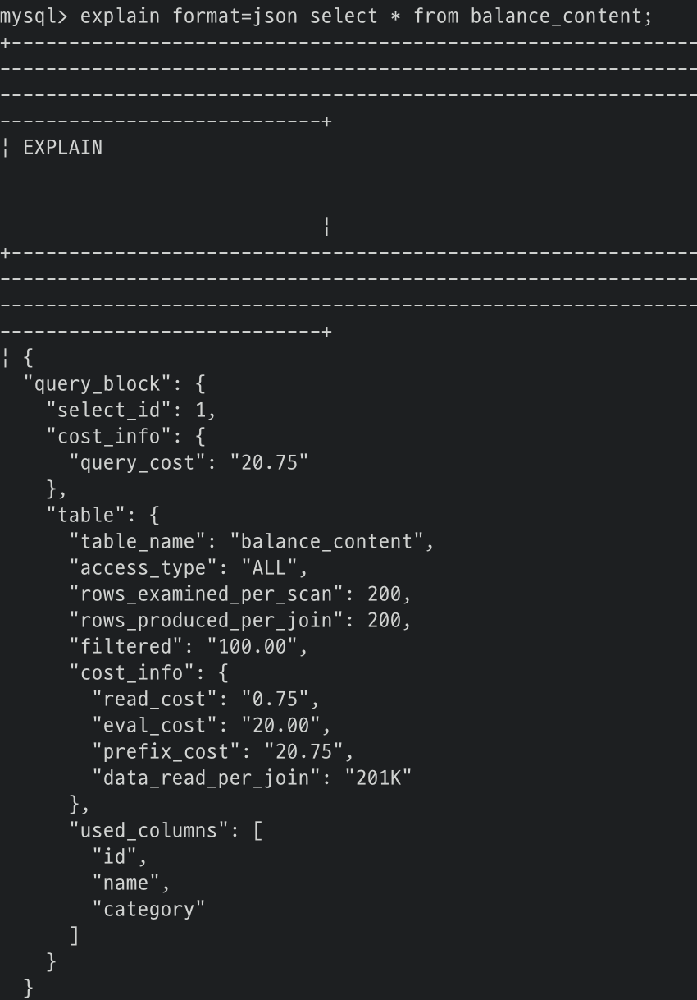
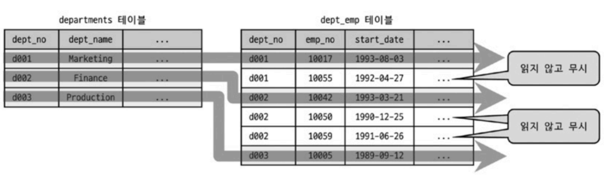

# 10. 실행 계획

- [10.1. 통계 정보](#101-통계-정보)
    - [10.1.1. 테이블 및 인덱스 통계 정보](#1011-테이블-및-인덱스-통계-정보)
    - [10.1.2. 히스토그램](#1012-히스토그램)
        - [10.1.2.1. 히스토그램 정보 수집 및 삭제](#10121-히스토그램-정보-수집-및-삭제)
        - [10.1.2.2. 히스토그램의 용도](#10122-히스토그램의-용도)
        - [10.1.2.3. 히스토그램과 인덱스](#10123-히스토그램과-인덱스)
    - [10.1.3. 코스트 모델(Cost Model)](#1013-코스트-모델cost-model)
- [10.2. 실행 계획 확인](#102-실행-계획-확인)
    - [10.2.1. 실행 계획 출력 포맷](#1021-실행-계획-출력-포맷)
    - [10.2.2. 쿼리의 실행 시간 확인](#1022-쿼리의-실행-시간-확인)
- [10.3. 실행 계획 분석](#103-실행-계획-분석)
    - [10.3.1. id 컬럼](#1031-id-컬럼)
    - [10.3.2. select_type 컬럼](#1032-select_type-컬럼)
    - [10.3.3. table 컬럼](#1033-table-컬럼)
    - [10.3.4. partitions 컬럼](#1034-partitions-컬럼)
    - [10.3.5. type 컬럼](#1035-type-컬럼)
    - [10.3.6. possible_keys 컬럼](#1036-possible_keys-컬럼)
    - [10.3.7. key 컬럼](#1037-key-컬럼)
    - [10.3.8. key_len 컬럼](#1038-key_len-컬럼)
    - [10.3.9. ref 컬럼](#1039-ref-컬럼)
    - [10.3.10. rows 컬럼](#10310-rows-컬럼)
    - [10.3.11. filtered 컬럼](#10311-filtered-컬럼)
    - [10.3.12. Extra 컬럼](#10312-extra-컬럼)


## 10.1. 통계 정보
- MySQL 8.0 버전부터 인덱스되지 않은 컬럼들의 데이터 분포도를 수집해서 저장하는 히스토그램 정보 도입

### 10.1.1. 테이블 및 인덱스 통계 정보
- 비용 기반 최적화(CBO)에서 가장 중요한 것은 통계 정보
- MySQL 5.6 버전부터 InnoDB 스토리지 엔진을 사용하는 테이블에 대한 통계 정보를 영구적으로 관리하도록 개선
    - 5.5 버전까지는 메모리에서만 관리되어 서버가 재시작되면 모두 사라짐
- 통계 정보는 `mysql.innodb_index_stats`, `mysql.innodb_table_stats` 테이블로 관리

    

    - `state_name='n_diff_pfx%'`: 인덱스가 가진 유니크 값의 개수
    - `state_name='n_leaf_pages'`: 인덱스의 리프 노드 페이지 개수
    - `state_name='size'`: 인덱스 트리의 전체 페이지 개수

    

    - `n_rows`: 테이블의 전체 레코드 건수
    - `clustered_index_size`: PK 크기(InnoDB 페이지 개수)
    - `sum_of_other_index_sizes`: PK를 제외한 인덱스의 크기(InnoDB 페이지 개수)
        - `STATS_AUTO_RECALC` 옵션에 따라 0으로 보일 수 있음, 이때는 ANALYZE TABLE 명령어 실행


- `STATS_PERSISTENT` 옵션으로 테이블 단위로 영구적인 통계 정보를 저장할지 말지 결정
    ```sql
    CREATE TABLE {table명} (
        id BIGINT NOT NULL,
        -- ...
    ) STATS_PERSISTENT=[ DEFAULT | 0 | 1]
    ```
    - `STATS_PERSISTENT=0`: MySQL 5.5 버전 이전 방식으로 관리, `mysql.innodb_index_stats`, `mysql.innodb_table_stats` 테이블에 저장하지 않음
    - `STATS_PERSISTENT=1`: `mysql.innodb_index_stats`, `mysql.innodb_table_stats` 테이블에 저장
    - `STATS_PERSISTENT=DEFAULT`: `STATS_PERSISTENT`옵션을 사용하지 않은 것과 동일, `innodb_stats_persistent` 시스템 변수 값으로 결정
    - 기본값은 1로 설정되어 있음
    - `ALTER TABLE` 명령어로 변경 가능
- 통계 정보 자동 갱신 트리거
    - 테이블이 새로 오픈
    - 테이블의 레코드 대량 변경(테이블의 전체 레코드 중 1/6 정도의 write 쿼리 실행)
    - `ANALYZE TABLE` 명령 실행
    - `SHOW TABLE STATUS` 명령 또는 `SHOW INDEX FROM` 명령 실행
    - InnoDB 모니터 활성화
    - `innodb_stats_on_metadata` 시스템 변수가 ON인 상태에서 `SHOW TABLE STATUS` 명령 실행
- 통계 정보가 자주 갱신되면 실행 계획이 의도하지 않게 변경될 수 있음
- `innodb_stats_auto_recalc` 시스템 변수를 OFF로 설정해서 통계 정보를 수동 갱신(`ANALYZE TABLE`)할 수 있음
    - 기본값은 ON
    - 테이블을 생성할 때 `STATS_AUTO_RECALC` 옵션을 사용해서 테이블 단위로 조정 가능
- `innodb_stats_sample_pages` 시스템 변수로 몇 개의 InnoDB 테이블 블록을 샘플링할지 결정
    - MySQL 5.6 버전부터 **deprecated**
    - `innodb_stats_transient_sample_pages`, `innodb_stats_persistent_sample_pages`로 분리됨
    - `innodb_stats_transient_sample_pages`: 기본값은 8, 자동으로 통계 정보 수집이 실행될 때 8개 페이지만 임의로 샘플링해서 분석하고 그 결과를 통계 정보로 활용
    - `innodb_stats_persistent_sample_pages`: 기본값은 20, `ANALYZE TABLE` 명령이 실행될 때 20개 페이지만 임의로 샘플링해서 분석하고 그 결과를 영구적인 통계 정보 테이블에 저장
    - 더 정확한 통계 정보를 수집하고자 한다면 `innodb_stats_persistent_sample_pages` 시스템 변수를 높은 값으로 설정, 너무 높으면 수집 시간이 길어지기 때문에 주의

### 10.1.2. 히스토그램
- MySQL 5.7 버전까지의 통계 정보는 인덱스된 컬럼의 유니크한 값의 개수 정도였음
    - 옵티마이저는 부족한 정보를 실행 계획 수립 때 실제 인덱스의 일부 페이지를 랜덤으로 가져와 참조
- MySQL 8.0 버전부터 컬럼의 데이터 분포도를 참조할 수 있는 히스토그램 추가

#### 10.1.2.1. 히스토그램 정보 수집 및 삭제
- 히스토그램은 `ANALYZE TABLE ... UPDATE HISTOGRAM` 명령으로 수동으로 수집 및 관리
    ```sql
    ANALYZE TABLE {table명}
    UPDATE HISTOGRAM ON {column명1}, {column명2}, ...;
    ```
    

- 히스토그램 정보는 `information_schema.column_statistics` 테이블에서 확인 가능

    

    

    - `sampling-rate`: 스캔한 페이지 비율(1.0 -> 100%), `histogram_generation_max_mem_size` 시스템 변수에 설정된 메모리 크기에 따라 샘플링(기본값 20MB)
    - `histogram-type`: 히스토그램의 종류
    - `number-of-buckets-specified`: 히스토그램을 생성할 때 설정했던 버킷의 개수, 기본으로 100개의 버킷 사용. **최대 1,024개를 설정할 수 있지만 일반적으로 100개면 충분**

- 버킷 단위로 레코드 건수나 컬럼값의 범위를 관리
    - `Singleton`(싱글톤 히스토그램)
        - Value-Based 히스토그램 또는 도수 분포라고도 함
        - 컬럼이 가지는 값별로 버킷 할당
        - 각 버킷은 2개 값(컬럼 값, 발생 빈도율)을 가짐
        - 유니크 값의 개수가 상대적으로 적은(히스토그램 버킷 수가 적은)경우 사용
        - 모든 레코드 건수 비율은 누적으로 표시
    - `Equi_Height`(높이 균형 히스토그램)
        - Height-Balanced 히스토그램이라고도 함
        - 개수가 균등한 컬럼값이 범위별로 하나의 버킷 할당
        - 각 버킷은 4개 값(범위 시작 값, 범위 마지막 값, 발생 빈도율, 유니크 값의 개수)을 가짐
        - 컬럼값의 각 범위에 대해 레코드 건수 비율이 누적으로 표시
        - 그래프로 그렸을 때 기울기가 일정하면 각 범위가 비슷한 값(레코드 건수)을 가짐
- MySQL 8.0.19 미만 버전까지는 히스토그램 생성 시 풀 스캔을 사용함. 이후 버전부터 InnoDB에서 샘플링 알고리즘 사용
- `ANALYZE TABLE ... DROP HISTOGRAM`으로 히스토그램 삭제
    ```sql
    ANALYZE TABLE {table명}
    DROP HISTOGRAM ON {column명1}, {column명2}, ...;
    ```
- 히스토그램을 삭제하면 실행 계획이 달라질 수 있기 때문에 주의
- 히스토그램 사용 유무는 옵티마이저 스위치로 제어
    ```sql
    SET GLOBAL optimizer_switch='condition_fanout_filter=off';
    ```

#### 10.1.2.2. 히스토그램의 용도
- 실제 응용 프로그램의 데이터는 항상 균등한 분포도를 가지지 않음
- 히스토그램은 특정 컬럼이 가지는 모든 값에 대한 분포도 정보를 가지지 않음
- 그러나 각 범위(버킷)별로 레코드의 건수나 유니크한 값의 개수 정보를 가지기 때문에 훨씬 정확하게 예측
- 실행 계획에서 `filtered`에 영향
- 히스토그램 정보가 없으면 옵티마이저는 데이터가 균등하게 분포돼 있을 것으로 예측

#### 10.1.2.3. 히스토그램과 인덱스
- 실행 계획을 수립할 때 사용 가능한 인덱스들로부터 조건절에 일치하는 레코드 건수를 대략 파악하고 최종적으로 가장 나은 실행 계획 선택
- 이때 실제 인덱스의 B-Tree를 샘플링하며 이 작업을 **인덱스 다이브(Index Dive)**라고 표현
- 인덱스된 컬럼을 검색 조건으로 사용하는 경우 해당 컬럼의 히스토그램을 사용하지 않고 인덱스 다이브로 직접 수집한 정보를 활용
- 히스토그램은 주로 인덱스되지 않은 컬럼에 대한 데이터 분포도를 참조하는 용도 -> filtered
- 인덱스 다이브 작업은 어느 정도 비용이 필요
- 실행 계획을 수립하는 것만으로도 상당한 인덱스 다이브를 실행하고 비용도 그만큼 커짐

### 10.1.3. 코스트 모델(Cost Model)
- MySQL 서버가 쿼리를 처리할 때 다음과 같은 작업 필요
    - 디스크로부터 데이터 페이지 읽기
    - 메모리(InnoDB 버퍼 풀)로부터 데이터 페이지 읽기
    - 인덱스 키 비교
    - 레코드 평가
    - 메모리 임시 테이블 작업
    - 디스크 임시 테이블 작업
- 전체 쿼리의 비용을 계산하는 데 필요한 단위 작업들의 비용을 **코스트 모델**이라고 함
- MySQL 5.7 버전부터 소스 코드에 상수화되어 있던 각 단위 작업 비용을 DBMS 관리자가 조정할 수 있게 개선
- MySQL 8.0 버전부터 히스토그램과 각 인덱스별 메모리에 적재된 페이지의 비율이 관리되고 옵티마이저 실행 계획 수립에 사용
- MySQL 8.0 서버의 코스트 모델은 `mysql.server_cost`, `mysql.engine_cost` 테이블에 저장되어 있는 설정값 사용
    - `server_cost`: 인덱스를 찾고 레코드를 비교하고 임시 테이블 처리에 대한 비용 관리
    
        - `cost_name`: 코스트 모델의 각 단위 작업
        - `cost_value`: DBMS 관리자가 설정한 값(NULL이면 `default_value` 컬럼의 비용 사용)
        - `last_updated`: 단위 작업의 비용이 변경된 시점
        - `comment`: 비용에 대한 추가 설명
        - `default_value`: 각 단위 작업의 비용(기본값이며, MySQL 서버 소스 코드에 설정된 값)
    - `engine_cost`: 레코드를 가진 데이터 페이지를 가져오는 데 필요한 비용 관리
    
        - `engine_name`: 비용이 적용된 스토리지 엔진
        - `device_type`: 디스크 타입
        - 나머지는 `server_cost` 테이블의 컬럼과 같음


- `row_evaluate_cost`는 스토리지 엔진이 반환한 레코드가 쿼리의 조건에 일치하는지 평가하는 단위 작업 비용
    - 값이 증가할수록 풀 테이블 스캔과 같이 많은 레코드를 처리하는 쿼리 비용이 높아짐
    - 반대로 레인지 스캔과 같이 상대적으로 적은 수의 레코드를 처리하는 쿼리의 비용은 낮아짐
- `key_compare_cost`는 키 값의 비교 작업에 필요한 비용
    - 값이 증가할수록 레코드 정렬과 같이 키 값 비교 처리가 많은 경우 쿼리 비용은 높아짐

- 실행 계획의 계산된 비용 확인
    - `EXPLAIN FORMAT=TREE`

        

    - `EXPLAIN FORMAT=JSON`

        

    - `EXPLAIN ANALYZE`

        
- 비용을 직접 계산하는 것은 어려움
- 각 단위 작업에 설정되는 비용 값이 커지면 어떤 실행 계획들이 고비용으로 바뀌고, 어떤 실행 계획들이 저비용으로 바뀌는지 파악하는 것이 중요
    - `key_compare_cost`: 비용을 높이면 정렬을 수행하지 않는 방향의 실행 계획을 선택할 가능성이 높아짐
    - `row_evaluate_cost`: 비용을 높이면 풀 스캔 쿼리 비용이 높아지고, 인덱스 레인지 스캔을 사용하는 실행 계획을 선택할 가능성이 높아짐
    - `disk_temptable_create_cost`, `disk_temptable_row_cost`: 비용을 높이면 디스크에 임시 테이블을 만들지 않는 방향의 실행 계획을 선택할 가능성이 높아짐
    - `memory_temptable_create_cost`, `memory_temptable_row_cost`: 비용을 높이면 메모리에 임시 테이블을 만들지 않는 방향의 실행 계획을 선택할 가능성이 높아짐
    - `io_block_read_cost`: 비용을 높이면 InnoDB 버퍼 풀에 데이터 페이지가 많이 적재되어 있는 인덱스를 사용하는 실행 계획을 선택할 가능성이 높아짐
    - `memory_block_read_cost`: 비용을 높이면 InnoDB 버퍼 풀에 적재된 데이터 페이지가 상대적으로 적더라도 해당 인덱스를 사용할 가능성이 높아짐
- 전문적인 지식이 없다면 `server_cost`, `engine_cost` 테이블의 기본값을 함부로 변경하지 않는 것이 좋음

## 10.2. 실행 계획 확인

### 10.2.1. 실행 계획 출력 포맷
- MySQL 8.0 버전부터 모든 내용이 통합되어 보이도록 개선
- `PARTITIONS`, `EXTENDED` 옵션은 문법에서 제거
- `FORMAT` 옵션으로 JSON, TREE 단순 테이블 형태로 선택 가능

### 10.2.2. 쿼리의 실행 시간 확인
- `SHOW PROFILE` 명령은 실행 계획의 단계별 소요 시간 정보를 확인할 수 없음
- MySQL 8.0.18 버전부터 쿼리의 실행 계획과 단계별 소요 시간 정보를 확인할 수 있는 `EXPLAIN ANALYZE` 기능 추가
- 실행 계획만 추출하는 것이 아니라 실제 쿼리를 실행하고 사용된 실행 계획과 소요된 시간을 보여줌
- 항상 결과를 `FORMAT=TREE` 형태로 보여줌
- 들여쓰기는 호출 순서를 의미
    - 들여쓰기가 같은 레벨이면 상단에 위치한 라인이 먼저 실행
    - 들여쓰기가 다른 레벨이면 가장 깊은 라인이 먼저 실행


- `actual time=n..m`
    - 레코드를 검색하는 데 걸린 시간(ms)
    - `n`은 첫 번째 레코드를 가져오는데 걸린 평균 시간(ms)
    - `m`은 마지막 레코드를 가져오는 데 걸린 평균 시간(ms)
- `row=n`
    - 조건에 일치하는 테이블의 평균 레코드 건수
- `loops=n`
    - 테이블의 레코드를 찾는 작업이 반복된 횟수

## 10.3. 실행 계획 분석


- 실행 순서는 위에서 아래로 순서대로 표시

### 10.3.1. id 컬럼
- 단위 SELECT 쿼리별로 부여되는 식별자 값
- 테이블을 조인하면 같은 id값 부여
- id 컬럼이 테이블의 접근 순서를 의미하지 않음

### 10.3.2. select_type 컬럼
- `SIMPLE`
    - 서브쿼리를 사용하지 않는 단순한 SELECT 쿼리
    - 하나의 실행 계획에서 `SIMPLE`인 단위 쿼리는 하나만 존재
- `PRIMARY`
    - UNION이나 서브쿼리를 가지는 SELECT 쿼리의 실행 계획에서 가장 바깥쪽(Outer)에 있는 단위 쿼리
    - `PRIMARY`인 단위 쿼리는 하나만 존재
- `UNION`
    - UNION으로 결합하는 단위 SELECT 쿼리 중에서 첫 번째를 제외한 두 번째 이후 단위 SELECT 쿼리
    - 첫 번째 단위 SELECT 쿼리는 `DERIVED`로 표시
- `DEPENDENT UNION`
    - UNION이나 UNION ALL로 집합을 결합하는 쿼리에서 표시
    - `DEPENDENT`는 결합된 단위 쿼리가 외부 쿼리에 영향을 받는 것을 의미
    - 내부 쿼리가 외부의 값을 참조해서 처리될 때 `DEPENDENT` 표시
- `UNION RESULT`
    - UNION 결과를 담아두는 테이블을 의미
    - UNION은 임시 테이블에 결과를 버퍼링하기 때문에 해당 임시 테이블을 가리키는 라인에 표시됨
    - 단위 쿼리가 아니기 때문에 별도의 id 값을 부여하지 않음
- `SUBQUERY`
    - **FROM절 이외에서 사용**되는 서브쿼리
    - FROM절에 사용된 서브쿼리는 `DERIVED`로 표시됨
- `DEPENDENT SUBQUERY`
    - 서브쿼리가 바깥쪽(Outer) 쿼리에서 정의된 컬럼을 사용할 때
    - 안쪽(Inner)의 서브쿼리 결과가 바깥쪽(Outer) 쿼리의 컬럼에 의존적이기 때문
    - 일반 서브쿼리보다 처리 속도가 느릴 때가 많음
- `DERIVED`
    - 단위 SELECT 쿼리의 실행 결과로 메모리나 디스크의 임시 테이블 생성
    - MySQL 5.6 버전부터 옵티마이저 옵션에 따라 쿼리 특성에 맞게 임시 테이블에도 인덱스 추가
- `DEPENDENT DERIVED`
    - MySQL 8.0 버전부터 레터럴 조인(LATERAL JOIN) 기능이 추가되면서 FROM절의 서브쿼리에서도 외부 컬럼을 참조할 수 있음
- `UNCACHEABLE SUBQUERY`
    - 서브쿼리 캐시는 쿼리 캐시나 파생 테이블과 무관
    - 조건이 똑같은 서브쿼리를 실행하면 이전의 실행 결과를 사용할 수 있도록 서브쿼리 결과를 캐시해둠
        - `SUBQUERY`: Outer의 영향을 받지 않으므로 처음 한 번만 실행해서 결과 캐시
        - `DEPENDENT SUBQUERY`: 의존하는 Outer 쿼리의 컬럼 값 단위로 캐시
    - 서브쿼리 캐시 자체를 사용할 수 없을 때 표시
        - 사용자 변수가 서브쿼리에 사용
        - `NOT-DETERMINISTIC` 속성의 스토어드 루틴이 서브쿼리 내에서 사용
        - `UUID()`, `RAID()`와 같이 결괏값이 호출할 때마다 달라지는 함수가 서브쿼리에 사용
- `UNCACHEABLE UNION`
    - UNION 캐시를 사용할 수 없을 때 표시
- `MATERIALIZED`
    - MySQL 5.6 버전부터 도입
    - FROM절이나 IN(subquery) 형태의 쿼리에 사용된 서브쿼리가 최적화되었을 때 표시

### 10.3.3. table 컬럼
- 단위 SELECT 쿼리 기준이 아닌 **테이블 기준**으로 표시
- 별칭이 부여된 경우 별칭이 표시
- FROM절이 없거나 `FROM DUAL`을 사용하면 NULL 표시
- `<>`에 둘러싸인 이름은 임시 테이블을 의미
    - 표시되는 숫자는 id 값

### 10.3.4. partitions 컬럼
- MySQL 8.0 버전부터 EXPLAIN 명령으로 파티션 관련 실행 계획까지 모두 확인 가능

### 10.3.5. type 컬럼
- 테이블의 접근 방법(Access type)
- 각 테이블의 레코드를 어떤 방식으로 읽었는지 나타냄
    - 인덱스를 사용해서 읽었는가
    - 풀 테이블 스캔으로 읽었는가
    - 등등
- 실행 계획에서 type 컬럼은 반드시 체크해야 할 중요한 정보
- 하나의 단위 SELECT 쿼리는 단 하나의 접근 방법만 사용
- `index_merge`를 제외한 나머지 접근 방법은 하나의 인덱스만 사용
- 밑으로 갈수록 성능이 느림

1. `system`
    - 레코드가 1건만 존재하는 테이블
    - 한 건도 존재하지 않는 테이블
    - MyISAM이나 MEMORY 테이블에서만 사용
2. `const`
    - 쿼리가 PK나 Unique 인덱스를 사용하는 WHERE 조건을 가지고 있고, 반드시 1건 반환
    - 다중 컬럼 인덱스에서 일부 컬럼만 조건으로 사용하면 `const` 접근 불가
        > 다중 컬럼 인덱스면 컬럼 모두 사용해야 유니크를 보장할 수 있음
    - 일부만 조건으로 사용할 경우 `ref`로 표시
3. `eq_ref`
    - 여러 테이블이 조인되는 쿼리에서만 표시
    - 드라이빙 테이블의 컬럼값을 드리븐 테이블의 PK나 Unique 인덱스 검색 조건에 사용
    - 다중 컬럼 인덱스일 경우 모든 컬럼이 비교 조건에 사용되어야 함
    - 드리븐 테이블에서 반드시 1건이 존재한다는 보장이 있어야 함
4. `ref`
    - 조인의 순서와 관계없이 사용
    - PK나 Unique 인덱스 등의 제약 조건 없음
    - 인덱스의 종류와 관계없이 동등 조건으로 검색할 때 사용
    - 반드시 1건이라는 보장이 없기 때문에 `const`나 `eq_ref`보다 빠르지 않음
    - 동등한 조건으로만 비교되므로 매우 빠른 조회 방법 중 하나

    > `const`, `eq_ref`, `ref` 접근 방법은 WHERE 조건절에 사용하는 비교 연산자가 동등 비교여야 함 <br/>
    이 세가지 접근 방법은 튜닝하기 않고 넘어가도 무방
5. `fulltext`
    - 전문 검색(full-text search) 인덱스 사용
    - 데이터의 분포나 레코드 건수에 따라 성능이 달라질 수 있음
    - 전문 검색 조건은 우선순위가 상당히 높음
    - `const`, `eq_ref`, `ref`가 아니면 일반적으로 전문 검색 읻넥스를 사용하는 조건 선택
    - 전문 검색 인덱스보다 일반 인덱스로 레인지 스캔으로 처리하는 방식이 더 빠른 경우가 많음
    - 전문 검색 쿼리를 사용할 경우 조건별로 성능을 확인해야 함
6. `ref_or_null`
    - `ref`와 접근 방법이 같으나 NULL 비교도 추가된 형태
7. `unique_subquery`
    - IN(subquery) 형태의 쿼리
    - 서브쿼리에서 유니크한 값만 반환
8. `index_subquery`
    - IN(subquery) 형태의 쿼리가 중복된 값을 반환할 수 있지만 인덱스를 이용해서 중복을 제거할 수 있을 때 사용
9. `range`
    - **인덱스 레인지 스캔**
    - 하나의 값이 아니라 범위로 검색
    - `<`, `>`, `IS NULL`, `BETWEEN`, `IN`, `LIKE`
    - range 접근 방법도 상당히 빠르며 모든 쿼리가 이 접근 방법만 사용해도 최적의 성능 보장
    - 보통 `const`, `ref`, `range`를 모두 묶어서 인덱스 레인지 스캔이라고 함
10. `index_merge`
    - 2개 이상의 인덱스로 각각 탐색한 후 결과 병합
    - 여러 인덱스를 읽기 때문에 `range`보다 효율성이 떨어짐
    - `fulltext` 인덱스를 사용하는 쿼리는 `index_merge`가 적용되지 않음
    - 항상 2개 이상의 집합이 되기 때문에 교집합, 합집합, 중복 제거와 같은 부가적인 작업 필요
    - `Extra` 컬럼에 보완적이 내용 표시(intersection, union, sort_union)
11. `index`
    - **인덱스 풀 스캔**
    - 풀 테이블 스캔과 비교했을 때 비교하는 레코드 건수는 같음
    - 인덱스는 데이터 파일 전체보다 크기가 작기 떄문에 풀 테이블 스캔보다 빠르게 처리
    - `const`, `ref`, `range` 접근 방법으로 인덱스 사용 불가 + 인덱스에 포함된 컬럼만으로 쿼리 처리 가능(데이터 파일을 읽지 않아도 되는 경우)
    - `const`, `ref`, `range` 접근 방법으로 인덱스 사용 불가 + 인덱스를 이용해 정렬이나 그루핑 작업 가능(별도의 정렬 작업을 피할 수 있는 경우)
12. `ALL`
    - **풀 테이블 스캔**
    - 가장 마지막에 선택하는 가장 비효율적인 방법
    - InnoDB는 대량의 디스크 I/O가 발생할 때 한꺼번에 많은 페이지를 읽어 들이는 리드 어헤드(Read Ahead) 기능 제공
        - 인접한 페이지가 연속해서 몇 번 읽히면 백그라운드 읽기 스레드가 최대 64개 페이지씩 한꺼번에 읽어옴
        - `innodb_read_ahead_threshold`, `innodb_random_read_ahead` 시스템 변수로 리드 어헤드 제어
    - 일반적으로 `index`, `ALL` 접근 방법은 작업 범위를 제한하는 조건이 아니기 때문에 빠른 응답이 필요한 웹 서비스 등과 같은 OLTP환경에서는 적합하지 않음

### 10.3.6. possible_keys 컬럼
- 옵티마이저가 최적의 실행 계획을 만들기 위해 후보로 선정했던 인덱스 목록
- 특별한 경우를 제외하고 무시해도 됨

### 10.3.7. key 컬럼
- 실행 계획에서 최종 선택된 인덱스
- 의도했던 인덱스가 표시되는 확인 필요
- `PRIMARY`로 표시될 경우 PK를 사용한다는 의미
- `ALL`과 같이 인덱스를 사용하지 못하면 NULL로 표시

### 10.3.8. key_len 컬럼
- 인덱스의 각 레코드에서 몇 바이트까지 사용했는지 표시
    > index extension이 사용되면 실제 인덱스 길이보다 더 큰 값 표시
- `urf8mb4` 문자 집합에서는 문자 하나가 차지하는 공간이 1byte ~ 4byte로 가변적
    - MySQL에서는 고정적으로 4byte로 계산
    - `VARCHAR(4)` -> 16byte
- NOT NULL이 아닌 컬럼은 **NULL 여부를 저장하기 위해 1byte 추가** 사용

### 10.3.9. ref 컬럼
- 참조 조건(Equal 비교 조건)으로 어떤 값이 제공되었는지 표시
- 상숫값을 지정했다면 `const`로 표시
- 다른 테이블의 컬럼값이면 테이블명, 컬럼명 표시
- `func`로 표시될 경우 콜레이션 변환이나 값 자체의 연산을 거쳐서 참조됐다는 것
    - 사용자가 명시적으로 값을 변환할 때
    - MySQL 서버가 내부적으로 값을 변환할 때
    - MySQL 서버가 추가 연산을 수행하지 않도록 조인 컬럼의 타입은 일치하는 것이 좋음

### 10.3.10 rows 컬럼
- 각 처리 방식이 얼마나 많은 레코드를 읽고 비교해야 하는지 예측해서 비용 산정
- 통계 정보를 기준으로 조사해서 예측
- 반환하는 레코드의 예측치가 아니라 **쿼리를  처리하기 위해 얼마나 많은 레코드를 읽고 체크해야 하는지 의미**
- 옵티마이저가 예측하는 수치는 대략적인 값이며 정확한 값을 산출하기 위한 기능이 아님
- 그러나 어느 정도 근접해야 하며 그래야만 옵티마이저는 제대로 된 실행 계획을 수립할 수 있음

### 10.3.11. filtered 컬럼
- `rows` 컬럼은 인덱스를 사용하는 조건에만 일치하는 레코드 건수를 예측한 것
- 그러나 대부분 쿼리에서 WHERE절에 사용되는 조건이 모두 인덱스를 사용할 수 있는 것은 아님
- 조인이 사용되는 경우 WHERE절에서 인덱스를 사용할 수 있는 조건도 중요하지만 인덱스를 사용하지 못하는 조건에 일치하는 레코드 건수를 파악하는 것도 매우 중요
- `filtered` 컬럼 값은 필터링되고 남은 레코드의 비율
- 이 값이 얼마나 정확히 예측될 수 있느냐에 따라 조인의 성능이 달라짐

### 10.3.12. Extra 컬럼
- 성능에 관련된 중요한 내용 표시

1. `const row not found`
    - `const` 접근 방법으로 테이블을 읽었지만 해당 테이블에 레코드가 1건도 존재하지 않음
2. `Deleting all rows`
    - MyISAM 스토리지 엔진과 같이 스토리지 엔진의 핸들러 차우너에서 테이블의 모든 레코드를 삭제하는 기능을 제공하는 스토리지 엔진 테이블
    - WHERE조건이 없는 DELETE 문장의 실행 계획
    - MySQL 8.0 버전부터 InnoDB, MyISAM 엔진 모두 더 이상 표시 되지 않음
3. `Distinct`
    - DISTINCT를 포함한 조인
    

    - DISTINCT를 처리하기 위해 조인하지 않아도 되는 레코드는 모두 무시하고 필요한 것만 조인
4. `FirstMatch`
    - 세미 조인 최적화 중 FirstMatch 사용
    - 함께 표시되는 테이블명은 기준 테이블
    - 기준 테이블에 첫 번째로 일치하는 한 건만 검색
5. `Full scan on NULL key`
    - col1 IN(subquery)에서 col1이 NULL이면 풀 테이블 스캔을 해야만 결과를 알 수 있음
    - 쿼리를 실행하는 도중 col1이 NULL을 만나면 차선책으로 서브쿼리 테이블에 대해 풀 테이블 스캔 사용
    - col1이 NOT NULL이라면 이러한 차선책은 사용되지 않음
    - `col1 IS NOT NULL AND col1 IN(subquery)`로 옵티마이저에게 힌트를 줄 수 있음
6. `Impossible HAVING`
    - HAVING절의 조건을 만족하는 레코드가 없을 때 표시
7. `Impossible WHERE`
    - WHERE 조건이 항상 FALSE가 될 수 밖에 없을 때 표시
8. `LooseScan`
    - 세미 조인 최적화 중 LooseScan 전략 사용
9. `No matching min/max row`
    - `MIN()`이나 `MAX()`와 같은 집합 함수가 있는 쿼리의 조건절에 일치하는 레코드가 한 건도 없을 때 표시
10. `no matching row in const table`
    - 조인이 사용된 테이블에서 `const` 방법으로 접근할 때 일치하는 레코드가 없을 경우 표시
11. `No matching rows after partition pruning`
    - 파티션된 테이블에 대한 UPDATE 또는 DELETE 명령의 실행 계획
    - 해당 파티션에서 UPDATE하거나 DELETE하 대상 레코드가 없을 때 표시
    - 삭제할 레코드가 없음을 의미하는 것이 아니라 **대상 파티션이 없다는 것을 의미**
12. `No tables used`
    - FROM절이 없거나 FROM DUAL 형태의 쿼리 실행 계획
13. `Not exists`
    - 아우터 조인을 이용해 안티-조인을 수행하는 쿼리 실행 계획
    - NOT IN(subquery) 또는 NOT EXISTS 등은 안티-조인으로 처리해야 하지만 레코드의 건수가 많으면 아우터 조인으로 빠른 성능을 낼 수 있음
    - 안티-조인은 일반 조인(INNER JOIN)을 했을 때 나오지 않는 결과만 가져오는 방법
    - 조인 조건에 일치하는 레코드가 여러 건 있더라도 딱 1건만 조회해보고 처리를 완료하는 최적화
14. `Plan isn't ready yet`
    - MySQL 8.0 버전에서 다른 커넥션에서 실행 중인 쿼리의 실행 계획 확인 가능
        ```sql
        EXPLAIN FOR CONNECTION {커넥션 번호}
        ```
    - 해당 커넥션에서 아직 쿼리의 실행 계획을 수립하지 못했을 때 명령어를 실행할 경우 표시
15. `Range checked for each record(index map: N)`
    - 조인에서 드리븐 테이블을 읽을 때 인덱스 레인지 스캔과 풀 테이블 스캔 중 어느 것이 효율적인지 판단할 수 없을 때 사용
    - type 컬럼에는 `ALL` 표시
    

    - `index map: 0x19`와 같이 16진수로 표현
    - 이진수로 변환했을 때 인덱스의 순번을 나타냄
        - ex) 11001 -> 5, 4, 3, 2, 1 인덱스 번호
    - 각 자릿수의 값이 1인 인덱스를 인덱스 후보로 산정
    - 실제 어떤 인덱스가 사용되었는지는 알 수 없음
    - `SHOW GLOBAL STATUS`에 `Select_range_check`에 누적값 표시
16. `Recursive`
    - MySQL 8.0 버전부터 CTE(Common Table Expression)를 이용해 재귀 쿼리 작성 가능
        ```sql
        WITH RECURSIVE cte (n) AS
        (
            SELECT 1
            UNION ALL
            SELECT n + 1 FROM cte WHERE n < 5
        )
        SELECT * FROM cte;
        ```
    - CTE를 이용한 재귀 쿼리의 실행 계획에 표시
17. `Rematerialize`
    - 래터럴로 조인되는 테이블은 선행 테이블의 레코드별로 서브쿼리를 실행해서 결과를 임시 테이블에 저장
    - 이 과정을 *Rematerializing*이라 함
18. `Select tables optimized away`
    - `MIN()` 또는 `MAX()`만 SELECT 절에 사용되거나 GROUP BY로 `MIN()`, `MAX()`를 조회하는 쿼리가 인덱스를 오름차순 또는 내림차순으로 1건만 읽는 형태의 최적화 적용
    
19. `Start temporary`, `End temporary`
    - 세미 조인 최적화 중 Duplicate Weed-out 최적화 사용
    - 불필요한 중복 건을 제거하기 위해 내부 임시 테이블이 사용됨
    - 조인되어 내부 임시 테이블에 저장되는 테이블을 식별할 수 있도록 첫 번째 테이블에 `Start temporary` 표시
    - 조인이 끝나는 부분에 `End temporary` 표시
20. `unique row not found`
    - 두 개의 테이블이 각각 유니크(PK 포함) 컬럼으로 아우터 조인을 수행하는 쿼리에서 아우터 테이블에 일치하는 레코드가 존재하지 않을 경우 표시
21. `Using filesort`
    - ORDER BY가 인덱스를 사용하지 못할 때 표시
    - 소트 버퍼에 복사해 퀵 소트 또는 힙 소트 알고리즘을 이용해 정렬 수행
    - 많은 부하를 일으키기 때문에 쿼리를 튜닝하거나 인덱스를 생성하는 것이 좋음
22. `Using index`
    - **커버링 인덱스**
    - 데이터 파일을 전혀 읽지 않고 인덱스만 읽어서 쿼리를 모두 처리할 수 있을 때 표시
    - 인덱스 레인지 스캔을 사용하지만 쿼리 성능이 만족스럽지 못한 경우 커버링 인덱스를 유도해 볼 수 있음
    - `index extension`으로 커버링 인덱스가 적용됐을 때도 표시
    - 실행 계획의 type 컬럼과 관계없이 사용될 수 있음
23. `Using index condition`
    - 인덱스 컨디션 푸시 다운 최적화 사용
24. `Using index for group-by`
    - GROUP BY 처리가 인덱스를 이용해 정렬된 인덱스 컬럼을 순서대로 읽으면서 그루핑 작업만 수행
    - 정렬없이 인덱스의 필요한 부분만 읽기 때문에 상당히 효율적이고 빠르게 처리
    - 루스 인덱스 스캔과 다름
    - `AVG()`, `SUM()`, `COUNT()`처럼 필요한 레코드를 듬성듬성 읽지 못하고 모든 인덱스를 다 읽어야 할 때 사용
25. `Using index for skip scan`
    - 인덱스 스킵 스캔 최적화
26. `Using join buffer(Block Nested Loop)`, `Using join buffer(Batched Key Access)`, `Using join buffer(hash join)`
    - 조인에서 드리븐 테이블에 검색을 위한 적절한 인덱스가 없으면 해시 조인 사용
    - 카테시간 조인도 해시 조인 사용
    - 온라인 웹 서비스용 MySQL 서버라면 조인 버퍼 크기는 1MB정도도 충분
27. `Using MRR`
    - MRR 최적화
28. `Using sort_union(...)`, `Using union(...)`, `Using intersect(...)`
    - `index_merge` 접근 방법
29. `Using temporary`
    - 임시 테이블 사용
    - 임시 테이블이 메모리에 생성됐는지, 디스크에 생성됐는지는 실행 계획만으로 판단 불가능
    - `Using temporary`가 표시되지 않지만 내부적으로 임시 테이블을 사용하는 경우도 있음
        - FROM절에 사용된 서브쿼리
        - `COUNT(DISTINCT col1)`를 포함하는 쿼리가 인덱스를 사용할 수 없는 경우
        - UNION 또는 UNION DISTINCT가 사용된 쿼리
        - 인덱스를 사용하지 못하는 ORDER BY
        - 인덱스를 사용하지 못하는 GROUP BY
30. `Using where`
    - MySQL 엔진에서 별도의 가공을 해서 필터링 작업을 처리한 경우
    - 체크 조건은 MySQL 엔진 레이어에서 처리
    - `Using where`이 성능상 문제를 일으킬지 아닐지는 실행 계획의 `filtered` 컬럼으로 확인
31. `Zero limit`
    - `LIMIT 0` 사용
    - 테이블의 레코드는 전혀 읽지 않고 결괏값의 메타 정보만 반환
